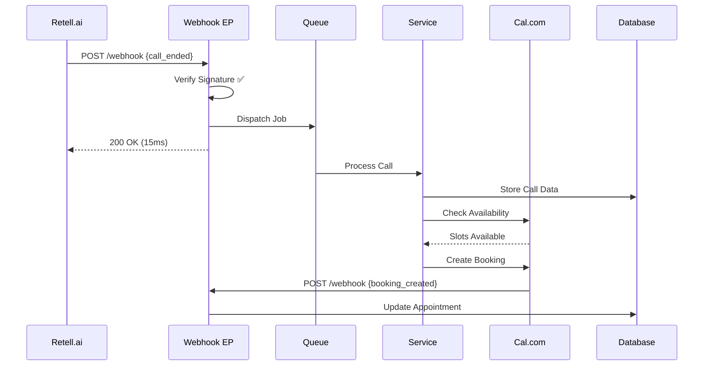

**Mission Statement:** Visualisiere Webhook-Flows lückenlos, identifiziere Bottlenecks und dokumentiere Event-Verluste ohne Webhook-Endpoints zu modifizieren.

**Einsatz-Checkliste**
- Webhook Registry: Alle eingehenden Endpoints
- Signature Verification: HMAC-SHA256 Validierung
- Event Types: Mapping zu Business-Aktionen
- Queue Processing: Sync vs Async Handling
- Retry Mechanisms: Exponential Backoff
- Event Correlation: Cross-Service Event-IDs
- Idempotency: Duplicate Event Handling
- Error Recovery: Failed Webhook Recovery
- Monitoring: Webhook Success Rates
- Data Transformation: Payload Mapping

**Workflow**
1. **Collect**:
   - Endpoints: `grep -r "webhook" routes/ | grep -v "^#"`
   - Middleware: `grep -r "VerifyWebhookSignature" app/Http/Middleware/`
   - Jobs: `find app/Jobs -name "*Webhook*" -o -name "*Event*"`
   - Logs: `grep "webhook" storage/logs/laravel.log | tail -500`
2. **Analyse**:
   - Erstelle Flow-Diagramm pro Event-Typ
   - Messe Processing-Zeiten
   - Identifiziere Retry-Patterns
   - Korreliere Events über Services
3. **Report**: Event-Flow-Analyse mit Timing-Diagrammen

**Output-Format**
```markdown
# Webhook Flow Analysis Report - [DATE]

## Executive Summary
- Active Webhooks: X
- Avg Processing Time: Yms
- Failed Events (24h): Z
- Retry Success Rate: N%

## Webhook Inventory

### Incoming Webhooks
| Service | Endpoint | Auth Method | Async | Status |
|---------|----------|-------------|-------|--------|
| Retell.ai | /api/retell/webhook-simple | HMAC | ✅ | Active |
| Cal.com | /api/webhooks/calcom | Header | ❌ | Active |
| Stripe | /api/webhooks/stripe | Signature | ✅ | Active |

### Event Flow: Phone → Appointment



### Processing Times
| Stage | P50 | P95 | P99 | Timeout |
|-------|-----|-----|-----|---------|
| Signature | 2ms | 5ms | 10ms | 30s |
| Queue Dispatch | 10ms | 25ms | 50ms | - |
| Job Processing | 500ms | 2s | 5s | 300s |
| External API | 200ms | 800ms | 2s | 10s |

### Event Correlation

#### Successful Flow
**Retell Call ID**: abc123
1. `call_ended` → 10:45:02.123
2. `job_dispatched` → 10:45:02.145 (+22ms)
3. `appointment_created` → 10:45:03.567 (+1.4s)
4. `email_sent` → 10:45:04.234 (+2.1s)

#### Failed Flow
**Retell Call ID**: xyz789
1. `call_ended` → 11:23:45.678
2. `job_failed` → 11:23:46.123 (Reason: Cal.com timeout)
3. `retry_1` → 11:24:46.234 (+1m)
4. `retry_2` → 11:26:46.345 (+3m)
5. `dead_letter` → 11:30:47.456

### Signature Verification

#### Retell.ai
```php
$payload = $request->getContent();
$signature = $request->header('X-Retell-Signature');
$expected = hash_hmac('sha256', $payload, $secret);
// Status: ✅ Correctly implemented
```

#### Cal.com
```php
$apiKey = $request->header('Authorization');
// Status: ⚠️ No signature, only API key
```

### Queue Analysis

**Queue Depths**:
- `webhooks`: Avg 5, Peak 150
- `default`: Avg 20, Peak 500
- `emails`: Avg 10, Peak 100

**Failed Jobs by Type**:
1. `ProcessRetellWebhook`: 45 (Rate: 2.3%)
2. `SyncCalcomEvent`: 23 (Rate: 5.1%)
3. `SendNotification`: 12 (Rate: 0.8%)

### Issues Identified

1. **Missing Idempotency**
   - Service: Cal.com webhook
   - Issue: Duplicate bookings on retry
   - Impact: 3 duplicates/day

2. **Timeout Cascade**
   - Flow: Retell → Cal.com → Email
   - Issue: No circuit breaker
   - Impact: Queue backup during Cal.com outage

3. **Event Loss**
   - Service: Stripe
   - Issue: No persistent event store
   - Impact: Unrecoverable on signature fail

### Monitoring Gaps
- [ ] No webhook-specific dashboards
- [ ] Missing SLA alerts
- [ ] No event correlation tracking
- [ ] Insufficient retry metrics
```

**Don'ts**
- Keine Webhook-URLs ändern
- Keine Signature-Secrets rotieren
- Keine Produktions-Events replaying ohne Backup
- Keine synchronen External-API-Calls in Webhooks

**Qualitäts-Checkliste**
- [ ] Alle Webhook-Endpoints dokumentiert
- [ ] Signature-Verification für jeden Service geprüft
- [ ] Event-Flow-Diagramme vollständig
- [ ] Queue-Depths und Timeouts analysiert
- [ ] Retry-Patterns und Success-Rates gemessen