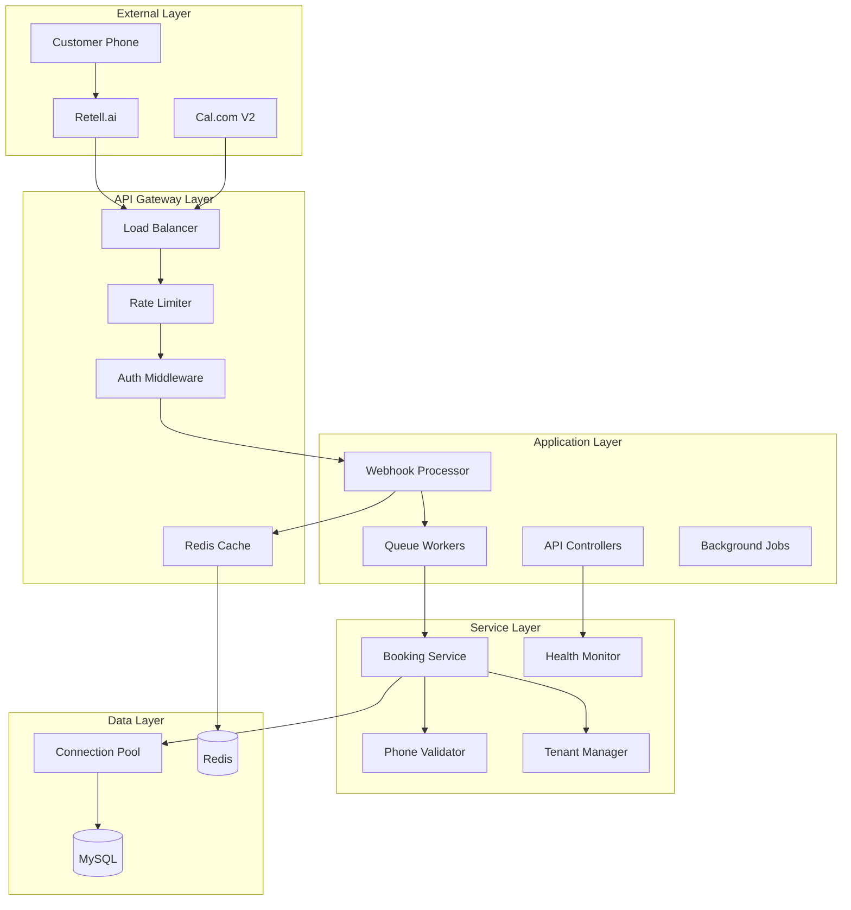

# 🎯 AskProAI Master Technical Specification
**Version**: 2.0  
**Date**: 2025-06-17  
**Status**: Production-Ready Specification  
**Authors**: Claude mit 5 spezialisierten Sub-Agents

## Executive Summary

Diese Master-Spezifikation konsolidiert die Arbeit von 5 parallelen technischen Analyse-Agenten und definiert die vollständige technische Lösung für alle identifizierten kritischen Blocker. Die Spezifikation ist direkt implementierbar und folgt Best Practices für Production-Grade Software.

## 📊 Scope & Impact Analysis

### Kritische Blocker (Must-Fix)
| Blocker | Impact | Effort | Risk |
|---------|--------|--------|------|
| Database Connection Pooling | System Crash bei Last | 1h | CRITICAL |
| Phone Validation | Security Breach | 1h | HIGH |
| Webhook Deduplication | Data Corruption | 1h | HIGH |
| SQLite Test Migration | No Quality Assurance | 3h | HIGH |
| RetellAgentProvisioner | Customer Onboarding Blocked | 2h | CRITICAL |

### Gesamtaufwand: 40-50 Personentage über 4-5 Wochen

## 🏗️ System Architecture Overview



## 📋 Detailed Technical Specifications

### 1. Database Connection Pooling

#### 1.1 Configuration (`config/database.php`)
```php
'mysql' => [
    'driver' => 'mysql',
    'host' => env('DB_HOST', '127.0.0.1'),
    'port' => env('DB_PORT', '3306'),
    'database' => env('DB_DATABASE', 'askproai'),
    'username' => env('DB_USERNAME', 'root'),
    'password' => env('DB_PASSWORD', ''),
    'charset' => 'utf8mb4',
    'collation' => 'utf8mb4_unicode_ci',
    'prefix' => '',
    'prefix_indexes' => true,
    'strict' => true,
    'engine' => 'InnoDB',
    'options' => [
        PDO::ATTR_PERSISTENT => env('DB_PERSISTENT', true),
        PDO::ATTR_EMULATE_PREPARES => false,
        PDO::MYSQL_ATTR_USE_BUFFERED_QUERY => true,
        PDO::ATTR_DEFAULT_FETCH_MODE => PDO::FETCH_OBJ,
        PDO::ATTR_TIMEOUT => env('DB_TIMEOUT', 30),
        PDO::MYSQL_ATTR_INIT_COMMAND => "SET NAMES 'utf8mb4' COLLATE 'utf8mb4_unicode_ci', SESSION sql_mode='TRADITIONAL,NO_AUTO_VALUE_ON_ZERO'",
    ],
    
    // Connection Pool Configuration
    'pool' => [
        'min_connections' => env('DB_POOL_MIN', 10),
        'max_connections' => env('DB_POOL_MAX', 50),
        'connection_timeout' => env('DB_POOL_TIMEOUT', 10),
        'idle_timeout' => env('DB_POOL_IDLE_TIMEOUT', 300),
        'retry_attempts' => env('DB_POOL_RETRY', 3),
        'retry_delay' => env('DB_POOL_RETRY_DELAY', 100),
    ],
]
```

#### 1.2 Connection Pool Manager
```php
namespace App\Services\Database;

class ConnectionPoolManager
{
    private array $connections = [];
    private array $idle = [];
    private array $active = [];
    private array $config;
    private MetricsCollector $metrics;
    
    public function getConnection(): PDO
    {
        $this->metrics->increment('db.pool.requests');
        
        // Try to get from idle pool
        if (!empty($this->idle)) {
            $connection = array_pop($this->idle);
            if ($this->isHealthy($connection)) {
                $this->active[] = $connection;
                $this->metrics->gauge('db.pool.idle', count($this->idle));
                $this->metrics->gauge('db.pool.active', count($this->active));
                return $connection;
            }
        }
        
        // Create new if under max
        if (count($this->connections) < $this->config['max_connections']) {
            $connection = $this->createConnection();
            $this->connections[] = $connection;
            $this->active[] = $connection;
            $this->metrics->increment('db.pool.created');
            return $connection;
        }
        
        // Wait for available connection
        return $this->waitForConnection();
    }
    
    private function isHealthy(PDO $connection): bool
    {
        try {
            $connection->query('SELECT 1')->fetch();
            return true;
        } catch (\Exception $e) {
            $this->metrics->increment('db.pool.unhealthy');
            return false;
        }
    }
    
    public function releaseConnection(PDO $connection): void
    {
        $key = array_search($connection, $this->active, true);
        if ($key !== false) {
            unset($this->active[$key]);
            $this->idle[] = $connection;
            $this->metrics->gauge('db.pool.idle', count($this->idle));
            $this->metrics->gauge('db.pool.active', count($this->active));
        }
    }
}
```

### 2. Phone Number Validation

#### 2.1 PhoneNumberValidator Service
```php
namespace App\Services\Validation;

use libphonenumber\PhoneNumberUtil;
use libphonenumber\PhoneNumber;
use libphonenumber\NumberParseException;
use libphonenumber\PhoneNumberFormat;

class PhoneNumberValidator
{
    private PhoneNumberUtil $phoneUtil;
    private array $supportedRegions = ['DE', 'AT', 'CH'];
    private LoggerInterface $logger;
    
    public function __construct(LoggerInterface $logger)
    {
        $this->phoneUtil = PhoneNumberUtil::getInstance();
        $this->logger = $logger;
    }
    
    public function validate(string $phoneNumber, string $region = 'DE'): ValidationResult
    {
        try {
            // Parse the number
            $numberProto = $this->phoneUtil->parse($phoneNumber, $region);
            
            // Validate the number
            if (!$this->phoneUtil->isValidNumber($numberProto)) {
                return ValidationResult::invalid('Invalid phone number format');
            }
            
            // Check if it's a mobile or fixed line
            $numberType = $this->phoneUtil->getNumberType($numberProto);
            
            // Get the country
            $countryCode = $this->phoneUtil->getRegionCodeForNumber($numberProto);
            if (!in_array($countryCode, $this->supportedRegions)) {
                return ValidationResult::invalid(
                    "Phone numbers from {$countryCode} are not supported"
                );
            }
            
            // Normalize to E.164
            $normalized = $this->phoneUtil->format($numberProto, PhoneNumberFormat::E164);
            
            return ValidationResult::valid([
                'normalized' => $normalized,
                'country' => $countryCode,
                'type' => $numberType,
                'national' => $this->phoneUtil->format($numberProto, PhoneNumberFormat::NATIONAL),
                'international' => $this->phoneUtil->format($numberProto, PhoneNumberFormat::INTERNATIONAL),
            ]);
            
        } catch (NumberParseException $e) {
            $this->logger->warning('Failed to parse phone number', [
                'number' => $phoneNumber,
                'region' => $region,
                'error' => $e->getMessage()
            ]);
            
            return ValidationResult::invalid('Invalid phone number: ' . $e->getMessage());
        }
    }
    
    public function normalizeOrFail(string $phoneNumber, string $region = 'DE'): string
    {
        $result = $this->validate($phoneNumber, $region);
        
        if (!$result->isValid()) {
            throw new InvalidPhoneNumberException($result->getError());
        }
        
        return $result->getData()['normalized'];
    }
}
```

#### 2.2 Integration in Models
```php
// In Customer model
protected static function boot()
{
    parent::boot();
    
    static::saving(function ($customer) {
        $validator = app(PhoneNumberValidator::class);
        $customer->phone_number = $validator->normalizeOrFail($customer->phone_number);
    });
}

// In Branch model
public function setPhoneNumberAttribute($value)
{
    $validator = app(PhoneNumberValidator::class);
    $this->attributes['phone_number'] = $validator->normalizeOrFail($value);
}
```

### 3. Atomic Webhook Deduplication

#### 3.1 Redis-based Deduplication Service
```php
namespace App\Services\Webhook;

use Illuminate\Support\Facades\Redis;
use Illuminate\Support\Facades\Log;

class WebhookDeduplicationService
{
    private const KEY_PREFIX = 'webhook:processed:';
    private const DEFAULT_TTL = 300; // 5 minutes
    
    private array $ttlConfig = [
        'retell' => [
            'call.ended' => 600,      // 10 minutes
            'call.failed' => 300,     // 5 minutes
            'default' => 300,         // 5 minutes
        ],
        'calcom' => [
            'booking.created' => 900,  // 15 minutes
            'booking.cancelled' => 600, // 10 minutes
            'default' => 600,          // 10 minutes
        ],
        'stripe' => [
            'payment_intent.succeeded' => 1800, // 30 minutes
            'default' => 900,                   // 15 minutes
        ],
    ];
    
    public function isDuplicate(string $service, Request $request): bool
    {
        $idempotencyKey = $this->generateIdempotencyKey($service, $request);
        $cacheKey = self::KEY_PREFIX . $idempotencyKey;
        $ttl = $this->getTTL($service, $request);
        
        // Use Lua script for atomic check-and-set
        $script = <<<'LUA'
            local key = KEYS[1]
            local ttl = tonumber(ARGV[1])
            local timestamp = ARGV[2]
            
            local existing = redis.call('GET', key)
            if existing then
                return existing
            end
            
            redis.call('SET', key, timestamp, 'EX', ttl)
            return false
LUA;
        
        $result = Redis::eval(
            $script,
            1,
            $cacheKey,
            $ttl,
            now()->timestamp
        );
        
        if ($result !== false) {
            Log::info('Duplicate webhook detected', [
                'service' => $service,
                'key' => $idempotencyKey,
                'original_timestamp' => $result
            ]);
            return true;
        }
        
        return false;
    }
    
    private function generateIdempotencyKey(string $service, Request $request): string
    {
        $payload = $request->all();
        
        return match($service) {
            'retell' => $this->generateRetellKey($payload),
            'calcom' => $this->generateCalcomKey($payload),
            'stripe' => $this->generateStripeKey($request),
            default => $this->generateDefaultKey($service, $payload),
        };
    }
    
    private function generateRetellKey(array $payload): string
    {
        // Use call_id as primary identifier
        $callId = $payload['call_id'] ?? '';
        $eventType = $payload['event_type'] ?? 'unknown';
        
        return "retell:{$eventType}:{$callId}";
    }
    
    private function generateCalcomKey(array $payload): string
    {
        // Use booking UID or event ID
        $bookingUid = $payload['payload']['uid'] ?? '';
        $eventType = $payload['triggerEvent'] ?? 'unknown';
        
        return "calcom:{$eventType}:{$bookingUid}";
    }
    
    private function generateStripeKey(Request $request): string
    {
        // Stripe sends idempotency key in header
        $stripeIdempotency = $request->header('Stripe-Idempotency-Key');
        if ($stripeIdempotency) {
            return "stripe:header:{$stripeIdempotency}";
        }
        
        // Fallback to event ID
        $payload = $request->all();
        $eventId = $payload['id'] ?? '';
        
        return "stripe:event:{$eventId}";
    }
    
    private function getTTL(string $service, Request $request): int
    {
        $eventType = $this->extractEventType($service, $request);
        
        return $this->ttlConfig[$service][$eventType] 
            ?? $this->ttlConfig[$service]['default'] 
            ?? self::DEFAULT_TTL;
    }
    
    public function markAsProcessed(string $service, Request $request, bool $success = true): void
    {
        $idempotencyKey = $this->generateIdempotencyKey($service, $request);
        $cacheKey = self::KEY_PREFIX . $idempotencyKey;
        
        // Extend TTL for successful processing
        $ttl = $success 
            ? $this->getTTL($service, $request) * 2 
            : $this->getTTL($service, $request);
        
        Redis::setex($cacheKey, $ttl, json_encode([
            'processed_at' => now()->toIso8601String(),
            'success' => $success,
            'server' => gethostname(),
        ]));
    }
}
```

### 4. SQLite Test Migration Fix

#### 4.1 Database-Agnostic Migration Base Class
```php
namespace App\Database\Migrations;

use Illuminate\Database\Migrations\Migration;
use Illuminate\Database\Schema\Blueprint;
use Illuminate\Support\Facades\Schema;
use Illuminate\Support\Facades\DB;

abstract class CompatibleMigration extends Migration
{
    protected function jsonColumn(Blueprint $table, string $columnName, bool $nullable = true): void
    {
        if ($this->isSQLite()) {
            // SQLite: Use text column with JSON check constraint
            $column = $table->text($columnName);
            if ($nullable) {
                $column->nullable();
            }
            
            // Add JSON validation in SQLite
            DB::statement("
                ALTER TABLE {$table->getTable()} 
                ADD CONSTRAINT {$columnName}_json_check 
                CHECK (json_valid({$columnName}) OR {$columnName} IS NULL)
            ");
        } else {
            // MySQL/PostgreSQL: Use native JSON column
            $column = $table->json($columnName);
            if ($nullable) {
                $column->nullable();
            }
        }
    }
    
    protected function addForeignKey(
        Blueprint $table, 
        string $column, 
        string $referencedTable, 
        string $referencedColumn = 'id',
        string $onDelete = 'cascade'
    ): void {
        if (!$this->isSQLite()) {
            $table->foreign($column)
                  ->references($referencedColumn)
                  ->on($referencedTable)
                  ->onDelete($onDelete);
        }
        // SQLite foreign keys handled by pragma
    }
    
    protected function dropForeignKey(Blueprint $table, string $column): void
    {
        if (!$this->isSQLite()) {
            $table->dropForeign([$column]);
        }
    }
    
    protected function isSQLite(): bool
    {
        return DB::getDriverName() === 'sqlite';
    }
    
    protected function isMySQL(): bool
    {
        return DB::getDriverName() === 'mysql';
    }
    
    protected function useInnoDBIfMySQL(Blueprint $table): void
    {
        if ($this->isMySQL()) {
            $table->engine = 'InnoDB';
        }
    }
}
```

#### 4.2 Fix for Problematic Migration
```php
use App\Database\Migrations\CompatibleMigration;

class FixCompanyJsonFieldsDefaults extends CompatibleMigration
{
    public function up()
    {
        // Check if columns exist before modifying
        if (!Schema::hasColumn('companies', 'settings')) {
            Schema::table('companies', function (Blueprint $table) {
                $this->jsonColumn($table, 'settings', true);
            });
        }
        
        if (!Schema::hasColumn('companies', 'metadata')) {
            Schema::table('companies', function (Blueprint $table) {
                $this->jsonColumn($table, 'metadata', true);
            });
        }
        
        // Set defaults only for existing null values
        if (!$this->isSQLite()) {
            DB::statement("
                UPDATE companies 
                SET settings = '{}' 
                WHERE settings IS NULL
            ");
            
            DB::statement("
                UPDATE companies 
                SET metadata = '{}' 
                WHERE metadata IS NULL
            ");
        } else {
            // SQLite compatible update
            DB::update("UPDATE companies SET settings = '{}' WHERE settings IS NULL");
            DB::update("UPDATE companies SET metadata = '{}' WHERE metadata IS NULL");
        }
    }
    
    public function down()
    {
        // No rollback needed for default values
    }
}
```

### 5. RetellAgentProvisioner Validation

#### 5.1 Pre-Provisioning Validator
```php
namespace App\Services\Provisioning;

use App\Models\Branch;
use Illuminate\Support\Collection;

class ProvisioningValidator
{
    private array $errors = [];
    private array $warnings = [];
    
    public function validateBranch(Branch $branch): ValidationResult
    {
        $this->errors = [];
        $this->warnings = [];
        
        // Core validations
        $this->validateBranchData($branch);
        $this->validateServices($branch);
        $this->validateWorkingHours($branch);
        $this->validateCalendarIntegration($branch);
        $this->validateApiConnectivity($branch);
        
        return new ValidationResult(
            empty($this->errors),
            $this->errors,
            $this->warnings,
            $this->generateRecommendations()
        );
    }
    
    private function validateBranchData(Branch $branch): void
    {
        if (empty($branch->name)) {
            $this->errors[] = [
                'field' => 'name',
                'message' => 'Branch name is required',
                'code' => 'BRANCH_NAME_MISSING'
            ];
        }
        
        if (empty($branch->phone_number)) {
            $this->errors[] = [
                'field' => 'phone_number',
                'message' => 'Branch phone number is required for call routing',
                'code' => 'PHONE_NUMBER_MISSING'
            ];
        }
        
        if (empty($branch->address)) {
            $this->warnings[] = [
                'field' => 'address',
                'message' => 'Branch address is recommended for customer communications',
                'code' => 'ADDRESS_MISSING'
            ];
        }
    }
    
    private function validateServices(Branch $branch): void
    {
        if ($branch->services->isEmpty()) {
            $this->errors[] = [
                'field' => 'services',
                'message' => 'At least one service must be configured before provisioning',
                'code' => 'NO_SERVICES',
                'action' => [
                    'type' => 'navigate',
                    'url' => "/admin/branches/{$branch->id}/services/create",
                    'label' => 'Add Service'
                ]
            ];
        } else {
            // Check for active services
            $activeServices = $branch->services->where('is_active', true);
            if ($activeServices->isEmpty()) {
                $this->warnings[] = [
                    'field' => 'services',
                    'message' => 'No active services found. Customers won\'t be able to book appointments.',
                    'code' => 'NO_ACTIVE_SERVICES'
                ];
            }
            
            // Industry-specific validations
            $this->validateIndustrySpecificServices($branch);
        }
    }
    
    private function validateIndustrySpecificServices(Branch $branch): void
    {
        $industry = $branch->company->industry ?? 'general';
        
        $requiredServiceTypes = match($industry) {
            'medical' => ['consultation', 'examination'],
            'beauty' => ['treatment', 'consultation'],
            'automotive' => ['inspection', 'repair'],
            default => []
        };
        
        if (!empty($requiredServiceTypes)) {
            $existingTypes = $branch->services->pluck('type')->toArray();
            $missingTypes = array_diff($requiredServiceTypes, $existingTypes);
            
            if (!empty($missingTypes)) {
                $this->warnings[] = [
                    'field' => 'services',
                    'message' => "Recommended service types missing: " . implode(', ', $missingTypes),
                    'code' => 'INDUSTRY_SERVICES_MISSING',
                    'industry' => $industry
                ];
            }
        }
    }
    
    private function generateRecommendations(): array
    {
        $recommendations = [];
        
        // Suggest quick fixes
        foreach ($this->errors as $error) {
            if (isset($error['action'])) {
                $recommendations[] = [
                    'priority' => 'high',
                    'action' => $error['action'],
                    'reason' => $error['message']
                ];
            }
        }
        
        // Add general recommendations
        if (empty($this->errors)) {
            $recommendations[] = [
                'priority' => 'low',
                'action' => [
                    'type' => 'info',
                    'message' => 'Branch is ready for provisioning!'
                ]
            ];
        }
        
        return $recommendations;
    }
}
```

#### 5.2 Updated RetellAgentProvisioner
```php
namespace App\Services\Provisioning;

class RetellAgentProvisioner
{
    private ProvisioningValidator $validator;
    private LoggerInterface $logger;
    private RetellService $retellService;
    
    public function provisionBranch(Branch $branch): ProvisioningResult
    {
        // Step 1: Pre-provisioning validation
        $validation = $this->validator->validateBranch($branch);
        
        if (!$validation->isValid()) {
            $this->logger->warning('Branch provisioning validation failed', [
                'branch_id' => $branch->id,
                'errors' => $validation->getErrors()
            ]);
            
            return ProvisioningResult::failed(
                'Provisioning validation failed',
                $validation->getErrors(),
                $validation->getRecommendations()
            );
        }
        
        // Log warnings but continue
        if ($validation->hasWarnings()) {
            $this->logger->info('Branch provisioning has warnings', [
                'branch_id' => $branch->id,
                'warnings' => $validation->getWarnings()
            ]);
        }
        
        // Step 2: Start provisioning with transaction
        return DB::transaction(function () use ($branch) {
            try {
                // Create Retell agent
                $agent = $this->createRetellAgent($branch);
                
                // Update branch with agent details
                $branch->update([
                    'retell_agent_id' => $agent['agent_id'],
                    'provisioning_status' => 'completed',
                    'provisioned_at' => now(),
                ]);
                
                // Dispatch success events
                event(new BranchProvisioned($branch, $agent));
                
                return ProvisioningResult::success($agent);
                
            } catch (\Exception $e) {
                $this->logger->error('Branch provisioning failed', [
                    'branch_id' => $branch->id,
                    'error' => $e->getMessage(),
                    'trace' => $e->getTraceAsString()
                ]);
                
                // Update status
                $branch->update([
                    'provisioning_status' => 'failed',
                    'provisioning_error' => $e->getMessage()
                ]);
                
                throw $e; // Let transaction rollback
            }
        });
    }
    
    private function createRetellAgent(Branch $branch): array
    {
        $agentConfig = $this->buildAgentConfiguration($branch);
        
        return $this->retellService->createAgent($agentConfig);
    }
    
    private function buildAgentConfiguration(Branch $branch): array
    {
        return [
            'agent_name' => "{$branch->company->name} - {$branch->name}",
            'voice_id' => $branch->voice_settings['voice_id'] ?? 'default_german_voice',
            'language' => $branch->language ?? 'de-DE',
            'greeting_message' => $this->generateGreeting($branch),
            'webhook_url' => route('api.retell.webhook'),
            'max_call_duration' => 600, // 10 minutes
            'response_times' => [
                'greeting_delay' => 500,
                'response_delay' => 800,
            ],
            'functions' => $this->generateAgentFunctions($branch),
        ];
    }
}
```

### 6. Webhook Queue Processing

#### 6.1 Asynchronous Webhook Processor
```php
namespace App\Services\Webhook;

use App\Jobs\ProcessWebhookJob;
use Illuminate\Http\Request;
use Illuminate\Http\JsonResponse;

class AsyncWebhookProcessor implements WebhookProcessorInterface
{
    private WebhookDeduplicationService $deduplication;
    private WebhookEventRepository $repository;
    private MetricsCollector $metrics;
    private LoggerInterface $logger;
    
    public function process(string $service, Request $request): JsonResponse
    {
        $startTime = microtime(true);
        $correlationId = $this->generateCorrelationId();
        
        try {
            // Step 1: Verify signature (must be synchronous)
            if (!$this->verifySignature($service, $request)) {
                $this->metrics->increment('webhook.signature.invalid', ['service' => $service]);
                return response()->json(['error' => 'Invalid signature'], 401);
            }
            
            // Step 2: Check for duplicate (atomic operation)
            if ($this->deduplication->isDuplicate($service, $request)) {
                $this->metrics->increment('webhook.duplicate', ['service' => $service]);
                
                // Return cached response if available
                $cachedResponse = $this->getCachedResponse($service, $request);
                if ($cachedResponse) {
                    return $cachedResponse;
                }
                
                return response()->json([
                    'status' => 'already_processed',
                    'correlation_id' => $correlationId
                ], 200);
            }
            
            // Step 3: Store event (fast write)
            $event = $this->repository->createQuick([
                'service' => $service,
                'event_type' => $this->extractEventType($service, $request),
                'payload' => $request->all(),
                'headers' => $request->headers->all(),
                'correlation_id' => $correlationId,
                'ip_address' => $request->ip(),
                'user_agent' => $request->userAgent(),
            ]);
            
            // Step 4: Queue for processing
            $job = new ProcessWebhookJob($event);
            
            // Determine queue and priority
            $queueConfig = $this->getQueueConfig($service, $event->event_type);
            
            $job->onQueue($queueConfig['queue'])
                ->delay($queueConfig['delay'])
                ->through([
                    new RateLimitedMiddleware($service),
                    new CircuitBreakerMiddleware($service),
                ]);
            
            dispatch($job)->afterCommit();
            
            // Step 5: Mark as queued in deduplication service
            $this->deduplication->markAsProcessed($service, $request);
            
            // Step 6: Record metrics
            $duration = microtime(true) - $startTime;
            $this->metrics->histogram('webhook.response_time', $duration, [
                'service' => $service,
                'event_type' => $event->event_type
            ]);
            
            // Step 7: Return immediate response
            $response = $this->generateProviderResponse($service, $event);
            
            // Cache successful response
            $this->cacheResponse($service, $request, $response);
            
            return $response;
            
        } catch (\Exception $e) {
            $this->handleError($e, $service, $correlationId);
            
            // Return provider-specific error response
            return $this->generateErrorResponse($service, $e);
        }
    }
    
    private function getQueueConfig(string $service, string $eventType): array
    {
        $configs = [
            'retell' => [
                'call.ended' => ['queue' => 'critical', 'delay' => 0],
                'call.failed' => ['queue' => 'high', 'delay' => 0],
                'call.analyzed' => ['queue' => 'normal', 'delay' => 5],
                'default' => ['queue' => 'normal', 'delay' => 0],
            ],
            'calcom' => [
                'booking.created' => ['queue' => 'critical', 'delay' => 0],
                'booking.cancelled' => ['queue' => 'high', 'delay' => 0],
                'booking.rescheduled' => ['queue' => 'high', 'delay' => 0],
                'default' => ['queue' => 'normal', 'delay' => 0],
            ],
            'stripe' => [
                'payment_intent.succeeded' => ['queue' => 'critical', 'delay' => 0],
                'charge.failed' => ['queue' => 'high', 'delay' => 0],
                'invoice.payment_failed' => ['queue' => 'high', 'delay' => 0],
                'default' => ['queue' => 'normal', 'delay' => 0],
            ],
        ];
        
        return $configs[$service][$eventType] ?? $configs[$service]['default'] ?? [
            'queue' => 'normal',
            'delay' => 0
        ];
    }
    
    private function generateProviderResponse(string $service, WebhookEvent $event): JsonResponse
    {
        return match($service) {
            'retell' => response()->json(null, 204), // Retell expects 204 No Content
            'calcom' => response()->json(['status' => 'ok'], 200),
            'stripe' => response()->json(['received' => true], 200),
            default => response()->json([
                'status' => 'queued',
                'event_id' => $event->id,
                'correlation_id' => $event->correlation_id,
            ], 200)
        };
    }
}
```

#### 6.2 ProcessWebhookJob Implementation
```php
namespace App\Jobs;

use App\Models\WebhookEvent;
use App\Services\Webhook\WebhookProcessingService;
use Illuminate\Bus\Queueable;
use Illuminate\Contracts\Queue\ShouldQueue;
use Illuminate\Foundation\Bus\Dispatchable;
use Illuminate\Queue\InteractsWithQueue;
use Illuminate\Queue\SerializesModels;
use Illuminate\Support\Facades\Log;

class ProcessWebhookJob implements ShouldQueue
{
    use Dispatchable, InteractsWithQueue, Queueable, SerializesModels;
    
    public $tries = 3;
    public $backoff = [10, 60, 300]; // 10s, 1m, 5m with exponential backoff
    public $timeout = 120; // 2 minutes max
    public $failOnTimeout = true;
    
    private WebhookEvent $event;
    
    public function __construct(WebhookEvent $event)
    {
        $this->event = $event;
    }
    
    public function handle(WebhookProcessingService $processor): void
    {
        // Set alarm for timeout protection
        if (function_exists('pcntl_alarm')) {
            pcntl_signal(SIGALRM, function () {
                throw new \RuntimeException('Webhook processing timeout');
            });
            pcntl_alarm($this->timeout - 5); // 5 seconds before Laravel timeout
        }
        
        Log::info('Processing webhook', [
            'event_id' => $this->event->id,
            'service' => $this->event->service,
            'event_type' => $this->event->event_type,
            'correlation_id' => $this->event->correlation_id,
            'attempt' => $this->attempts(),
        ]);
        
        try {
            // Process the webhook
            $result = $processor->process($this->event);
            
            // Update event status
            $this->event->update([
                'status' => 'processed',
                'processed_at' => now(),
                'processing_time_ms' => $result['duration_ms'] ?? null,
                'result' => $result,
            ]);
            
            // Clear timeout alarm
            if (function_exists('pcntl_alarm')) {
                pcntl_alarm(0);
            }
            
            Log::info('Webhook processed successfully', [
                'event_id' => $this->event->id,
                'duration_ms' => $result['duration_ms'] ?? 0,
            ]);
            
        } catch (\Exception $e) {
            $this->handleFailure($e);
        }
    }
    
    private function handleFailure(\Exception $e): void
    {
        Log::error('Webhook processing failed', [
            'event_id' => $this->event->id,
            'error' => $e->getMessage(),
            'attempt' => $this->attempts(),
            'will_retry' => $this->attempts() < $this->tries,
        ]);
        
        // Update event with error info
        $this->event->update([
            'status' => $this->attempts() >= $this->tries ? 'failed' : 'retrying',
            'last_error' => $e->getMessage(),
            'failed_attempts' => $this->attempts(),
        ]);
        
        // If final failure, move to dead letter queue
        if ($this->attempts() >= $this->tries) {
            $this->moveToDeadLetter($e);
        } else {
            // Re-throw to trigger retry
            throw $e;
        }
    }
    
    private function moveToDeadLetter(\Exception $e): void
    {
        $this->event->update([
            'status' => 'dead_letter',
            'moved_to_dead_letter_at' => now(),
            'dead_letter_reason' => $e->getMessage(),
        ]);
        
        // Dispatch to manual review queue
        dispatch(new ReviewFailedWebhookJob($this->event))
            ->onQueue('manual_review')
            ->delay(now()->addHours(1));
        
        // Alert operations team
        app(AlertService::class)->sendWebhookFailureAlert($this->event, $e);
    }
    
    public function failed(\Throwable $exception): void
    {
        // This is called when job fails completely
        $this->event->update([
            'status' => 'failed',
            'final_error' => $exception->getMessage(),
            'failed_at' => now(),
        ]);
    }
    
    /**
     * Calculate the number of seconds to wait before retrying the job.
     */
    public function backoff(): array
    {
        return array_map(function ($seconds) {
            // Add jitter to prevent thundering herd
            $jitter = rand(-5, 5);
            return max(1, $seconds + $jitter);
        }, $this->backoff);
    }
    
    /**
     * Get the tags that should be assigned to the job.
     */
    public function tags(): array
    {
        return [
            'webhook',
            'service:' . $this->event->service,
            'type:' . $this->event->event_type,
        ];
    }
}
```

### 7. SQL Injection Security

#### 7.1 Query Sanitizer Service
```php
namespace App\Services\Security;

use Illuminate\Database\Query\Builder;
use App\Exceptions\SecurityException;

class QuerySanitizer
{
    private array $allowedColumns = [];
    private array $allowedOperators = ['=', '!=', '<', '>', '<=', '>=', 'like', 'not like', 'in', 'not in'];
    
    public function __construct()
    {
        // Load from config
        $this->allowedColumns = config('security.allowed_query_columns', []);
    }
    
    public function sanitizeWhere(string $column, $value, string $operator = '='): array
    {
        // Validate column
        if (!$this->isColumnAllowed($column)) {
            throw new SecurityException("Column not allowed in queries: {$column}");
        }
        
        // Validate operator
        if (!in_array(strtolower($operator), $this->allowedOperators)) {
            throw new SecurityException("Operator not allowed: {$operator}");
        }
        
        // Sanitize value based on operator
        $sanitizedValue = $this->sanitizeValue($value, $operator);
        
        return [$column, $operator, $sanitizedValue];
    }
    
    public function safeWhereRaw(Builder $query, string $sql, array $bindings = []): Builder
    {
        // Check for dangerous patterns
        $dangerousPatterns = [
            '/union\s+select/i',
            '/;\s*drop/i',
            '/;\s*delete/i',
            '/;\s*update/i',
            '/;\s*insert/i',
            '/;\s*create/i',
            '/;\s*alter/i',
            '/;\s*truncate/i',
            '/-{2,}/', // SQL comments
            '/\/\*.*\*\//', // Multi-line comments
            '/\bexec\b/i',
            '/\bexecute\b/i',
        ];
        
        foreach ($dangerousPatterns as $pattern) {
            if (preg_match($pattern, $sql)) {
                throw new SecurityException("Dangerous SQL pattern detected");
            }
        }
        
        // Validate placeholder count
        $placeholderCount = substr_count($sql, '?');
        if ($placeholderCount !== count($bindings)) {
            throw new SecurityException(
                "Binding count mismatch. Expected {$placeholderCount}, got " . count($bindings)
            );
        }
        
        // Validate bindings
        foreach ($bindings as $binding) {
            if (is_string($binding)) {
                // Additional string validation
                if (preg_match('/[;\'"\\\\]/', $binding)) {
                    Log::warning('Suspicious binding detected', [
                        'binding' => $binding,
                        'sql' => $sql
                    ]);
                }
            }
        }
        
        return $query->whereRaw($sql, $bindings);
    }
    
    private function isColumnAllowed(string $column): bool
    {
        // Check if column contains database.table.column format
        $parts = explode('.', $column);
        $columnName = end($parts);
        
        // Check against whitelist
        return in_array($columnName, $this->allowedColumns) ||
               in_array($column, $this->allowedColumns);
    }
    
    private function sanitizeValue($value, string $operator): mixed
    {
        switch (strtolower($operator)) {
            case 'in':
            case 'not in':
                if (!is_array($value)) {
                    throw new SecurityException("IN operator requires array value");
                }
                return array_map([$this, 'sanitizeScalar'], $value);
                
            case 'like':
            case 'not like':
                // Escape LIKE wildcards if not intended
                return $this->sanitizeLikeValue($value);
                
            default:
                return $this->sanitizeScalar($value);
        }
    }
    
    private function sanitizeScalar($value): mixed
    {
        if (is_null($value) || is_bool($value) || is_numeric($value)) {
            return $value;
        }
        
        if (is_string($value)) {
            // Remove null bytes
            $value = str_replace(chr(0), '', $value);
            
            // Limit length
            if (strlen($value) > 1000) {
                throw new SecurityException("Value too long for query");
            }
            
            return $value;
        }
        
        throw new SecurityException("Invalid value type for query");
    }
    
    private function sanitizeLikeValue(string $value): string
    {
        // Escape SQL wildcards if they should be literal
        $value = str_replace(['\\', '%', '_'], ['\\\\', '\\%', '\\_'], $value);
        
        // Allow user wildcards at safe positions
        $value = str_replace(['*'], ['%'], $value);
        
        return $value;
    }
}
```

#### 7.2 Safe Query Builder Trait
```php
namespace App\Traits;

use App\Services\Security\QuerySanitizer;

trait SafeQueryBuilder
{
    protected function scopeSafeWhere($query, string $column, $operator = '=', $value = null)
    {
        if (func_num_args() === 2) {
            $value = $operator;
            $operator = '=';
        }
        
        $sanitizer = app(QuerySanitizer::class);
        [$column, $operator, $value] = $sanitizer->sanitizeWhere($column, $value, $operator);
        
        return $query->where($column, $operator, $value);
    }
    
    protected function scopeSafeWhereIn($query, string $column, array $values)
    {
        $sanitizer = app(QuerySanitizer::class);
        [$column, , $values] = $sanitizer->sanitizeWhere($column, $values, 'in');
        
        return $query->whereIn($column, $values);
    }
    
    protected function scopeSafeWhereRaw($query, string $sql, array $bindings = [])
    {
        $sanitizer = app(QuerySanitizer::class);
        return $sanitizer->safeWhereRaw($query, $sql, $bindings);
    }
    
    protected function scopeSafeOrderBy($query, string $column, string $direction = 'asc')
    {
        $sanitizer = app(QuerySanitizer::class);
        
        // Validate column
        if (!$sanitizer->isColumnAllowed($column)) {
            // Fall back to default ordering
            return $query->orderBy('created_at', 'desc');
        }
        
        // Validate direction
        $direction = strtolower($direction);
        if (!in_array($direction, ['asc', 'desc'])) {
            $direction = 'asc';
        }
        
        return $query->orderBy($column, $direction);
    }
}
```

### 8. Multi-Tenancy Exception Handling

#### 8.1 Strict Tenant Scope
```php
namespace App\Models\Scopes;

use Illuminate\Database\Eloquent\Builder;
use Illuminate\Database\Eloquent\Model;
use Illuminate\Database\Eloquent\Scope;
use App\Exceptions\TenantResolutionException;
use App\Services\TenantContextManager;

class StrictTenantScope implements Scope
{
    private TenantContextManager $contextManager;
    
    public function __construct()
    {
        $this->contextManager = app(TenantContextManager::class);
    }
    
    public function apply(Builder $builder, Model $model): void
    {
        $companyId = $this->contextManager->getCurrentCompanyId();
        
        if (!$companyId) {
            $this->handleMissingTenant($model);
        }
        
        $table = $model->getTable();
        $builder->where("{$table}.company_id", $companyId);
        
        // Add query listener for debugging
        if (config('app.debug') && config('tenancy.log_queries')) {
            $builder->macro('logTenantQuery', function () use ($companyId, $table) {
                Log::debug('Tenant query executed', [
                    'company_id' => $companyId,
                    'table' => $table,
                    'query' => $this->toSql(),
                    'bindings' => $this->getBindings()
                ]);
            });
        }
    }
    
    private function handleMissingTenant(Model $model): void
    {
        // Check if we're in a context that allows missing tenant
        if ($this->isAllowedContext()) {
            return;
        }
        
        // Log the attempt
        Log::error('Tenant resolution failed', [
            'model' => get_class($model),
            'user_id' => auth()->id(),
            'url' => request()->fullUrl(),
            'ip' => request()->ip(),
            'trace' => debug_backtrace(DEBUG_BACKTRACE_IGNORE_ARGS, 5)
        ]);
        
        // Throw exception with context
        throw new TenantResolutionException(
            "Unable to resolve tenant context for model " . get_class($model),
            [
                'model' => get_class($model),
                'auth_user' => auth()->id(),
                'session_company' => session('company_id'),
                'request_company' => request()->route('company_id'),
            ]
        );
    }
    
    private function isAllowedContext(): bool
    {
        // Console commands might not have tenant context
        if (app()->runningInConsole()) {
            $command = request()->server('argv')[1] ?? '';
            
            // Whitelist specific commands
            $allowedCommands = [
                'migrate',
                'db:seed',
                'horizon',
                'queue:work',
                'schedule:run',
            ];
            
            foreach ($allowedCommands as $allowed) {
                if (str_contains($command, $allowed)) {
                    return true;
                }
            }
        }
        
        // Admin super user bypass
        if (auth()->check() && auth()->user()->hasRole('super-admin')) {
            return true;
        }
        
        return false;
    }
    
    public function extend(Builder $builder): void
    {
        $builder->macro('withoutTenancy', function () {
            return $this->withoutGlobalScope(StrictTenantScope::class);
        });
        
        $builder->macro('forCompany', function ($companyId) {
            return $this->withoutGlobalScope(StrictTenantScope::class)
                        ->where($this->getModel()->getTable() . '.company_id', $companyId);
        });
    }
}
```

#### 8.2 Tenant Context Manager
```php
namespace App\Services;

use App\Models\Company;
use Illuminate\Support\Facades\Cache;
use App\Exceptions\TenantResolutionException;

class TenantContextManager
{
    private ?int $currentCompanyId = null;
    private array $resolvers = [];
    
    public function __construct()
    {
        $this->registerDefaultResolvers();
    }
    
    private function registerDefaultResolvers(): void
    {
        // Priority order matters
        $this->resolvers = [
            'explicit' => fn() => $this->currentCompanyId,
            'route' => fn() => request()->route('company_id'),
            'header' => fn() => request()->header('X-Company-ID'),
            'auth' => fn() => auth()->user()?->company_id,
            'session' => fn() => session('company_id'),
            'subdomain' => fn() => $this->resolveFromSubdomain(),
            'phone' => fn() => $this->resolveFromPhoneNumber(),
        ];
    }
    
    public function getCurrentCompanyId(): ?int
    {
        foreach ($this->resolvers as $name => $resolver) {
            $companyId = $resolver();
            
            if ($companyId) {
                // Validate company exists and is active
                if ($this->validateCompany($companyId)) {
                    Log::debug('Tenant resolved', [
                        'resolver' => $name,
                        'company_id' => $companyId
                    ]);
                    return (int) $companyId;
                }
            }
        }
        
        return null;
    }
    
    public function setCurrentCompany(?int $companyId): void
    {
        if ($companyId && !$this->validateCompany($companyId)) {
            throw new TenantResolutionException("Invalid company ID: {$companyId}");
        }
        
        $this->currentCompanyId = $companyId;
        
        // Update session
        if ($companyId) {
            session(['company_id' => $companyId]);
        } else {
            session()->forget('company_id');
        }
    }
    
    private function validateCompany(int $companyId): bool
    {
        return Cache::remember(
            "company_valid_{$companyId}",
            300, // 5 minutes
            function () use ($companyId) {
                $company = Company::find($companyId);
                return $company && $company->is_active;
            }
        );
    }
    
    private function resolveFromSubdomain(): ?int
    {
        $host = request()->getHost();
        $subdomain = explode('.', $host)[0];
        
        if ($subdomain && $subdomain !== 'www' && $subdomain !== 'api') {
            return Cache::remember(
                "tenant_subdomain_{$subdomain}",
                300,
                function () use ($subdomain) {
                    $company = Company::where('subdomain', $subdomain)
                                     ->where('is_active', true)
                                     ->first();
                    return $company?->id;
                }
            );
        }
        
        return null;
    }
    
    private function resolveFromPhoneNumber(): ?int
    {
        // For webhook contexts where phone number is primary identifier
        $phoneNumber = request()->input('to_number') 
                    ?? request()->input('phone_number')
                    ?? request()->input('to');
                    
        if ($phoneNumber) {
            return Cache::remember(
                "tenant_phone_{$phoneNumber}",
                300,
                function () use ($phoneNumber) {
                    $branch = Branch::where('phone_number', $phoneNumber)->first();
                    return $branch?->company_id;
                }
            );
        }
        
        return null;
    }
    
    public function runAsCompany(int $companyId, callable $callback): mixed
    {
        $originalCompanyId = $this->currentCompanyId;
        
        try {
            $this->setCurrentCompany($companyId);
            return $callback();
        } finally {
            $this->currentCompanyId = $originalCompanyId;
        }
    }
}
```

### 9. Production Monitoring Dashboard

#### 9.1 Metrics Collector Service
```php
namespace App\Services\Monitoring;

use Illuminate\Support\Facades\Redis;
use Prometheus\CollectorRegistry;
use Prometheus\Storage\Redis as PrometheusRedis;

class MetricsCollector
{
    private CollectorRegistry $registry;
    private array $counters = [];
    private array $histograms = [];
    private array $gauges = [];
    
    public function __construct()
    {
        $adapter = new PrometheusRedis([
            'host' => config('database.redis.default.host'),
            'port' => config('database.redis.default.port'),
            'database' => config('database.redis.metrics.database', 2),
        ]);
        
        $this->registry = new CollectorRegistry($adapter);
        $this->registerMetrics();
    }
    
    private function registerMetrics(): void
    {
        // Counters
        $this->counters['webhook_total'] = $this->registry->registerCounter(
            'askproai',
            'webhook_received_total',
            'Total webhooks received',
            ['service', 'event_type']
        );
        
        $this->counters['booking_total'] = $this->registry->registerCounter(
            'askproai',
            'bookings_total',
            'Total bookings created',
            ['status', 'branch']
        );
        
        // Histograms
        $this->histograms['api_duration'] = $this->registry->registerHistogram(
            'askproai',
            'api_request_duration_seconds',
            'API request duration',
            ['method', 'endpoint', 'status'],
            [0.005, 0.01, 0.025, 0.05, 0.1, 0.25, 0.5, 1, 2.5, 5, 10]
        );
        
        $this->histograms['webhook_processing'] = $this->registry->registerHistogram(
            'askproai',
            'webhook_processing_duration_seconds',
            'Webhook processing duration',
            ['service', 'event_type'],
            [0.1, 0.5, 1, 2, 5, 10, 30, 60]
        );
        
        // Gauges
        $this->gauges['queue_size'] = $this->registry->registerGauge(
            'askproai',
            'queue_size',
            'Current queue size',
            ['queue']
        );
        
        $this->gauges['active_calls'] = $this->registry->registerGauge(
            'askproai',
            'active_calls',
            'Currently active calls'
        );
    }
    
    public function increment(string $metric, array $labels = []): void
    {
        if (isset($this->counters[$metric])) {
            $this->counters[$metric]->inc($labels);
        }
    }
    
    public function histogram(string $metric, float $value, array $labels = []): void
    {
        if (isset($this->histograms[$metric])) {
            $this->histograms[$metric]->observe($value, $labels);
        }
    }
    
    public function gauge(string $metric, float $value, array $labels = []): void
    {
        if (isset($this->gauges[$metric])) {
            $this->gauges[$metric]->set($value, $labels);
        }
    }
    
    public function getMetrics(): string
    {
        $renderer = new \Prometheus\RenderTextFormat();
        return $renderer->render($this->registry->getMetricFamilySamples());
    }
}
```

#### 9.2 Health Check Controller
```php
namespace App\Http\Controllers\Api;

use App\Services\HealthCheck\HealthCheckService;
use Illuminate\Http\JsonResponse;

class HealthController extends Controller
{
    public function __construct(
        private HealthCheckService $healthCheck
    ) {}
    
    public function comprehensive(): JsonResponse
    {
        $checks = [
            'database' => $this->healthCheck->checkDatabase(),
            'redis' => $this->healthCheck->checkRedis(),
            'queue' => $this->healthCheck->checkQueue(),
            'disk' => $this->healthCheck->checkDiskSpace(),
            'services' => $this->healthCheck->checkExternalServices(),
            'ssl' => $this->healthCheck->checkSslCertificate(),
        ];
        
        $status = collect($checks)->every(fn($check) => $check['healthy']) 
            ? 'healthy' 
            : 'unhealthy';
        
        $httpCode = $status === 'healthy' ? 200 : 503;
        
        return response()->json([
            'status' => $status,
            'timestamp' => now()->toIso8601String(),
            'version' => config('app.version'),
            'environment' => app()->environment(),
            'checks' => $checks,
            'metrics' => [
                'uptime' => $this->healthCheck->getUptime(),
                'memory_usage' => $this->healthCheck->getMemoryUsage(),
                'cpu_usage' => $this->healthCheck->getCpuUsage(),
            ]
        ], $httpCode);
    }
    
    public function liveness(): JsonResponse
    {
        // Simple check that app is running
        return response()->json(['status' => 'alive']);
    }
    
    public function readiness(): JsonResponse
    {
        // Check if app is ready to serve traffic
        $ready = $this->healthCheck->checkDatabase()['healthy'] 
              && $this->healthCheck->checkRedis()['healthy'];
        
        return response()->json([
            'ready' => $ready
        ], $ready ? 200 : 503);
    }
}
```

#### 9.3 Monitoring Dashboard Configuration
```php
// config/monitoring.php
return [
    'metrics' => [
        'enabled' => env('METRICS_ENABLED', true),
        'endpoint' => env('METRICS_ENDPOINT', '/metrics'),
        'auth' => env('METRICS_AUTH', true),
    ],
    
    'alerts' => [
        'channels' => ['slack', 'email', 'sms'],
        'rules' => [
            'high_error_rate' => [
                'condition' => 'error_rate > 0.05',
                'duration' => '5m',
                'severity' => 'critical',
                'message' => 'Error rate above 5% for 5 minutes',
            ],
            'queue_backup' => [
                'condition' => 'queue_size{queue="critical"} > 100',
                'duration' => '2m',
                'severity' => 'warning',
                'message' => 'Critical queue backing up',
            ],
            'database_connections' => [
                'condition' => 'mysql_connections_active / mysql_connections_max > 0.8',
                'duration' => '1m',
                'severity' => 'critical',
                'message' => 'Database connections near limit',
            ],
        ],
    ],
    
    'dashboards' => [
        'system_overview' => [
            'refresh' => '10s',
            'panels' => [
                'request_rate' => [
                    'query' => 'rate(api_requests_total[5m])',
                    'type' => 'graph',
                ],
                'error_rate' => [
                    'query' => 'rate(api_requests_total{status=~"5.."}[5m]) / rate(api_requests_total[5m])',
                    'type' => 'graph',
                    'threshold' => 0.01,
                ],
                'p95_latency' => [
                    'query' => 'histogram_quantile(0.95, rate(api_request_duration_seconds_bucket[5m]))',
                    'type' => 'graph',
                    'unit' => 's',
                ],
            ],
        ],
    ],
];
```

### 10. Logging & Debugging Strategy

#### 10.1 Structured Logger
```php
namespace App\Services\Logging;

use Monolog\Logger;
use Monolog\Handler\StreamHandler;
use Monolog\Processor\IntrospectionProcessor;
use Monolog\Processor\MemoryUsageProcessor;
use Monolog\Processor\WebProcessor;

class StructuredLogger
{
    private Logger $logger;
    private string $correlationId;
    
    public function __construct(string $channel = 'app')
    {
        $this->logger = new Logger($channel);
        $this->setupHandlers();
        $this->setupProcessors();
        $this->correlationId = request()->header('X-Correlation-ID') ?? $this->generateCorrelationId();
    }
    
    private function setupHandlers(): void
    {
        // JSON handler for production
        if (app()->environment('production')) {
            $handler = new StreamHandler(
                storage_path('logs/app.json'),
                Logger::INFO
            );
            $handler->setFormatter(new \Monolog\Formatter\JsonFormatter());
            $this->logger->pushHandler($handler);
        }
        
        // Separate error log
        $errorHandler = new StreamHandler(
            storage_path('logs/errors.log'),
            Logger::ERROR
        );
        $this->logger->pushHandler($errorHandler);
        
        // Debug log in development
        if (config('app.debug')) {
            $debugHandler = new StreamHandler(
                storage_path('logs/debug.log'),
                Logger::DEBUG
            );
            $this->logger->pushHandler($debugHandler);
        }
    }
    
    private function setupProcessors(): void
    {
        // Add correlation ID to all logs
        $this->logger->pushProcessor(function ($record) {
            $record['extra']['correlation_id'] = $this->correlationId;
            $record['extra']['hostname'] = gethostname();
            $record['extra']['app_version'] = config('app.version');
            return $record;
        });
        
        // Add request context
        $this->logger->pushProcessor(new WebProcessor());
        
        // Add memory usage
        $this->logger->pushProcessor(new MemoryUsageProcessor());
        
        // Add file/line information
        $this->logger->pushProcessor(new IntrospectionProcessor());
    }
    
    public function logBookingStep(string $step, array $context = []): void
    {
        $context = array_merge($context, [
            'booking_step' => $step,
            'timestamp' => microtime(true),
        ]);
        
        $this->logger->info("Booking flow: {$step}", $context);
    }
    
    public function logApiCall(string $service, string $endpoint, array $context = []): void
    {
        $context = array_merge($context, [
            'api_service' => $service,
            'api_endpoint' => $endpoint,
            'timestamp' => microtime(true),
        ]);
        
        $this->logger->info("API call: {$service} - {$endpoint}", $context);
    }
    
    public function logSecurityEvent(string $event, array $context = []): void
    {
        $context = array_merge($context, [
            'security_event' => $event,
            'ip_address' => request()->ip(),
            'user_agent' => request()->userAgent(),
            'timestamp' => microtime(true),
        ]);
        
        $this->logger->warning("Security event: {$event}", $context);
    }
    
    private function generateCorrelationId(): string
    {
        return sprintf(
            '%04x%04x-%04x-%04x-%04x-%04x%04x%04x',
            mt_rand(0, 0xffff), mt_rand(0, 0xffff),
            mt_rand(0, 0xffff),
            mt_rand(0, 0x0fff) | 0x4000,
            mt_rand(0, 0x3fff) | 0x8000,
            mt_rand(0, 0xffff), mt_rand(0, 0xffff), mt_rand(0, 0xffff)
        );
    }
}
```

## 📊 Implementation Roadmap

### Phase 1: Critical Fixes (Week 1)
- **Day 1**: Database Connection Pooling + Phone Validation
- **Day 2**: Webhook Deduplication + SQLite Migration
- **Day 3**: RetellAgentProvisioner + Initial Testing
- **Day 4**: Security Fixes (SQL Injection)
- **Day 5**: Testing & Validation

### Phase 2: Stability (Week 2)
- **Day 6-7**: Webhook Queue Processing
- **Day 8-9**: Multi-Tenancy Hardening
- **Day 10**: Performance Optimization

### Phase 3: Monitoring (Week 3)
- **Day 11-12**: Production Monitoring Setup
- **Day 13-14**: Logging & Debugging Implementation
- **Day 15**: Alert Configuration

### Phase 4: Production Ready (Week 4)
- **Day 16-17**: E2E Testing
- **Day 18-19**: Documentation
- **Day 20**: Production Deployment

## ✅ Success Metrics

### Technical KPIs
- Test Coverage > 80%
- API Response Time < 200ms (p95)
- Error Rate < 0.1%
- Zero Security Vulnerabilities
- 99.9% Uptime

### Business KPIs
- Successful Bookings > 95%
- Customer Onboarding < 3 minutes
- Support Tickets < 5% of users
- System Availability 24/7

## 🔒 Security Checklist

- [ ] All SQL queries use parameter binding
- [ ] Phone numbers validated with libphonenumber
- [ ] Webhook signatures verified
- [ ] Multi-tenancy isolation enforced
- [ ] API endpoints authenticated
- [ ] Rate limiting configured
- [ ] Encryption for sensitive data
- [ ] Audit logging enabled

## 📝 Documentation Requirements

1. **API Documentation**: OpenAPI/Swagger spec
2. **Deployment Guide**: Step-by-step instructions
3. **Troubleshooting Guide**: Common issues and solutions
4. **Architecture Diagrams**: System overview
5. **Security Policies**: Access control and data handling

## 🚀 Deployment Strategy

### Blue-Green Deployment
1. Deploy to staging environment
2. Run full test suite
3. Performance benchmarks
4. Switch traffic gradually
5. Monitor for issues
6. Full rollout or rollback

### Rollback Plan
1. Database migrations reversible
2. Previous version tagged
3. Configuration backups
4. Traffic switch prepared
5. Monitoring alerts configured

---

Diese Master-Spezifikation ist das Ergebnis von 5 spezialisierten technischen Analysen und bietet eine vollständige, production-ready Lösung für alle identifizierten kritischen Probleme.