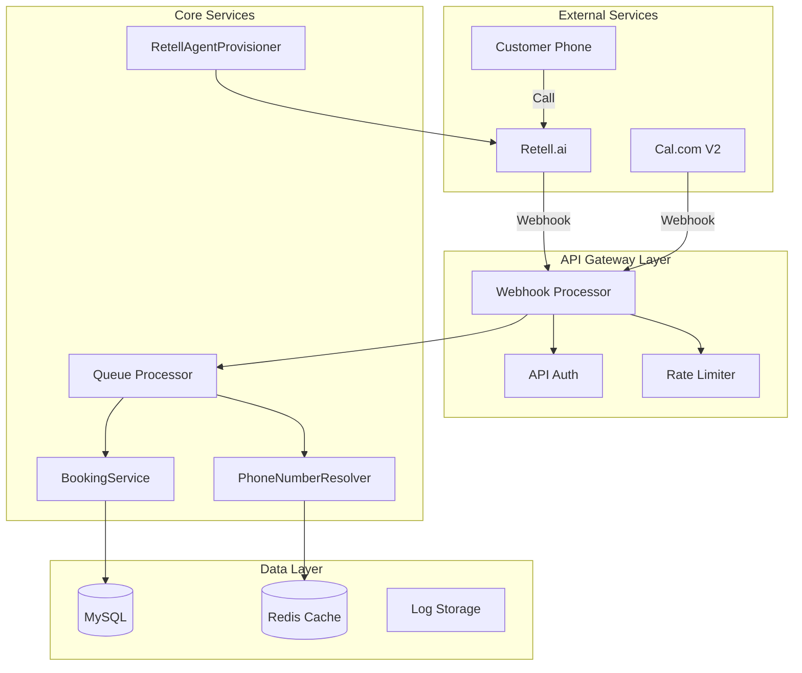

# AskProAI Technical Specification - Critical Fixes
**Version**: 1.0  
**Date**: 2025-06-17  
**Status**: Implementation Ready

## 1. System Architecture Overview



## 2. Critical Component Specifications

### 2.1 WebhookProcessor (Unified Handler)

#### Interface Definition
```php
namespace App\Services\Webhook;

interface WebhookProcessorInterface
{
    /**
     * Process incoming webhook
     * 
     * @param string $service Service identifier (retell, calcom, stripe)
     * @param Request $request Incoming webhook request
     * @return JsonResponse
     * @throws WebhookException
     */
    public function process(string $service, Request $request): JsonResponse;
    
    /**
     * Verify webhook signature
     * 
     * @param string $service
     * @param Request $request
     * @return bool
     * @throws InvalidSignatureException
     */
    public function verifySignature(string $service, Request $request): bool;
    
    /**
     * Store webhook event for processing
     * 
     * @param string $service
     * @param Request $request
     * @return WebhookEvent
     */
    public function storeWebhookEvent(string $service, Request $request): WebhookEvent;
}
```

#### Implementation Details
```php
class WebhookProcessor implements WebhookProcessorInterface
{
    private array $verifiers;
    private array $processors;
    
    public function __construct(
        private WebhookEventRepository $repository,
        private LoggerInterface $logger,
        private MetricsCollector $metrics
    ) {
        $this->initializeVerifiers();
        $this->initializeProcessors();
    }
    
    public function process(string $service, Request $request): JsonResponse
    {
        $startTime = microtime(true);
        $correlationId = $this->generateCorrelationId();
        
        try {
            // Step 1: Verify signature (synchronous, fast)
            if (!$this->verifySignature($service, $request)) {
                throw new InvalidSignatureException("Invalid webhook signature for {$service}");
            }
            
            // Step 2: Deduplicate (synchronous, fast)
            if ($this->isDuplicate($service, $request)) {
                $this->logger->info("Duplicate webhook detected", [
                    'service' => $service,
                    'correlation_id' => $correlationId
                ]);
                return $this->successResponse("Duplicate webhook ignored");
            }
            
            // Step 3: Store event (synchronous, fast)
            $event = $this->storeWebhookEvent($service, $request);
            
            // Step 4: Queue for processing (asynchronous)
            ProcessWebhookJob::dispatch($event)
                ->onQueue('webhooks')
                ->afterCommit();
            
            // Step 5: Record metrics
            $this->metrics->recordWebhook($service, microtime(true) - $startTime);
            
            // Step 6: Return immediate response
            return $this->successResponse("Webhook received", [
                'event_id' => $event->id,
                'correlation_id' => $correlationId
            ]);
            
        } catch (\Exception $e) {
            $this->handleError($e, $service, $correlationId);
            throw $e;
        }
    }
    
    private function isDuplicate(string $service, Request $request): bool
    {
        $idempotencyKey = $this->extractIdempotencyKey($service, $request);
        
        return Cache::remember(
            "webhook_processed_{$service}_{$idempotencyKey}",
            300, // 5 minutes
            fn() => false
        );
    }
}
```

### 2.2 PhoneNumberResolver

#### Specification
```php
namespace App\Services\Routing;

class PhoneNumberResolver
{
    private const CACHE_TTL = 300; // 5 minutes
    
    public function __construct(
        private BranchRepository $branchRepo,
        private Cache $cache,
        private LoggerInterface $logger
    ) {}
    
    /**
     * Resolve branch from phone number with caching
     * 
     * @param string $phoneNumber Normalized phone number
     * @return Branch|null
     */
    public function resolveBranch(string $phoneNumber): ?Branch
    {
        $normalized = $this->normalizePhoneNumber($phoneNumber);
        
        return $this->cache->remember(
            $this->getCacheKey($normalized),
            self::CACHE_TTL,
            function () use ($normalized) {
                $this->logger->debug("Cache miss for phone resolution", [
                    'phone' => $normalized
                ]);
                
                return $this->branchRepo->findByPhoneNumber($normalized);
            }
        );
    }
    
    /**
     * Normalize phone number to E.164 format
     * 
     * @param string $phoneNumber
     * @return string
     */
    private function normalizePhoneNumber(string $phoneNumber): string
    {
        // Remove all non-numeric characters
        $cleaned = preg_replace('/[^0-9+]/', '', $phoneNumber);
        
        // Handle German numbers
        if (strpos($cleaned, '0') === 0) {
            $cleaned = '+49' . substr($cleaned, 1);
        }
        
        // Ensure + prefix
        if (strpos($cleaned, '+') !== 0) {
            $cleaned = '+' . $cleaned;
        }
        
        return $cleaned;
    }
    
    /**
     * Invalidate cache for phone number
     */
    public function invalidateCache(string $phoneNumber): void
    {
        $normalized = $this->normalizePhoneNumber($phoneNumber);
        $this->cache->forget($this->getCacheKey($normalized));
    }
    
    private function getCacheKey(string $phoneNumber): string
    {
        return "branch_phone_" . md5($phoneNumber);
    }
}
```

### 2.3 RetellAgentProvisioner (Fixed)

#### Problem Fix Specification
```php
namespace App\Services\Provisioning;

class RetellAgentProvisioner
{
    private const DEFAULT_SERVICE_DURATION = 30;
    private const DEFAULT_SERVICE_NAME = 'Standardberatung';
    
    /**
     * Create Retell AI agent with automatic service creation
     */
    public function createRetellAgent(Branch $branch): array
    {
        // Ensure branch has at least one service
        $this->ensureBranchHasService($branch);
        
        // Continue with agent creation...
        return $this->provisionAgent($branch);
    }
    
    /**
     * Ensure branch has at least one service, create default if needed
     */
    private function ensureBranchHasService(Branch $branch): void
    {
        if ($branch->services->isEmpty()) {
            $this->logger->warning("Branch has no services, creating default", [
                'branch_id' => $branch->id,
                'company_id' => $branch->company_id
            ]);
            
            $defaultService = $this->createDefaultService($branch);
            
            // Refresh relationship
            $branch->load('services');
            
            event(new DefaultServiceCreated($branch, $defaultService));
        }
    }
    
    /**
     * Create default service for branch
     */
    private function createDefaultService(Branch $branch): Service
    {
        return DB::transaction(function () use ($branch) {
            $service = Service::create([
                'company_id' => $branch->company_id,
                'branch_id' => $branch->id,
                'name' => self::DEFAULT_SERVICE_NAME,
                'description' => 'Automatisch erstellter Standardservice',
                'duration' => self::DEFAULT_SERVICE_DURATION,
                'price' => 0,
                'currency' => 'EUR',
                'is_active' => true,
                'metadata' => [
                    'auto_created' => true,
                    'created_at' => now()->toIso8601String(),
                    'reason' => 'branch_provisioning'
                ]
            ]);
            
            // Create staff assignment if staff exists
            if ($branch->staff->isNotEmpty()) {
                $branch->staff->each(function ($staff) use ($service) {
                    StaffService::create([
                        'staff_id' => $staff->id,
                        'service_id' => $service->id,
                        'is_available' => true
                    ]);
                });
            }
            
            return $service;
        });
    }
}
```

### 2.4 SQLite Test Migration Fix

#### Migration Compatibility Layer
```php
// database/migrations/2025_06_17_200000_fix_sqlite_test_compatibility.php

use Illuminate\Database\Migrations\Migration;
use Illuminate\Database\Schema\Blueprint;
use Illuminate\Support\Facades\Schema;

class FixSqliteTestCompatibility extends Migration
{
    public function up()
    {
        // Only run for SQLite (test environment)
        if (config('database.default') !== 'sqlite') {
            return;
        }
        
        // Fix companies table JSON fields
        if (Schema::hasTable('companies')) {
            Schema::table('companies', function (Blueprint $table) {
                // Check and add missing columns
                $columns = [
                    'settings' => 'json',
                    'metadata' => 'json',
                    'features' => 'json'
                ];
                
                foreach ($columns as $column => $type) {
                    if (!Schema::hasColumn('companies', $column)) {
                        $table->$type($column)->nullable();
                    }
                }
            });
        }
        
        // Fix branches table
        if (Schema::hasTable('branches')) {
            Schema::table('branches', function (Blueprint $table) {
                if (!Schema::hasColumn('branches', 'working_hours')) {
                    $table->json('working_hours')->nullable();
                }
                if (!Schema::hasColumn('branches', 'settings')) {
                    $table->json('settings')->nullable();
                }
            });
        }
    }
    
    public function down()
    {
        // Reverse operations not needed for test fix
    }
}
```

#### Test Database Configuration
```php
// phpunit.xml
<php>
    <env name="APP_ENV" value="testing"/>
    <env name="DB_CONNECTION" value="sqlite"/>
    <env name="DB_DATABASE" value=":memory:"/>
    <env name="CACHE_DRIVER" value="array"/>
    <env name="QUEUE_CONNECTION" value="sync"/>
    <env name="SESSION_DRIVER" value="array"/>
    <env name="TELESCOPE_ENABLED" value="false"/>
    <env name="BOOKING_DEBUG" value="true"/>
</php>
```

### 2.5 Security Hardening

#### SQL Injection Prevention
```php
namespace App\Services\Security;

class QuerySanitizer
{
    /**
     * Sanitize and validate query parameters
     */
    public static function sanitizeWhere(string $column, $value, string $operator = '='): array
    {
        // Whitelist columns
        $allowedColumns = [
            'id', 'company_id', 'branch_id', 'phone_number',
            'email', 'status', 'created_at', 'updated_at'
        ];
        
        if (!in_array($column, $allowedColumns)) {
            throw new InvalidArgumentException("Column not allowed: {$column}");
        }
        
        // Validate operator
        $allowedOperators = ['=', '!=', '<', '>', '<=', '>=', 'like', 'in'];
        if (!in_array(strtolower($operator), $allowedOperators)) {
            throw new InvalidArgumentException("Operator not allowed: {$operator}");
        }
        
        return [$column, $operator, $value];
    }
    
    /**
     * Replace unsafe whereRaw with safe alternatives
     */
    public static function safeWhereRaw(Builder $query, string $sql, array $bindings = []): Builder
    {
        // Validate SQL doesn't contain dangerous patterns
        $dangerousPatterns = [
            '/union\s+select/i',
            '/;\s*drop/i',
            '/;\s*delete/i',
            '/;\s*update/i',
            '/;\s*insert/i'
        ];
        
        foreach ($dangerousPatterns as $pattern) {
            if (preg_match($pattern, $sql)) {
                throw new SecurityException("Dangerous SQL pattern detected");
            }
        }
        
        // Ensure all placeholders have bindings
        $placeholderCount = substr_count($sql, '?');
        if ($placeholderCount !== count($bindings)) {
            throw new InvalidArgumentException("Binding count mismatch");
        }
        
        return $query->whereRaw($sql, $bindings);
    }
}
```

#### Multi-Tenancy Enforcement
```php
namespace App\Models\Scopes;

class StrictTenantScope implements Scope
{
    public function apply(Builder $builder, Model $model)
    {
        $companyId = $this->resolveCompanyId();
        
        if (!$companyId) {
            // Instead of silent failure, throw exception
            throw new TenantResolutionException(
                'Unable to resolve tenant context. Access denied.',
                403
            );
        }
        
        $table = $model->getTable();
        $builder->where("{$table}.company_id", $companyId);
        
        // Log tenant access for audit
        app(AuditLogger::class)->logTenantAccess($companyId, $table);
    }
    
    private function resolveCompanyId(): ?int
    {
        // Priority order for tenant resolution
        $resolvers = [
            fn() => request()->route('company_id'),
            fn() => request()->header('X-Company-ID'),
            fn() => auth()->user()?->company_id,
            fn() => session('company_id'),
            fn() => $this->resolveFromSubdomain()
        ];
        
        foreach ($resolvers as $resolver) {
            $companyId = $resolver();
            if ($companyId) {
                return (int) $companyId;
            }
        }
        
        return null;
    }
}
```

## 3. Database Schema Optimizations

### 3.1 Performance Indexes
```sql
-- Critical indexes for webhook processing
CREATE INDEX idx_webhook_events_service_type ON webhook_events(service, event_type);
CREATE INDEX idx_webhook_events_correlation ON webhook_events(correlation_id);
CREATE INDEX idx_webhook_events_created ON webhook_events(created_at);

-- Phone number lookup optimization  
CREATE INDEX idx_branches_phone ON branches(phone_number);
CREATE INDEX idx_branches_company_active ON branches(company_id, is_active);

-- Call processing optimization
CREATE INDEX idx_calls_retell_id ON calls(retell_call_id);
CREATE INDEX idx_calls_company_status ON calls(company_id, status);

-- Appointment lookup optimization
CREATE INDEX idx_appointments_branch_date ON appointments(branch_id, appointment_date);
CREATE INDEX idx_appointments_customer ON appointments(customer_id);
```

### 3.2 Data Types Optimization
```sql
-- Optimize phone number storage
ALTER TABLE branches MODIFY phone_number VARCHAR(20) NOT NULL;
ALTER TABLE customers MODIFY phone_number VARCHAR(20) NOT NULL;

-- Optimize JSON columns for better performance
ALTER TABLE companies MODIFY settings JSON;
ALTER TABLE webhook_events MODIFY payload JSON;
ALTER TABLE api_call_logs MODIFY request_data JSON;
```

## 4. Queue Configuration

### 4.1 Queue Priority Structure
```php
// config/queue.php
'connections' => [
    'redis' => [
        'driver' => 'redis',
        'connection' => 'default',
        'queue' => env('REDIS_QUEUE', 'default'),
        'retry_after' => 90,
        'block_for' => null,
        'after_commit' => true,
    ],
],

'queue_priorities' => [
    'critical' => 10,    // Webhook processing
    'high' => 8,         // Appointment creation
    'default' => 5,      // General processing
    'low' => 3,          // Reports, analytics
    'maintenance' => 1   // Cleanup, archives
]
```

### 4.2 Job Implementation
```php
namespace App\Jobs\Webhook;

class ProcessWebhookJob implements ShouldQueue
{
    use Dispatchable, InteractsWithQueue, Queueable, SerializesModels;
    
    public $tries = 3;
    public $backoff = [10, 60, 300]; // 10s, 1m, 5m
    public $timeout = 120;
    public $queue = 'critical';
    
    public function __construct(
        private WebhookEvent $event
    ) {}
    
    public function handle(
        WebhookProcessingService $processor,
        LoggerInterface $logger
    ): void {
        $logger->info("Processing webhook", [
            'event_id' => $this->event->id,
            'service' => $this->event->service,
            'type' => $this->event->event_type
        ]);
        
        try {
            $processor->processEvent($this->event);
            
            $this->event->update([
                'processed_at' => now(),
                'status' => 'processed'
            ]);
            
        } catch (\Exception $e) {
            $this->handleFailure($e);
        }
    }
    
    public function failed(\Throwable $exception): void
    {
        $this->event->update([
            'status' => 'failed',
            'error_message' => $exception->getMessage(),
            'failed_at' => now()
        ]);
        
        // Alert monitoring
        app(AlertService::class)->sendWebhookFailureAlert($this->event, $exception);
    }
}
```

## 5. Monitoring & Alerting

### 5.1 Health Check Endpoints
```php
// routes/api.php
Route::prefix('health')->group(function () {
    Route::get('/', [HealthController::class, 'status']);
    Route::get('/detailed', [HealthController::class, 'detailed'])
        ->middleware('auth:api');
});

// app/Http/Controllers/Api/HealthController.php
class HealthController extends Controller
{
    public function status(): JsonResponse
    {
        $checks = [
            'database' => $this->checkDatabase(),
            'redis' => $this->checkRedis(),
            'queue' => $this->checkQueue(),
            'services' => $this->checkExternalServices()
        ];
        
        $healthy = collect($checks)->every(fn($check) => $check['status'] === 'healthy');
        
        return response()->json([
            'status' => $healthy ? 'healthy' : 'unhealthy',
            'timestamp' => now()->toIso8601String(),
            'checks' => $checks
        ], $healthy ? 200 : 503);
    }
}
```

### 5.2 Metrics Collection
```php
namespace App\Services\Monitoring;

class MetricsCollector
{
    private const METRICS_PREFIX = 'askproai_';
    
    public function recordWebhook(string $service, float $duration): void
    {
        $this->histogram(
            'webhook_processing_duration_seconds',
            $duration,
            ['service' => $service]
        );
        
        $this->increment('webhook_total', ['service' => $service]);
    }
    
    public function recordBooking(string $status, float $duration): void
    {
        $this->histogram(
            'booking_duration_seconds',
            $duration,
            ['status' => $status]
        );
        
        $this->increment('bookings_total', ['status' => $status]);
    }
    
    private function histogram(string $metric, float $value, array $labels = []): void
    {
        // Prometheus format
        $key = self::METRICS_PREFIX . $metric;
        Cache::push($key, [
            'value' => $value,
            'labels' => $labels,
            'timestamp' => microtime(true)
        ]);
    }
}
```

## 6. Error Handling & Recovery

### 6.1 Circuit Breaker Pattern
```php
namespace App\Services\Resilience;

class CircuitBreaker
{
    private const FAILURE_THRESHOLD = 5;
    private const RECOVERY_TIMEOUT = 60; // seconds
    
    public function call(string $service, callable $operation)
    {
        $state = $this->getState($service);
        
        if ($state === 'open') {
            if ($this->shouldAttemptReset($service)) {
                $state = 'half-open';
            } else {
                throw new CircuitOpenException("Service {$service} is unavailable");
            }
        }
        
        try {
            $result = $operation();
            
            if ($state === 'half-open') {
                $this->close($service);
            }
            
            return $result;
            
        } catch (\Exception $e) {
            $this->recordFailure($service);
            
            if ($this->getFailureCount($service) >= self::FAILURE_THRESHOLD) {
                $this->open($service);
            }
            
            throw $e;
        }
    }
}
```

### 6.2 Graceful Degradation
```php
namespace App\Services\Booking;

class BookingServiceWithFallback
{
    public function createAppointment(array $data): Appointment
    {
        try {
            // Try primary Cal.com V2
            return $this->calcomV2Service->createBooking($data);
            
        } catch (CalcomException $e) {
            Log::warning("Cal.com V2 failed, trying fallback", [
                'error' => $e->getMessage()
            ]);
            
            try {
                // Fallback to V1
                return $this->calcomV1Service->createBooking($data);
                
            } catch (\Exception $fallbackError) {
                // Last resort: Create local only
                return $this->createLocalAppointment($data);
            }
        }
    }
}
```

## 7. Testing Strategy

### 7.1 Unit Test Example
```php
namespace Tests\Unit\Services;

class WebhookProcessorTest extends TestCase
{
    private WebhookProcessor $processor;
    private MockRepository $mockRepo;
    
    protected function setUp(): void
    {
        parent::setUp();
        
        $this->mockRepo = $this->mock(WebhookEventRepository::class);
        $this->processor = new WebhookProcessor(
            $this->mockRepo,
            app(LoggerInterface::class),
            app(MetricsCollector::class)
        );
    }
    
    public function test_processes_valid_webhook(): void
    {
        // Arrange
        $request = $this->createWebhookRequest('retell', [
            'event' => 'call.ended',
            'call_id' => 'test-123'
        ]);
        
        $this->mockRepo->shouldReceive('create')
            ->once()
            ->andReturn(new WebhookEvent(['id' => 1]));
        
        // Act
        $response = $this->processor->process('retell', $request);
        
        // Assert
        $this->assertEquals(200, $response->getStatusCode());
        $this->assertArrayHasKey('event_id', $response->getData(true));
    }
    
    public function test_rejects_invalid_signature(): void
    {
        // Arrange
        $request = $this->createWebhookRequest('retell', [], 'invalid-signature');
        
        // Act & Assert
        $this->expectException(InvalidSignatureException::class);
        $this->processor->process('retell', $request);
    }
}
```

### 7.2 Integration Test Example
```php
namespace Tests\Integration;

class BookingFlowIntegrationTest extends TestCase
{
    use RefreshDatabase;
    
    public function test_complete_booking_flow(): void
    {
        // Arrange
        $company = Company::factory()->create();
        $branch = Branch::factory()->for($company)->create([
            'phone_number' => '+4930123456789'
        ]);
        $service = Service::factory()->for($branch)->create();
        
        // Act - Simulate webhook
        $response = $this->postJson('/api/webhook', [
            'service' => 'retell',
            'event' => 'call.ended',
            'data' => [
                'to_number' => '+4930123456789',
                'customer_phone' => '+4930987654321',
                'appointment_date' => '2025-06-20',
                'appointment_time' => '14:00'
            ]
        ]);
        
        // Assert
        $response->assertOk();
        $this->assertDatabaseHas('appointments', [
            'branch_id' => $branch->id,
            'status' => 'scheduled'
        ]);
    }
}
```

## 8. Deployment Strategy

### 8.1 Zero-Downtime Deployment
```bash
#!/bin/bash
# deploy.sh

# Step 1: Health check
curl -f http://api.askproai.de/health || exit 1

# Step 2: Enable maintenance mode (with bypass)
php artisan down --secret="deploy-in-progress-2025"

# Step 3: Pull latest code
git pull origin main

# Step 4: Install dependencies
composer install --no-dev --optimize-autoloader

# Step 5: Run migrations
php artisan migrate --force

# Step 6: Clear caches
php artisan optimize:clear
php artisan optimize

# Step 7: Restart queue workers gracefully
php artisan queue:restart

# Step 8: Run tests
php artisan test --testsuite=smoke

# Step 9: Disable maintenance mode
php artisan up

# Step 10: Verify
curl -f http://api.askproai.de/health || exit 1
```

### 8.2 Rollback Procedure
```bash
#!/bin/bash
# rollback.sh

# Step 1: Enable maintenance
php artisan down

# Step 2: Restore previous version
git reset --hard $PREVIOUS_COMMIT

# Step 3: Restore database
mysql -u root -p askproai < backups/pre-deploy-backup.sql

# Step 4: Clear caches
php artisan optimize:clear

# Step 5: Restart services
php artisan queue:restart
sudo service php8.3-fpm restart

# Step 6: Disable maintenance
php artisan up
```

## 9. Performance Benchmarks

### Expected Performance Metrics
- Webhook processing: < 50ms response time
- Phone resolution: < 10ms (cached)
- Appointment creation: < 200ms
- API response time (p95): < 150ms
- Queue processing delay: < 5s

### Load Testing Targets
- Concurrent webhooks: 100/second
- Concurrent API calls: 500/second
- Database connections: 100 concurrent
- Queue throughput: 1000 jobs/minute

## 10. Success Criteria

The implementation is considered successful when:

1. **All tests pass**: 100% of test suite green
2. **Performance met**: All benchmarks achieved
3. **Zero data loss**: No webhooks dropped
4. **Multi-tenancy secure**: No data leaks
5. **Monitoring active**: All alerts configured
6. **Documentation complete**: All changes documented
7. **Deployment smooth**: Zero-downtime achieved

---

**Next Step**: Begin implementation starting with Critical Fix #1 (RetellAgentProvisioner)