# 🚀 AskProAI - Ultimate Implementation Plan 2025

## 🎯 Vision & Kernproblem
**Wir vereinfachen die automatische Terminbuchung via Telefon so radikal, dass jeder Friseur, Arzt oder Handwerker es in 3 Minuten einrichten kann.**

### 🔴 Die 3 Hauptprobleme (aus gestern):
1. **Verwirrung**: "Woher weiß das System, bei welcher Filiale angerufen wird?"
2. **Komplexität**: 119 Tabellen, 7 Cal.com Services, 5 Retell Services 
3. **Setup-Chaos**: Unklar wo was konfiguriert werden muss

---

## 📊 KLARHEIT SCHAFFEN: So funktioniert der Datenfluss

### 🔄 Der magische Moment: Telefon → Termin

```mermaid
graph LR
    A[Kunde ruft an<br/>+49 30 12345678] -->|1| B[Retell.ai Agent]
    B -->|2| C[Webhook an AskProAI]
    C -->|3| D[PhoneNumberResolver]
    D -->|4| E[Findet Filiale & Company]
    E -->|5| F[Lädt Cal.com Settings]
    F -->|6| G[Prüft Verfügbarkeit]
    G -->|7| H[Bucht Termin]
    H -->|8| I[Sendet Bestätigung]
```



### 📍 Die kritischen Zuordnungen:

```yaml
Telefonnummer: +49 30 12345678
    ↓
phone_numbers Tabelle:
  - number: "+49 30 12345678"
  - branch_id: "2079e925-..."
    ↓
branches Tabelle:
  - id: "2079e925-..."
  - name: "Zahnarztpraxis Berlin Mitte"
  - company_id: 85
  - retell_agent_id: "agent_9a8202..."
  - calcom_event_type_id: 2026361
    ↓
calcom_event_types Tabelle:
  - id: 2026361
  - name: "30-min-behandlung"
  - calcom_team_id: "dr-schmidt-zahnaerzte"
```

---

## 🛠 DER NEUE PLAN: Radikal vereinfacht

### ⚡ PHASE 0: SOFORT-MAßNAHMEN (Morgen, Tag 1)

#### 08:00-10:00: Große Aufräumaktion
```bash
# 1. Backup erstellen
php artisan backup:run --only-db

# 2. Test-Files entfernen (16 Stück!)
mkdir -p tests/manual
mv test_*.php check_*.php tests/manual/

# 3. Redundante Services identifizieren
find app/Services -name "*Service.php" | sort
```

**Zu löschende Services:**
- ❌ CalcomService.php → Nur CalcomV2Service behalten
- ❌ RetellService.php → Nur RetellV2Service behalten  
- ❌ AppointmentService.php → In SmartBookingService integrieren
- ❌ 4 weitere redundante Services

#### 10:00-12:00: Service Consolidation
```php
// NEU: app/Services/SmartBookingService.php
class SmartBookingService 
{
    private CalcomV2Service $calcom;
    private RetellV2Service $retell;
    private PhoneNumberResolver $resolver;
    
    public function handleIncomingCall(array $webhookData): Appointment
    {
        // 1. Resolve branch from phone number
        $branch = $this->resolver->resolve($webhookData['to_number']);
        
        // 2. Parse customer intent
        $bookingIntent = $this->parseBookingIntent($webhookData);
        
        // 3. Find available slot
        $slot = $this->calcom->findAvailableSlot(
            $branch->calcom_event_type_id,
            $bookingIntent->requestedDateTime
        );
        
        // 4. Create appointment
        return $this->createAppointment($branch, $slot, $bookingIntent);
    }
}
```

#### 13:00-15:00: Vereinfachte Datenbank
```sql
-- Tabellen die WEG können (56 Stück!):
DROP TABLE IF EXISTS oauth_*;  -- 5 Tabellen
DROP TABLE IF EXISTS telescope_*;  -- 5 Tabellen  
DROP TABLE IF EXISTS pulse_*;  -- 7 Tabellen
DROP TABLE IF EXISTS failed_jobs;
DROP TABLE IF EXISTS job_batches;
-- ... weitere 39 redundante Tabellen

-- Neue, vereinfachte Struktur:
-- Nur noch 20 KERN-Tabellen statt 119!
```

#### 15:00-17:00: Setup-Wizard V1
```php
// app/Filament/Admin/Pages/QuickSetupWizard.php
class QuickSetupWizard extends Page
{
    protected array $steps = [
        'company' => [
            'title' => 'Firma anlegen',
            'fields' => ['name', 'industry', 'timezone'],
            'duration' => '30 Sekunden'
        ],
        'branch' => [
            'title' => 'Erste Filiale',
            'fields' => ['name', 'address', 'phone_number'],
            'duration' => '30 Sekunden'
        ],
        'calcom' => [
            'title' => 'Cal.com verbinden',
            'action' => 'OAuth oder API Key',
            'auto_import' => true,
            'duration' => '60 Sekunden'
        ],
        'retell' => [
            'title' => 'KI-Stimme aktivieren',
            'action' => 'Agent erstellen & Nummer verknüpfen',
            'test_call' => true,
            'duration' => '60 Sekunden'
        ]
    ];
}
```

---

### 📈 PHASE 1: KERN-STABILISIERUNG (Woche 1-2)

#### Vereinfachte Service-Architektur
```yaml
ALT (7 Services):              NEU (3 Services):
- CalcomService                - SmartBookingService
- CalcomV2Service              - IntegrationService  
- RetellService                - NotificationService
- RetellV2Service
- AppointmentService
- BookingService
- CallService
```

#### Klare Verantwortlichkeiten:
1. **SmartBookingService**: Alles rund um Terminbuchung
2. **IntegrationService**: Alle externen APIs (Cal.com, Retell)
3. **NotificationService**: Alle Benachrichtigungen (Email, später SMS)

---

### 🎨 PHASE 2: PREMIUM UX (Woche 3-4)

#### Der 3-Minuten Setup (State-of-the-Art!)

```typescript
// 1. FIRMA ANLEGEN (30 Sek)
{
  name: "Friseur Schmidt",
  industry: "beauty", // Auto-konfiguriert Settings!
  timezone: "Europe/Berlin"
}

// 2. KALENDER VERBINDEN (60 Sek)
// OAuth Flow mit Cal.com
// → Automatisch alle Event Types importiert
// → Automatisch alle Mitarbeiter verknüpft

// 3. TELEFON AKTIVIEREN (60 Sek)  
// → Nummer auswählen oder mitbringen
// → KI-Stimme wählen (oder eigene aufnehmen)
// → Automatisch Retell Agent erstellt

// 4. TEST & LIVE (30 Sek)
// → Test-Anruf durchführen
// → Live-Dashboard öffnet sich
// → Erster echter Anruf = Konfetti! 🎉
```

#### Industry Templates (Automatische Vorkonfiguration)
```php
$industryDefaults = [
    'medical' => [
        'appointment_duration' => 30,
        'buffer_time' => 10,
        'reminder_hours' => 24,
        'no_show_policy' => 'strict'
    ],
    'beauty' => [
        'appointment_duration' => 60,
        'buffer_time' => 15,
        'reminder_hours' => 48,
        'no_show_policy' => 'flexible'
    ],
    'handwerk' => [
        'appointment_duration' => 120,
        'buffer_time' => 30,
        'reminder_hours' => 72,
        'no_show_policy' => 'relaxed'
    ]
];
```

---

### 💰 PHASE 3: MONETARISIERUNG (Woche 5)

#### Transparentes Pricing (Best-in-Class)
```javascript
// Real-time Usage Dashboard
const PricingCalculator = {
  base: 99, // EUR/Monat
  included: {
    calls: 100,
    appointments: 50,
    branches: 2
  },
  overage: {
    per_call: 0.50,
    per_appointment: 2.00,
    per_branch: 25.00
  },
  
  // Live-Anzeige im Dashboard
  currentUsage: {
    calls: 87,  // von 100
    appointments: 42,  // von 50
    projected_bill: 99.00  // EUR
  }
};
```

#### Stripe Integration (Vollautomatisch)
- Subscription Management
- Usage-Based Billing  
- SEPA Lastschrift
- Automatische Rechnungen

---

### 🌟 PHASE 4: CUSTOMER PORTAL (Woche 6-7)

#### Das Portal das Vertrauen schafft
```php
// Portal Features (Filament-basiert)
CustomerPortal::features([
    // TRANSPARENZ
    'live_calls' => true,        // Anrufe in Echtzeit sehen
    'appointments' => true,      // Alle Termine im Überblick
    'analytics' => true,         // Conversion Rates, ROI
    
    // SELF-SERVICE  
    'team_management' => true,   // Mitarbeiter verwalten
    'branch_settings' => true,   // Öffnungszeiten ändern
    'billing' => true,           // Rechnungen & Usage
    
    // INTEGRATIONEN
    'calendar_sync' => true,     // Weitere Kalender verbinden
    'api_access' => true,        // Für eigene Integrationen
]);
```

---

### 🚀 PHASE 5: SKALIERUNG (Woche 8+)

#### Enterprise Features
- Multi-Region Support
- White-Label Lösung
- API Marketplace
- Advanced Analytics
- Compliance Zertifikate

#### Zukunfts-Features
- WhatsApp Integration (wenn Nachfrage da ist)
- SMS Benachrichtigungen (als Premium Feature)
- Video-Call Booking
- AI Insights & Predictions

---

## 📋 MORGEN: Der erste Tag

### 🎯 Tagesplan für maximalen Impact

```yaml
08:00-08:30: Kickoff & Backup
  - Diesen Plan durchgehen
  - Full Backup erstellen
  - Test-Anruf bei +493083793369

08:30-10:00: Große Aufräumaktion  
  - 16 Test-Files → /tests/manual/
  - Redundante Services markieren
  - Disabled Files löschen

10:00-12:00: Service Konsolidierung
  - SmartBookingService erstellen
  - PhoneNumberResolver fixen
  - Tests schreiben

13:00-15:00: Datenbank-Optimierung
  - Redundante Tabellen identifizieren
  - Migration vorbereiten
  - Performance Indexes

15:00-17:00: Quick Setup Wizard V1  
  - Wizard-Grundstruktur
  - Industry Templates
  - Test mit AskProAI Berlin

17:00-17:30: Deploy & Celebrate
  - Staging Deployment
  - End-to-End Test
  - Erster Meilenstein! 🎉
```

### ✅ Definition of Done für Tag 1:
- [ ] Code ist 30% kleiner
- [ ] Nur noch 3 statt 7 Services  
- [ ] Setup dauert 10 statt 120 Minuten
- [ ] Erfolgreicher Test-Anruf
- [ ] Dokumentation aktualisiert

---

## 🏆 ERFOLGS-METRIKEN

### Woche 1:
- ✅ 50% weniger Code-Komplexität
- ✅ 3-Minuten Setup möglich
- ✅ 100% Test Coverage Core Flow

### Monat 1:
- ✅ 10 zahlende Kunden
- ✅ 95% Anruf-zu-Termin Rate
- ✅ < 5% Churn Rate

### Jahr 1:
- ✅ 1000+ Filialen
- ✅ #1 in Deutschland
- ✅ Expansion nach Österreich/Schweiz

---

## 💡 KERN-PHILOSOPHIE

### Was uns State-of-the-Art macht:

1. **Radikal Einfach**
   - 3 Services statt 20
   - 20 Tabellen statt 119
   - 1 Dashboard statt 6

2. **Obsessiv Kundenorientiert**
   - 3-Minuten Setup
   - Zero Training Required
   - Erfolg ab dem ersten Anruf

3. **Technisch Exzellent**
   - < 200ms Response Time
   - 99.9% Uptime
   - Skaliert bis 10k Filialen

4. **Transparent & Fair**
   - Usage-based Pricing
   - Keine versteckten Kosten
   - Jederzeit kündbar

---

**Dieser Plan macht AskProAI zum Marktführer! Los geht's! 🚀**