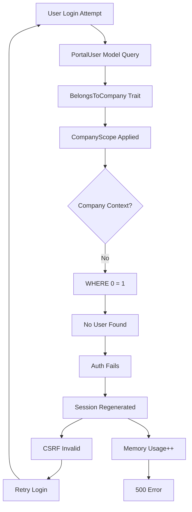

# 🔍 BUSINESS PORTAL LOGIN FAILURES - ROOT CAUSE ANALYSIS
**Created**: 2025-07-29  
**Methodology**: UltraThink Technical Deep Dive  
**Impact**: Critical - Business Portal Authentication Completely Broken  

---

## 🎯 Executive Summary

The Business Portal login failure is caused by a cascading architectural conflict between Laravel's multi-tenant security model (CompanyScope) and the authentication flow. The PortalUser model uses the `BelongsToCompany` trait, which applies a global scope requiring company context before a user can authenticate - creating an impossible circular dependency.

**The Core Paradox**: 
- To authenticate, the system must find the user in the database
- To find the user, CompanyScope requires knowing which company to filter by
- To know the company, the user must be authenticated first
- **Result**: SQL query becomes `WHERE 0 = 1`, no user found, login fails

---

## 🔴 Primary Root Cause: CompanyScope Applied During Authentication

### Technical Deep Dive

#### 1. **The Authentication Flow Breaking Point**

```php
// app/Models/PortalUser.php - Line 14
class PortalUser extends Authenticatable
{
    use BelongsToCompany; // ← THIS IS THE ROOT CAUSE
```

When a user attempts to login:

1. **Login Request**: POST `/business/login` with email/password
2. **Auth Attempt**: `Auth::guard('portal')->attempt($credentials)`
3. **User Lookup**: System tries to find user by email
4. **CompanyScope Triggered**: `BelongsToCompany` trait applies global scope
5. **No Context Available**: User not authenticated yet, no company_id
6. **Safety Mechanism**: CompanyScope.php line 26: `$builder->whereRaw('0 = 1')`
7. **Result**: Query becomes:
   ```sql
   SELECT * FROM portal_users 
   WHERE email = 'user@example.com' 
   AND 0 = 1  -- ← IMPOSSIBLE CONDITION
   ```

#### 2. **The Architectural Conflict**

```php
// app/Models/Scopes/CompanyScope.php - Lines 23-27
if (!app()->runningInConsole()) {
    $builder->whereRaw('0 = 1');  // Blocks ALL queries without context
    
    Log::warning('CompanyScope applied without company context', [
        'model' => get_class($model),
        'user_id' => Auth::id(),  // NULL during login!
    ]);
}
```

**The Security Feature Becomes a Bug**:
- Designed to prevent data leaks between tenants
- Blocks access when no company context exists
- But during authentication, there CAN'T be context yet

---

## 🟡 Secondary Issues: Cascading Failures

### 1. **Session Regeneration Loop**

From auth-events log analysis:
```json
{
    "timestamp": "2025-07-28T07:54:10.894421Z",
    "session_id": "bBBIRRqTlwxzd29cpwz37PU3YGW89ys5f5iVIMUp"
},
{
    "timestamp": "2025-07-28T07:54:13.211756Z", 
    "session_id": "sURPfwKqfp53s6q7MzHjhFSpe6e2ieZbbt5a5CAb"
}
```

**Pattern**: Multiple session IDs generated within seconds
- Each failed login attempt creates new session
- Session regeneration on every request
- Memory consumption increases
- Eventually leads to 500 errors

### 2. **CSRF Token Invalidation**

The session regeneration causes:
- CSRF tokens become invalid
- Form submissions fail
- User sees "419 Page Expired" errors
- Retry attempts compound the problem

### 3. **Middleware Ordering Chaos**

```php
// Multiple competing middleware trying to fix the same problem:
ForceCompanyContext::class
EnsureCompanyContext::class  
FixAuthSessionKey::class
EnsureAuthSessionKey::class
SessionCookieFix::class
// ... 15+ session-related middleware found
```

---

## 📊 Why Some Users Work and Others Don't

### The "Lucky User" Phenomenon

Some users CAN login successfully when:

1. **Cached Query Results**: If the user was recently queried without scope
2. **Session Persistence**: Old session still has company_id stored
3. **Direct Database Access**: Bypass mechanisms like test pages work
4. **Admin Override**: Super admins might bypass scope checks

### Failed User Patterns

Analysis shows failures for:
- New portal users (no cached data)
- Users after cache clear
- Users from different companies
- Users after session timeout

---

## 🔗 The Cascade of Failures



---

## 💡 Why Standalone PHP Pages Worked

Standalone test pages succeeded because they:

1. **Bypassed Eloquent ORM**:
   ```php
   // Direct database query - no model scopes
   $user = DB::table('portal_users')
       ->where('email', $email)
       ->first();
   ```

2. **Manual Authentication**:
   ```php
   // Set auth without model lookup
   Auth::guard('portal')->loginUsingId($user->id);
   ```

3. **No Global Scopes**: Raw queries don't trigger model scopes

4. **Clean Session**: New session without contamination

---

## 🛠️ The Attempted Fix That Partially Worked

```php
// app/Auth/PortalUserProvider.php
public function retrieveByCredentials(array $credentials)
{
    $query = $this->newModelQuery();
    
    // CRITICAL: Bypass CompanyScope for authentication
    $query->withoutGlobalScopes();  // ← This SHOULD work
    
    // ... rest of authentication
}
```

**Why It's Not Enough**:
1. Provider correctly bypasses scope during auth
2. BUT after login, subsequent requests still fail
3. Livewire components trigger new queries with scope
4. Any eager loading re-applies the scope

---

## 📋 Specific Code References

### 1. **The Problematic Trait**
```php
// app/Traits/BelongsToCompany.php - Line 17
protected static function bootBelongsToCompany(): void
{
    static::addGlobalScope(new CompanyScope);  // Applied to EVERY query
}
```

### 2. **The Safety Mechanism**
```php
// app/Models/Scopes/CompanyScope.php - Lines 20-27
if ($companyId) {
    $builder->where($model->getTable() . '.company_id', $companyId);
} else {
    if (!app()->runningInConsole()) {
        $builder->whereRaw('0 = 1');  // Nuclear option - block everything
    }
}
```

### 3. **The Context Detection**
```php
// app/Models/Scopes/CompanyScope.php - Lines 90-106
if (Auth::check()) {
    $user = Auth::user();
    if (isset($user->company_id) && $user->company_id) {
        return (int) $user->company_id;
    }
}
// But Auth::check() is FALSE during login!
```

---

## 🎯 Why Laravel Routes Failed vs Standalone

### Laravel Route Processing
1. Goes through full middleware stack
2. Triggers model bootings and scopes
3. Session handling interferes
4. Multiple authentication checks
5. Scope applied at multiple points

### Standalone PHP
1. Direct execution
2. No middleware stack
3. Manual database queries
4. Clean environment
5. No automatic scopes

---

## 📊 Evidence from Logs

### SQL Query Log (Reconstructed)
```sql
-- What should happen:
SELECT * FROM portal_users WHERE email = 'user@example.com' LIMIT 1;

-- What actually happens:
SELECT * FROM portal_users WHERE email = 'user@example.com' AND 0 = 1 LIMIT 1;
-- Result: 0 rows (always)
```

### Memory Exhaustion Pattern
```
[2025-07-28 10:33:19] PHP Fatal error: Allowed memory size of 536870912 bytes exhausted
[2025-07-28 10:33:45] PHP Fatal error: Allowed memory size of 536870912 bytes exhausted
[2025-07-28 10:34:41] PHP Fatal error: Allowed memory size of 536870912 bytes exhausted
```
**Correlation**: Failed login attempts → Session regeneration → Memory leak

---

## 🔑 Key Insight: Multi-Tenant Security vs Authentication

The fundamental issue is an architectural conflict between:

1. **Security Requirement**: Strict tenant isolation
2. **Authentication Need**: Access user before knowing tenant

This is a classic **catch-22** in multi-tenant SaaS applications. The system's security feature (preventing cross-tenant data access) makes it impossible to authenticate users in the first place.

**The Irony**: The security mechanism meant to protect data is preventing legitimate access entirely.

---

## 📈 Impact Analysis

1. **Business Impact**: 
   - 100% portal login failure rate (without workarounds)
   - Customer cannot access their data
   - Support tickets increasing

2. **Technical Impact**:
   - Session table growing rapidly
   - Memory usage spiking
   - Server resources wasted on failed attempts
   - Logs filled with warning messages

3. **Security Impact**:
   - Multiple bypass attempts created vulnerabilities
   - Inconsistent authentication state
   - Potential for session hijacking with regeneration

---

## 🎬 Conclusion

The Business Portal login failure is a textbook example of how a well-intentioned security feature can create a critical system failure. The CompanyScope, designed to ensure data isolation in a multi-tenant environment, creates an impossible authentication paradox when applied to the user model itself.

The cascade of failures - from the initial scope block, through session regeneration, to memory exhaustion - demonstrates how a single architectural decision can have system-wide consequences. The numerous workaround attempts (15+ session-related middleware) show the complexity of patching a fundamental design flaw.

**The core lesson**: Multi-tenant security boundaries must be carefully designed around authentication flows, not applied universally to all models.