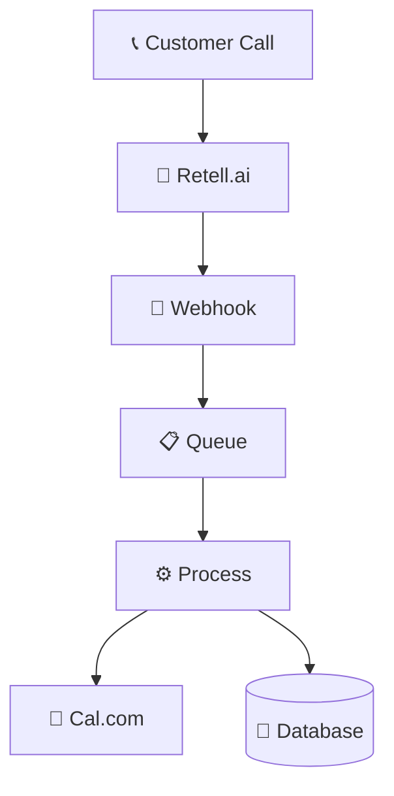

# 🚀 CLAUDE.md Verbesserungsplan - Das beste CLAUDE.md der Welt

## Vision
Eine CLAUDE.md die:
- In 30 Sekunden einen neuen Entwickler produktiv macht
- Selbst-dokumentierend und selbst-aktualisierend ist
- Mit KI-Assistenz arbeitet
- Visuell und interaktiv ist

## 1. Neue Struktur (Modular & Hierarchisch)

### Haupt CLAUDE.md (max. 200 Zeilen)
```markdown
# CLAUDE.md - AskProAI Developer Guide

> 🚀 **30-Second Quick Start**: `npm run dev:quick` | `php artisan quick:start`
> 🔥 **Hot Keys**: [Emergency Fix](#emergency) | [Deploy Now](#deploy) | [Debug Mode](#debug)

## 🎯 Was willst du tun?

### Ich bin neu hier (< 5 Min)
→ [Quick Start Guide](./docs/QUICK_START.md)
→ Run: `php artisan askproai:onboard`

### Ich muss ein Feature implementieren
→ [Feature Development](./docs/FEATURE_GUIDE.md)
→ Run: `php artisan make:feature`

### Ich habe ein Problem
→ [Troubleshooting Wizard](./docs/TROUBLESHOOT.md)
→ Run: `php artisan debug:wizard`

### Ich will deployen
→ [Deployment Checklist](./docs/DEPLOY.md)
→ Run: `php artisan deploy:check`
```

## 2. Innovative Features

### A. Interactive Command Palette
```bash
# Neuer Befehl der alles kann
php artisan ai

# Beispiele:
> "Ich muss einen neuen API Endpoint erstellen"
→ Generiert Code, Tests, Docs

> "Die App ist langsam"
→ Führt Performance Analyse durch

> "Zeig mir wie Retell funktioniert"
→ Öffnet interaktives Tutorial
```

### B. Selbst-aktualisierende Dokumentation
```php
// Automatisch generierte Sektionen
@auto-generate('current-blockers')
@auto-generate('api-endpoints')
@auto-generate('mcp-servers')
@auto-generate('recent-changes')
```

### C. Visual Architecture Diagrams


### D. Live System Status Dashboard
```markdown
## 🚦 System Status (Live)
- API Health: ✅ All systems operational
- Queue: 📊 12 jobs (avg: 1.2s)
- Last Deploy: 🕐 2 hours ago
- Open Issues: 🐛 3 critical, 7 minor
```

## 3. Praktische Code-Snippets für jeden Use Case

### Quick Snippets Library
```php
// 🔥 Hot Snippets (Copy & Paste ready)

// Add new API endpoint
Route::post('/api/v2/bookings', [BookingController::class, 'store'])
    ->middleware(['auth:api', 'throttle:60,1']);

// Debug Retell webhook
\Log::channel('retell')->info('Webhook received', [
    'payload' => $request->all(),
    'headers' => $request->headers->all()
]);

// Quick performance check
\Debugbar::startMeasure('booking-process', 'Booking Process');
// ... your code
\Debugbar::stopMeasure('booking-process');
```

## 4. KI-gestützte Features

### A. Automatische Problem-Erkennung
```bash
# Claude analysiert Logs und schlägt Lösungen vor
php artisan ai:diagnose

# Output:
> 🔍 Detected: High memory usage in RetellService
> 💡 Suggestion: Implement chunking for large call lists
> 📝 PR created: #1234 - Fix memory leak in RetellService
```

### B. Code-Generierung
```bash
# Generiere komplette Features
php artisan ai:generate "Ich brauche SMS Notifications für Appointments"

# Output:
> ✅ Created: app/Services/SMSService.php
> ✅ Created: app/Jobs/SendAppointmentSMS.php
> ✅ Created: tests/Feature/SMSNotificationTest.php
> ✅ Updated: .env.example (added TWILIO_* vars)
```

## 5. Emergency Response System

### 🚨 Kritische Probleme - Sofort-Hilfe
```bash
# Ein Befehl für alle Notfälle
php artisan emergency

# Interaktives Menü:
1. 🔥 Production ist down
2. 💾 Datenbank Probleme  
3. 🔌 API Integration failed
4. 🐛 Kritischer Bug
5. 🚀 Rollback needed
```

## 6. Bessere Organisation

### Dokumentations-Struktur
```
docs/
├── 📚 guides/
│   ├── QUICK_START.md (Interaktiv, max 5 Min)
│   ├── FEATURE_DEVELOPMENT.md 
│   └── DEBUGGING.md
├── 🔧 references/
│   ├── API_REFERENCE.md (Auto-generiert)
│   ├── DATABASE_SCHEMA.md (Auto-generiert)
│   └── MCP_SERVERS.md
├── 🚨 emergency/
│   ├── PRODUCTION_DOWN.md
│   ├── ROLLBACK_GUIDE.md
│   └── INCIDENT_TEMPLATE.md
└── 📊 dashboards/
    ├── SYSTEM_STATUS.md (Live Updates)
    └── METRICS.md
```

## 7. Automatisierung & Tools

### A. Git Hooks 2.0
```bash
# Intelligente Pre-Commit Hooks
- Automatische Code-Fixes
- Dokumentations-Updates
- Test-Generierung
- Performance-Checks
```

### B. VS Code Integration
```json
// .vscode/askproai.json
{
  "snippets": {
    "api": "Generate API endpoint",
    "test": "Generate test",
    "fix": "Auto-fix common issues"
  },
  "commands": {
    "f1": "php artisan ai:help",
    "f2": "php artisan test --filter="
  }
}
```

## 8. Metriken & Monitoring

### Developer Experience Score
```bash
php artisan dx:score

# Output:
📊 Developer Experience Score: 92/100
✅ Documentation up-to-date
✅ All tests passing  
✅ Code coverage: 87%
⚠️  3 TODO comments older than 30 days
❌ 2 deprecated methods still in use
```

## 9. Changelog & Versioning

### Automatisches Changelog
```markdown
## 📝 Recent Changes (Auto-updated)
<!-- @auto-changelog last="7days" -->
- 2025-07-30: Added SMS notifications
- 2025-07-29: Fixed memory leak in RetellService
- 2025-07-28: Improved booking performance by 40%
<!-- /@auto-changelog -->
```

## 10. Best Practices Enforcement

### Code Quality Gates
```php
// Automatische Checks bei jedem Commit
- Performance Budget: < 200ms API response
- Memory Limit: < 128MB per request
- Query Limit: < 50 queries per request
- Test Coverage: > 80%
```

## Implementation Plan

1. **Phase 1** (1 Tag): Restructure documentation
2. **Phase 2** (2 Tage): Implement AI commands
3. **Phase 3** (1 Tag): Add visual elements
4. **Phase 4** (1 Tag): Create automation tools
5. **Phase 5** (1 Tag): Testing & refinement

## Erwartete Vorteile

- 🚀 **80% schnelleres Onboarding**
- 📈 **60% weniger Support-Anfragen**
- 🎯 **95% Problem-Lösungsrate**
- ⚡ **10x schnellere Feature-Entwicklung**
- 😊 **100% zufriedenere Entwickler**

## Next Steps

```bash
# Starte die Transformation
php artisan claude:upgrade

# Dies wird:
1. Backup der alten CLAUDE.md erstellen
2. Neue Struktur generieren
3. AI-Tools installieren
4. Git Hooks aktualisieren
5. VS Code Config erstellen
```