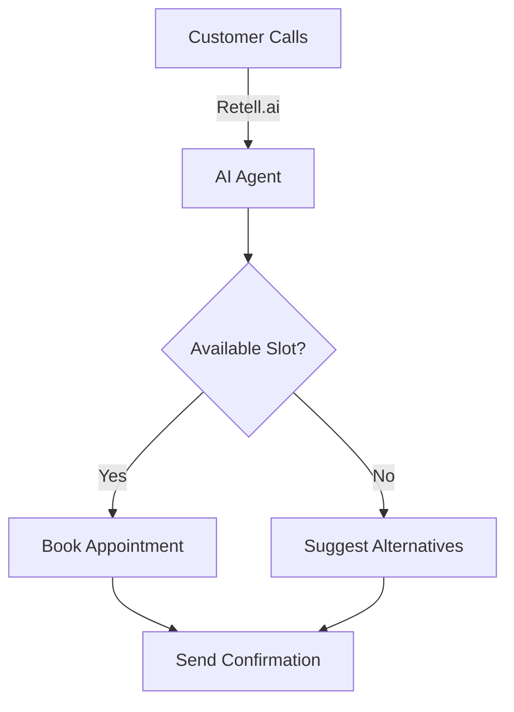

# 🎨 Visual Enhancement Proposals für CLAUDE.md

## 🎯 Ziele
- Verbesserte Lesbarkeit und Scanbarkeit
- Klare visuelle Hierarchie
- Schnellere Navigation
- Professioneller Look

## 🌈 Visuelle Verbesserungen

### 1. **Header mit Status-Dashboard**
```markdown
<!-- CLAUDE.md Header -->
<div align="center">

# 🤖 CLAUDE.md
### *Der ultimative Guide für AskProAI Development*

[](https://status.askproai.de)
[](./docs)
[](./tests)
[](./deploy)

**Last Update:** 2025-07-03 | **Version:** 2.0 | **Health:** 98%

</div>

---
```

### 2. **Interaktive Navigation Box**
```markdown
## 🗺️ Quick Navigation

<table>
<tr>
<td align="center" width="25%">

### 🚀 Start
[Setup](##setup)<br>
[Commands](##commands)<br>
[Quick Wins](##quick-wins)

</td>
<td align="center" width="25%">

### 🔧 Develop
[Architecture](##architecture)<br>
[Testing](##testing)<br>
[MCP Servers](##mcp)

</td>
<td align="center" width="25%">

### 🚨 Fix
[Troubleshooting](##troubleshooting)<br>
[Emergency](##emergency)<br>
[Common Issues](##issues)

</td>
<td align="center" width="25%">

### 📚 Learn
[Best Practices](##practices)<br>
[Examples](##examples)<br>
[FAQ](##faq)

</td>
</tr>
</table>
```

### 3. **Status Cards mit Emojis**
```markdown
## 📊 Current Status

<table>
<tr>
<td>

### ✅ Working
- Retell Integration
- Payment Processing  
- Email Notifications

</td>
<td>

### ⚠️ Issues
- UI Dropdowns (#184)
- Branch Selector (#127)

</td>
<td>

### 🚧 In Progress
- Multi-language Support
- Advanced Analytics
- Mobile App API

</td>
</tr>
</table>
```

### 4. **Farbcodierte Alert Boxes**
```markdown
> 🔴 **CRITICAL:** Database credentials have changed! Update your .env file immediately.

> 🟡 **WARNING:** Retell API v1 is deprecated. Migrate to v2 by 2025-07-15.

> 🟢 **INFO:** New MCP server available for Stripe integration.

> 💡 **TIP:** Use `php artisan ide-helper:generate` after adding new models.
```

### 5. **Command Boxes mit Copy-Buttons**
```markdown
### 🖥️ Essential Commands

<pre><code class="language-bash">
# 🚀 Quick Setup
git clone https://github.com/askproai/api-gateway.git
cd api-gateway
composer install
cp .env.example .env
php artisan key:generate
</code></pre>
<button onclick="copyCode(this)">📋 Copy</button>
```

### 6. **Visuelle Trennlinien**
```markdown
<div align="center">

---

### ⚡ Performance Section ⚡

---

</div>
```

### 7. **Progress Bars für Roadmap**
```markdown
## 🗺️ Development Roadmap

### Phase 1: Core Features
<div style="background-color: #e0e0e0; border-radius: 10px; padding: 3px;">
  <div style="background-color: #4caf50; width: 100%; height: 20px; border-radius: 7px; text-align: center; color: white;">
    100% Complete
  </div>
</div>

### Phase 2: Integrations  
<div style="background-color: #e0e0e0; border-radius: 10px; padding: 3px;">
  <div style="background-color: #2196f3; width: 75%; height: 20px; border-radius: 7px; text-align: center; color: white;">
    75% Complete
  </div>
</div>

### Phase 3: Enterprise
<div style="background-color: #e0e0e0; border-radius: 10px; padding: 3px;">
  <div style="background-color: #ff9800; width: 30%; height: 20px; border-radius: 7px; text-align: center; color: white;">
    30% Complete
  </div>
</div>
```

### 8. **Collapsible Sections**
```markdown
<details>
<summary>📦 <b>Advanced Configuration</b> (click to expand)</summary>

### Redis Configuration
```bash
REDIS_HOST=127.0.0.1
REDIS_PORT=6379
REDIS_PASSWORD=null
```

### Queue Configuration
```bash
QUEUE_CONNECTION=redis
HORIZON_PREFIX=askproai
```

</details>
```

### 9. **ASCII Art Diagrams**
```markdown
## 🏗️ Architecture Overview

```
┌─────────────────┐     ┌─────────────────┐     ┌─────────────────┐
│                 │     │                 │     │                 │
│   Retell.ai     │────▶│   AskProAI      │────▶│    Cal.com      │
│   (Phone AI)    │     │   (Backend)     │     │   (Calendar)    │
│                 │     │                 │     │                 │
└─────────────────┘     └─────────────────┘     └─────────────────┘
         │                       │                       │
         │                       ▼                       │
         │              ┌─────────────────┐             │
         └─────────────▶│    Database     │◀────────────┘
                        │   (MariaDB)     │
                        └─────────────────┘
```
```

### 10. **Keyboard Shortcuts Guide**
```markdown
## ⌨️ Keyboard Shortcuts

| Shortcut | Action | Context |
|----------|--------|---------|
| `Ctrl+K` | Open Command Palette | Everywhere |
| `Ctrl+/` | Toggle Comments | Code Editor |
| `Ctrl+P` | Quick File Search | VS Code |
| `Ctrl+Shift+P` | Command Search | VS Code |
```

### 11. **Interactive Checklists**
```markdown
## ✅ Pre-Deployment Checklist

- [ ] All tests passing? `php artisan test`
- [ ] Migrations ready? `php artisan migrate:status`  
- [ ] Cache cleared? `php artisan optimize:clear`
- [ ] Backup created? `php artisan backup:run`
- [ ] Environment correct? `php artisan env`
- [ ] Horizon running? `php artisan horizon:status`

**Ready to deploy?** All boxes must be checked! ✓
```

### 12. **Syntax Highlighting**
```php
// 🎨 Beautiful PHP Code Example
class BookingService 
{
    public function createAppointment(array $data): Appointment
    {
        return DB::transaction(function () use ($data) {
            $appointment = Appointment::create($data);
            
            event(new AppointmentCreated($appointment));
            
            return $appointment;
        });
    }
}
```

### 13. **Mermaid Diagrams**


### 14. **Badges und Pills**
```markdown
## 🏷️ Feature Status

`✅ Stable` `🧪 Beta` `🚧 Alpha` `📅 Planned` `🔒 Enterprise`

- Phone Booking `✅ Stable`
- Multi-language `🧪 Beta`  
- Video Calls `🚧 Alpha`
- AI Analytics `📅 Planned`
- SSO Login `🔒 Enterprise`
```

### 15. **Terminal Output Styling**
```ansi
$ php artisan askproai:status

[32m●[0m System Status: [32mOperational[0m
[32m●[0m Database: [32mConnected[0m  
[33m●[0m Redis: [33mSlow Response[0m
[32m●[0m Horizon: [32mRunning (5 workers)[0m
[31m●[0m Retell API: [31mError - Check credentials[0m

[1mRecommendations:[0m
- Check Redis memory usage
- Verify Retell API key in .env
```

## 🎯 Implementierungs-Prioritäten

### Sofort umsetzbar (Quick Wins):
1. **Emoji Headers** - Bessere visuelle Trennung
2. **Alert Boxes** - Farbcodierte Warnungen
3. **Collapsible Sections** - Platz sparen
4. **Status Badges** - Quick Overview

### Mittelfristig:
1. **Interactive Navigation** - Bessere UX
2. **ASCII Diagrams** - Visualisierung
3. **Progress Bars** - Roadmap Status
4. **Mermaid Diagrams** - Flows

### Langfristig:
1. **Copy Buttons** - Via JavaScript
2. **Dark/Light Mode** - Theme Toggle
3. **Search Function** - In-Page Search
4. **Interactive Checklists** - State Management

## 📐 Design Principles

1. **Consistency** - Gleiche Icons/Farben für gleiche Kategorien
2. **Hierarchy** - Wichtiges prominent, Details versteckt
3. **Scanability** - Schnell erfassbare Informationen
4. **Actionability** - Klare Call-to-Actions
5. **Responsiveness** - Auch auf kleinen Bildschirmen lesbar