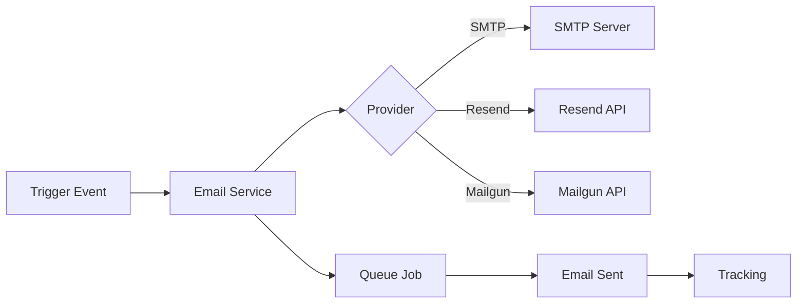

# Email System - Complete Documentation

**Last Updated:** 2025-07-10  
**Version:** 2.0  
**Status:** Production Ready

## Table of Contents

1. [Overview](#overview)
2. [Architecture](#architecture)
3. [Email Providers](#email-providers)
4. [Email Templates](#email-templates)
5. [Call Summary Emails](#call-summary-emails)
6. [Notification System](#notification-system)
7. [CSV Export](#csv-export)
8. [Queue Processing](#queue-processing)
9. [Configuration](#configuration)
10. [Monitoring & Troubleshooting](#monitoring--troubleshooting)
11. [Security & Compliance](#security--compliance)
12. [API Reference](#api-reference)

## Overview

The AskProAI Email System is a comprehensive solution for handling all email communications including:
- Appointment confirmations and reminders
- Call summaries with recordings and transcripts
- Customer notifications
- Billing and invoice emails
- System alerts and notifications

### Key Features
- ✅ Multiple email provider support (SMTP, Resend, Mailgun, Postmark)
- ✅ Queue-based processing for reliability
- ✅ Multi-language email templates
- ✅ Professional HTML designs with mobile optimization
- ✅ CSV export attachments
- ✅ Email tracking and analytics
- ✅ Batch email processing
- ✅ Company-specific customization

## Architecture

### Service Layer Structure

```
EmailSystem/
├── Services/
│   ├── EmailService.php              # Core email service
│   ├── CallNotificationService.php   # Call-specific notifications
│   ├── NotificationService.php       # Multi-channel notifications
│   └── CallExportService.php        # CSV export generation
├── Mail/
│   ├── CallSummaryEmail.php         # Individual call summaries
│   ├── CallSummaryBatchEmail.php    # Batch summaries
│   ├── CustomCallSummaryEmail.php   # Customizable summaries
│   ├── AppointmentConfirmation.php  # Appointment emails
│   └── InvoiceEmail.php            # Billing emails
├── Jobs/
│   ├── SendCallSummaryJob.php       # Async email processing
│   ├── SendCallSummaryEmailJob.php  # Legacy job
│   └── SendBatchCallSummariesCommand.php # Scheduled batches
└── Templates/
    ├── call-summary-modern.blade.php # Modern design
    ├── call-summary-premium.blade.php # Premium design
    └── call-summary-batch.blade.php  # Batch template
```

### Data Flow



## Email Providers

### 1. SMTP Configuration
```env
MAIL_MAILER=smtp
MAIL_HOST=smtp.udag.de
MAIL_PORT=587
MAIL_USERNAME=askproai@udag.de
MAIL_PASSWORD=secure_password
MAIL_ENCRYPTION=tls
MAIL_FROM_ADDRESS="info@askproai.de"
MAIL_FROM_NAME="AskProAI"
```

### 2. Resend (Preferred for Transactional)
```env
MAIL_MAILER=resend
RESEND_API_KEY=re_xxxxxxxxxxxxxxxxx
```

**Benefits:**
- Optimized for transactional emails
- Better delivery rates
- Detailed delivery reports
- Faster sending
- Already configured in SPF record

### 3. Mailgun
```env
MAILGUN_DOMAIN=mg.askproai.de
MAILGUN_SECRET=key-xxxxxx
MAILGUN_ENDPOINT=api.eu.mailgun.net
```

### 4. Postmark
```env
POSTMARK_TOKEN=xxxxxx-xxxx-xxxx-xxxx-xxxxxxxxxxxx
```

## Email Templates

### Call Summary Templates

#### 1. Modern Template (`call-summary-modern.blade.php`)
- Clean, professional design
- Mobile-responsive layout
- Color-coded urgency levels
- Optional transcript section
- CSV attachment support

#### 2. Premium Template (`call-summary-premium.blade.php`)
**Features:**
- Premium header with quick actions
- Company info showing call forwarding
- Three action buttons:
  - 📞 View Call (primary)
  - 🎧 Recording (secondary)
  - 📊 CSV Download (tertiary)
- Metadata bar with key information
- Structured content sections

**Layout Structure:**
```
┌─────────────────────────────────────┐
│         COMPANY NAME                │
│  Call forwarded to +49...           │
│                                     │
│ [View Call] [🎧] [CSV]             │
└─────────────────────────────────────┘
┌─────────────────────────────────────┐
│  DATE & TIME │ DURATION │ PRIORITY  │
│   08.01.2025 │   5:23   │  NORMAL   │
│     14:30    │   Min    │           │
└─────────────────────────────────────┘
```

#### 3. Batch Summary Template (`call-summary-batch.blade.php`)
- Statistics overview
- Time period display
- Urgent calls highlight
- All calls table
- CSV attachment for all calls

### Email Components

#### Custom Message Support
- Optional custom message at top
- Markdown formatting support
- Position: Above all other content
- Default: Empty (no message)

#### Dynamic Content Sections
1. **Caller Information Grid**
   - Name, Phone, Email, Company
   - Two-column responsive layout

2. **Call Summary**
   - AI-generated summary
   - Key points highlighted
   - Action items extracted

3. **Appointment Details** (if booked)
   - Date, time, service
   - Status indicator
   - Yellow highlight for pending

4. **Transcript Section**
   - Full conversation display
   - Chat-style formatting
   - Speaker identification
   - No height restrictions

5. **Customer Information**
   - Previous interactions
   - Contact details
   - Notes and preferences

## Call Summary Emails

### Individual Call Summaries

#### Sending Process
1. Call ends → Webhook received
2. `ProcessRetellCallEndedJob` processes data
3. Checks if summaries enabled
4. Dispatches `SendCallSummaryJob` (30s delay)
5. Email sent to configured recipients

#### Configuration
```php
// Company level settings
$company->update([
    'send_call_summaries' => true,
    'call_summary_recipients' => ['admin@company.com'],
    'include_transcript_in_summary' => true,
    'include_csv_export' => true,
    'summary_email_frequency' => 'immediate'
]);
```

### Batch Call Summaries

#### Scheduled Processing
```php
// In app/Console/Kernel.php
$schedule->command('calls:send-batch-summaries --frequency=hourly')
    ->hourly()
    ->at('05');

$schedule->command('calls:send-batch-summaries --frequency=daily')
    ->dailyAt('08:00');
```

#### Batch Features
- Aggregated statistics
- Urgent calls section
- Complete CSV export
- Time period summary

### Manual Sending

#### Via UI
1. Navigate to call details
2. Click "Send Summary" button
3. Enter recipients
4. Select options
5. Send

#### Via API
```bash
POST /business/api/calls/{id}/send-summary
{
    "recipients": ["email@example.com"],
    "include_transcript": true,
    "include_csv": true,
    "message": "Optional custom message",
    "subject": "Optional custom subject"
}
```

## Notification System

### Multi-Channel Support
```php
class NotificationService
{
    public function sendNotification($customer, $type, $data)
    {
        $channels = $this->getEnabledChannels($customer);
        
        foreach ($channels as $channel) {
            match($channel) {
                'email' => $this->sendEmail($customer, $type, $data),
                'sms' => $this->sendSMS($customer, $type, $data),
                'whatsapp' => $this->sendWhatsApp($customer, $type, $data),
                'push' => $this->sendPush($customer, $type, $data),
            };
        }
    }
}
```

### Email Types
1. **Appointment Notifications**
   - Confirmation
   - Reminder (24h, 1h)
   - Cancellation
   - Rescheduling

2. **Call Notifications**
   - New call received
   - Call summary
   - Missed call alert
   - Voicemail notification

3. **System Notifications**
   - Account activation
   - Password reset
   - Billing alerts
   - System maintenance

## CSV Export

### Export Service Features
```php
class CallExportService
{
    // Export columns
    protected $columns = [
        'id' => 'ID',
        'created_at' => 'Datum',
        'time' => 'Uhrzeit',
        'duration_sec' => 'Dauer (Sekunden)',
        'duration_formatted' => 'Dauer',
        'phone_number' => 'Telefonnummer',
        'customer_name' => 'Kundenname',
        'customer_email' => 'Kunden E-Mail',
        'branch_name' => 'Filiale',
        'status' => 'Status',
        'urgency_level' => 'Dringlichkeit',
        'summary' => 'Zusammenfassung',
        'appointment_date' => 'Termin Datum',
        'appointment_time' => 'Termin Uhrzeit',
        'transcript' => 'Transkript',
        'dynamic_variables' => 'Erfasste Daten',
        'agent_name' => 'Agent Name',
        'cost' => 'Kosten',
        'updated_at' => 'Aktualisiert am'
    ];
}
```

### Data Privacy Filters
```php
// Fields excluded from export
protected $excludedFields = [
    'caller_id',
    'twilio_call_sid',
    'direction',
    'to_number',
    'from_number',
    'retell_call_id',
    'internal_metadata'
];
```

### Export Features
- UTF-8 BOM for Excel compatibility
- Semicolon delimiter for German Excel
- Customer costs only (not internal)
- Filtered dynamic variables
- Formatted dates and times

## Queue Processing

### Queue Configuration
```php
// Email jobs use dedicated queue
QUEUE_EMAILS=emails

// Horizon configuration
'environments' => [
    'production' => [
        'email-worker' => [
            'connection' => 'redis',
            'queue' => ['emails'],
            'balance' => 'auto',
            'maxProcesses' => 10,
            'memory' => 128,
            'tries' => 3,
            'timeout' => 300,
        ],
    ],
],
```

### Job Processing
```php
class SendCallSummaryJob implements ShouldQueue
{
    use Dispatchable, InteractsWithQueue, Queueable, SerializesModels;
    
    public $tries = 3;
    public $timeout = 300;
    public $backoff = [60, 180, 300];
    
    public function handle()
    {
        // Process email sending
        // Handle retries
        // Track status
    }
}
```

### Failed Job Handling
```php
public function failed(Throwable $exception)
{
    Log::error('Call summary email failed', [
        'call_id' => $this->call->id,
        'error' => $exception->getMessage(),
        'recipients' => $this->recipients
    ]);
    
    // Notify admins
    // Create failed job record
    // Attempt alternative sending
}
```

## Configuration

### Environment Variables
```env
# Primary Mail Configuration
MAIL_MAILER=resend
MAIL_FROM_ADDRESS="info@askproai.de"
MAIL_FROM_NAME="AskProAI"

# Resend Configuration
RESEND_API_KEY=re_xxxxxxxxxxxxxxxxx

# SMTP Fallback
SMTP_HOST=smtp.udag.de
SMTP_PORT=587
SMTP_USERNAME=askproai@udag.de
SMTP_PASSWORD=secure_password
SMTP_ENCRYPTION=tls

# Email Settings
EMAIL_RATE_LIMIT=100
EMAIL_RATE_WINDOW=60
EMAIL_RETRY_TIMES=3
EMAIL_RETRY_DELAY=300

# Queue Settings
QUEUE_CONNECTION=redis
QUEUE_EMAILS=emails
```

### Company Settings
```php
// Database fields
'send_call_summaries' => boolean
'call_summary_recipients' => json array
'include_transcript_in_summary' => boolean
'include_csv_export' => boolean
'summary_email_frequency' => enum('immediate', 'hourly', 'daily')
'call_notification_settings' => json object
```

### User Preferences
```php
// Portal user settings
'call_notification_preferences' => [
    'receive_summaries' => true,
    'summary_types' => ['urgent', 'appointments'],
    'preferred_time' => '09:00',
    'timezone' => 'Europe/Berlin'
]
```

## Monitoring & Troubleshooting

### Email Tracking
```php
// Track email status
EmailLog::create([
    'to' => $recipient,
    'type' => 'call_summary',
    'status' => 'sent',
    'metadata' => [
        'call_id' => $call->id,
        'include_transcript' => true,
        'include_csv' => true
    ],
    'sent_at' => now()
]);
```

### Common Issues

#### Emails Not Sending
1. Check queue workers running
   ```bash
   php artisan horizon:status
   ```

2. Check mail configuration
   ```bash
   php artisan tinker
   >>> Mail::raw('Test', fn($m) => $m->to('test@example.com'));
   ```

3. Check logs
   ```bash
   tail -f storage/logs/laravel.log | grep -i mail
   ```

#### Encoding Issues
- Files include UTF-8 BOM
- Use semicolon delimiter for German Excel
- Ensure proper character encoding in templates

#### Performance Issues
- Enable queue workers
- Increase worker memory limit
- Use chunked processing for large batches

### Monitoring Commands
```bash
# Check email queue
php artisan queue:monitor emails

# View failed jobs
php artisan queue:failed

# Retry failed emails
php artisan queue:retry all

# Check email stats
php artisan email:stats --period=today
```

## Security & Compliance

### Data Protection
1. **Encryption**
   - All sensitive data encrypted at rest
   - TLS for email transmission
   - Encrypted attachments optional

2. **Access Control**
   - Permission-based email sending
   - Audit logs for all emails
   - IP whitelist for API access

3. **GDPR Compliance**
   - Consent tracking
   - Unsubscribe links
   - Data retention policies
   - Export capabilities

### Email Authentication
```dns
# SPF Record
v=spf1 include:spf.resend.com include:udag.de -all

# DKIM (configured via provider)
# DMARC Policy
v=DMARC1; p=quarantine; rua=mailto:dmarc@askproai.de
```

### Rate Limiting
```php
// Per-company limits
'email_limits' => [
    'per_minute' => 10,
    'per_hour' => 100,
    'per_day' => 1000,
    'burst' => 20
]
```

## API Reference

### Send Call Summary
```http
POST /business/api/calls/{id}/send-summary
Authorization: Bearer {token}
Content-Type: application/json

{
    "recipients": ["email1@example.com", "email2@example.com"],
    "include_transcript": true,
    "include_csv": true,
    "message": "Hier ist die Anrufzusammenfassung",
    "subject": "Anrufzusammenfassung vom 10.01.2025"
}
```

**Response:**
```json
{
    "success": true,
    "message": "Email sent successfully",
    "email_id": "msg_xxxxxxxxx",
    "recipients": ["email1@example.com", "email2@example.com"]
}
```

### Email Preview
```http
POST /business/api/email/preview
Authorization: Bearer {token}
Content-Type: application/json

{
    "call_id": "123e4567-e89b-12d3-a456-426614174000",
    "include_transcript": true,
    "message": "Preview message"
}
```

### Export Calls with Email
```http
POST /business/api/calls/export-batch
Authorization: Bearer {token}
Content-Type: application/json

{
    "filters": {
        "date_from": "2025-01-01",
        "date_to": "2025-01-31",
        "branch_id": "branch_uuid"
    },
    "format": "csv",
    "email_to": "admin@company.com"
}
```

### Update Notification Settings
```http
PUT /business/api/settings/notifications/calls
Authorization: Bearer {token}
Content-Type: application/json

{
    "send_call_summaries": true,
    "call_summary_recipients": ["admin@company.com"],
    "include_transcript_in_summary": true,
    "include_csv_export": false,
    "summary_email_frequency": "immediate"
}
```

## Best Practices

### 1. Email Design
- Keep subject lines under 50 characters
- Use preheader text effectively
- Optimize for mobile (60% of opens)
- Test across email clients
- Include alt text for images

### 2. Deliverability
- Warm up new IP addresses
- Monitor sender reputation
- Keep bounce rates < 2%
- Handle unsubscribes properly
- Use double opt-in when possible

### 3. Performance
- Queue all non-critical emails
- Batch similar emails together
- Use templates for consistency
- Cache rendered templates
- Monitor sending rates

### 4. Content
- Personalize with customer data
- Use clear CTAs
- Keep content concise
- Include relevant links
- Test different versions

### 5. Compliance
- Include unsubscribe links
- Honor opt-out requests
- Log all communications
- Secure sensitive data
- Follow local regulations

## Future Enhancements

### Planned Features
1. **Advanced Templates**
   - Drag-and-drop editor
   - A/B testing support
   - Dynamic content blocks
   - Template marketplace

2. **Analytics Dashboard**
   - Open/click tracking
   - Conversion metrics
   - Engagement heatmaps
   - ROI calculation

3. **Automation**
   - Drip campaigns
   - Trigger-based sending
   - Customer journeys
   - Behavioral targeting

4. **Integration**
   - CRM synchronization
   - Marketing platforms
   - Analytics tools
   - Customer data platforms

---

**Documentation Status:** ✅ Complete  
**Ready for:** Notion Import  
**Last Review:** 2025-07-10