# Retell Conversation Flow V25 - Visual Diagrams

## Complete Flow Architecture


## Before vs After Fix

### V24 - BROKEN FLOW

```mermaid
graph LR
    PRESENT[node_present_result<br/>Alternativen zeigen]
    BOOK[func_book_appointment<br/>❌ NICHT ERREICHBAR]
    LOOP[Infinite Loop<br/>❌ STUCK]

    PRESENT -->|"User: 'Um 06:55'"| LOOP
    LOOP -.->|"Versucht zurück<br/>zu check_availability"| LOOP
    BOOK -.->|"Wird NIE erreicht"| BOOK

    style LOOP fill:#FF6B6B,stroke:#C92A2A,stroke-width:3px
    style BOOK fill:#FFB6B6,stroke:#FA5252,stroke-width:2px
    style PRESENT fill:#FFE066,stroke:#FAB005,stroke-width:2px
```



### V25 - FIXED FLOW

```mermaid
graph LR
    PRESENT[node_present_result<br/>Alternativen zeigen]
    EXTRACT[node_extract_alternative_selection<br/>🆕 Zeit erfassen]
    CONFIRM[node_confirm_alternative<br/>🆕 Bestätigen]
    BOOK[func_book_appointment<br/>✅ BOOKING ERFOLGT]
    SUCCESS[node_booking_success<br/>✅ Bestätigung]

    PRESENT -->|"User: 'Um 06:55'"| EXTRACT
    EXTRACT -->|"{{selected_alternative_time}}<br/>= '06:55'"| CONFIRM
    CONFIRM -->|"Equation:<br/>variable exists"| BOOK
    BOOK -->|"Webhook ausgeführt"| SUCCESS

    style EXTRACT fill:#90EE90,stroke:#2F9E44,stroke-width:3px
    style CONFIRM fill:#90EE90,stroke:#2F9E44,stroke-width:3px
    style BOOK fill:#51CF66,stroke:#2B8A3E,stroke-width:3px
    style SUCCESS fill:#51CF66,stroke:#2B8A3E,stroke-width:3px
    style PRESENT fill:#74C0FC,stroke:#1971C2,stroke-width:2px
```



## Decision Flow at node_present_result


## State Variables Flow

```mermaid
graph LR
    subgraph "Sammeln"
        V1[customer_name]
        V2[service_name]
        V3[appointment_date]
        V4[appointment_time]
    end

    subgraph "🆕 Alternative Auswahl"
        V5[selected_alternative_time]
    end

    subgraph "Booking"
        B1{Welche Zeit?}
        P1[Parameter: uhrzeit]
    end

    V1 --> B1
    V2 --> B1
    V3 --> B1
    V4 -.->|"Original Path"| B1
    V5 -->|"🆕 Alternative Path"| B1

    B1 -->|"Verwendet eine<br/>der beiden"| P1

    style V5 fill:#90EE90,stroke:#2F9E44,stroke-width:3px
    style P1 fill:#FFD700,stroke:#FF8C00,stroke-width:2px
```



## Transition Conditions

```mermaid
graph TD
    PRESENT[node_present_result]

    T1{Transition 1<br/>Prompt}
    T2{Transition 2<br/>Prompt}
    T3{🆕 Transition 3<br/>Prompt}

    E1[func_book_appointment]
    E2[node_collect_booking_info]
    E3[🆕 node_extract_alternative_selection]

    PRESENT --> T3
    T3 -->|"'User selected<br/>alternative time slot'"| E3

    PRESENT --> T1
    T1 -->|"'User explicitly<br/>confirmed booking'"| E1

    PRESENT --> T2
    T2 -->|"'User wants<br/>different time'"| E2

    style T3 fill:#90EE90,stroke:#2F9E44,stroke-width:3px
    style E3 fill:#90EE90,stroke:#2F9E44,stroke-width:3px
```



## Edge Priority Order


## Test Case Flow

### Test Case: Alternative Selection


### Test Case: Direct Booking (No Alternative)


## Error Scenarios

### V24 - What Went Wrong

```mermaid
graph TD
    PRESENT[node_present_result<br/>'Alternativen: 06:55...']

    USER[User: 'Um 06:55']

    ATTEMPT1{Versucht:<br/>edge_present_to_book}
    CHECK1[Condition: 'User explicitly<br/>confirmed booking']
    MATCH1{Match?}

    ATTEMPT2{Versucht:<br/>edge_present_to_retry}
    CHECK2[Condition: 'User wants<br/>different time']
    MATCH2{Match?}

    STUCK[❌ STUCK<br/>Kein Match<br/>Node Prison]
    HALLUCINATE[❌ Agent halluziniert<br/>'Reserviert']

    PRESENT --> USER
    USER --> ATTEMPT1
    ATTEMPT1 --> CHECK1
    CHECK1 --> MATCH1
    MATCH1 -->|"Nein<br/>(User sagte nicht 'Ja')"| ATTEMPT2

    ATTEMPT2 --> CHECK2
    CHECK2 --> MATCH2
    MATCH2 -->|"Nein<br/>(User will diese Zeit)"| STUCK

    STUCK --> HALLUCINATE

    style STUCK fill:#FF6B6B,stroke:#C92A2A,stroke-width:3px
    style HALLUCINATE fill:#FF6B6B,stroke:#C92A2A,stroke-width:3px
```



### V25 - How It's Fixed

```mermaid
graph TD
    PRESENT[node_present_result<br/>'Alternativen: 06:55...']

    USER[User: 'Um 06:55']

    ATTEMPT1{🆕 Prüft zuerst:<br/>edge_present_to_extract}
    CHECK1[Condition: 'User selected<br/>alternative time slot']
    MATCH1{Match?}

    EXTRACT[✅ node_extract<br/>Erfasst Zeit]
    CONFIRM[✅ node_confirm<br/>Bestätigt]
    BOOK[✅ func_book<br/>Führt Buchung aus]
    SUCCESS[✅ SUCCESS]

    PRESENT --> USER
    USER --> ATTEMPT1
    ATTEMPT1 --> CHECK1
    CHECK1 --> MATCH1
    MATCH1 -->|"✅ JA<br/>(User wählte Alternative)"| EXTRACT

    EXTRACT --> CONFIRM
    CONFIRM --> BOOK
    BOOK --> SUCCESS

    style EXTRACT fill:#90EE90,stroke:#2F9E44,stroke-width:3px
    style CONFIRM fill:#90EE90,stroke:#2F9E44,stroke-width:3px
    style BOOK fill:#51CF66,stroke:#2B8A3E,stroke-width:3px
    style SUCCESS fill:#51CF66,stroke:#2B8A3E,stroke-width:3px
```



## Implementation Timeline


## Node Type Reference

```mermaid
graph TD
    subgraph "Node Types in V25"
        N1[Conversation Node<br/>Dynamic: node_present_result<br/>Static: node_confirm_alternative]
        N2[🆕 Extract Dynamic Variable<br/>node_extract_alternative_selection]
        N3[Function Node<br/>func_check_availability<br/>func_book_appointment]
        N4[End Node<br/>node_end]
    end

    subgraph "Transition Types"
        T1[Prompt-Based<br/>'User selected alternative']
        T2[Equation-Based<br/>'{{variable}} exists']
    end

    N1 --> T1
    N2 --> T2
    N3 --> T2

    style N2 fill:#90EE90,stroke:#2F9E44,stroke-width:3px
```

## Legend

- 🆕 Green Boxes = New nodes/edges in V25
- Yellow Boxes = Function nodes (API calls)
- Blue Boxes = Conversation nodes
- Red Boxes = Problems/errors in V24
- Solid Lines = Active transitions
- Dotted Lines = Attempted/failed transitions

---

**Generated:** 2025-11-04
**Version:** V25
**Purpose:** Visual reference for conversation flow fix
