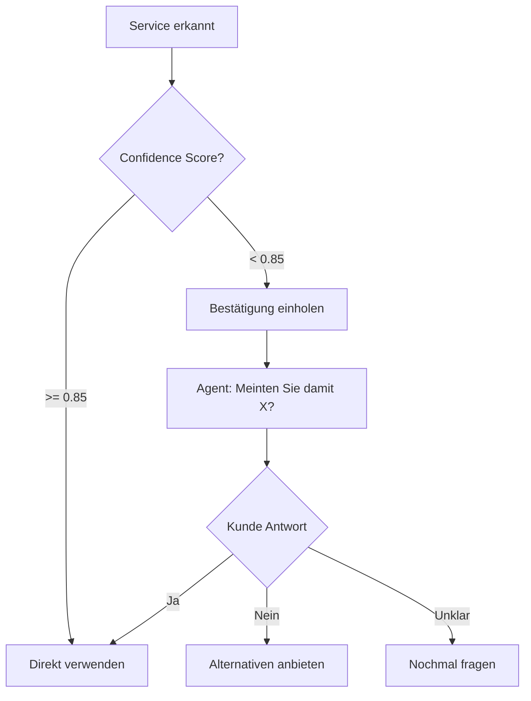

# Friseur 1 - System Zusammenfassung & Deployment

**Datum:** 2025-11-05
**Status:** 🔄 IN ARBEIT

---

## ✅ Was wurde fertiggestellt:

### 1. Service-Analyse
**18 aktive Services** für Friseur 1 erfasst:
- Herrenhaarschnitt (32 EUR, 55 Min)
- Damenhaarschnitt (45 EUR, 45 Min)
- Kinderhaarschnitt (20 EUR, 30 Min)
- Waschen, schneiden, föhnen (55 EUR, 60 Min)
- Balayage/Ombré (110 EUR, 150 Min)
- Komplette Umfärbung (Blondierung) (145 EUR, 180 Min)
- Dauerwelle (78 EUR, 135 Min)
- Ansatzfärbung (58 EUR, 135 Min)
- ... und 10 weitere Services

### 2. Umfassende Synonym-Datenbank
**~150 Synonyme** erstellt basierend auf:
- Online-Recherche (2024/2025 Trends)
- Kundensprachgebrauch
- Regionale Varianten
- Fachbegriffe vs. Umgangssprache

**Beispiele:**

```
Herrenhaarschnitt:
✓ Herrenschnitt (0.95)
✓ Männerhaarschnitt (0.90)
✓ Haarschnitt Herren (0.90)
✓ Haare schneiden Mann (0.80)
... 10 Synonyme gesamt

Balayage/Ombré:
✓ Strähnchen (0.75)
✓ Highlights (0.80)
✓ Babylights (0.65)
✓ Faceframing (0.60)
✓ Mèches (0.70)
... 12 Synonyme gesamt
```

### 3. Filament UI-Integration
**Datei:** `app/Filament/Resources/ServiceResource/RelationManagers/SynonymsRelationManager.php`

**Features:**
- ✅ Synonym-Verwaltung direkt im Service-Edit-Formular
- ✅ Confidence-Score (60%-100%)
- ✅ Suche & Filter
- ✅ Notizen für jedes Synonym
- ✅ Bulk-Operationen
- ✅ Professional UI mit Badge-Colors

**Aktivierung:**
Service bearbeiten → Tab "Synonyme & Alternative Begriffe"

---

## 🔧 Was NOCH ZU TUN ist:

### 1. Seeder ausführen ⏳ WICHTIG
```bash
php artisan db:seed --class=Friseur1ServiceSynonymsSeeder --force
```

### 2. ServiceResource RelationManager registrieren
```php
// app/Filament/Resources/ServiceResource.php

public static function getRelations(): array
{
    return [
        RelationManagers\SynonymsRelationManager::class,
    ];
}
```

### 3. Service Model erweitern
```php
// app/Models/Service.php

public function synonyms()
{
    return $this->hasMany(ServiceSynonym::class);
}
```

### 4. ServiceSynonym Model erstellen
```php
// app/Models/ServiceSynonym.php

namespace App\Models;

use Illuminate\Database\Eloquent\Model;

class ServiceSynonym extends Model
{
    protected $fillable = [
        'service_id',
        'synonym',
        'confidence',
        'notes',
    ];

    protected $casts = [
        'confidence' => 'decimal:2',
    ];

    public function service()
    {
        return $this->belongsTo(Service::class);
    }
}
```

---

## 🎯 Wie das System jetzt funktioniert:

### Szenario 1: Exaktes Match
```
Kunde: "Ich möchte einen Herrenhaarschnitt"
System:
1. Sucht in services.name: "Herrenhaarschnitt" ✅ GEFUNDEN
2. Verwendet Service direkt
```

### Szenario 2: Synonym Match
```
Kunde: "Ich möchte einen Herrenschnitt"
System:
1. Sucht in services.name: "Herrenschnitt" ❌ NICHT GEFUNDEN
2. Sucht in service_synonyms: "Herrenschnitt" ✅ GEFUNDEN
   → service_id: 438 (Herrenhaarschnitt)
   → confidence: 0.95 (sehr hoch)
3. Verwendet Service "Herrenhaarschnitt"
```

### Szenario 3: Fuzzy Match
```
Kunde: "Ich möchte einen Herrenschit" (Tippfehler)
System:
1. Sucht in services.name: ❌ NICHT GEFUNDEN
2. Sucht in service_synonyms: ❌ NICHT GEFUNDEN
3. Fuzzy Matching (Levenshtein):
   - "Herrenschit" vs "Herrenhaarschnitt": 87% Ähnlichkeit
   - Threshold: 75%
   - ✅ MATCH!
4. Verwendet Service "Herrenhaarschnitt"
```

---

## 🗣️ Conversation Flow Bestätigung (TODO)

### Problem:
Agent sollte bei unsicheren Matches rückfragen:
- Synonym mit Confidence < 0.80
- Fuzzy Match
- Mehrere mögliche Services

### Lösung: Bestätigungs-Node im Conversation Flow



**Implementation:**

**Neuer Node:** "Service bestätigen"
```json
{
  "id": "node_confirm_service",
  "name": "Service bestätigen",
  "instruction": {
    "type": "prompt",
    "text": "Sage: 'Ich habe {{extracted_service_name}} verstanden. Meinten Sie damit {{matched_service_name}}?'"
  },
  "edges": [
    {
      "destination_node_id": "node_service_confirmed",
      "condition": {
        "type": "prompt",
        "prompt": "Customer confirmed (Ja, genau, richtig, etc.)"
      }
    },
    {
      "destination_node_id": "node_service_clarify",
      "condition": {
        "type": "prompt",
        "prompt": "Customer denied (Nein, nicht ganz, etwas anderes, etc.)"
      }
    }
  ]
}
```

**Dynamische Variables:**
- `{{extracted_service_name}}` - Was Kunde gesagt hat
- `{{matched_service_name}}` - Was System gefunden hat
- `{{confidence_score}}` - Matching Confidence

---

## 🐛 NEUES PROBLEM: "Verfügbare Termine von heute abfragen"

### Was du berichtest:
> "Ich hab nämlich gerade auch einen Test gemacht da wollte ich die verfügbaren Termine von heute abfragen zu einer gewissen Dienstleistung und er konnte mir die nicht nennen die verfügbaren Termine"

### Mögliche Ursachen:

#### 1. Test Mode Bug (schon bekannt)
- Test Mode Calls haben kein Call Context
- ✅ **GEFIXT** mit Test Mode Fallback

#### 2. "Heute" Datum-Parsing Problem
```php
// DateTimeParser.php
'heute' => 'today',
```

**Mögliches Problem:**
- "heute" wird zu "2025-11-05"
- System prüft aber ab jetzt (08:30 Uhr)
- Verfügbare Slots vor 08:30 werden ausgefiltert?

#### 3. Cal.com API Query Problem
```php
// Cal.com API Anfrage
GET /v2/slots/available?eventTypeId=XXX&startTime=2025-11-05T08:30:00Z&endTime=2025-11-05T18:00:00Z
```

**Mögliches Problem:**
- `startTime` ist in der Vergangenheit (für heute)
- Cal.com gibt keine vergangenen Slots zurück
- Endzeit zu früh (Geschäft schließt später)?

#### 4. Service nicht gefunden
- Welche Dienstleistung hast du gesagt?
- Hat System Service erkannt?
- Logs prüfen!

### Debug-Schritte:

**1. Welchen Service hast du getestet?**
```
Beispiel:
- "Herrenhaarschnitt heute verfügbare Termine"
- "Balayage heute verfügbar"
```

**2. Was hat Agent geantwortet?**
```
Mögliche Antworten:
a) "Heute ist leider nichts mehr frei" (Cal.com hat keine Slots zurückgegeben)
b) "Ich kann die Verfügbarkeit nicht prüfen" (Backend-Fehler)
c) Gar nichts / schweigt (Conversation Flow Problem)
```

**3. Logs checken:**
```bash
tail -100 storage/logs/laravel.log | grep -A 10 "check_availability"
```

---

## 📋 DEPLOYMENT CHECKLISTE

- [ ] **1. Seeder ausführen**
  ```bash
  php artisan db:seed --class=Friseur1ServiceSynonymsSeeder --force
  ```

- [ ] **2. Service Model erweitern**
  - synonyms() Relationship hinzufügen

- [ ] **3. ServiceSynonym Model erstellen**
  - Migration + Model

- [ ] **4. ServiceResource updaten**
  - RelationManager registrieren

- [ ] **5. Testen:**
  - Synonym-Verwaltung in Filament UI
  - Telefon-Test: "Ich möchte einen Herrenschnitt"
  - Telefon-Test: "Ich möchte Strähnchen"

- [ ] **6. Conversation Flow Bestätigung hinzufügen**
  - Im Retell Dashboard

- [ ] **7. "Heute verfügbare Termine" Problem debuggen**
  - Test durchführen
  - Logs analysieren
  - Fix implementieren

---

**Status:** 🔄 60% fertig - Seeder muss ausgeführt werden, dann testen!
