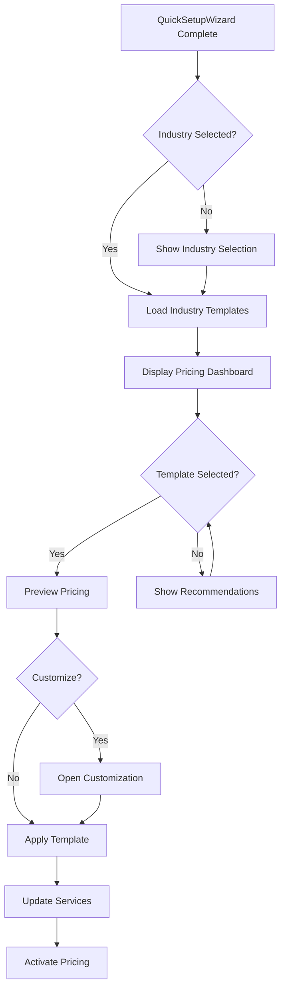

# Industry-Specific Pricing Template System Specification

## Executive Summary

This specification outlines a comprehensive industry-specific pricing template system for AskProAI that works alongside the existing QuickSetupWizard. The system provides pre-configured pricing templates based on German market standards, enabling one-click pricing activation post-setup with full compliance to industry regulations.

## 1. System Architecture

### 1.1 Core Components

```yaml
IndustryPricingTemplateSystem:
  ├── IndustryPricingTemplates (Database)
  │   ├── Medical Pricing Templates
  │   ├── Beauty & Wellness Templates
  │   ├── Legal Services Templates
  │   └── Handwerk (Craftsman) Templates
  │
  ├── PricingTemplateService (Core Service)
  │   ├── Template Management
  │   ├── Compliance Validation
  │   ├── Quick Apply Engine
  │   └── Override Management
  │
  ├── IndustryPricingWizard (UI Component)
  │   ├── Template Selection
  │   ├── Customization Interface
  │   ├── Preview & Simulation
  │   └── One-Click Activation
  │
  └── ComplianceEngine
      ├── GOÄ/GOZ Validation (Medical)
      ├── HWK Standards (Handwerk)
      ├── RAK Guidelines (Legal)
      └── VAT Rules per Industry
```

### 1.2 Integration Points

- **Post-QuickSetupWizard**: Activated after company setup completion
- **Service/Branch Management**: Updates existing services with pricing
- **CompanyPricing Model**: Extends existing pricing structure
- **Compliance Monitoring**: Real-time validation of pricing rules

## 2. Industry-Specific Pricing Research

### 2.1 Medical & Healthcare (Medizin & Gesundheit)

```php
[
    'medical_general_practice' => [
        'name' => 'Allgemeinmedizin',
        'base_consultation' => [
            'goz_number' => '1',
            'min_price' => 10.72,
            'standard_price' => 25.00,
            'max_price' => 37.52,
            'duration' => 15,
        ],
        'extended_consultation' => [
            'goz_number' => '3',
            'min_price' => 17.49,
            'standard_price' => 40.00,
            'max_price' => 61.21,
            'duration' => 30,
        ],
        'emergency_surcharge' => [
            'percentage' => 50,
            'night_surcharge' => 100,
            'weekend_surcharge' => 75,
        ],
        'vat_exempt' => true,
        'billing_rules' => 'GOÄ/EBM',
    ],
    
    'physiotherapy' => [
        'name' => 'Physiotherapie',
        'krankengymnastik' => [
            'insurance_price' => 23.50,
            'private_price' => 45.00,
            'duration' => 30,
        ],
        'manual_therapy' => [
            'insurance_price' => 28.50,
            'private_price' => 55.00,
            'duration' => 30,
        ],
        'vat_rate' => 0, // Heilbehandlung VAT-exempt
    ],
]
```

### 2.2 Beauty & Wellness

```php
[
    'hairdresser' => [
        'name' => 'Friseur',
        'men_haircut' => [
            'price_range' => [25, 35],
            'duration' => 30,
            'includes' => ['Waschen', 'Schneiden', 'Styling'],
        ],
        'women_haircut' => [
            'price_range' => [35, 65],
            'duration' => 45,
            'includes' => ['Beratung', 'Waschen', 'Schneiden', 'Föhnen'],
        ],
        'coloring' => [
            'price_range' => [45, 120],
            'duration' => 120,
            'material_cost_factor' => 0.3,
        ],
        'vat_rate' => 19,
    ],
    
    'beauty_salon' => [
        'name' => 'Kosmetikstudio',
        'facial_treatment' => [
            'basic' => ['price' => 45, 'duration' => 60],
            'premium' => ['price' => 85, 'duration' => 90],
        ],
        'vat_rate' => 19,
        'hygiene_surcharge' => 5, // COVID-related
    ],
]
```

### 2.3 Legal Services (Rechtsdienstleistungen)

```php
[
    'law_firm' => [
        'name' => 'Rechtsanwaltskanzlei',
        'initial_consultation' => [
            'rvg_base' => 190,
            'typical_price' => 250,
            'duration' => 60,
            'max_price_consumer' => 250, // BGB §312a limit
        ],
        'hourly_rates' => [
            'junior' => 150,
            'senior' => 350,
            'partner' => 500,
        ],
        'vat_rate' => 19,
        'billing_increment' => 6, // minutes
    ],
]
```

### 2.4 Handwerk (Craftsman Services)

```php
[
    'handwerk_general' => [
        'name' => 'Handwerksbetrieb',
        'hourly_rates' => [
            'geselle' => 45,
            'meister' => 65,
            'azubi' => 25,
        ],
        'call_out_fee' => [
            'local' => 35,
            'regional' => 65,
        ],
        'material_markup' => 15, // percentage
        'vat_rate' => 19,
        'minimum_charge' => 89, // typical 1st hour minimum
    ],
]
```

## 3. Template Structure & Database Schema

### 3.1 New Tables

```sql
-- Industry pricing templates
CREATE TABLE industry_pricing_templates (
    id BIGINT PRIMARY KEY,
    industry_code VARCHAR(50) NOT NULL,
    sub_industry VARCHAR(100),
    template_name VARCHAR(200) NOT NULL,
    description TEXT,
    is_active BOOLEAN DEFAULT true,
    compliance_rules JSON,
    pricing_structure JSON NOT NULL,
    vat_handling JSON,
    surcharge_rules JSON,
    min_requirements JSON,
    created_at TIMESTAMP,
    updated_at TIMESTAMP,
    
    INDEX idx_industry (industry_code, is_active),
    INDEX idx_sub_industry (sub_industry)
);

-- Service pricing templates
CREATE TABLE service_pricing_templates (
    id BIGINT PRIMARY KEY,
    template_id BIGINT REFERENCES industry_pricing_templates(id),
    service_name VARCHAR(200) NOT NULL,
    service_code VARCHAR(50),
    base_price DECIMAL(10,2),
    min_price DECIMAL(10,2),
    max_price DECIMAL(10,2),
    duration_minutes INT,
    billing_unit ENUM('fixed', 'hourly', 'per_unit'),
    billing_increment INT DEFAULT 1,
    vat_rate DECIMAL(5,2),
    compliance_code VARCHAR(50),
    includes JSON,
    excludes JSON,
    created_at TIMESTAMP,
    
    INDEX idx_template (template_id),
    INDEX idx_service_code (service_code)
);

-- Company template applications
CREATE TABLE company_pricing_applications (
    id BIGINT PRIMARY KEY,
    company_id BIGINT REFERENCES companies(id),
    template_id BIGINT REFERENCES industry_pricing_templates(id),
    applied_at TIMESTAMP NOT NULL,
    applied_by BIGINT REFERENCES users(id),
    customizations JSON,
    override_rules JSON,
    is_active BOOLEAN DEFAULT true,
    
    INDEX idx_company (company_id, is_active)
);

-- Pricing compliance log
CREATE TABLE pricing_compliance_log (
    id BIGINT PRIMARY KEY,
    company_id BIGINT NOT NULL,
    check_type VARCHAR(50),
    compliance_status ENUM('compliant', 'warning', 'violation'),
    details JSON,
    checked_at TIMESTAMP,
    
    INDEX idx_company_compliance (company_id, checked_at)
);
```

### 3.2 Template JSON Structure

```json
{
  "template": {
    "id": "medical_general_practice_2025",
    "industry": "medical",
    "sub_industry": "general_practice",
    "version": "2025.1",
    "compliance": {
      "regulations": ["GOÄ", "EBM", "SGB V"],
      "last_updated": "2025-01-01",
      "validation_rules": {
        "max_factor": 3.5,
        "requires_justification_above": 2.3
      }
    },
    "services": [
      {
        "code": "GOA_1",
        "name": "Beratung",
        "pricing": {
          "base": 10.72,
          "factors": {
            "1.0": 10.72,
            "1.8": 19.30,
            "2.3": 24.66,
            "3.5": 37.52
          },
          "default_factor": 2.3
        },
        "duration": 15,
        "requirements": {
          "documentation": ["reason", "duration"],
          "billing_notes": "Nur 1x pro Tag abrechenbar"
        }
      }
    ],
    "surcharges": {
      "emergency": {
        "code": "GOA_D",
        "percentage": 50,
        "conditions": ["outside_hours", "urgent"]
      },
      "night": {
        "code": "GOA_E",
        "percentage": 100,
        "time_range": ["20:00", "08:00"]
      }
    }
  }
}
```

## 4. Implementation Components

### 4.1 IndustryPricingTemplateService

```php
namespace App\Services\Pricing;

class IndustryPricingTemplateService
{
    public function getTemplatesForIndustry(string $industry): Collection;
    public function applyTemplate(Company $company, int $templateId, array $overrides = []): bool;
    public function validateCompliance(Company $company): ComplianceReport;
    public function suggestOptimalPricing(Company $company): PricingSuggestion;
    public function compareWithCompetitors(Company $company, string $region): CompetitorAnalysis;
    public function calculateROI(Company $company, int $templateId): ROIProjection;
}
```

### 4.2 Quick Configuration Page (Post-Setup)

```php
namespace App\Filament\Admin\Pages;

class IndustryPricingConfiguration extends Page
{
    protected static string $view = 'filament.admin.pages.industry-pricing-configuration';
    
    public function mount()
    {
        // Only accessible after QuickSetupWizard completion
        $this->company = auth()->user()->company;
        
        if (!$this->company->setup_completed_at) {
            return redirect()->route('filament.admin.pages.quick-setup-wizard');
        }
        
        $this->loadIndustryTemplates();
        $this->loadCompetitorPricing();
        $this->generatePricingSuggestions();
    }
}
```

### 4.3 Pricing Template Widget

```php
namespace App\Filament\Admin\Widgets;

class PricingTemplateWidget extends Widget
{
    protected static string $view = 'filament.admin.widgets.pricing-template';
    
    public function getTemplateCards(): array
    {
        return [
            'recommended' => $this->getRecommendedTemplate(),
            'popular' => $this->getPopularTemplates(),
            'premium' => $this->getPremiumTemplate(),
            'budget' => $this->getBudgetTemplate(),
        ];
    }
}
```

## 5. User Interface Design

### 5.1 Industry Pricing Dashboard

```blade
{{-- resources/views/filament/admin/pages/industry-pricing-configuration.blade.php --}}
<x-filament-panels::page>
    <div class="grid grid-cols-1 lg:grid-cols-3 gap-6">
        {{-- Template Selection --}}
        <div class="lg:col-span-2">
            <x-filament::card>
                <h2 class="text-2xl font-bold mb-4">
                    Branchenspezifische Preisvorlagen
                </h2>
                
                <div class="grid grid-cols-1 md:grid-cols-2 gap-4">
                    @foreach($templates as $template)
                        <x-pricing-template-card 
                            :template="$template"
                            :selected="$selectedTemplate?->id === $template->id"
                        />
                    @endforeach
                </div>
                
                {{-- Quick Actions --}}
                <div class="mt-6 flex gap-4">
                    <x-filament::button wire:click="applyTemplate">
                        Vorlage anwenden
                    </x-filament::button>
                    
                    <x-filament::button color="gray" wire:click="customizeTemplate">
                        Anpassen
                    </x-filament::button>
                </div>
            </x-filament::card>
        </div>
        
        {{-- Preview & Analytics --}}
        <div>
            <x-filament::card>
                <h3 class="text-lg font-semibold mb-4">Preisvorschau</h3>
                <x-pricing-preview :services="$previewServices" />
            </x-filament::card>
            
            <x-filament::card class="mt-4">
                <h3 class="text-lg font-semibold mb-4">Marktanalyse</h3>
                <x-competitor-pricing-chart :data="$competitorData" />
            </x-filament::card>
        </div>
    </div>
</x-filament-panels::page>
```

### 5.2 Template Customization Modal

```blade
{{-- Customization interface with live preview --}}
<x-filament::modal id="customize-pricing">
    <x-slot name="header">
        <h2>Preisvorlage anpassen</h2>
    </x-slot>
    
    <div class="grid grid-cols-2 gap-6">
        <div>
            {{-- Service list with price inputs --}}
            @foreach($services as $service)
                <div class="mb-4">
                    <label>{{ $service->name }}</label>
                    <div class="flex items-center gap-2">
                        <x-filament::input 
                            type="number" 
                            wire:model.live="prices.{{ $service->id }}"
                            step="0.01"
                        />
                        <span class="text-sm text-gray-500">
                            (Empfohlen: {{ $service->recommended_price }}€)
                        </span>
                    </div>
                </div>
            @endforeach
        </div>
        
        <div>
            {{-- Live ROI calculation --}}
            <x-roi-calculator :prices="$prices" />
        </div>
    </div>
</x-filament::modal>
```

## 6. Compliance & Validation

### 6.1 Medical Compliance Engine

```php
class MedicalPricingCompliance
{
    public function validateGOA(array $pricing): ValidationResult
    {
        $violations = [];
        
        foreach ($pricing as $service) {
            // Check factor limits
            if ($service['factor'] > 3.5) {
                $violations[] = "Factor exceeds GOÄ maximum without justification";
            }
            
            // Check combination rules
            if ($this->hasIncompatibleCombination($service)) {
                $violations[] = "Service combination not allowed per GOÄ";
            }
        }
        
        return new ValidationResult($violations);
    }
}
```

### 6.2 VAT Handling per Industry

```php
class IndustryVATHandler
{
    private array $vatRules = [
        'medical' => [
            'heilbehandlung' => 0,    // VAT exempt
            'schoenheit' => 19,       // Cosmetic procedures
            'gutachten' => 19,        // Medical reports
        ],
        'legal' => [
            'beratung' => 19,         // Standard VAT
            'gerichtlich' => 19,      // Court services
        ],
        'handwerk' => [
            'reparatur' => 19,        // Standard
            'renovation' => 19,       // Building services
            'kleinreparatur' => 7,    // Reduced rate possible
        ],
    ];
}
```

## 7. Monitoring & Analytics

### 7.1 Pricing Performance Dashboard

```php
class PricingAnalyticsDashboard
{
    public function getMetrics(Company $company): array
    {
        return [
            'conversion_rate_by_price' => $this->getConversionByPricePoint(),
            'competitor_comparison' => $this->getMarketPosition(),
            'price_elasticity' => $this->calculateElasticity(),
            'optimal_price_suggestion' => $this->suggestOptimalPrices(),
            'revenue_impact' => $this->projectRevenueImpact(),
        ];
    }
}
```

### 7.2 Automated Price Optimization

```php
class PriceOptimizationEngine
{
    public function analyzePricingPerformance(Company $company): Optimization
    {
        // Analyze conversion rates at different price points
        $conversionData = $this->getHistoricalConversions($company);
        
        // Calculate price elasticity
        $elasticity = $this->calculatePriceElasticity($conversionData);
        
        // Generate optimization suggestions
        return new Optimization([
            'current_performance' => $this->getCurrentMetrics($company),
            'suggested_changes' => $this->generateSuggestions($elasticity),
            'expected_impact' => $this->projectImpact($company),
        ]);
    }
}
```

## 8. Integration Workflow

### 8.1 Post-Setup Integration



### 8.2 One-Click Application Process

```php
public function applyPricingTemplate(Company $company, int $templateId): void
{
    DB::transaction(function () use ($company, $templateId) {
        // 1. Load template
        $template = IndustryPricingTemplate::findOrFail($templateId);
        
        // 2. Apply to company pricing
        $companyPricing = $this->createCompanyPricing($company, $template);
        
        // 3. Update all services
        $this->updateServicePrices($company, $template);
        
        // 4. Set compliance rules
        $this->applyComplianceRules($company, $template);
        
        // 5. Log application
        $this->logTemplateApplication($company, $template);
        
        // 6. Send confirmation
        $this->notifyPricingActivated($company);
    });
}
```

## 9. Competitive Pricing Analysis

### 9.1 Market Data Integration

```php
class MarketPricingAnalyzer
{
    public function getRegionalPricing(string $industry, string $postalCode): array
    {
        // Integration with pricing databases
        $marketData = $this->fetchMarketData($industry, $postalCode);
        
        return [
            'average_prices' => $marketData->getAverages(),
            'price_range' => $marketData->getRange(),
            'premium_threshold' => $marketData->getPremiumThreshold(),
            'budget_threshold' => $marketData->getBudgetThreshold(),
            'market_saturation' => $marketData->getSaturation(),
        ];
    }
}
```

## 10. Implementation Timeline

### Phase 1: Core Infrastructure (Week 1-2)
- Database schema implementation
- Template data structure
- Basic CRUD operations
- Compliance engine foundation

### Phase 2: Template Creation (Week 3-4)
- Research and create industry templates
- Implement compliance rules
- VAT handling logic
- Testing with real data

### Phase 3: UI Development (Week 5-6)
- Pricing configuration page
- Template selection interface
- Customization modal
- Preview functionality

### Phase 4: Integration & Testing (Week 7-8)
- QuickSetupWizard integration
- One-click activation
- Comprehensive testing
- Performance optimization

### Phase 5: Analytics & Optimization (Week 9-10)
- Analytics dashboard
- Price optimization engine
- A/B testing framework
- Documentation

## 11. Security & Data Protection

### 11.1 Pricing Data Security

```php
class PricingDataSecurity
{
    // Encrypt sensitive pricing data
    protected function encryptPricingData(array $data): string
    {
        return encrypt(json_encode($data));
    }
    
    // Audit trail for pricing changes
    protected function logPricingChange(Company $company, array $changes): void
    {
        PricingAuditLog::create([
            'company_id' => $company->id,
            'user_id' => auth()->id(),
            'changes' => $changes,
            'ip_address' => request()->ip(),
            'user_agent' => request()->userAgent(),
        ]);
    }
}
```

## 12. Success Metrics

### 12.1 KPIs

1. **Setup Time Reduction**
   - Target: 80% reduction in pricing configuration time
   - From: 30-45 minutes manual setup
   - To: 3-5 minutes with templates

2. **Compliance Rate**
   - Target: 100% compliance with industry regulations
   - Automated compliance checking
   - Real-time violation alerts

3. **Revenue Optimization**
   - Target: 15-25% revenue increase through optimal pricing
   - A/B testing of price points
   - Dynamic price optimization

4. **User Satisfaction**
   - Target: 90% satisfaction with pricing templates
   - Easy customization options
   - Clear ROI visualization

## 13. Future Enhancements

1. **AI-Powered Pricing**
   - Machine learning for optimal pricing
   - Demand-based dynamic pricing
   - Seasonal adjustment automation

2. **Multi-Currency Support**
   - Euro as primary
   - Swiss Franc for Swiss market
   - Currency conversion handling

3. **Advanced Analytics**
   - Price elasticity curves
   - Customer segment pricing
   - Predictive revenue modeling

4. **Integration Ecosystem**
   - DATEV export for tax advisors
   - Insurance billing systems
   - Government reporting (GKV)

## 14. Risk Mitigation

1. **Compliance Risks**
   - Regular updates to regulation database
   - Legal review of templates quarterly
   - Automated compliance monitoring

2. **Technical Risks**
   - Comprehensive testing suite
   - Rollback capabilities
   - Gradual rollout strategy

3. **Business Risks**
   - Competitor pricing monitoring
   - Customer feedback loops
   - Flexible customization options

## Conclusion

This industry-specific pricing template system will significantly streamline the onboarding process for new AskProAI customers while ensuring compliance with German market regulations. The one-click activation combined with intelligent customization options provides the perfect balance between speed and flexibility.

The system's integration with the existing QuickSetupWizard creates a seamless experience where companies can be fully operational with optimized, compliant pricing within minutes of signing up.