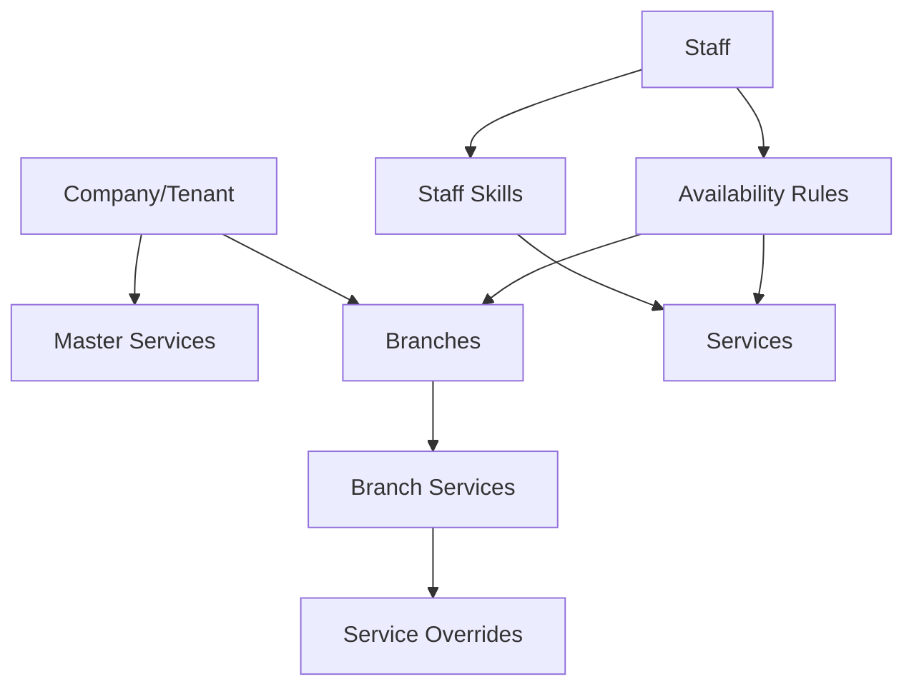

# 🎯 AskProAI Master Implementation Plan

## Executive Summary
Transformation von AskProAI zu einer flexiblen Multi-Business-Model Plattform mit höchster Code-Qualität und optimaler User Experience.

## 🏗️ Architektur-Übersicht

### Drei Kern-Geschäftsmodelle

#### 1. **Simple Business Model** (z.B. AskProAI selbst)
- Ein Unternehmen, eine Filiale
- Einfache Mitarbeiter-Service-Zuordnung
- Basis-Verfügbarkeiten

#### 2. **Multi-Branch Hotline Model** (z.B. Fitnessstudio-Kette)
- Zentrale Telefonnummer für alle Filialen
- Kunde wählt Filiale während des Anrufs
- Verfügbarkeitsprüfung pro Filiale

#### 3. **Complex Service Matrix Model** (z.B. Friseur-Kette)
- Mehrere Filialen mit unterschiedlichen Services
- Mitarbeiter-Skills und Zertifizierungen
- Service-spezifische Verfügbarkeiten

## 📊 Datenmodell-Erweiterungen

### Neue Entitäten



### Kritische Datenbank-Änderungen

```sql
-- 1. Master Services (Company-wide templates)
CREATE TABLE master_services (
    id BIGINT PRIMARY KEY,
    company_id BIGINT NOT NULL,
    name VARCHAR(255),
    base_duration INT,
    base_price DECIMAL(10,2),
    category VARCHAR(100),
    skill_requirements JSON,
    created_at TIMESTAMP
);

-- 2. Branch Service Overrides
CREATE TABLE branch_service_overrides (
    id BIGINT PRIMARY KEY,
    branch_id UUID NOT NULL,
    master_service_id BIGINT NOT NULL,
    custom_name VARCHAR(255),
    custom_duration INT,
    custom_price DECIMAL(10,2),
    is_active BOOLEAN DEFAULT true,
    min_skill_level ENUM('junior', 'senior', 'expert'),
    requires_certification BOOLEAN DEFAULT false
);

-- 3. Staff Skills & Certifications
CREATE TABLE staff_skills (
    id BIGINT PRIMARY KEY,
    staff_id UUID NOT NULL,
    service_id BIGINT NOT NULL,
    skill_level ENUM('junior', 'senior', 'expert'),
    years_experience INT,
    certifications JSON,
    last_training_date DATE,
    UNIQUE KEY unique_staff_service (staff_id, service_id)
);

-- 4. Complex Availability Rules
CREATE TABLE availability_rules (
    id BIGINT PRIMARY KEY,
    staff_id UUID NOT NULL,
    branch_id UUID NOT NULL,
    service_id BIGINT,
    day_of_week TINYINT,
    start_time TIME,
    end_time TIME,
    rule_type ENUM('available', 'blocked', 'service_specific'),
    priority INT DEFAULT 0
);

-- 5. Routing Configuration
CREATE TABLE call_routing_configs (
    id BIGINT PRIMARY KEY,
    company_id BIGINT NOT NULL,
    routing_strategy ENUM('single', 'nearest', 'load_balanced', 'skill_based'),
    fallback_branch_id UUID,
    routing_rules JSON
);
```

## 🎨 UI/UX Konzepte

### 1. **Visual Service Matrix**

```
┌─────────────────────────────────────────────┐
│  Mitarbeiter-Service-Kompetenz-Matrix      │
├─────────────┬────────┬────────┬────────────┤
│ Mitarbeiter │ Färben │ Schnitt│ Extensions │
├─────────────┼────────┼────────┼────────────┤
│ Anna B.     │ ⭐⭐⭐  │ ⭐⭐⭐  │ ⭐⭐      │
│ Klaus M.    │ ⭐⭐    │ ⭐⭐⭐  │ -         │
│ Lisa S.     │ ⭐⭐⭐  │ ⭐⭐    │ ⭐⭐⭐    │
└─────────────┴────────┴────────┴────────────┘

⭐ = Junior | ⭐⭐ = Senior | ⭐⭐⭐ = Expert
```

### 2. **Branch Service Overview**

```
Unternehmen: Hair & Beauty GmbH
│
├── 📍 Berlin Mitte
│   ├── Services: 24 (2 exklusiv)
│   ├── Mitarbeiter: 8
│   └── Auslastung: 78%
│
├── 📍 Berlin Charlottenburg  
│   ├── Services: 22
│   ├── Mitarbeiter: 6
│   └── Auslastung: 85%
│
└── 📍 Berlin Prenzlauer Berg
    ├── Services: 26 (4 exklusiv)
    ├── Mitarbeiter: 10
    └── Auslastung: 72%
```

### 3. **Smart Booking Flow Visualization**

```
Kunde ruft an → AI erkennt Service-Wunsch
                      ↓
            [Branch-Auswahl wenn Multi-Branch]
                      ↓
            Verfügbare Mitarbeiter filtern:
            - Skill-Level ✓
            - Zertifizierung ✓
            - Verfügbarkeit ✓
                      ↓
            Terminvorschläge mit Ranking
```

## 🔧 Technische Implementierung

### Phase 1: Datenmodell-Erweiterung (3-4 Tage)

#### Tag 1-2: Migrations & Models
```php
// Neue Migrations erstellen
- 2025_06_18_create_master_services_table.php
- 2025_06_18_create_branch_service_overrides_table.php  
- 2025_06_18_create_staff_skills_table.php
- 2025_06_18_create_availability_rules_table.php
- 2025_06_18_create_call_routing_configs_table.php

// Neue Models
- app/Models/MasterService.php (erweitern)
- app/Models/StaffSkill.php
- app/Models/AvailabilityRule.php
- app/Models/CallRoutingConfig.php
```

#### Tag 3-4: Relationships & Scopes
```php
// Branch Model erweitern
public function serviceOverrides() {
    return $this->hasMany(BranchServiceOverride::class);
}

public function getActiveServices() {
    // Merge master services with branch overrides
}

// Staff Model erweitern  
public function skills() {
    return $this->hasMany(StaffSkill::class);
}

public function canPerformService($serviceId, $requiredLevel = null) {
    // Check skill level and certifications
}
```

### Phase 2: Service Layer (4-5 Tage)

#### Tag 1-2: Booking Service Enhancement
```php
namespace App\Services\Booking;

class EnhancedBookingService {
    
    public function findAvailableSlots(
        $serviceId, 
        $branchId = null, 
        $date = null,
        $preferences = []
    ) {
        // 1. Get service requirements
        $service = $this->getServiceWithRequirements($serviceId, $branchId);
        
        // 2. Find qualified staff
        $qualifiedStaff = $this->findQualifiedStaff($service, $branchId);
        
        // 3. Check availability rules
        $availableSlots = $this->checkComplexAvailability(
            $qualifiedStaff, 
            $service, 
            $date
        );
        
        // 4. Rank by preferences
        return $this->rankSlotsByPreferences($availableSlots, $preferences);
    }
}
```

#### Tag 3-4: Multi-Branch Routing
```php
namespace App\Services\Routing;

class CallRoutingService {
    
    public function routeCall($phoneNumber, $requestedService = null) {
        $config = $this->getRoutingConfig();
        
        switch($config->routing_strategy) {
            case 'nearest':
                return $this->findNearestBranch($phoneNumber);
                
            case 'skill_based':
                return $this->findBestSkillMatch($requestedService);
                
            case 'load_balanced':
                return $this->findLeastBusyBranch();
                
            default:
                return $config->fallback_branch_id;
        }
    }
}
```

#### Tag 5: Availability Engine
```php
namespace App\Services\Availability;

class ComplexAvailabilityEngine {
    
    public function calculateAvailability($staff, $service, $date) {
        // 1. Base availability from working hours
        $baseSlots = $this->getBaseAvailability($staff, $date);
        
        // 2. Apply availability rules
        $ruledSlots = $this->applyAvailabilityRules($baseSlots, $staff, $service);
        
        // 3. Remove existing appointments
        $freeSlots = $this->removeBookedSlots($ruledSlots, $staff, $date);
        
        // 4. Apply service duration
        return $this->applyServiceDuration($freeSlots, $service);
    }
}
```

### Phase 3: UI Components (5-6 Tage)

#### Tag 1-2: Filament Resources
```php
// app/Filament/Admin/Resources/ServiceManagementResource.php
class ServiceManagementResource extends Resource {
    public static function form(Form $form): Form {
        return $form->schema([
            // Master Service Section
            Section::make('Master Service Template')
                ->schema([
                    TextInput::make('name'),
                    Select::make('category'),
                    TextInput::make('base_duration'),
                    TextInput::make('base_price'),
                ]),
                
            // Branch Overrides Section
            Section::make('Branch-Specific Settings')
                ->schema([
                    Repeater::make('branchOverrides')
                        ->relationship('branchOverrides')
                        ->schema([
                            Select::make('branch_id'),
                            TextInput::make('custom_name'),
                            TextInput::make('custom_price'),
                        ])
                ]),
        ]);
    }
}
```

#### Tag 3-4: Visual Components
```blade
{{-- resources/views/filament/components/staff-skill-matrix.blade.php --}}
<div class="staff-skill-matrix">
    <table class="w-full">
        <thead>
            <tr>
                <th>Mitarbeiter</th>
                @foreach($services as $service)
                    <th class="text-center">{{ $service->name }}</th>
                @endforeach
            </tr>
        </thead>
        <tbody>
            @foreach($staff as $member)
                <tr>
                    <td>{{ $member->name }}</td>
                    @foreach($services as $service)
                        <td class="text-center">
                            @php
                                $skill = $member->getSkillForService($service->id);
                            @endphp
                            @if($skill)
                                <x-skill-level-indicator :level="$skill->level" />
                            @else
                                <span class="text-gray-400">-</span>
                            @endif
                        </td>
                    @endforeach
                </tr>
            @endforeach
        </tbody>
    </table>
</div>
```

#### Tag 5-6: Interactive Dashboards
```php
// app/Filament/Admin/Pages/BranchServiceOverview.php
class BranchServiceOverview extends Page {
    protected static string $view = 'filament.pages.branch-service-overview';
    
    public function getBranchData() {
        return Branch::with(['serviceOverrides', 'staff.skills'])
            ->get()
            ->map(function($branch) {
                return [
                    'name' => $branch->name,
                    'services' => $branch->getActiveServices(),
                    'staff_count' => $branch->staff->count(),
                    'utilization' => $branch->getUtilizationRate(),
                    'exclusive_services' => $branch->getExclusiveServices(),
                ];
            });
    }
}
```

### Phase 4: Retell.ai Integration (3-4 Tage)

#### Tag 1-2: Enhanced Prompts
```php
// app/Services/Provisioning/EnhancedPromptGenerator.php
class EnhancedPromptGenerator {
    
    public function generateMultiBranchPrompt($company) {
        if ($company->routing_config->routing_strategy === 'single') {
            return $this->generateSimplePrompt($company);
        }
        
        return <<<PROMPT
Du bist der KI-Assistent für {$company->name}.

WICHTIG: Wir haben mehrere Standorte. Frage den Kunden immer:
"An welchem unserer Standorte möchten Sie Ihren Termin vereinbaren?"

Verfügbare Standorte:
{$this->formatBranches($company->branches)}

Nach Standortwahl:
1. Prüfe verfügbare Services am gewählten Standort
2. Finde qualifizierte Mitarbeiter
3. Biete passende Termine an

Bei Service-Anfragen die Expertise-Level beachten:
- Junior: Basis-Services
- Senior: Erweiterte Services  
- Expert: Spezial-Services
PROMPT;
    }
}
```

#### Tag 3-4: Function Call Updates
```javascript
// Retell.ai Custom Functions
{
    "name": "check_multi_branch_availability",
    "description": "Prüft Verfügbarkeit über mehrere Filialen",
    "parameters": {
        "type": "object",
        "properties": {
            "service_name": {
                "type": "string",
                "description": "Gewünschter Service"
            },
            "preferred_branch": {
                "type": "string", 
                "description": "Bevorzugte Filiale (optional)"
            },
            "date_range": {
                "type": "object",
                "properties": {
                    "start": {"type": "string", "format": "date"},
                    "end": {"type": "string", "format": "date"}
                }
            },
            "skill_level": {
                "type": "string",
                "enum": ["any", "senior", "expert"],
                "description": "Gewünschtes Expertise-Level"
            }
        }
    }
}
```

### Phase 5: Testing & Optimization (3-4 Tage)

#### Test-Szenarien
```php
// tests/Feature/MultiBusinessModelTest.php
class MultiBusinessModelTest extends TestCase {
    
    /** @test */
    public function it_handles_single_branch_booking() {
        // Arrange
        $company = Company::factory()
            ->has(Branch::factory()->count(1))
            ->create(['routing_strategy' => 'single']);
            
        // Act & Assert
    }
    
    /** @test */
    public function it_routes_to_nearest_branch() {
        // Test multi-branch routing logic
    }
    
    /** @test */
    public function it_respects_staff_skill_requirements() {
        // Test skill-based filtering
    }
}
```

## 🚀 Deployment Strategy

### Rollout-Plan
1. **Week 1**: Database migrations + Basic models
2. **Week 2**: Service layer implementation
3. **Week 3**: UI components + Admin interface
4. **Week 4**: Testing + Bug fixes
5. **Week 5**: Pilot customer deployment

### Feature Flags
```php
// config/features.php
return [
    'multi_branch_routing' => env('FEATURE_MULTI_BRANCH', false),
    'staff_skills' => env('FEATURE_STAFF_SKILLS', false),
    'complex_availability' => env('FEATURE_COMPLEX_AVAILABILITY', false),
];
```

## 📈 Success Metrics

1. **Booking Success Rate**: >85% successful bookings
2. **Setup Time**: <15 minutes per branch
3. **Query Performance**: <100ms availability checks
4. **User Satisfaction**: >4.5/5 rating

## 🔍 Qualitätssicherung

### Code Standards
- PSR-12 Coding Standard
- 100% Type Declarations  
- Comprehensive PHPDoc
- Unit Test Coverage >80%

### Architecture Principles
- DRY (Don't Repeat Yourself)
- SOLID Principles
- Repository Pattern
- Service Layer Pattern
- Event-Driven Architecture

### Performance Requirements
- Page Load: <1s
- API Response: <200ms
- Availability Calculation: <100ms
- Concurrent Users: 1000+

## 💡 Innovation Opportunities

1. **AI-Powered Optimization**
   - Predict best time slots
   - Suggest staff based on customer history
   - Automatic load balancing

2. **Advanced Visualizations**
   - Real-time branch utilization map
   - Staff skill development tracking
   - Service popularity heatmaps

3. **Smart Routing**
   - Weather-based adjustments
   - Traffic-aware branch selection
   - Customer preference learning

---

Dieser Plan stellt sicher, dass AskProAI zu einer erstklassigen Multi-Business-Model-Plattform wird, die flexibel, skalierbar und benutzerfreundlich ist.