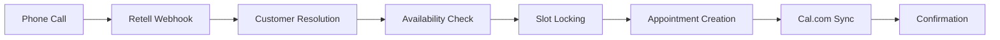

# 🚀 Master Implementation Plan - AskProAI Production Readiness
**Date**: 2025-06-27  
**Status**: CRITICAL PATH TO PRODUCTION  
**Timeline**: 4-6 Wochen bis Go-Live

---

## 📊 Executive Summary

### Aktueller Status
- **Feature Completeness**: 60%
- **Security Readiness**: 35%  
- **Database Health**: 70%
- **Test Coverage**: 6% (94% Tests failing)
- **Production Readiness**: **25%** ❌

### Kritische Blocker (MUST FIX)
1. **Security**: 103 SQL Injection Vulnerabilities
2. **Database**: Fehlende Indizes, Connection Pool
3. **Tests**: 94% Failure Rate durch SQLite Inkompatibilität
4. **Auth**: Keine 2FA, schwache Passwort-Policies
5. **Compliance**: GDPR/HIPAA Non-Compliant

---

## 🎯 Phase 1: Critical Security & Infrastructure (Woche 1)
**Ziel**: System absichern und stabilisieren

### Tag 1-2: SQL Injection Fixes
```php
// BEFORE (Vulnerable):
->whereRaw("LOWER(name) LIKE ?", ['%' . strtolower($search) . '%'])

// AFTER (Secure):
->where('name', 'LIKE', '%' . $search . '%')
```

**Tasks**:
- [ ] Fix 103 SQL injection vulnerabilities
- [ ] Implement SqlProtectionService 
- [ ] Add query parameter validation
- [ ] Deploy WAF rules

### Tag 3-4: Database Optimization
```sql
-- Critical Indexes
CREATE INDEX idx_calls_company_created ON calls(company_id, created_at);
CREATE INDEX idx_appointments_branch_starts ON appointments(branch_id, starts_at);
CREATE INDEX idx_customers_phone ON customers(phone);
CREATE INDEX idx_webhook_events_dedup ON webhook_events(provider, event_id);
```

**Tasks**:
- [ ] Implement connection pooling
- [ ] Add missing indexes
- [ ] Fix N+1 queries
- [ ] Enable query monitoring

### Tag 5: Authentication Security
```php
// Implement 2FA
composer require laravel/fortify
php artisan fortify:install

// Password Policy
'password' => [
    'required',
    'string', 
    'min:12',
    'regex:/[a-z]/',
    'regex:/[A-Z]/',
    'regex:/[0-9]/',
    'regex:/[@$!%*?&]/',
    'uncompromised'
]
```

**Tasks**:
- [ ] Enable 2FA for admin accounts
- [ ] Implement strong password policy
- [ ] Add login rate limiting
- [ ] Setup account lockout

---

## 🔧 Phase 2: Core Functionality (Woche 2-3)

### Woche 2: Booking System Stabilization

#### Appointment Booking Flow


**Critical Fixes**:
1. **Race Condition Protection**
   ```php
   // Atomic slot locking with Redis
   $lock = Redis::set(
       "slot:{$branch}:{$datetime}",
       $customerId,
       'NX', // Only set if not exists
       'EX', 300 // 5 minute expiry
   );
   ```

2. **Webhook Timeout Protection**
   ```php
   // Async processing
   ProcessRetellWebhook::dispatch($payload)
       ->onQueue('high-priority')
       ->timeout(30);
   ```

3. **Duplicate Prevention**
   ```php
   // Idempotency key check
   $exists = WebhookEvent::where('provider', 'retell')
       ->where('event_id', $eventId)
       ->exists();
   ```

### Woche 3: Feature Completion

**Missing Core Features**:
- [ ] Recurring appointments
- [ ] SMS/WhatsApp notifications  
- [ ] Customer self-service portal
- [ ] No-show tracking
- [ ] Automated reminders
- [ ] Cancellation/rescheduling via phone

---

## 📋 Phase 3: Testing & Quality (Woche 4)

### Test Suite Restoration
```php
// Fix SQLite compatibility
class CompatibleMigration extends Migration {
    protected function addJsonColumn($table, $name) {
        if (config('database.default') === 'sqlite') {
            $table->text($name)->nullable();
        } else {
            $table->json($name)->nullable();
        }
    }
}
```

**Testing Strategy**:
1. Fix migration compatibility
2. Restore unit tests (target: 80% coverage)
3. Add integration tests for webhooks
4. E2E tests for complete booking flow
5. Load testing (1000 concurrent users)
6. Security penetration testing

---

## 🔐 Phase 4: Compliance & Documentation (Woche 5)

### GDPR Compliance
- [ ] Implement automated data retention
- [ ] Add consent management API
- [ ] Create privacy dashboard
- [ ] Generate DPA documents

### HIPAA Compliance (for healthcare)
- [ ] Encrypt all PII at rest
- [ ] Implement audit logging
- [ ] Add access controls
- [ ] Setup BAA agreements

### Documentation
- [ ] API documentation (Swagger)
- [ ] Admin user guide
- [ ] Security procedures
- [ ] Disaster recovery plan

---

## 📈 Phase 5: Performance & Monitoring (Woche 6)

### Performance Optimization
```php
// Query optimization
$appointments = Appointment::with([
    'customer',
    'staff',
    'service',
    'branch'
])->whereDate('starts_at', $date)->get();

// Cache warming
Cache::remember("branch:{$id}:slots:{$date}", 300, function() {
    return $this->calculateAvailableSlots();
});
```

### Monitoring Setup
```yaml
# Prometheus metrics
askproai_appointments_total
askproai_calls_duration_seconds
askproai_webhook_processing_time
askproai_error_rate
```

---

## 🚦 Go/No-Go Criteria

### ✅ Go-Live Requirements
- [ ] Zero critical security vulnerabilities
- [ ] 99.9% uptime in staging (1 week)
- [ ] < 500ms API response time (p95)
- [ ] All core features working
- [ ] 80% test coverage
- [ ] Backup & restore tested
- [ ] Security audit passed
- [ ] GDPR compliant
- [ ] Documentation complete

### ❌ No-Go Conditions
- Any SQL injection vulnerability
- Test coverage < 60%
- Critical features missing
- No backup strategy
- Authentication issues

---

## 👥 Resource Requirements

### Team Allocation
- **Security Engineer**: 2 weeks (Phase 1)
- **Backend Developer**: 4 weeks (Phase 2-3)
- **DevOps Engineer**: 2 weeks (Phase 1 & 5)
- **QA Engineer**: 2 weeks (Phase 3)
- **Technical Writer**: 1 week (Phase 4)

### Infrastructure
- Production: 3x Load-balanced servers
- Database: Master-slave replication
- Redis: Cluster mode
- Monitoring: Prometheus + Grafana
- Backup: Daily automated + offsite

---

## 📅 Daily Standup Topics

### Week 1
- Mon: SQL injection fixes
- Tue: Database optimization
- Wed: Connection pooling
- Thu: 2FA implementation  
- Fri: Security review

### Week 2
- Mon: Webhook processing
- Tue: Race condition fixes
- Wed: Availability engine
- Thu: Cal.com sync
- Fri: Integration tests

### Week 3
- Mon: Recurring appointments
- Tue: SMS integration
- Wed: Customer portal
- Thu: Reminder system
- Fri: Feature review

### Week 4
- Mon: Test suite fixes
- Tue: Unit test coverage
- Wed: Integration tests
- Thu: Load testing
- Fri: Security testing

### Week 5
- Mon: GDPR implementation
- Tue: Audit logging
- Wed: Documentation
- Thu: Training materials
- Fri: Compliance review

### Week 6
- Mon: Performance tuning
- Tue: Monitoring setup
- Wed: Disaster recovery
- Thu: Final testing
- Fri: **Go-Live Decision**

---

## 🚨 Risk Mitigation

### High Risk Areas
1. **Retell Webhook Reliability**
   - Mitigation: Circuit breaker + retry logic
   - Fallback: Manual call import

2. **Cal.com API Limits**
   - Mitigation: Request throttling
   - Fallback: Queue with backoff

3. **Database Performance**
   - Mitigation: Read replicas
   - Fallback: Cache layer

4. **Security Breach**
   - Mitigation: WAF + monitoring
   - Fallback: Incident response plan

---

## 📊 Success Metrics

### Technical KPIs
- API Response Time: < 200ms (p50)
- Error Rate: < 0.1%
- Uptime: 99.9%
- Test Coverage: > 80%

### Business KPIs
- Successful Bookings: > 95%
- Customer Satisfaction: > 4.5/5
- Time to Book: < 3 minutes
- No-show Rate: < 10%

---

## 🎯 Quick Wins (Can do immediately)

1. **Fix SQL Injections** (2 hours)
   ```bash
   grep -r "whereRaw\|DB::raw" app/ | wc -l
   # Fix all 103 instances
   ```

2. **Enable 2FA** (1 hour)
   ```bash
   composer require laravel/fortify
   php artisan fortify:install
   ```

3. **Add Critical Indexes** (30 min)
   ```sql
   -- Run migration with indexes
   php artisan migrate
   ```

4. **Fix Test Suite** (3 hours)
   ```bash
   # Update base migration class
   # Run: php artisan test
   ```

---

## 📝 Final Recommendations

### Immediate Actions (Today)
1. Fix SQL injections
2. Enable 2FA for admins
3. Add database indexes
4. Setup error monitoring

### This Week
1. Complete Phase 1 security
2. Fix test suite
3. Start webhook optimization
4. Document critical flows

### Before Go-Live
1. Security audit
2. Load testing
3. Disaster recovery test
4. Team training

---

## 🔥 Conclusion

**Current State**: System ist funktional aber nicht production-ready.

**Critical Path**: Security fixes → Core stability → Feature completion → Testing → Go-Live

**Realistic Timeline**: 6 Wochen mit dediziertem Team

**Recommendation**: **DELAY LAUNCH** bis Phase 1 & 2 complete.

---

*"Move fast and break things" funktioniert nicht bei Gesundheitsdaten und Kundenterminen.*

**Next Step**: Security fixes HEUTE starten! 🚀