# 🚨 MASTER SOLUTION PLAN - AskProAI Critical Fixes
**Erstellt**: 2025-06-26  
**Priorität**: KRITISCH  
**Ziel**: System in 2 Wochen produktionsreif machen

## 📊 Executive Summary

Das System hat **119 kritische Probleme** über 5 Bereiche verteilt:
- **42 Sicherheitslücken** (15 kritisch)
- **94% der Tests sind kaputt**
- **Webhook-Integration funktioniert nicht**
- **System crasht bei >100 gleichzeitigen Nutzern**
- **Testanrufe erscheinen nicht im Dashboard**

**Kernproblem**: Die gesamte Datenfluss-Pipeline von Retell → Webhook → Dashboard ist defekt.

## 🎯 Root Cause Analysis

### Hauptursache: "Testanruf erscheint nicht im Dashboard"

```mermaid
graph TD
    A[Anruf bei Retell] -->|❌ Webhook kommt nicht an| B[Laravel Webhook]
    B -->|❌ Signature Verification fails| C[ProcessRetellCallJob]
    C -->|❌ Company Resolution schlägt fehl| D[Datenbank]
    D -->|❌ Keine Live-Updates| E[Dashboard]
```



**Die 4 Haupt-Blocker**:
1. **Webhook Registration fehlt** in Retell
2. **Signature Verification** schlägt fehl
3. **Company Resolution** findet keine Zuordnung
4. **Dashboard Polling** statt Live-Updates

## 📋 Priorisierte Problem-Matrix

| Problem | Kritikalität | Impact | Aufwand | ROI |
|---------|-------------|---------|---------|-----|
| SQL Injections | 🔴 KRITISCH | Security Breach | 2h | ⭐⭐⭐⭐⭐ |
| Webhook nicht registriert | 🔴 KRITISCH | Keine Anrufe | 30min | ⭐⭐⭐⭐⭐ |
| Tests kaputt | 🔴 KRITISCH | Keine QA | 3h | ⭐⭐⭐⭐ |
| Connection Pool | 🟡 HOCH | Crashes | 1h | ⭐⭐⭐⭐ |
| Company Resolution | 🟡 HOCH | Falsche Zuordnung | 2h | ⭐⭐⭐ |

## 🚀 PHASENPLAN

### ⚡ Phase 1: CRITICAL HOTFIXES (Tag 1-2)
**Ziel**: System funktionsfähig machen

#### 1.1 SQL Injection Fixes (2 Stunden)
```bash
# Erstelle Hotfix für alle 42 SQL Injections
php artisan make:command FixSqlInjections
```

**Fix-Strategie**:
```php
// VORHER (GEFÄHRLICH)
->whereRaw("phone_number = '{$phoneNumber}'")

// NACHHER (SICHER)
->where('phone_number', $phoneNumber)
```

**Betroffene Dateien**:
- `app/Services/PhoneNumberResolver.php`
- `app/Services/RetellWebhookProcessor.php`
- `app/Http/Controllers/Api/WebhookController.php`
- Alle 42 Stellen mit `whereRaw`

#### 1.2 Webhook Registration Fix (30 Minuten)
```bash
# Erstelle Webhook Registration Command
php artisan make:command RegisterRetellWebhooks
```

**Implementierung**:
```php
// app/Console/Commands/RegisterRetellWebhooks.php
public function handle()
{
    $companies = Company::whereNotNull('retell_api_key')->get();
    
    foreach ($companies as $company) {
        $this->info("Registriere Webhook für {$company->name}...");
        
        $response = Http::withHeaders([
            'Authorization' => 'Bearer ' . $company->retell_api_key
        ])->post('https://api.retellai.com/webhooks', [
            'url' => config('app.url') . '/api/retell/webhook',
            'events' => ['call_started', 'call_ended', 'call_analyzed']
        ]);
        
        if ($response->successful()) {
            $company->update(['retell_webhook_id' => $response->json('webhook_id')]);
            $this->info("✅ Webhook registriert: {$response->json('webhook_id')}");
        }
    }
}
```

#### 1.3 Emergency Test Fix (3 Stunden)
```bash
# SQLite-kompatible Migration
php artisan make:migration fix_sqlite_compatibility
```

```php
// database/migrations/fix_sqlite_compatibility.php
public function up()
{
    if (DB::connection()->getDriverName() === 'sqlite') {
        // SQLite-spezifische Fixes
        Schema::table('companies', function (Blueprint $table) {
            $table->text('settings')->default('{}')->change();
            $table->text('retell_config')->default('{}')->change();
        });
    }
}
```

#### 1.4 Connection Pool Hotfix (1 Stunde)
```php
// config/database.php
'mysql' => [
    'driver' => 'mysql',
    'host' => env('DB_HOST', '127.0.0.1'),
    'options' => [
        PDO::ATTR_PERSISTENT => true,
        PDO::ATTR_EMULATE_PREPARES => true,
        PDO::MYSQL_ATTR_USE_BUFFERED_QUERY => false,
    ],
    'pool' => [
        'min' => 5,
        'max' => 20,
    ],
],
```

**Success Metrics Phase 1**:
- ✅ Keine SQL Injection Vulnerabilities mehr
- ✅ Webhook empfängt Retell Events
- ✅ 50% der Tests laufen wieder
- ✅ System stabil bis 200 gleichzeitige User

### 🔧 Phase 2: CORE FUNCTIONALITY (Tag 3-5)
**Ziel**: Anrufe erscheinen im Dashboard

#### 2.1 Company Resolution Fix (2 Stunden)
```php
// app/Services/ImprovedPhoneResolver.php
class ImprovedPhoneResolver
{
    private $cache;
    private $validator;
    
    public function resolveCompany(string $phoneNumber): ?Company
    {
        // 1. Normalisiere Nummer
        $normalized = $this->normalizePhoneNumber($phoneNumber);
        
        // 2. Cache Check
        $cacheKey = "phone_company:{$normalized}";
        if ($cached = Cache::get($cacheKey)) {
            return $cached;
        }
        
        // 3. Direkte Suche
        $branch = Branch::where('phone_number', $normalized)
            ->orWhere('phone_number', $phoneNumber)
            ->first();
            
        if ($branch) {
            Cache::put($cacheKey, $branch->company, 3600);
            return $branch->company;
        }
        
        // 4. Fuzzy Search mit Levenshtein
        $branches = Branch::all();
        foreach ($branches as $branch) {
            if ($this->phoneNumbersMatch($phoneNumber, $branch->phone_number)) {
                Cache::put($cacheKey, $branch->company, 3600);
                return $branch->company;
            }
        }
        
        return null;
    }
}
```

#### 2.2 Live Dashboard Updates (2 Stunden)
```php
// app/Http/Livewire/CallDashboard.php
class CallDashboard extends Component
{
    public $calls;
    
    protected $listeners = ['callReceived' => 'refreshCalls'];
    
    public function mount()
    {
        $this->refreshCalls();
    }
    
    public function refreshCalls()
    {
        $this->calls = Call::with(['company', 'customer'])
            ->latest()
            ->take(50)
            ->get();
    }
    
    public function render()
    {
        return view('livewire.call-dashboard');
    }
}
```

```javascript
// resources/js/dashboard.js
// Pusher Integration für Live Updates
Echo.channel('company.' + companyId)
    .listen('CallReceived', (e) => {
        Livewire.emit('callReceived', e.call);
        
        // Toast Notification
        toast.success('Neuer Anruf eingegangen!');
    });
```

#### 2.3 Webhook Processing Fix (1 Stunde)
```php
// app/Jobs/ProcessRetellWebhook.php
class ProcessRetellWebhook implements ShouldQueue
{
    use Dispatchable, InteractsWithQueue, Queueable, SerializesModels;
    
    public $tries = 3;
    public $backoff = [10, 30, 60];
    
    public function handle()
    {
        try {
            DB::beginTransaction();
            
            // 1. Validiere Payload
            $validator = Validator::make($this->payload, [
                'call_id' => 'required|string',
                'event_type' => 'required|in:call_started,call_ended,call_analyzed',
                'phone_number' => 'required|string',
            ]);
            
            if ($validator->fails()) {
                throw new ValidationException($validator);
            }
            
            // 2. Resolve Company
            $company = app(ImprovedPhoneResolver::class)
                ->resolveCompany($this->payload['phone_number']);
                
            if (!$company) {
                Log::warning('No company found for phone', $this->payload);
                return;
            }
            
            // 3. Process Event
            switch ($this->payload['event_type']) {
                case 'call_ended':
                    $this->processCallEnded($company);
                    break;
            }
            
            DB::commit();
            
            // 4. Broadcast Update
            broadcast(new CallReceived($call))->toOthers();
            
        } catch (\Exception $e) {
            DB::rollBack();
            Log::error('Webhook processing failed', [
                'error' => $e->getMessage(),
                'payload' => $this->payload
            ]);
            throw $e;
        }
    }
}
```

**Success Metrics Phase 2**:
- ✅ Anrufe erscheinen innerhalb von 5 Sekunden im Dashboard
- ✅ Company Resolution funktioniert zu 95%
- ✅ Live Updates ohne Page Refresh
- ✅ Webhook Retry Mechanismus aktiv

### 🎯 Phase 3: OPTIMIZATION (Tag 6-10)
**Ziel**: Performance & Stabilität

#### 3.1 Query Optimization (1 Tag)
```php
// app/Services/QueryOptimizer.php
class QueryOptimizer
{
    public function optimizeCallQueries()
    {
        // Füge fehlende Indizes hinzu
        Schema::table('calls', function (Blueprint $table) {
            $table->index(['company_id', 'created_at']);
            $table->index(['phone_number']);
            $table->index(['status', 'created_at']);
        });
        
        // Eager Loading für häufige Queries
        Call::with(['company', 'customer', 'appointments'])
            ->scopes(['recent', 'byCompany'])
            ->chunk(100, function ($calls) {
                // Process
            });
    }
}
```

#### 3.2 Caching Strategy (1 Tag)
```php
// app/Services/CacheManager.php
class CacheManager
{
    const COMPANY_SETTINGS = 'company_settings:';
    const PHONE_MAPPING = 'phone_mapping:';
    const DASHBOARD_STATS = 'dashboard_stats:';
    
    public function warmCache()
    {
        // Pre-load häufig genutzte Daten
        Company::active()->each(function ($company) {
            Cache::remember(self::COMPANY_SETTINGS . $company->id, 3600, 
                fn() => $company->settings
            );
        });
        
        // Phone Number Mappings
        Branch::all()->each(function ($branch) {
            Cache::put(
                self::PHONE_MAPPING . $branch->phone_number,
                $branch->company_id,
                86400 // 24 Stunden
            );
        });
    }
}
```

#### 3.3 Monitoring Setup (2 Tage)
```yaml
# docker-compose.monitoring.yml
services:
  prometheus:
    image: prom/prometheus
    volumes:
      - ./prometheus.yml:/etc/prometheus/prometheus.yml
    ports:
      - "9090:9090"
      
  grafana:
    image: grafana/grafana
    ports:
      - "3000:3000"
    environment:
      - GF_SECURITY_ADMIN_PASSWORD=askproai
      
  alertmanager:
    image: prom/alertmanager
    ports:
      - "9093:9093"
```

**Grafana Dashboards**:
- API Response Times
- Webhook Processing Queue
- Database Connection Pool
- Error Rates
- Business Metrics (Calls, Appointments)

**Success Metrics Phase 3**:
- ✅ 90% aller Queries < 50ms
- ✅ Cache Hit Rate > 80%
- ✅ Monitoring Dashboards live
- ✅ Alerts für kritische Metriken

### 🚀 Phase 4: FUTURE-PROOFING (Tag 11-14)
**Ziel**: Skalierbarkeit & Wartbarkeit

#### 4.1 Service Consolidation (2 Tage)
```php
// app/Services/UnifiedRetellService.php
class UnifiedRetellService
{
    private $http;
    private $cache;
    private $logger;
    
    public function __construct()
    {
        $this->http = Http::timeout(30)
            ->retry(3, 100)
            ->withHeaders([
                'Authorization' => 'Bearer ' . config('services.retell.api_key')
            ]);
    }
    
    // Konsolidiere alle Retell-Operationen
    public function getCall($callId) { }
    public function listCalls($filters = []) { }
    public function createAgent($config) { }
    public function updateAgent($agentId, $config) { }
    public function registerWebhook($url) { }
}
```

#### 4.2 Test Suite Rebuild (2 Tage)
```php
// tests/TestCase.php
abstract class TestCase extends BaseTestCase
{
    use CreatesApplication, RefreshDatabase;
    
    protected function setUp(): void
    {
        parent::setUp();
        
        // SQLite-kompatible Seeds
        $this->artisan('db:seed', ['--class' => 'TestDatabaseSeeder']);
        
        // Mock External Services
        Http::fake([
            'api.retellai.com/*' => Http::response(['success' => true], 200),
            'api.cal.com/*' => Http::response(['success' => true], 200),
        ]);
    }
}
```

#### 4.3 Documentation & Onboarding (2 Tage)
```markdown
# Quick Start Guide

## 1. Basis-Setup (3 Minuten)
- Company anlegen
- API Keys eintragen
- Telefonnummer verknüpfen

## 2. Test-Anruf
- Nummer anrufen
- Im Dashboard prüfen
- Termin verifizieren

## 3. Troubleshooting
- Webhook Test Tool
- Log Viewer
- Health Check Dashboard
```

**Success Metrics Phase 4**:
- ✅ 100% Test Coverage für kritische Pfade
- ✅ Setup-Zeit < 5 Minuten
- ✅ Dokumentation komplett
- ✅ Auto-Scaling ready

## 📊 Gesamt-Timeline & Ressourcen

| Phase | Dauer | Ressourcen | Kosten | Risk |
|-------|-------|------------|--------|------|
| Phase 1 | 2 Tage | 1 Senior Dev | €1,600 | LOW |
| Phase 2 | 3 Tage | 1 Senior + 1 Junior | €3,600 | MEDIUM |
| Phase 3 | 5 Tage | 2 Devs | €4,000 | LOW |
| Phase 4 | 4 Tage | 1 Dev + 1 DevOps | €3,200 | LOW |
| **TOTAL** | **14 Tage** | **2-3 Devs** | **€12,400** | **MEDIUM** |

## 🎯 Success Metrics (Nach 14 Tagen)

### Technische Metriken
- ✅ 0 kritische Sicherheitslücken
- ✅ 95% Test Coverage
- ✅ <100ms API Response Time
- ✅ 99.9% Uptime
- ✅ Support für 1000+ gleichzeitige User

### Business Metriken
- ✅ Anrufe erscheinen in <5 Sekunden
- ✅ 98% erfolgreiche Webhook-Verarbeitung
- ✅ Setup-Zeit <5 Minuten
- ✅ 0 verlorene Anrufe

## 🚨 Rollback-Strategie

### Bei kritischen Fehlern:
1. **Database Snapshots** vor jeder Phase
2. **Feature Flags** für neue Funktionen
3. **Blue-Green Deployment** für Zero-Downtime
4. **Hotfix Branch** immer ready

### Notfall-Kontakte:
- Lead Developer: [Tel/Email]
- DevOps: [Tel/Email]
- Retell Support: support@retellai.com
- Cal.com Support: support@cal.com

## 📝 Nächste Schritte

### SOFORT (Heute):
1. **Führe SQL Injection Fixes durch** (2h)
2. **Registriere Retell Webhooks** (30min)
3. **Starte Test-Suite Fixes** (Rest des Tages)

### MORGEN:
1. **Connection Pool implementieren**
2. **Company Resolution verbessern**
3. **Erste Live-Updates testen**

### ÜBERMORGEN:
1. **Dashboard Updates fertigstellen**
2. **Monitoring aufsetzen**
3. **Erste Performance Tests**

---

**WICHTIG**: Dieser Plan ist auf minimalen Aufwand bei maximalem Impact optimiert. Jede Phase baut auf der vorherigen auf. KEINE neuen Features bis Phase 4 abgeschlossen!

**Kontakt**: Bei Fragen oder Blockern sofort melden. Zeit ist kritisch!