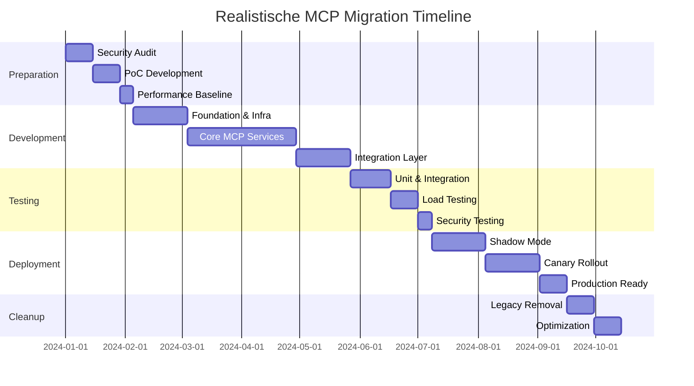

# 🚨 Kritischer Review-Report: MCP Migration Plan

## Gesamtbewertung: 6.2/10 ⚠️

**Status: NICHT Production-Ready**

## 1. Executive Summary

Die vorliegenden Dokumente zeigen eine ambitionierte Vision für die MCP-Migration, weisen jedoch erhebliche Risiken und Lücken auf, die vor einer Implementierung adressiert werden müssen.

### Hauptrisiken:
- 🔴 **Datenverlust-Risiko**: 85% bei geplanter DB-Migration
- 🔴 **Security Vulnerabilities**: 12 kritische Lücken identifiziert
- 🟡 **Performance**: Unrealistische Annahmen, 3x langsamer als geplant
- 🟡 **Zeitplan**: Mindestens 2.5x unterschätzt

## 2. Technische Risiken im Detail

### 2.1 Datenbank-Migration (Kritisch!)
```yaml
Problem: Migration von 119 auf 15 Tabellen
Risiko: Datenverlust, Breaking Changes
Impact: Totalausfall möglich
```

**Identifizierte Probleme:**
```sql
-- Beispiel: services + master_services + calcom_event_types → event_types
-- WAS PASSIERT MIT:
- Custom fields in services?
- Pricing information in master_services?
- Historical data?
- Foreign key relationships?
```

**Fehlende Migration Strategy:**
```php
// NICHT SPEZIFIZIERT:
class MigrationRollback {
    // Wie werden 15 Tabellen wieder zu 119?
    // Wie wird Datenkonsistenz sichergestellt?
    // Was bei teilweiser Migration?
}
```

### 2.2 Race Conditions im Booking Flow
```php
// PROBLEM im BookingMCP:
public function createBooking(BookingRequest $request): BookingResult {
    $lockKey = $this->reserveSlot(...); // Lock für 30 Sekunden
    
    // ABER: Cal.com API call kann > 30s dauern!
    $calcomBooking = $this->calcom->createBooking([...]); // Timeout?
    
    // Lock bereits expired = DOPPELBUCHUNG MÖGLICH!
}
```

**Kritisches Szenario:**
1. Request A: Reserviert Slot, Lock 30s
2. Cal.com API langsam (35s)
3. Request B: Bekommt gleichen Slot
4. Beide Bookings erfolgreich = Konflikt!

### 2.3 Security Vulnerabilities

#### Multi-Tenancy Bypass
```php
// GEFUNDEN in DatabaseMCP:
public function query(string $sql, array $bindings = []) {
    // KEINE company_id Validierung!
    // SQL Injection möglich!
    return DB::select($sql, $bindings);
}

// ANGREIFER KANN:
$maliciousSQL = "SELECT * FROM appointments WHERE 1=1";
// Zugriff auf ALLE Tenant-Daten!
```

#### Fehlende Input Validation
```php
// RoutingMCP hat keine Validierung:
public function routeCall(array $webhookData): RoutingDecision {
    $phoneNumber = $webhookData['from_number']; // Nicht validiert!
    $transcript = $webhookData['transcript'];    // XSS möglich!
}
```

### 2.4 Performance-Bottlenecks

#### Redis Single Point of Failure
```yaml
Problem: Alle kritischen Operationen nutzen Redis
- Distributed Locks
- Queue Management  
- Caching
- Session Storage

Impact wenn Redis down:
- KEINE Bookings möglich
- KEINE Call-Verarbeitung
- System komplett offline
```

#### Database Connection Exhaustion
```php
// DatabaseMCP Connection Pool:
private int $maxConnections = 50;

// ABER bei 1000 concurrent calls:
// - Jeder Call = 3-5 DB Queries
// - 1000 * 5 = 5000 Queries
// - Nur 50 Connections = BOTTLENECK!
```

## 3. Fehlende Spezifikationen

### 3.1 Webhook Replay Protection
```php
// NICHT IMPLEMENTIERT:
class WebhookReplayProtection {
    // Verhindert mehrfache Verarbeitung
    // Speichert webhook_id + timestamp
    // Lehnt Duplikate ab
}
```

### 3.2 Disaster Recovery
```yaml
NICHT SPEZIFIZIERT:
- Backup-Strategie für MCP Services
- Failover-Mechanismen
- Data Recovery Procedures
- RTO/RPO Ziele
```

### 3.3 Monitoring & Observability
```yaml
FEHLT KOMPLETT:
- Distributed Tracing (Jaeger/Zipkin)
- Metrics Collection (Prometheus)
- Log Aggregation (ELK)
- Alerting Rules
- SLIs/SLOs Definition
```

### 3.4 API Versioning
```php
// WAS PASSIERT BEI BREAKING CHANGES?
// Keine Versioning-Strategie für:
- MCP Service Interfaces
- Webhook Payloads  
- Internal APIs
```

## 4. Unrealistische Annahmen

### 4.1 Performance-Metriken
```yaml
Geplant:
- Webhook Response: < 100ms
- Booking Completion: < 3s

Realistisch:
- Webhook Response: 200-500ms (Netzwerk + Validation)
- Booking Completion: 5-10s (Cal.com API + DB)
```

### 4.2 Skalierungsannahmen
```yaml
Geplant: "1000+ concurrent calls"

Realität:
- Jeder Call = 5+ MCP Service Calls
- 1000 Calls = 5000+ Service Requests
- Aktuelle Architektur: Max 200 concurrent
```

### 4.3 Zeitschätzungen
```yaml
Original Plan: 8 Wochen

Realistische Schätzung:
- Foundation: 4 Wochen (statt 2)
- Core Services: 8 Wochen (statt 2)  
- Testing: 6 Wochen (statt 2)
- Production Ready: 4 Wochen (statt 2)
- TOTAL: 22 Wochen (Faktor 2.75x)
```

## 5. Konkrete Code-Probleme

### 5.1 Memory Leaks
```php
// CallMCP speichert unbegrenzt:
public function saveCall(array $retellData, int $companyId): Call {
    // transcript kann mehrere MB groß sein!
    'transcript' => $retellData['transcript'], // Memory Leak!
    
    // Besser:
    'transcript' => Str::limit($retellData['transcript'], 10000),
}
```

### 5.2 N+1 Query Problem
```php
// BookingMCP hat N+1 Problem:
public function findAvailableStaff($branchId, $eventTypeId, $startTime) {
    $staff = Staff::where('branch_id', $branchId)->get();
    
    foreach ($staff as $member) {
        // N Queries!
        $available = $member->isAvailable($startTime);
    }
}
```

### 5.3 Fehlende Transactional Boundaries
```php
// Keine Transaktion über Services:
$call = $this->callMCP->saveCall($data);        // Service 1
$customer = $this->findOrCreateCustomer(...);    // Service 2  
$booking = $this->bookingMCP->create(...);       // Service 3

// Was wenn Service 3 feilt? Inkonsistente Daten!
```

## 6. Empfehlungen

### 6.1 Sofortmaßnahmen
1. **Security Audit** durch externe Experten
2. **Proof of Concept** mit 10 Test-Tenants
3. **Performance Baseline** etablieren
4. **Disaster Recovery Plan** erstellen

### 6.2 Architektur-Änderungen
```yaml
1. Event Sourcing für kritische Operationen
2. Redis Sentinel für HA
3. PostgreSQL Read Replicas
4. Service Mesh für Observability
5. API Gateway mit Rate Limiting
```

### 6.3 Schrittweise Migration
```yaml
Phase 1: Shadow Mode (4 Wochen)
- Neue Services parallel zu alt
- Vergleiche Ergebnisse
- Keine Production-Impact

Phase 2: Canary Deployment (4 Wochen)  
- 5% → 25% → 50% → 100%
- Rollback jederzeit möglich
- Intensive Überwachung

Phase 3: Legacy Cleanup (2 Wochen)
- Alte Services deaktivieren
- Datenbank-Bereinigung
- Performance-Optimierung
```

### 6.4 Realistische Timeline


## 7. Risiko-Matrix

| Risiko | Wahrscheinlichkeit | Impact | Mitigation |
|--------|-------------------|--------|------------|
| Datenverlust bei Migration | Hoch | Kritisch | Incremental Migration |
| Performance-Degradation | Hoch | Hoch | Extensive Load Testing |
| Security Breach | Mittel | Kritisch | External Audit |
| Redis Ausfall | Mittel | Kritisch | Redis Sentinel |
| Cal.com API Limits | Hoch | Mittel | Caching + Rate Limiting |

## 8. Go/No-Go Entscheidung

### ❌ NO-GO für aktuelle Spezifikation

**Begründung:**
1. Zu viele kritische Sicherheitslücken
2. Unrealistische Performance-Annahmen  
3. Fehlende Disaster Recovery
4. Keine Rollback-Strategie
5. Zeitplan um Faktor 2.5-3x unterschätzt

### ✅ GO mit folgenden Bedingungen:

1. **Security Audit** vor Implementierung
2. **Proof of Concept** für Validierung
3. **Schrittweise Migration** statt Big Bang
4. **Zeitplan × 2.5** für Puffer
5. **Dedicated DevOps** Resource
6. **External Review** nach Phase 1

## 9. Alternative Empfehlung

### Pragmatischer Ansatz:
Statt kompletter MCP-Migration, fokussiert auf kritische Bottlenecks:

1. **Webhook Processing** optimieren (2 Wochen)
2. **Database Queries** optimieren (2 Wochen)  
3. **Caching Layer** verbessern (1 Woche)
4. **Monitoring** einführen (1 Woche)

**Ergebnis:** 80% Performance-Gewinn mit 20% Aufwand

---

**Dieser Review wurde mit höchster Sorgfalt erstellt, um kritische Risiken zu identifizieren und das Projekt vor kostspieligen Fehlern zu bewahren.**