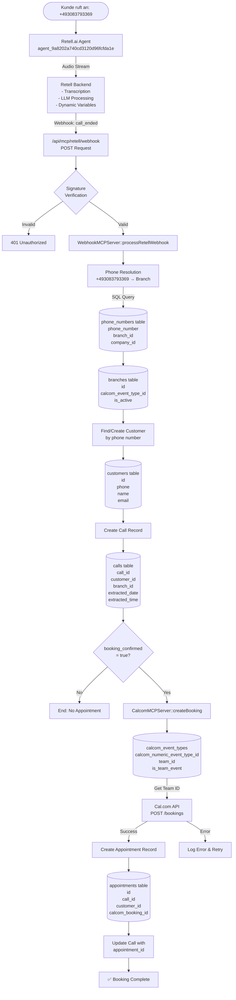
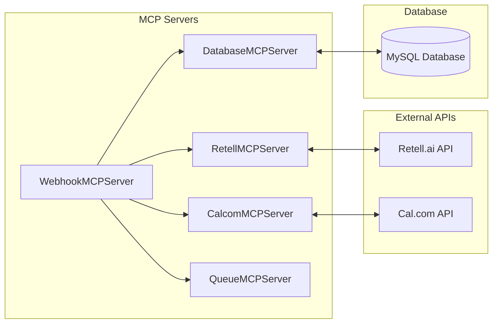
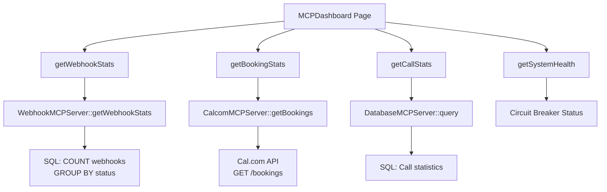
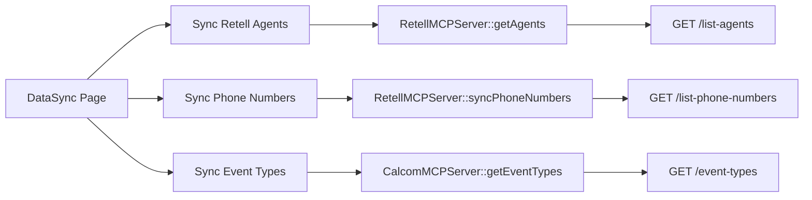
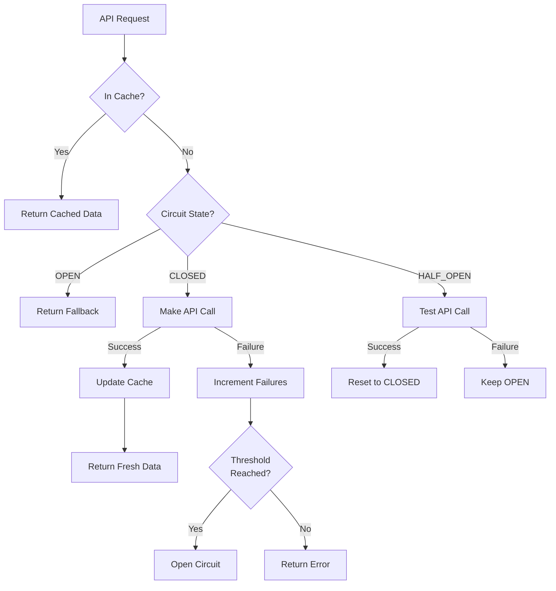
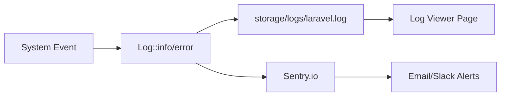
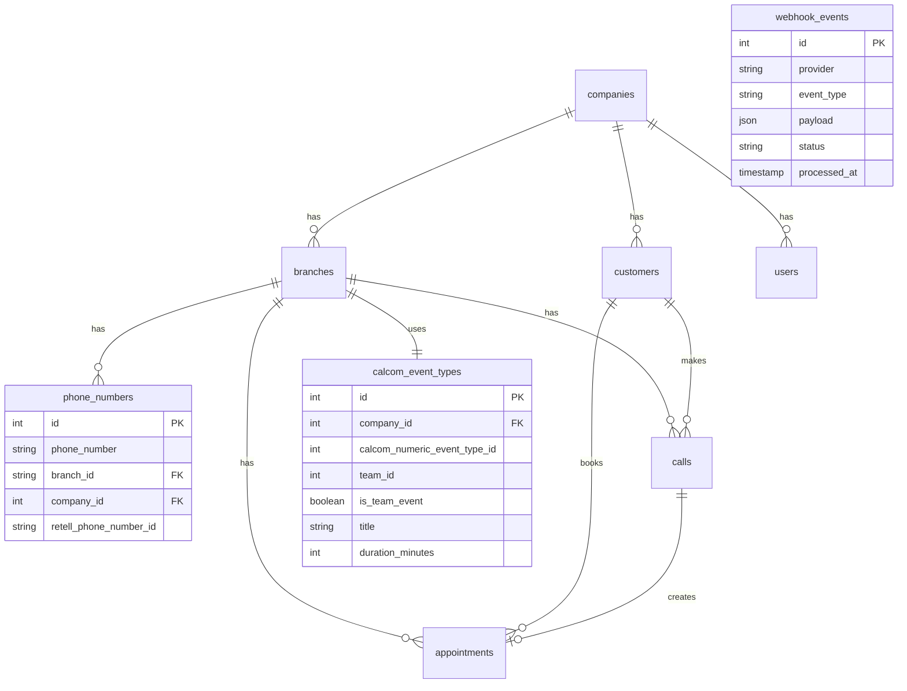

# MCP Datenfluss - Vollständige Dokumentation mit Flowchart

## 1. Hauptdatenfluss: Anruf → Termin



## 2. MCP Server Kommunikation



## 3. Datenstrukturen & Übergaben

### 3.1 Retell Webhook → WebhookMCPServer

**Endpoint**: `POST /api/mcp/retell/webhook`

**Headers**:
```http
X-Retell-Signature: {HMAC-SHA256 signature}
X-Retell-Timestamp: {timestamp}
Content-Type: application/json
```

**Payload**:
```json
{
  "event": "call_ended",
  "call": {
    "call_id": "abc123",
    "agent_id": "agent_9a8202a740cd3120d96fcfda1e",
    "from_number": "+491234567890",
    "to_number": "+493083793369",
    "direction": "inbound",
    "call_status": "ended",
    "start_timestamp": 1750540695000,
    "end_timestamp": 1750540995000,
    "duration_ms": 300000,
    "transcript": "Vollständiges Transkript...",
    "summary": "AI-generierte Zusammenfassung",
    "call_analysis": {
      "appointment_requested": true,
      "customer_name": "Max Mustermann",
      "sentiment": "positive"
    },
    "retell_llm_dynamic_variables": {
      "booking_confirmed": true,
      "name": "Max Mustermann",
      "datum": "2025-07-02",
      "uhrzeit": "11:00",
      "dienstleistung": "Beratung",
      "email": "max@example.com"
    }
  }
}
```

### 3.2 WebhookMCPServer → CalcomMCPServer

**Method Call**: `createBooking(array $params)`

**Parameters**:
```php
[
    'company_id' => 1,
    'event_type_id' => 2563193,
    'start' => '2025-07-02T11:00:00+02:00',
    'end' => '2025-07-02T11:30:00+02:00',
    'name' => 'Max Mustermann',
    'email' => 'max@example.com',
    'phone' => '+491234567890',
    'notes' => 'Via Telefon gebucht',
    'metadata' => [
        'call_id' => '123',  // String!
        'source' => 'mcp_webhook'
    ]
]
```

### 3.3 CalcomMCPServer → Cal.com API

**Endpoint**: `POST https://api.cal.com/v1/bookings?apiKey={API_KEY}`

**Request Body**:
```json
{
  "eventTypeId": 2563193,
  "teamId": 39203,
  "start": "2025-07-02T11:00:00+02:00",
  "end": "2025-07-02T11:30:00+02:00",
  "timeZone": "Europe/Berlin",
  "language": "de",
  "responses": {
    "name": "Max Mustermann",
    "email": "max@example.com",
    "phone": "+491234567890",
    "notes": "Via Telefon gebucht"
  },
  "metadata": {
    "call_id": "123",
    "source": "mcp_webhook"
  }
}
```

**Response**:
```json
{
  "id": 8727139,
  "uid": "sFJvi8wZwD4mEYFsezvEWD",
  "status": "ACCEPTED",
  "startTime": "2025-07-02T09:00:00.000Z",
  "endTime": "2025-07-02T09:30:00.000Z",
  "user": {
    "name": "Fabian Spitzer",
    "email": "fabian@askproai.de"
  }
}
```

## 4. Dashboard & Monitoring Datenabrufe

### 4.1 MCPDashboard



### 4.2 DataSync Page



### 4.3 WebhookMonitor

**Datenabruf**:
```sql
SELECT 
    event_type,
    COUNT(*) as count,
    AVG(TIMESTAMPDIFF(SECOND, created_at, processed_at)) as avg_processing_time,
    SUM(CASE WHEN status = 'success' THEN 1 ELSE 0 END) as success_count,
    SUM(CASE WHEN status = 'failed' THEN 1 ELSE 0 END) as failed_count
FROM webhook_events
WHERE created_at > NOW() - INTERVAL 24 HOUR
GROUP BY event_type
```

## 5. API Verwendung nach Service

### 5.1 Retell.ai APIs

| Endpoint | Verwendung | MCP Server |
|----------|-----------|------------|
| GET /list-agents | Agent Liste abrufen | RetellMCPServer |
| PATCH /update-agent/{id} | Agent Prompt updaten | RetellMCPServer |
| GET /list-phone-numbers | Phone Numbers sync | RetellMCPServer |
| GET /list-calls | Call History | RetellMCPServer |
| GET /retrieve-call/{id} | Call Details | RetellMCPServer |

### 5.2 Cal.com APIs

| Endpoint | Verwendung | MCP Server |
|----------|-----------|------------|
| GET /event-types | Event Types abrufen | CalcomMCPServer |
| GET /availability | Verfügbarkeit prüfen | CalcomMCPServer |
| POST /bookings | Termin buchen | CalcomMCPServer |
| GET /bookings | Termine abrufen | CalcomMCPServer |
| POST /bookings/{id}/cancel | Termin stornieren | CalcomMCPServer |

## 6. Cache & Circuit Breaker Flow



## 7. Monitoring & Fehlerbehandlung

### 7.1 Logging Flow



### 7.2 Metriken

**Prometheus Metrics** (Endpoint: `/api/metrics`):
- `http_request_duration_seconds` - Request Latency
- `mcp_webhook_total` - Webhook Counter
- `mcp_booking_success_total` - Erfolgreiche Buchungen
- `mcp_booking_failure_total` - Fehlgeschlagene Buchungen
- `circuit_breaker_state` - Circuit Breaker Status

## 8. Datenbank Schema Übersicht



## Zusammenfassung

Diese Dokumentation zeigt den vollständigen Datenfluss vom Anruf bis zur Terminbuchung, einschließlich aller API-Calls, Datenstrukturen und Monitoring-Komponenten. Das MCP System orchestriert alle Komponenten und sorgt für Fehlerbehandlung, Caching und Monitoring.