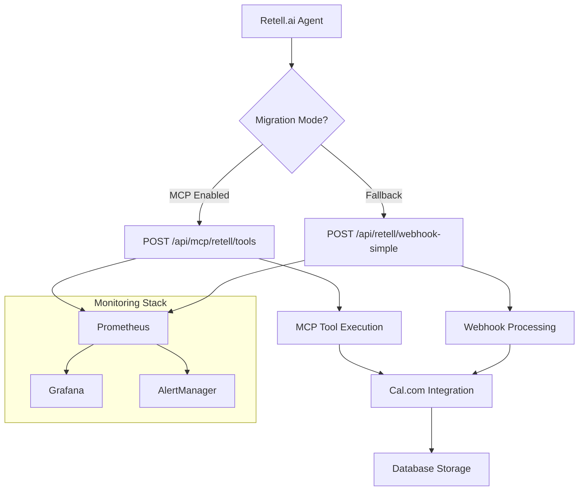

# MCP Migration Deployment Guide

## Overview

This guide provides comprehensive instructions for deploying the new Retell.ai MCP (Model Context Protocol) integration that replaces webhook-based communication. The deployment supports zero-downtime migration with parallel operation and gradual rollout capabilities.

## Architecture



## Key Features

- **Zero-downtime deployment** with webhook fallback
- **Gradual rollout** with percentage-based migration
- **Circuit breaker** for resilience
- **Performance monitoring** with <500ms response time requirement
- **Comprehensive alerting** for failures and performance degradation
- **Automatic rollback** on critical failures

## Prerequisites

1. **System Requirements:**
   - PHP 8.2+
   - Laravel 10+
   - Redis for caching and queues
   - MySQL/PostgreSQL database
   - Nginx/Apache web server

2. **External Services:**
   - Retell.ai API access
   - Cal.com API integration
   - Monitoring stack (Prometheus/Grafana) - optional

3. **Permissions:**
   - Write access to `/var/www/api-gateway`
   - Backup directory access: `/var/backups/mcp-migration`
   - Log directory access: `/var/log`

## Configuration

### 1. Environment Setup

Copy the MCP configuration template:

```bash
cp .env.mcp.example .env.mcp
```

Update the key configuration values:

```bash
# Required MCP settings
MCP_RETELL_AGENT_TOKEN=your_secure_token_here
MCP_RETELL_AGENT_BACKUP_TOKEN=your_backup_token_here
MCP_RESPONSE_TIME_LIMIT_MS=500
MCP_MIGRATION_MODE=true
MCP_FALLBACK_TO_WEBHOOK=true

# Rollout configuration
MCP_ROLLOUT_PERCENTAGE=0  # Start with 0% for testing

# Circuit breaker
MCP_CIRCUIT_BREAKER_ENABLED=true
MCP_CIRCUIT_BREAKER_THRESHOLD=5
MCP_CIRCUIT_BREAKER_TIMEOUT=60

# Performance monitoring
MCP_PERFORMANCE_MONITORING_ENABLED=true
MCP_ALERT_RESPONSE_TIME_THRESHOLD_MS=1000
```

### 2. Security Configuration

**Authentication Tokens:**
```bash
# Generate secure tokens
openssl rand -hex 32  # For MCP_RETELL_AGENT_TOKEN
openssl rand -hex 32  # For MCP_RETELL_AGENT_BACKUP_TOKEN
```

**Rate Limiting:**
```bash
MCP_RATE_LIMIT_TOOLS=100        # Requests per minute
MCP_IP_RATE_LIMIT_MAX=200       # Per IP limit
MCP_REQUEST_SIZE_LIMIT_MB=10    # Max request size
```

## Deployment Process

### Phase 1: Pre-deployment Validation

1. **Run Health Check:**
```bash
./scripts/mcp-health-check.sh --comprehensive
```

2. **Validate Configuration:**
```bash
php artisan config:validate
php artisan env:check
```

3. **Run Tests:**
```bash
php artisan test tests/Feature/MCP/
php artisan test tests/Feature/RetellIntegrationTest.php
```

### Phase 2: Deployment

1. **Execute Deployment Script:**
```bash
# Full deployment with 0% rollout (testing mode)
export MCP_ROLLOUT_PERCENTAGE=0
./scripts/deploy-mcp-migration.sh
```

2. **Monitor Deployment:**
```bash
# Check logs
tail -f /var/log/mcp-migration-*.log

# Verify MCP endpoint
curl -H "Authorization: Bearer $MCP_RETELL_AGENT_TOKEN" \
     https://api.askproai.de/api/mcp/retell/health
```

### Phase 3: Gradual Rollout

1. **Start with 10% rollout:**
```bash
php artisan config:set MCP_ROLLOUT_PERCENTAGE 10
php artisan config:cache
```

2. **Monitor performance:**
```bash
./scripts/mcp-health-check.sh
```

3. **Increase gradually:**
```bash
# If performance is good, increase rollout
for percentage in 25 50 75 100; do
    echo "Rolling out to $percentage%"
    php artisan config:set MCP_ROLLOUT_PERCENTAGE $percentage
    php artisan config:cache
    sleep 300  # Wait 5 minutes
    ./scripts/mcp-health-check.sh || break
done
```

## Monitoring Setup

### 1. Generate Monitoring Configuration

```bash
# Generate Prometheus config
./scripts/generate-prometheus-config.sh

# Generate Grafana dashboard
./scripts/generate-grafana-dashboard.sh provision
```

### 2. Deploy Monitoring Stack (Docker)

```bash
# Start monitoring stack
docker-compose -f /tmp/docker-compose.monitoring.yml up -d

# Verify services
docker-compose ps
curl http://localhost:9090/targets    # Prometheus
curl http://localhost:3000            # Grafana
```

### 3. Import Grafana Dashboard

```bash
# Deploy dashboard to Grafana
GRAFANA_URL=http://localhost:3000 \
GRAFANA_USER=admin \
GRAFANA_PASSWORD=admin123 \
./scripts/generate-grafana-dashboard.sh deploy
```

## Health Monitoring

### Key Metrics to Monitor

1. **Response Time:**
   - Target: <500ms (95th percentile)
   - Warning: >300ms
   - Critical: >1000ms

2. **Error Rate:**
   - Target: <1%
   - Warning: >5%
   - Critical: >10%

3. **Circuit Breaker:**
   - Monitor state: CLOSED (healthy)
   - Alert on: OPEN or HALF_OPEN states

4. **Tool Execution Success:**
   - Target: >98%
   - Critical: <95%

### Health Check Commands

```bash
# Basic health check
./scripts/mcp-health-check.sh

# Comprehensive health check
./scripts/mcp-health-check.sh --comprehensive

# Continuous monitoring
watch -n 30 './scripts/mcp-health-check.sh'
```

## Troubleshooting

### Common Issues

1. **High Response Times:**
```bash
# Check database performance
php artisan db:monitor

# Check Redis connection
redis-cli ping

# Review slow queries
tail -f storage/logs/laravel.log | grep "slow"
```

2. **Authentication Failures:**
```bash
# Verify token configuration
php artisan tinker
> config('services.mcp.token')

# Test endpoint manually
curl -H "Authorization: Bearer $MCP_RETELL_AGENT_TOKEN" \
     -H "Content-Type: application/json" \
     -d '{"tool":"test"}' \
     https://api.askproai.de/api/mcp/retell/tools
```

3. **Circuit Breaker Issues:**
```bash
# Check circuit breaker status
php artisan circuit-breaker:status --service=retell

# Reset circuit breaker
php artisan circuit-breaker:reset --service=retell
```

### Emergency Rollback

**Immediate Rollback:**
```bash
# Emergency rollback (no confirmation)
./scripts/rollback-mcp.sh --emergency
```

**Standard Rollback:**
```bash
# Interactive rollback
./scripts/rollback-mcp.sh

# Automatic rollback
./scripts/rollback-mcp.sh --auto
```

**Post-Rollback Verification:**
```bash
# Verify webhook functionality
curl -X POST https://api.askproai.de/api/retell/webhook-simple \
     -H "Content-Type: application/json" \
     -d '{"test": true}'

# Check application health
php artisan health:check
```

## Performance Optimization

### Database Optimization

```sql
-- Add indexes for MCP queries
CREATE INDEX idx_calls_mcp_processed ON calls(created_at, company_id) 
WHERE integration_type = 'mcp';

CREATE INDEX idx_companies_mcp_enabled ON companies(mcp_enabled, updated_at);
```

### Caching Strategy

```bash
# Configure tool-specific caching
MCP_CACHE_TOOL_GET_AVAILABLE_SLOTS=300    # 5 minutes
MCP_CACHE_TOOL_GET_COMPANY_INFO=600       # 10 minutes
MCP_CACHE_TOOL_GET_CUSTOMER_INFO=180      # 3 minutes
```

### Rate Limit Tuning

```bash
# Adjust based on observed traffic
MCP_RATE_LIMIT_TOOLS=150         # Increase if needed
MCP_RATE_LIMIT_BURST_MULTIPLIER=3  # Allow bursts
```

## Security Considerations

1. **Token Management:**
   - Rotate tokens every 90 days
   - Use separate tokens for different environments
   - Store tokens securely (not in code)

2. **Request Validation:**
   - Enable signature validation
   - Limit request size (10MB default)
   - Implement IP whitelisting if needed

3. **Monitoring:**
   - Alert on authentication failures
   - Monitor for unusual traffic patterns
   - Log security events

## Migration Checklist

### Pre-Migration
- [ ] Environment configured (.env.mcp)
- [ ] Tokens generated and secured
- [ ] Tests passing
- [ ] Health checks green
- [ ] Monitoring stack ready
- [ ] Backup strategy confirmed

### During Migration
- [ ] 0% rollout deployed successfully
- [ ] MCP endpoint responding
- [ ] Webhook fallback working
- [ ] Monitoring data flowing
- [ ] Performance within limits

### Post-Migration
- [ ] 100% rollout completed
- [ ] All health checks passing
- [ ] Performance metrics stable
- [ ] Error rates acceptable
- [ ] Alerts configured
- [ ] Documentation updated

## Support and Maintenance

### Daily Operations

```bash
# Daily health check
./scripts/mcp-health-check.sh --comprehensive > /var/log/daily-health-$(date +%Y%m%d).log

# Check alert status
curl -s http://localhost:9093/api/v1/alerts | jq '.data[] | select(.state=="firing")'

# Review performance metrics
curl -s "http://localhost:9090/api/v1/query?query=rate(askproai_mcp_requests_total[1h])"
```

### Weekly Maintenance

```bash
# Rotate logs
find /var/log -name "mcp-*.log" -mtime +7 -delete

# Update performance baselines
php artisan metrics:calculate-baselines --service=mcp

# Backup configuration
cp -r config/ /var/backups/mcp-config-$(date +%Y%m%d)/
```

### Performance Tuning

1. **Response Time Optimization:**
   - Database query optimization
   - Redis caching improvements
   - Connection pooling

2. **Throughput Optimization:**
   - Increase rate limits gradually
   - Scale horizontally if needed
   - Optimize tool execution

3. **Resource Optimization:**
   - Monitor memory usage
   - Adjust cache sizes
   - Tune circuit breaker thresholds

## Conclusion

The MCP migration provides improved performance, reliability, and monitoring capabilities. Follow this guide carefully and monitor the system closely during migration. The zero-downtime deployment ensures business continuity while providing the benefits of the new architecture.

For questions or issues, check the troubleshooting section or review the deployment logs in `/var/log/mcp-migration-*.log`.