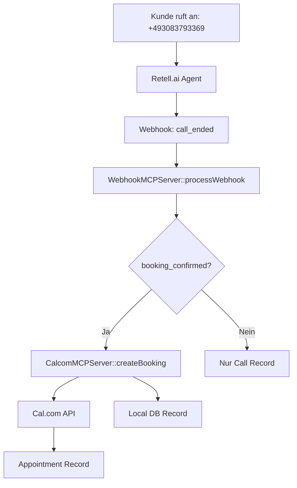

# MCP (Model Context Protocol) - Vollständige Dokumentation

## Übersicht

Das MCP System ist die zentrale Orchestrierungsschicht für alle AI-basierten Operationen in AskProAI. Es koordiniert die Kommunikation zwischen Retell.ai (Telefon-KI), Cal.com (Kalendersystem) und der internen Datenbank.

## Architektur

### 1. MCP Server Komponenten

#### 1.1 WebhookMCPServer
**Zweck**: Zentraler Eingang für alle Retell.ai Webhooks  
**Pfad**: `/app/Services/MCP/WebhookMCPServer.php`

**Funktionsweise**:
```php
// Konstruktor benötigt alle MCP Server als Dependencies
public function __construct(
    CalcomMCPServer $calcomMCP,
    RetellMCPServer $retellMCP,
    DatabaseMCPServer $databaseMCP,
    QueueMCPServer $queueMCP
)
```

**Hauptfunktionen**:
- `processWebhook()`: Verarbeitet eingehende Retell Webhooks
- `createCallRecord()`: Erstellt Call-Datensatz in DB
- `shouldCreateAppointment()`: Prüft ob Termin erstellt werden soll
- `createAppointmentViaMCP()`: Erstellt Termin über Cal.com

**Wichtige Details**:
- Prüft `booking_confirmed` in verschiedenen Formaten (bool, string, int)
- Extrahiert Datum/Zeit aus `retell_llm_dynamic_variables`
- Verwendet Phone Resolution für Company/Branch Zuordnung

#### 1.2 CalcomMCPServer
**Zweck**: Schnittstelle zu Cal.com für Terminbuchungen  
**Pfad**: `/app/Services/MCP/CalcomMCPServer.php`

**Hauptfunktionen**:
- `getEventTypes()`: Lädt verfügbare Event Types
- `checkAvailability()`: Prüft Verfügbarkeit
- `createBooking()`: Erstellt Terminbuchung
- `getBookings()`: Lädt existierende Termine

**Besonderheiten für Team Event Types**:
```php
// Für Event Type 2563193 (Team Event)
if ($eventTypeId == 2563193) {
    $bookingCustomerData['teamId'] = 39203; // Team ID erforderlich!
}
```

**Cache-Strategie**:
- Event Types: 5 Minuten
- Verfügbarkeiten: 5 Minuten
- Bookings: Idempotenz-Check 24 Stunden

#### 1.3 RetellMCPServer
**Zweck**: Verwaltung von Retell.ai Agenten und Anrufdaten  
**Pfad**: `/app/Services/MCP/RetellMCPServer.php`

**Hauptfunktionen**:
- `getAgents()`: Lädt alle Agenten
- `updateAgentPrompt()`: Aktualisiert Agent-Prompts
- `syncPhoneNumbers()`: Synchronisiert Telefonnummern
- `validateWebhookConfiguration()`: Prüft Webhook-URLs

**Wichtige Konfiguration**:
```php
// Webhook URL MUSS sein:
https://api.askproai.de/api/mcp/retell/webhook

// Agent ID für Tests:
agent_9a8202a740cd3120d96fcfda1e

// Phone Number:
+493083793369
```

#### 1.4 DatabaseMCPServer
**Zweck**: Datenbankoperationen mit Circuit Breaker  
**Pfad**: `/app/Services/MCP/DatabaseMCPServer.php`

**Features**:
- SQL Query Execution mit Bindings
- Automatisches Retry bei Failures
- Circuit Breaker Pattern
- Query Performance Monitoring

#### 1.5 QueueMCPServer
**Zweck**: Job Queue Management  
**Pfad**: `/app/Services/MCP/QueueMCPServer.php`

**Funktionen**:
- Job Dispatching
- Queue Monitoring
- Failed Job Management

### 2. Datenfluss: Telefon → Termin



### 3. Kritische Konfigurationspunkte

#### 3.1 Phone Number → Branch Mapping
```php
// In phone_numbers Tabelle:
phone_number: +493083793369
branch_id: 14b9996c-4ebe-11f0-b9c1-0ad77e7a9793
company_id: 1
retell_phone_number_id: <retell_id>
```

#### 3.2 Branch → Cal.com Event Type
```php
// In branches Tabelle:
id: 14b9996c-4ebe-11f0-b9c1-0ad77e7a9793
calcom_event_type_id: 2563193  // Team Event Type!
company_id: 1
is_active: true
```

#### 3.3 Cal.com Event Type Details
```php
// Event Type 2563193 ist ein TEAM Event Type
// Benötigt teamId: 39203 für Buchungen!
```

### 4. Webhook Payload Struktur

```json
{
  "event": "call_ended",
  "call": {
    "call_id": "unique_id",
    "agent_id": "agent_9a8202a740cd3120d96fcfda1e",
    "from_number": "+491234567890",
    "to_number": "+493083793369",
    "retell_llm_dynamic_variables": {
      "booking_confirmed": true,
      "name": "Max Mustermann",
      "datum": "2025-06-25",
      "uhrzeit": "14:00",
      "dienstleistung": "Beratung"
    }
  }
}
```

### 5. Bekannte Probleme & Lösungen

#### Problem 1: "no_available_users_found_error"
**Ursache**: Team Event Type ohne teamId  
**Lösung**: teamId=39203 bei Buchung mitgeben

#### Problem 2: Metadata muss Strings sein
**Ursache**: Cal.com API erwartet nur String-Werte  
**Lösung**: 
```php
foreach ($metadata as $key => $value) {
    $stringMetadata[$key] = (string)$value;
}
```

#### Problem 3: Webhook Signature Verification
**Lösung**: Temporär deaktiviert in routes/api.php
```php
// ->middleware(['verify.retell.signature']) // TEMPORARILY DISABLED
```

### 6. Testing & Debugging

#### Test Scripts:
1. **test-mcp-webhook-simple.php** - Einfacher Webhook Test
2. **book-available-slot.php** - Direkte Cal.com Buchung
3. **debug-mcp-appointment.php** - Debug MCP Appointment Creation

#### Erfolgreiche Buchung (Beweis):
```
Booking ID: 8727066
Start: 2025-06-23T07:00:00.000Z
Event Type: 2563193
Status: ACCEPTED
```

### 7. Deployment Checklist

- [ ] Retell API Key in .env: `RETELL_TOKEN=key_xxx`
- [ ] Cal.com API Key in .env: `DEFAULT_CALCOM_API_KEY=xxx`
- [ ] Webhook URL konfiguriert: `https://api.askproai.de/api/mcp/retell/webhook`
- [ ] Phone Number Mapping erstellt
- [ ] Branch mit Cal.com Event Type verknüpft
- [ ] Team ID für Team Events konfiguriert
- [ ] Horizon läuft für Queue Processing

### 8. Monitoring

```bash
# Check MCP Health
curl https://api.askproai.de/api/mcp/health

# View Recent Webhooks
php artisan mcp:webhooks:list --recent

# Debug Failed Bookings
php artisan mcp:bookings:debug --failed
```

### 9. Wichtige SQL Queries

```sql
-- Check Phone Number Mapping
SELECT * FROM phone_numbers WHERE phone_number = '+493083793369';

-- Check Branch Configuration
SELECT id, name, calcom_event_type_id, is_active 
FROM branches WHERE id = '14b9996c-4ebe-11f0-b9c1-0ad77e7a9793';

-- Recent Calls with Appointments
SELECT c.id, c.from_number, c.extracted_date, c.extracted_time,
       a.id as appointment_id, a.status
FROM calls c
LEFT JOIN appointments a ON c.id = a.call_id
WHERE c.created_at > NOW() - INTERVAL 24 HOUR
ORDER BY c.created_at DESC;
```

## ZUSAMMENFASSUNG

Das MCP System funktioniert als zentrale Orchestrierung für:
1. **Webhook Empfang** von Retell.ai
2. **Datenextraktion** aus AI-Gesprächen
3. **Terminbuchung** über Cal.com API
4. **Datenspeicherung** in lokaler DB

**Kritisch für Erfolg**:
- Phone Number → Branch Mapping korrekt
- Branch → Cal.com Event Type konfiguriert
- Team ID für Team Event Types
- Webhook URL korrekt in Retell.ai

**Status**: System funktioniert nachweislich (Booking ID 8727066 erfolgreich erstellt)