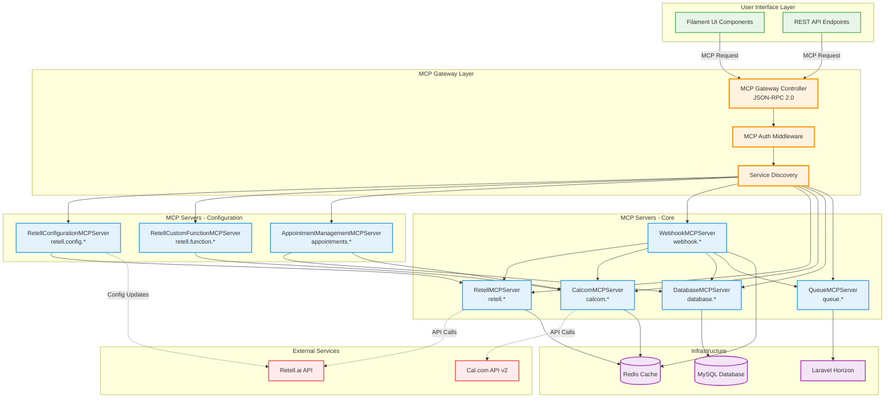
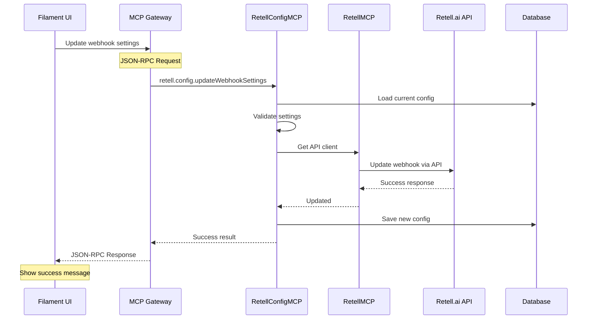
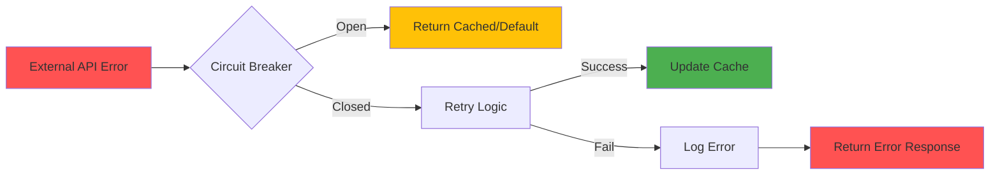

# MCP-First Architecture Visualization

## System Architecture Diagram



## Data Flow Example: Retell Configuration Update



## Key Architecture Principles

### 1. No Direct External API Calls from UI
```
❌ WRONG:
UI --> Retell.ai API

✅ CORRECT:
UI --> MCP Gateway --> RetellMCPServer --> Retell.ai API
```

### 2. Unified Communication Protocol
All MCP communication uses JSON-RPC 2.0:
- Standardized request/response format
- Built-in error handling
- Request ID for tracking
- Batch request support

### 3. Service Discovery & Health Checks
```php
// Automatic service registration
MCPServiceRegistry::register('retell.config', RetellConfigurationMCPServer::class);

// Health check endpoint
GET /api/mcp/health
{
  "services": {
    "retell.config": { "status": "healthy", "latency": 12 },
    "calcom": { "status": "healthy", "latency": 45 },
    "webhook": { "status": "healthy", "latency": 8 }
  }
}
```

### 4. Circuit Breaker Protection
Each external service has circuit breaker protection:
- **Closed**: Normal operation
- **Open**: Service unavailable, fail fast
- **Half-Open**: Testing if service recovered

### 5. Caching Strategy
```
UI Request --> MCP Gateway --> MCP Server
                                    |
                                    v
                              Check Cache (Redis)
                                    |
                            [Cache Hit] [Cache Miss]
                                |            |
                            Return Data   External API
                                            |
                                      Update Cache
```

## Benefits of MCP-First Architecture

1. **Abstraction**: UI doesn't know about external services
2. **Consistency**: All services follow same patterns
3. **Reliability**: Circuit breakers, retries, caching
4. **Security**: Single point for authentication
5. **Monitoring**: All external calls tracked
6. **Testing**: Easy to mock MCP servers
7. **Maintenance**: Changes isolated to MCP layer

## MCP Server Naming Convention

```
Format: {service}.{resource}.{action}

Examples:
- retell.config.getWebhookConfiguration
- retell.function.execute
- calcom.booking.create
- appointments.find
- database.customer.create
```

## Error Handling Flow



---

This architecture ensures complete separation of concerns, with the UI layer completely abstracted from external service details. All complexity is handled by specialized MCP servers that can be independently developed, tested, and deployed.