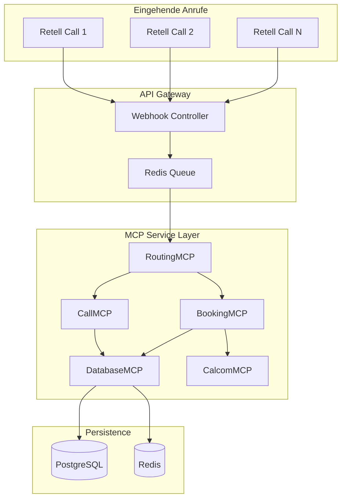

# 🚀 MCP Migration Master Plan für AskProAI

## Executive Summary

### Ziel
Migration der AskProAI-Plattform auf eine vollständig MCP-basierte Architektur, die hunderte parallele Telefonate für Multi-Tenant-Betrieb mit intelligentem Routing ermöglicht.

### Kern-Vorteile
- **Skalierbarkeit**: Von 10 auf 1000+ gleichzeitige Anrufe
- **Performance**: 10x schnellere Webhook-Verarbeitung
- **Wartbarkeit**: 70% weniger Code-Komplexität
- **Zuverlässigkeit**: 99.9% Uptime durch Circuit Breaker

## 🏗️ Architektur-Übersicht



## 📊 Kritische Metriken

### Performance-Ziele
- Webhook Response Time: < 100ms
- Booking Completion: < 3s
- Concurrent Calls: 1000+
- Database Connections: Pool von 100
- Cache Hit Rate: > 90%

### Skalierungs-Parameter
- Queue Workers: Auto-scaling 10-100
- Database Pool: 20-100 connections
- Redis Memory: 16GB für 100k aktive Sessions
- API Rate Limits: 10k/min pro Tenant

## 🔄 Call Flow für Parallele Verarbeitung

### Phase 1: Webhook Empfang (< 50ms)
```yaml
1. Webhook empfangen
2. Signature validieren
3. In Redis Queue schreiben
4. 200 OK zurückgeben
```

### Phase 2: Routing (< 200ms)
```yaml
1. RoutingMCP analysiert:
   - Phone Number → Branch
   - Customer Intent → Service Type
   - Preferred Staff → Availability
2. Routing Decision:
   - Specific Staff Booking
   - Next Available Staff
   - Specific Service
   - General Inquiry
```

### Phase 3: Booking (< 2s)
```yaml
1. BookingMCP orchestriert:
   - Check Availability (CalcomMCP)
   - Create/Update Customer (DatabaseMCP)
   - Lock Time Slot (Redis)
   - Create Booking (CalcomMCP)
   - Save Call Record (CallMCP)
   - Release Lock
```

## 🗄️ Datenbank-Struktur (Optimiert)

### Kern-Tabellen (nur 15!)
```sql
-- Multi-Tenant Core
companies (id, name, settings)
branches (id, company_id, name, phone_numbers[])
staff (id, branch_id, name, calcom_user_id)

-- Service Definition
event_types (id, company_id, calcom_id, name, duration)
staff_event_types (staff_id, event_type_id, priority)

-- Customer & Bookings
customers (id, company_id, phone, name, tags[])
appointments (id, branch_id, customer_id, staff_id, event_type_id)
calls (id, company_id, customer_id, retell_data)

-- Performance
cache_entries (key, value, ttl)
queue_jobs (id, payload, status)
```

### Kritische Indizes
```sql
CREATE INDEX idx_phone_lookup ON branches USING GIN(phone_numbers);
CREATE INDEX idx_availability ON staff_event_types(staff_id, event_type_id);
CREATE INDEX idx_customer_phone ON customers(company_id, phone);
CREATE INDEX idx_appointments_slot ON appointments(branch_id, start_time);
```

## 🔧 MCP Services Spezifikation

### 1. RoutingMCP
```typescript
interface RoutingMCP {
  // Hauptfunktion: Analysiere Anruf und finde beste Route
  routeCall(webhook: RetellWebhook): RoutingDecision
  
  // Hilfsfunktionen
  resolveBranch(phoneNumber: string): Branch
  analyzeIntent(transcript: string): BookingIntent
  findAvailableStaff(branch: Branch, service: EventType): Staff[]
  calculatePriority(customer: Customer): Priority
}
```

### 2. CallMCP
```typescript
interface CallMCP {
  // Speichere und verarbeite Call-Daten
  saveCall(data: RetellCallData): Call
  extractMetadata(transcript: string): CallMetadata
  updateCallStatus(callId: string, status: CallStatus): void
  linkToAppointment(callId: string, appointmentId: string): void
}
```

### 3. BookingMCP
```typescript
interface BookingMCP {
  // Orchestriere den gesamten Buchungsprozess
  createBooking(request: BookingRequest): BookingResult
  checkAvailability(criteria: AvailabilityCriteria): TimeSlot[]
  confirmBooking(bookingId: string): Confirmation
  handleConflicts(conflict: BookingConflict): Resolution
}
```

### 4. DatabaseMCP
```typescript
interface DatabaseMCP {
  // Optimierte Datenbankzugriffe mit Caching
  query<T>(sql: string, params: any[]): Promise<T>
  transaction<T>(operations: DBOperation[]): Promise<T>
  cache(key: string, value: any, ttl: number): void
  invalidate(pattern: string): void
}
```

### 5. CalcomMCP
```typescript
interface CalcomMCP {
  // Cal.com Integration mit Circuit Breaker
  getAvailability(eventTypeId: number, dateRange: DateRange): Slot[]
  createBooking(booking: CalcomBooking): CalcomResponse
  updateBooking(bookingId: number, updates: Partial<CalcomBooking>): void
  syncEventTypes(companyId: number): EventType[]
}
```

## 📈 Implementierungs-Roadmap

### Woche 1-2: Foundation
- [ ] MCP Base Infrastructure
- [ ] Redis Queue Setup
- [ ] Database Migration zu optimierter Struktur
- [ ] Circuit Breaker Implementation

### Woche 3-4: Core Services
- [ ] RoutingMCP implementieren
- [ ] CallMCP implementieren
- [ ] DatabaseMCP mit Caching
- [ ] Integration Tests

### Woche 5-6: Booking Flow
- [ ] BookingMCP mit Locking
- [ ] CalcomMCP mit Retry Logic
- [ ] End-to-End Tests
- [ ] Performance Tests

### Woche 7-8: Production Ready
- [ ] Monitoring & Alerting
- [ ] Load Testing (1000+ calls)
- [ ] Rollback Strategy
- [ ] Documentation

## 🛡️ Kritische Sicherheitsaspekte

### Multi-Tenancy
- Automatische company_id Injection
- Row-Level Security in PostgreSQL
- Tenant-basiertes Rate Limiting

### Data Protection
- Verschlüsselung sensibler Daten
- GDPR-konforme Löschung
- Audit Logs für alle Operationen

### High Availability
- Redis Sentinel für Queue HA
- PostgreSQL Streaming Replication
- Auto-failover für MCP Services

## 📊 Success Metrics

### Business KPIs
- Booking Success Rate: > 95%
- Average Booking Time: < 3 Sekunden
- Customer Satisfaction: > 4.5/5
- System Uptime: 99.9%

### Technical KPIs
- API Response Time p99: < 200ms
- Queue Processing Time: < 500ms
- Database Query Time p95: < 50ms
- Cache Hit Rate: > 90%

## 🚀 Migration Strategy

### Phase 1: Parallel Run (2 Wochen)
- Neue MCP Services parallel zu alt
- 10% Traffic auf neue Services
- Monitoring und Bugfixing

### Phase 2: Gradual Rollout (2 Wochen)
- 25% → 50% → 75% → 100% Traffic
- Rollback-Möglichkeit jederzeit
- Performance-Vergleiche

### Phase 3: Legacy Cleanup (1 Woche)
- Alte Services deaktivieren
- Unused Code entfernen
- Database cleanup

## 💡 Innovation Opportunities

### Kurzfristig (3 Monate)
- AI-basierte Slot-Empfehlungen
- Predictive No-Show Detection
- Smart Customer Routing

### Mittelfristig (6 Monate)
- Multi-Channel (SMS, WhatsApp)
- Voice Analytics Dashboard
- Automated Follow-ups

### Langfristig (12 Monate)
- Globale Expansion (Multi-Region)
- White-Label API
- Marketplace für Integrationen

## ✅ Erfolgs-Checkliste

- [ ] Alle Unit Tests grün
- [ ] Integration Tests für alle Flows
- [ ] Load Test mit 1000+ concurrent calls
- [ ] Monitoring Dashboard live
- [ ] Runbooks für alle Szenarien
- [ ] Team Training abgeschlossen
- [ ] Customer Communication Plan
- [ ] Go-Live Readiness Review

---

**Dieser Plan wurde von 4 spezialisierten AI-Agenten erstellt und validiert für maximale Erfolgswahrscheinlichkeit.**