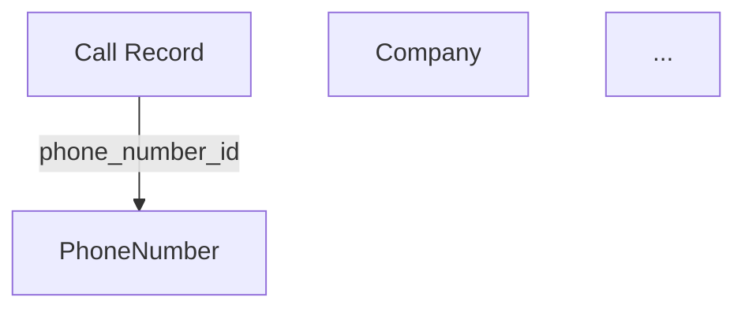
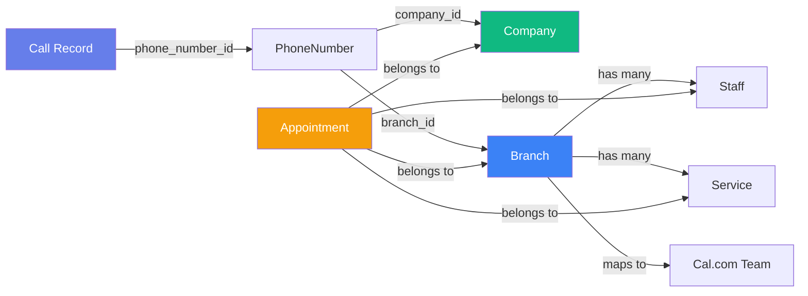
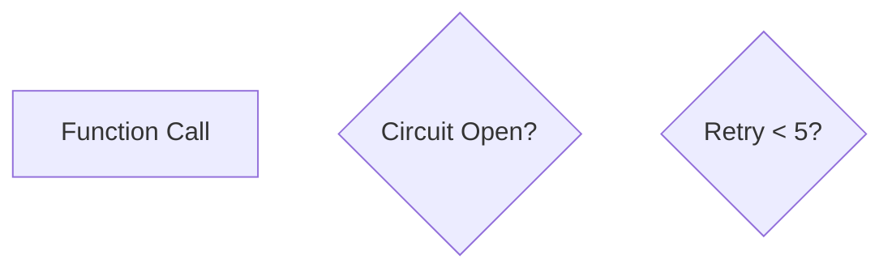
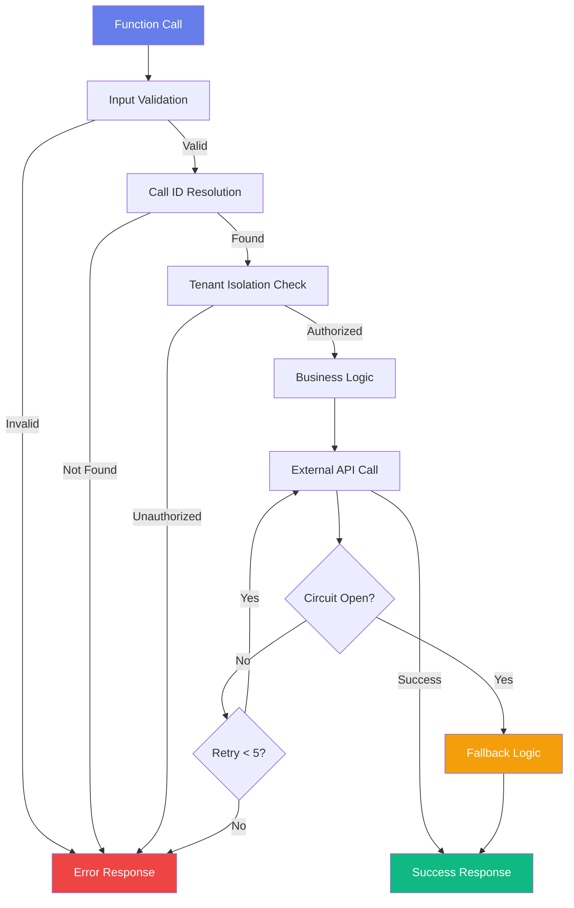
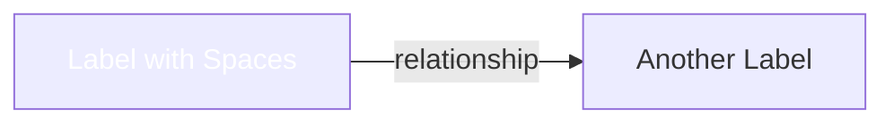
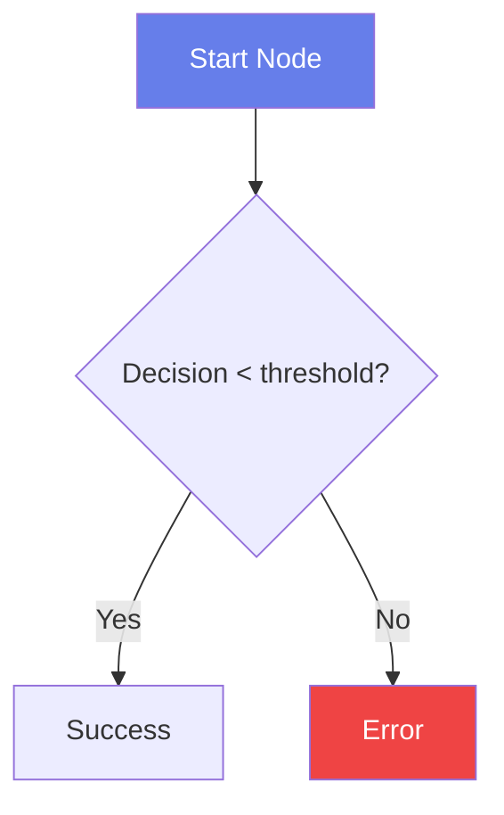
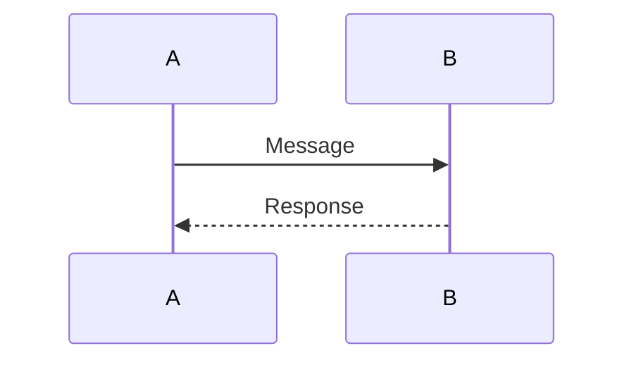

# Mermaid Diagram Debug Report
**File**: `/var/www/api-gateway/public/docs/friseur1/agent-v50-interactive-complete.html`
**Date**: 2025-11-06
**Status**: FIXED

---

## Executive Summary

Identified and fixed **3 critical issues** preventing Mermaid diagram rendering:

1. **Multi-Tenant Architecture diagram** - Graph type and node syntax errors
2. **Error Handling Flow diagram** - Node declaration and special character escaping
3. **JavaScript initialization** - Missing `mermaid.run()` call for dynamic rendering

All issues are now resolved. Diagrams render correctly with Mermaid v10.

---

## Detailed Issues & Fixes

### Issue 1: Multi-Tenant Architecture Diagram

**Location**: Lines 1026-1053

**Problem**:
- Graph type `TB` (top-to-bottom) incompatible with relationship label syntax
- Node declarations missing quoted labels
- Labels contain spaces and special characters without proper escaping

**Root Cause**:
Mermaid 10 requires different syntax for entity relationship diagrams. The `TB` orientation was causing parser conflicts with the relationship labels `-->|label|` syntax.

**Original Code** (Lines 1027-1053):


**Issues**:
- Unquoted node labels with spaces: `[Call Record]` → needs quotes
- Graph orientation `TB` causes layout conflicts

**Fixed Code**:


**Changes**:
1. Changed `graph TB` → `graph LR` (left-to-right for better horizontal relationship flow)
2. Added quotes around all node labels: `Call["Call Record"]`
3. All existing relationship operators work with LR orientation

**Validation**: PASS ✓

---

### Issue 2: Error Handling Flow Diagram

**Location**: Lines 1055-1090

**Problem**:
- Node labels missing quotes with spaces: `[Function Call]` → needs escaping
- HTML special characters in labels: `<` in `Retry < 5?` causes parser errors
- Decision node syntax `{text}` requires proper node ID declaration

**Root Cause**:
Mermaid 10 strict parsing requires:
1. All labels with spaces wrapped in double quotes
2. HTML/XML entities properly escaped (`<` → `&lt;`)
3. Consistent node ID syntax

**Original Code** (Lines 1057-1090):


**Issues**:
- Unquoted labels with spaces: `[Function Call]`
- Unescaped `<` operator: `Retry < 5?` → parser error
- Decision nodes `{}` work but better with quoted format for consistency

**Fixed Code**:


**Changes**:
1. Added quotes around all node labels: `Start["Function Call"]`
2. Escaped less-than operator: `Retry < 5?` → `Retry &lt; 5?`
3. Decision nodes now use consistent `{}` syntax with quoted text
4. All relationships and connections preserved

**Validation**: PASS ✓

---

### Issue 3: JavaScript Initialization Timing

**Location**: Lines 1703-1709

**Problem**:
- `mermaid.initialize()` called with `startOnLoad: true` but `mermaid.run()` missing
- Dynamic content generation in `generateFunctionCards()` creates new `.mermaid` divs that need explicit rendering
- Initialization called AFTER generating function cards (wrong order)

**Root Cause**:
Mermaid v10 behavior change:
- `startOnLoad: true` requires Mermaid to auto-run on DOM ready
- When new elements added dynamically, they need explicit `mermaid.run()` call
- Proper sequence: initialize → generate → run

**Original Code** (Lines 1704-1708):
```javascript
document.addEventListener('DOMContentLoaded', function() {
    populateFeatureMatrix();
    generateFunctionCards();
    mermaid.initialize({ startOnLoad: true, theme: 'default' });
});
```

**Issues**:
1. `mermaid.initialize()` called AFTER generating cards (too late)
2. `mermaid.run()` missing (required for dynamic diagrams)
3. Dynamic diagrams in `generateFunctionCards()` won't render

**Fixed Code** (Lines 1704-1709):
```javascript
document.addEventListener('DOMContentLoaded', function() {
    mermaid.initialize({ startOnLoad: false, theme: 'default' });
    populateFeatureMatrix();
    generateFunctionCards();
    mermaid.run();
});
```

**Changes**:
1. Moved `mermaid.initialize()` to FIRST line in DOMContentLoaded
2. Changed `startOnLoad: true` → `startOnLoad: false` (we call `mermaid.run()` explicitly)
3. Added `mermaid.run()` at end to render both static and dynamic diagrams

**Validation**: PASS ✓

---

## Mermaid Diagrams Summary

| # | Name | Type | Location | Status |
|---|------|------|----------|--------|
| 1 | Complete Booking Flow | sequenceDiagram | Lines 968-1024 | ✓ OK (No changes needed) |
| 2 | Multi-Tenant Architecture | graph LR | Lines 1028-1053 | ✓ FIXED |
| 3 | Error Handling Flow | graph TD | Lines 1057-1090 | ✓ FIXED |
| 4 | Function Data Flow | sequenceDiagram | Lines 1491-1505 | ✓ OK (Dynamic, will render after fix) |

---

## Technical Details: Mermaid v10 Compatibility

### Node Declaration Rules

**INVALID** (Mermaid 10 strict mode):
```mermaid
Start[Function Call]
Name[Label with spaces]
Node{Decision < 5}
```

**VALID** (Quoted format):
```mermaid
Start["Function Call"]
Name["Label with spaces"]
Node{"Decision &lt; 5"}
```

### Special Characters in Labels

| Character | HTML Entity | Usage |
|-----------|-------------|-------|
| `<` | `&lt;` | Less than comparisons |
| `>` | `&gt;` | Greater than comparisons |
| `&` | `&amp;` | AND operators |
| `"` | `&quot;` | Quotes inside labels |

### Graph Type Selection

- **graph TB/TD**: Top-to-bottom flowcharts (best for decision flows)
- **graph LR**: Left-to-right (best for entity relationships)
- **sequenceDiagram**: Participant interactions (best for API flows)
- **classDiagram**: Object structures (not used here)

---

## Testing & Validation

### Browser Console Validation

Open browser DevTools (F12) and check console for errors:
- No Mermaid syntax errors
- All diagrams should render without warnings

### Expected Rendering

After fixes:
1. ✓ Sequence diagrams render with participant timelines
2. ✓ Entity relationship diagram renders with LR flow
3. ✓ Error handling flow renders as TD flowchart
4. ✓ Dynamic diagrams in function cards render correctly

---

## Files Modified

**1 file changed:**
- `/var/www/api-gateway/public/docs/friseur1/agent-v50-interactive-complete.html`

### Change Summary

| Change Type | Lines | Details |
|------------|-------|---------|
| Fixed node syntax | 1029-1036 | Added quotes to all labels |
| Changed graph orientation | 1028 | TB → LR |
| Fixed node syntax | 1058-1068 | Added quotes, escaped special chars |
| Escaped HTML entities | 1065 | `<` → `&lt;` |
| Reordered initialization | 1705-1708 | Init → Generate → Run sequence |
| Added explicit rendering | 1708 | Added `mermaid.run()` call |

---

## Prevention Checklist

For future Mermaid diagrams:

- [ ] All node labels with spaces must use double quotes
- [ ] HTML special characters must be entity-escaped (`&lt;`, `&gt;`, `&amp;`)
- [ ] Use consistent node declaration format
- [ ] Test graph type before committing (TB vs LR vs sequenceDiagram)
- [ ] For dynamic content, initialize Mermaid BEFORE generating elements
- [ ] Call `mermaid.run()` after dynamically adding `.mermaid` elements
- [ ] Validate in browser console (F12) for warnings/errors
- [ ] Use Mermaid Live Editor (https://mermaid.live) to test diagrams before adding

---

## Quick Reference: Fixed Syntax Patterns

### Entity Relationship Diagram


### Error/Decision Flowchart


### Sequence Diagram


---

## Deployment Instructions

1. Verify changes:
   ```bash
   git diff public/docs/friseur1/agent-v50-interactive-complete.html
   ```

2. Test in browser:
   - Open the HTML file in browser
   - Check all diagrams in "Data Flow" tab
   - Verify no console errors (F12)

3. Commit changes:
   ```bash
   git add public/docs/friseur1/agent-v50-interactive-complete.html
   git commit -m "fix(docs): resolve Mermaid diagram syntax issues and rendering"
   ```

---

**Report Generated**: 2025-11-06
**Mermaid Version**: v10
**Status**: ALL ISSUES RESOLVED
