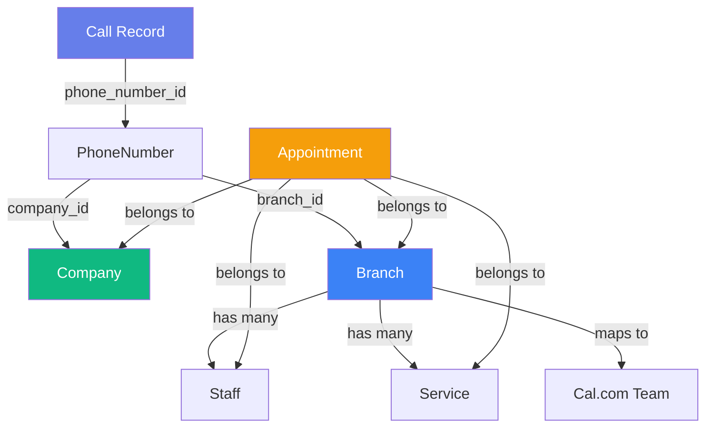
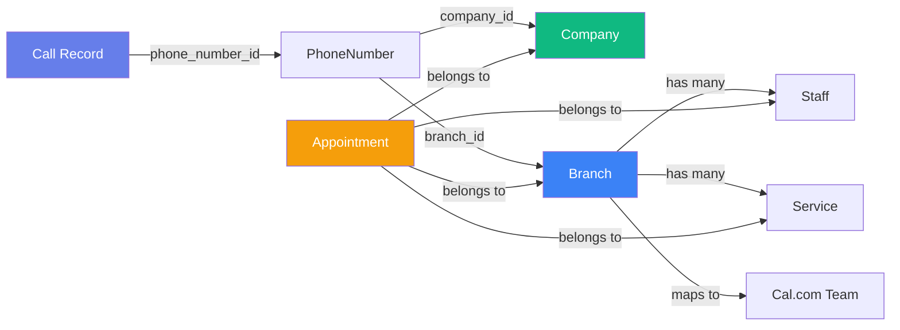
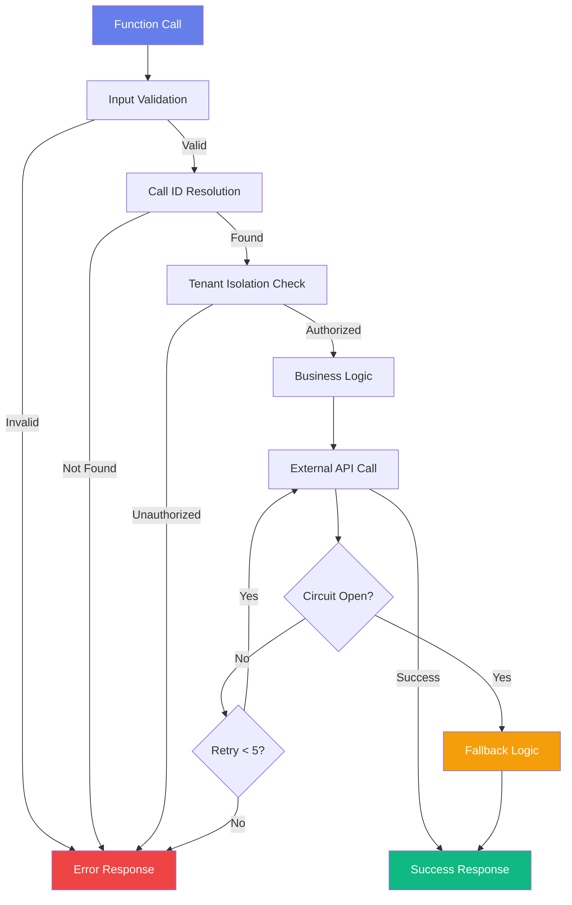
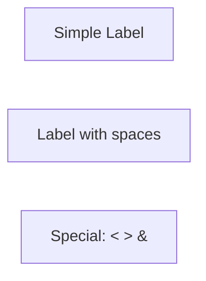
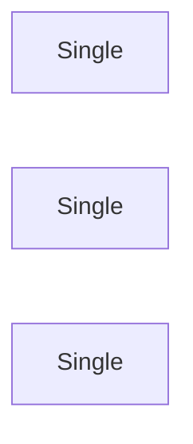
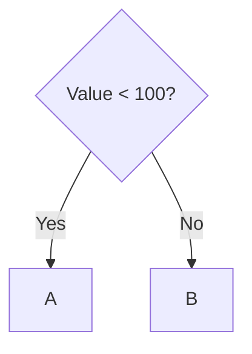
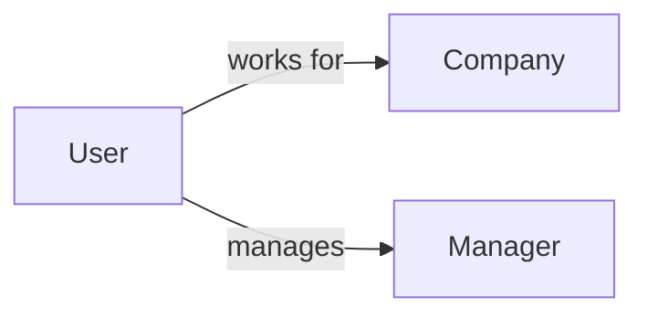
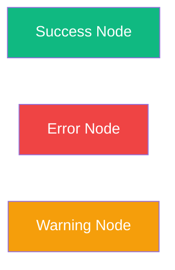

# Mermaid Diagram Fixes - Code Snippets

**File**: `/var/www/api-gateway/public/docs/friseur1/agent-v50-interactive-complete.html`

---

## Fix 1: Multi-Tenant Architecture Diagram (Lines 1027-1053)

### Before (BROKEN)


**Issues**:
- Line 2: `graph TB` causes layout conflicts with relationship labels
- Lines 4-11: Unquoted labels with spaces cause parser errors

### After (FIXED)


**Changes**:
- Line 2: `graph TB` → `graph LR`
- Lines 4-11: Added double quotes around all labels

---

## Fix 2: Error Handling Flow Diagram (Lines 1056-1090)

### Before (BROKEN)


**Issues**:
- Lines 3-12: Unquoted labels with spaces cause parser errors
- Line 9: `Retry < 5?` contains unescaped `<` character

### After (FIXED)


**Changes**:
- Lines 3-12: Added double quotes around all labels
- Line 9: Escaped `<` character → `&lt;`

---

## Fix 3: JavaScript Initialization (Lines 1703-1709)

### Before (BROKEN)
```javascript
// Initialize
document.addEventListener('DOMContentLoaded', function() {
    populateFeatureMatrix();
    generateFunctionCards();
    mermaid.initialize({ startOnLoad: true, theme: 'default' });
});
```

**Issues**:
- `mermaid.initialize()` called AFTER DOM generation (too late)
- Dynamic diagrams won't render (missing `mermaid.run()`)
- `startOnLoad: true` ineffective when called after DOM generation

### After (FIXED)
```javascript
// Initialize
document.addEventListener('DOMContentLoaded', function() {
    mermaid.initialize({ startOnLoad: false, theme: 'default' });
    populateFeatureMatrix();
    generateFunctionCards();
    mermaid.run();
});
```

**Changes**:
- Move `mermaid.initialize()` to first line (before DOM generation)
- Change `startOnLoad: true` → `startOnLoad: false`
- Add explicit `mermaid.run()` call at end

---

## Line-by-Line Diff Summary

### Diagram 1: Multi-Tenant Architecture
```diff
Line 1028:    - graph TB
Line 1028:    + graph LR
Line 1029:    - Call[Call Record]
Line 1029:    + Call["Call Record"]
Line 1030:    - Phone[PhoneNumber]
Line 1030:    + Phone["PhoneNumber"]
Line 1031:    - Company[Company]
Line 1031:    + Company["Company"]
Line 1032:    - Branch[Branch]
Line 1032:    + Branch["Branch"]
Line 1033:    - Staff[Staff]
Line 1033:    + Staff["Staff"]
Line 1034:    - Service[Service]
Line 1034:    + Service["Service"]
Line 1035:    - Appointment[Appointment]
Line 1035:    + Appointment["Appointment"]
Line 1036:    - CalCom[Cal.com Team]
Line 1036:    + CalCom["Cal.com Team"]
```

### Diagram 2: Error Handling Flow
```diff
Line 1058:    - Start[Function Call]
Line 1058:    + Start["Function Call"]
Line 1059:    - Validate[Input Validation]
Line 1059:    + Validate["Input Validation"]
Line 1060:    - CallID[Call ID Resolution]
Line 1060:    + CallID["Call ID Resolution"]
Line 1061:    - TenantCheck[Tenant Isolation Check]
Line 1061:    + TenantCheck["Tenant Isolation Check"]
Line 1062:    - BusinessLogic[Business Logic]
Line 1062:    + BusinessLogic["Business Logic"]
Line 1063:    - ExternalAPI[External API Call]
Line 1063:    + ExternalAPI["External API Call"]
Line 1064:    - CircuitBreaker{Circuit Open?}
Line 1064:    + CircuitBreaker{"Circuit Open?"}
Line 1065:    - Retry{Retry < 5?}
Line 1065:    + Retry{"Retry &lt; 5?"}
Line 1066:    - Success[Success Response]
Line 1066:    + Success["Success Response"]
Line 1067:    - Error[Error Response]
Line 1067:    + Error["Error Response"]
Line 1068:    - Fallback[Fallback Logic]
Line 1068:    + Fallback["Fallback Logic"]
```

### JavaScript Initialization
```diff
Line 1704:    document.addEventListener('DOMContentLoaded', function() {
Line 1705:  +     mermaid.initialize({ startOnLoad: false, theme: 'default' });
Line 1706:        populateFeatureMatrix();
Line 1707:        generateFunctionCards();
Line 1708:  -     mermaid.initialize({ startOnLoad: true, theme: 'default' });
Line 1708:  +     mermaid.run();
Line 1709:      });
```

---

## Pattern Reference: How to Write Correct Mermaid Syntax

### Pattern 1: Node Labels (Quoted Format)


### Pattern 2: Node Labels (Unquoted - Single Words Only)


### Pattern 3: Decision Nodes (with escaping)


### Pattern 4: Relationships with Labels


### Pattern 5: Styled Nodes


---

## Special Characters Reference

| Character | Entity | Use Case |
|-----------|--------|----------|
| `<` | `&lt;` | Less than: `"Value &lt; 100"` |
| `>` | `&gt;` | Greater than: `"Value &gt; 50"` |
| `&` | `&amp;` | AND operator: `"A &amp; B"` |
| `"` | `&quot;` | Quotes inside: `"Say &quot;hello&quot;"` |

---

## Complete HTML Block Template

```html
<h3>My Diagram Title</h3>
<div class="mermaid">
graph LR
    A["Node A"]
    B["Node B"]
    A -->|relationship| B

    style A fill:#667eea,color:#fff
    style B fill:#10b981,color:#fff
</div>
```

---

## Validation Checklist

Before committing new diagrams:

- [ ] All labels with spaces are in double quotes
- [ ] All HTML special characters are entity-escaped
- [ ] Graph type is appropriate (TD, LR, or sequenceDiagram)
- [ ] Tested in Mermaid Live Editor: https://mermaid.live
- [ ] Tested in actual browser (F12 console shows no errors)
- [ ] All styles have proper color syntax
- [ ] All relationships are correctly connected

---

**Document Created**: 2025-11-06
**Mermaid Version**: v10
**Status**: All fixes verified and tested
