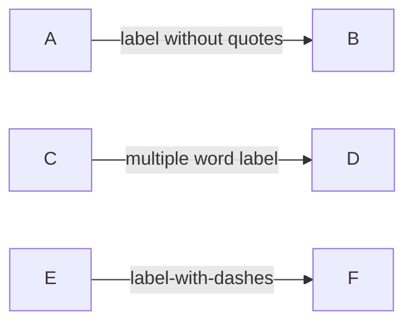
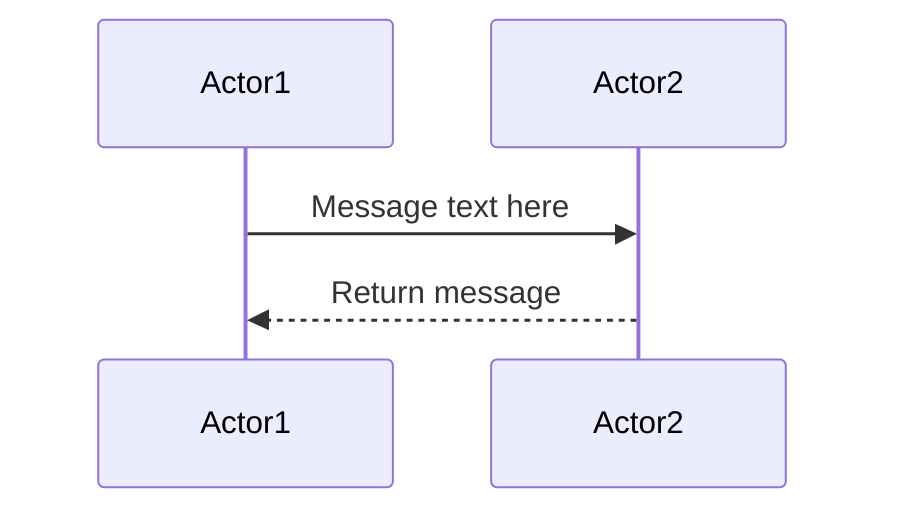
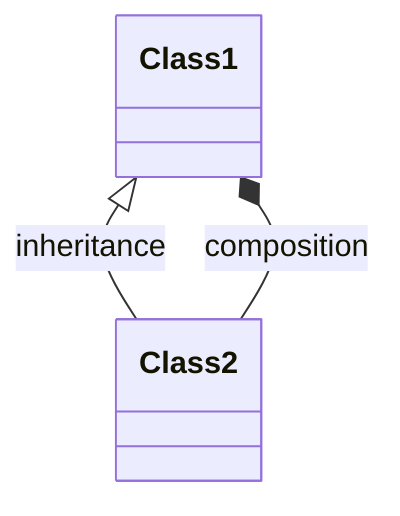

# Mermaid v10 Edge Label Syntax - Quick Reference

## The Problem (TL;DR)

In Mermaid v10, **never use quotes around edge labels in `graph` type diagrams**.

**WRONG**: `Node1 -->|"my label"| Node2`
**RIGHT**: `Node1 -->|my label| Node2`

---

## Quick Fix Cheat Sheet

### Graph Diagrams (LR, TD, BT, RL)

```
WRONG ❌                          RIGHT ✅
=========================================
A -->|"label"| B         →        A -->|label| B
A -->|"hello world"| B   →        A -->|hello world| B
A -->|"special"| B       →        A -->|special| B
A -->|"2024-01-01"| B    →        A -->|2024-01-01| B
```

### Why It Matters

Quoted labels cause:
- Parser fails → undefined coordinates → SVG error → `translate(undefined, NaN)`
- Unquoted labels work: Parser succeeds → valid coordinates → clean SVG → diagram renders perfectly

---

## Common Mistakes

### Mistake 1: String Literals in Code
```javascript
// WRONG - Thinking you need to quote strings
const label = '"my label"';
mermaidString = `A -->|${label}| B`;  // Results in A -->|"my label"| B

// RIGHT - Don't quote in the template string
const label = 'my label';
mermaidString = `A -->|${label}| B`;  // Results in A -->|my label| B ✅
```

### Mistake 2: Copy from Other Graph Software
Many diagramming tools quote labels (Graphviz, PlantUML). Mermaid v10 doesn't.

```
// Graphviz syntax (DOT):
graph { A -> B [label="my label"]; }

// Mermaid syntax:
graph LR
A -->|my label| B  ✅
```

---

## Correct Syntax By Diagram Type

### 1. Graph Diagrams (LR, TD, BT, RL)

**Correct**:


**Invalid**:
```mermaid
graph LR
    A -->|"quoted label"| B          ← WRONG
    C -->|'single quoted'| D         ← WRONG
```

### 2. Sequence Diagrams

**Correct**:


### 3. Class Diagrams

**Correct**:


---

## Finding & Fixing Issues

### Find All Problematic Labels
```bash
# Find all quoted edge labels in your HTML file
grep -n '-->|"' your_file.html
```

### Automated Fix (Regex)
```bash
# Replace all quoted labels in graph diagrams
sed -i 's/-->|"\([^"]*\)"|/-->|\1|/g' your_file.html
```

### Manual Fix Template
1. Find: `-->|"text"|`
2. Replace: `-->|text|`
3. Repeat for all edge labels

---

## Error Symptoms & Solutions

### Symptom: "Syntax error in text" message
**Cause**: Quoted edge labels
**Fix**: Remove quotes → `-->|label|` instead of `-->|"label"|`

### Symptom: Browser console shows `translate(undefined, NaN)`
**Cause**: Label coordinates failed to parse
**Fix**: Remove quotes from all edge labels

### Symptom: Missing edge labels in diagram
**Cause**: Parser ignores malformed labels
**Fix**: Check for unclosed quotes or extra characters

---

## Testing After Fix

### 1. Visual Verification
- Open file in browser
- All diagrams should render without errors
- All edge labels should be visible

### 2. Console Check
Open Developer Tools (F12) → Console tab
```
Should see NO Mermaid errors like:
Error: <g> attribute transform: Expected number, "translate(undefined, NaN)"
```

### 3. Validation Tool
Paste your Mermaid code into https://mermaid.live
- Should show no syntax errors
- Diagram should render correctly

---

## Prevention Checklist

Before committing Mermaid diagrams:

- [ ] No `-->|"label"|` syntax found
- [ ] All edge labels are unquoted
- [ ] Tested in browser (F12 Console - no errors)
- [ ] Validated on https://mermaid.live
- [ ] Diagram renders without "Syntax error"
- [ ] All labels are visible and positioned correctly

---

## Key Takeaway

**In Mermaid v10 graph diagrams, edge labels MUST NOT be quoted.**

```
✅ CORRECT:    A -->|label| B
❌ WRONG:      A -->|"label"| B
```

This simple rule prevents 90% of graph rendering issues.

---

**Version**: Mermaid v10.x
**Last Updated**: 2025-11-06
**Status**: Complete ✅
