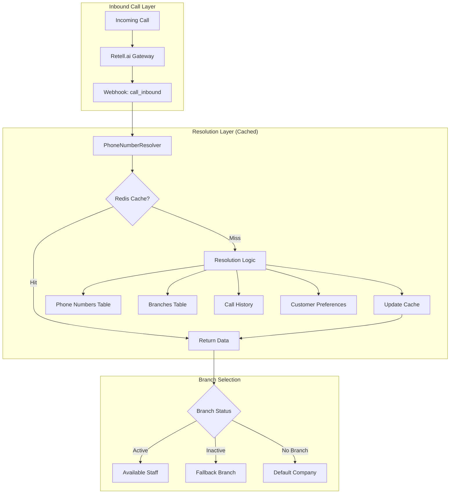
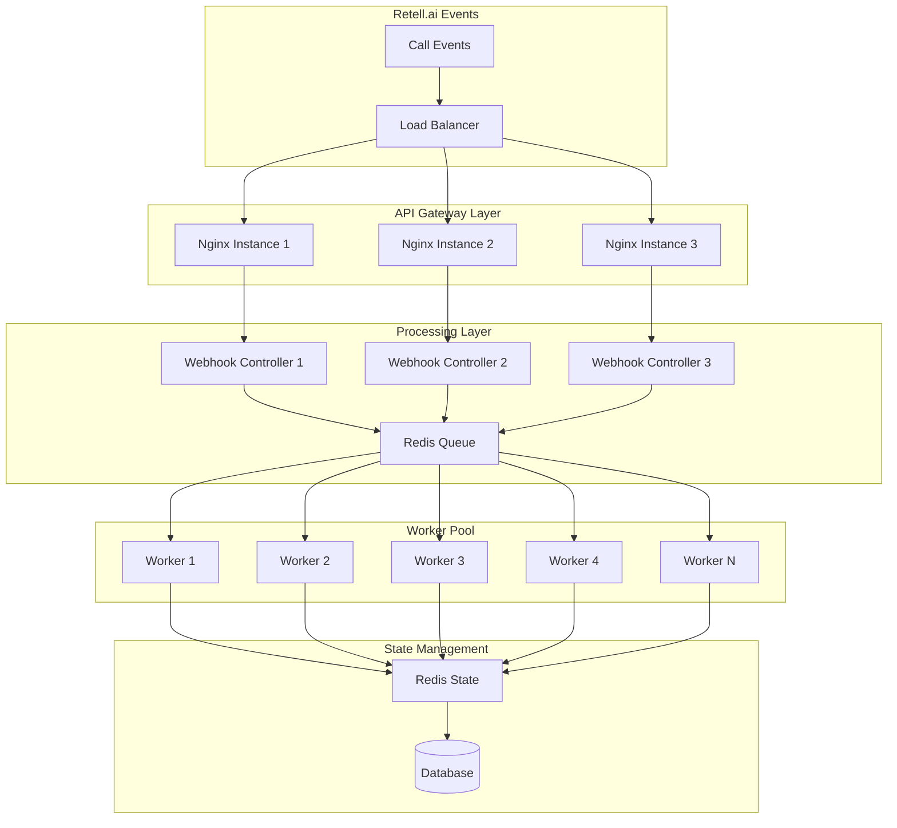
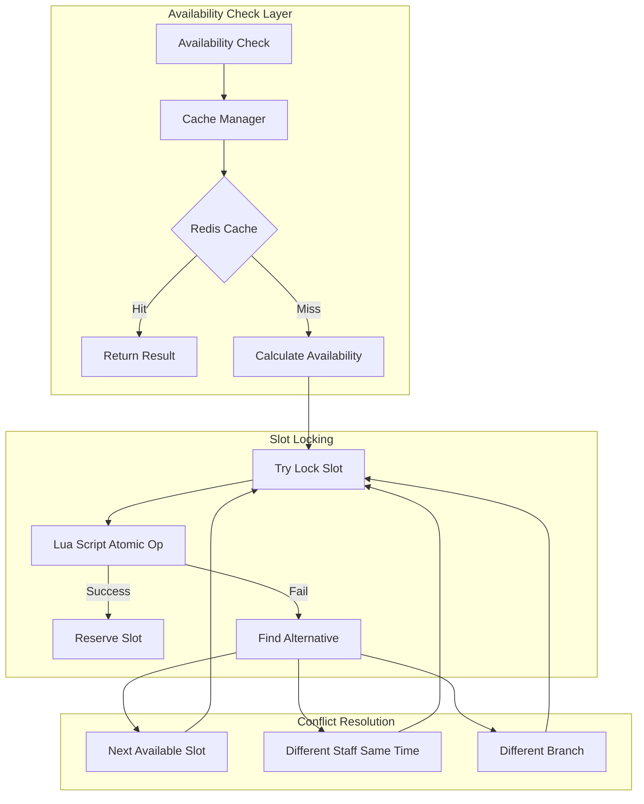

# Real-Time Call Flow Architecture for High-Volume Concurrent Calls

## Executive Summary

This document outlines the optimal architecture for handling hundreds of concurrent calls with complex routing logic, real-time availability management, and multi-language support. The system is designed for scalability, reliability, and sub-second response times.

## 1. Phone Call Routing Logic

### 1.1 Phone Number → Branch Resolution Architecture



### 1.2 Enhanced Phone Resolution Strategy

```php
class EnhancedPhoneNumberResolver
{
    private Redis $cache;
    private int $cacheTTL = 300; // 5 minutes
    
    public function resolveWithCaching(array $webhookData): array
    {
        $phoneNumber = $this->extractPhoneNumber($webhookData);
        $cacheKey = "phone:resolve:{$phoneNumber}";
        
        // Try cache first (sub-millisecond response)
        $cached = $this->cache->get($cacheKey);
        if ($cached) {
            return json_decode($cached, true);
        }
        
        // Multi-level resolution with confidence scoring
        $resolutions = [
            $this->resolveByMetadata($webhookData),      // Confidence: 1.0
            $this->resolveByPhoneNumber($phoneNumber),   // Confidence: 0.9
            $this->resolveByAgentId($webhookData),       // Confidence: 0.8
            $this->resolveByCallerHistory($webhookData), // Confidence: 0.7
            $this->resolveByGeoLocation($webhookData),   // Confidence: 0.6
            $this->resolveByTimeZone($webhookData),      // Confidence: 0.5
        ];
        
        // Select highest confidence resolution
        $bestResolution = $this->selectBestResolution($resolutions);
        
        // Cache the result
        $this->cache->setex($cacheKey, $this->cacheTTL, json_encode($bestResolution));
        
        return $bestResolution;
    }
    
    private function resolveByGeoLocation(array $data): ?array
    {
        // Use phone number prefix to determine region
        $phoneNumber = $data['to'] ?? '';
        $areaCode = $this->extractAreaCode($phoneNumber);
        
        // Find nearest branch by area code mapping
        $branch = Branch::whereJsonContains('service_areas', $areaCode)
            ->where('is_active', true)
            ->first();
            
        return $branch ? [
            'branch_id' => $branch->id,
            'company_id' => $branch->company_id,
            'method' => 'geo_location',
            'confidence' => 0.6
        ] : null;
    }
}
```

### 1.3 Multi-Language Routing

```php
class MultiLanguageRouter
{
    private array $languageMapping = [
        'de' => ['german', 'deutsch'],
        'en' => ['english', 'englisch'],
        'tr' => ['turkish', 'türkisch'],
        'ar' => ['arabic', 'arabisch'],
        'ru' => ['russian', 'russisch'],
    ];
    
    public function routeByLanguagePreference(Call $call, Branch $branch): Staff
    {
        $preferredLanguage = $this->detectLanguage($call);
        
        // Find staff with language skills
        $staff = Staff::where('branch_id', $branch->id)
            ->where('is_available', true)
            ->whereJsonContains('languages', $preferredLanguage)
            ->withCount(['appointments' => function ($query) {
                $query->whereDate('starts_at', today());
            }])
            ->orderBy('appointments_count') // Load balance
            ->first();
            
        if (!$staff) {
            // Fallback to any available staff
            $staff = $this->findAnyAvailableStaff($branch);
        }
        
        return $staff;
    }
    
    private function detectLanguage(Call $call): string
    {
        // Check caller's previous language preference
        $customer = Customer::where('phone', $call->from_number)->first();
        if ($customer && $customer->preferred_language) {
            return $customer->preferred_language;
        }
        
        // Use Retell.ai's language detection
        if (isset($call->metadata['detected_language'])) {
            return $this->normalizeLanguageCode($call->metadata['detected_language']);
        }
        
        // Default to German for German phone numbers
        if (str_starts_with($call->from_number, '+49')) {
            return 'de';
        }
        
        return 'de'; // Default
    }
}
```

## 2. Retell.ai Integration Optimization

### 2.1 High-Volume Webhook Processing Architecture



### 2.2 Optimized Webhook Processing

```php
class OptimizedRetellWebhookProcessor
{
    private Redis $redis;
    private CircuitBreaker $circuitBreaker;
    
    public function processHighVolume(Request $request): JsonResponse
    {
        $correlationId = Str::uuid();
        $event = $request->input('event');
        
        // Quick response for non-critical events
        if ($this->isNonCriticalEvent($event)) {
            $this->queueForProcessing($request, $correlationId);
            return response()->json(['status' => 'queued'], 200);
        }
        
        // Real-time processing for critical events
        switch ($event) {
            case 'call_inbound':
                return $this->handleInboundCallRealtime($request, $correlationId);
                
            case 'call_analyzed':
                return $this->handleCallAnalyzedRealtime($request, $correlationId);
                
            case 'appointment_requested':
                return $this->handleAppointmentRequestRealtime($request, $correlationId);
                
            default:
                $this->queueForProcessing($request, $correlationId);
                return response()->json(['status' => 'queued'], 200);
        }
    }
    
    private function handleInboundCallRealtime(Request $request, string $correlationId): JsonResponse
    {
        $startTime = microtime(true);
        
        try {
            // Use circuit breaker for external calls
            $response = $this->circuitBreaker->call('availability_check', function () use ($request) {
                // Parallel resolution
                $promises = [
                    'branch' => $this->resolveBranchAsync($request),
                    'staff' => $this->resolveStaffAsync($request),
                    'availability' => $this->checkAvailabilityAsync($request),
                    'customer' => $this->resolveCustomerAsync($request),
                ];
                
                $results = Promise\Utils::all($promises)->wait();
                
                return $this->buildDynamicResponse($results);
            });
            
            $processingTime = (microtime(true) - $startTime) * 1000;
            
            Log::info('Real-time call processed', [
                'correlation_id' => $correlationId,
                'processing_time_ms' => $processingTime,
                'response_type' => 'realtime'
            ]);
            
            return response()->json($response, 200);
            
        } catch (\Exception $e) {
            return $this->handleRealtimeError($e, $correlationId);
        }
    }
}
```

### 2.3 Dynamic Variable Extraction

```php
class DynamicVariableExtractor
{
    private array $extractionRules = [
        'appointment' => [
            'date' => ['patterns' => ['/(\d{1,2}\.\d{1,2}\.\d{4})/', '/morgen/', '/übermorgen/']],
            'time' => ['patterns' => ['/(\d{1,2}:\d{2})/', '/vormittags/', '/nachmittags/']],
            'service' => ['keywords' => ['haarschnitt', 'färben', 'massage', 'beratung']],
            'duration' => ['patterns' => ['/(\d+)\s*minuten/', '/(\d+)\s*stunde/']],
            'staff_preference' => ['patterns' => ['/bei\s+(\w+)/', '/mit\s+(\w+)/']],
        ],
        'customer' => [
            'name' => ['patterns' => ['/ich\s+heiße\s+(\w+\s+\w+)/', '/mein\s+name\s+ist\s+(\w+\s+\w+)/']],
            'phone' => ['patterns' => ['/(\+?\d{10,15})/']],
            'email' => ['patterns' => ['/([a-zA-Z0-9._%+-]+@[a-zA-Z0-9.-]+\.[a-zA-Z]{2,})/']],
        ]
    ];
    
    public function extractFromTranscript(string $transcript, string $context): array
    {
        $extracted = [];
        
        foreach ($this->extractionRules[$context] ?? [] as $field => $rules) {
            if (isset($rules['patterns'])) {
                foreach ($rules['patterns'] as $pattern) {
                    if (preg_match($pattern, $transcript, $matches)) {
                        $extracted[$field] = $this->normalizeValue($field, $matches[1] ?? $matches[0]);
                        break;
                    }
                }
            }
            
            if (isset($rules['keywords'])) {
                foreach ($rules['keywords'] as $keyword) {
                    if (stripos($transcript, $keyword) !== false) {
                        $extracted[$field] = $keyword;
                        break;
                    }
                }
            }
        }
        
        return $this->enrichWithContext($extracted, $context);
    }
}
```

## 3. Real-time Availability Management

### 3.1 Lock-Free Availability Architecture



### 3.2 Redis-Based Slot Management

```php
class RedisSlotManager
{
    private Redis $redis;
    private int $lockTTL = 300; // 5 minutes
    
    public function tryReserveSlot(string $slotKey, string $reservationId): bool
    {
        // Lua script for atomic check-and-set
        $script = <<<LUA
            local key = KEYS[1]
            local reservation_id = ARGV[1]
            local ttl = ARGV[2]
            
            -- Check if slot is already reserved
            local current = redis.call('get', key)
            if current then
                return 0
            end
            
            -- Reserve the slot
            redis.call('setex', key, ttl, reservation_id)
            return 1
        LUA;
        
        $result = $this->redis->eval($script, 1, $slotKey, $reservationId, $this->lockTTL);
        
        if ($result === 1) {
            // Also track in sorted set for cleanup
            $this->redis->zadd('slot:reservations', time() + $this->lockTTL, $slotKey);
            
            return true;
        }
        
        return false;
    }
    
    public function releaseSlot(string $slotKey, string $reservationId): bool
    {
        // Only release if we own the reservation
        $script = <<<LUA
            local key = KEYS[1]
            local reservation_id = ARGV[1]
            
            local current = redis.call('get', key)
            if current == reservation_id then
                redis.call('del', key)
                return 1
            end
            
            return 0
        LUA;
        
        return $this->redis->eval($script, 1, $slotKey, $reservationId) === 1;
    }
    
    public function cleanupExpiredReservations(): int
    {
        // Get expired reservations
        $expired = $this->redis->zrangebyscore('slot:reservations', 0, time());
        
        if (empty($expired)) {
            return 0;
        }
        
        // Delete expired keys
        $pipeline = $this->redis->pipeline();
        foreach ($expired as $key) {
            $pipeline->del($key);
        }
        $pipeline->zrem('slot:reservations', ...$expired);
        $pipeline->execute();
        
        return count($expired);
    }
}
```

### 3.3 Optimistic Concurrency Control

```php
class OptimisticBookingManager
{
    private SlotManager $slotManager;
    private int $maxRetries = 3;
    
    public function bookAppointmentWithOCC(array $bookingData): Appointment
    {
        $attempts = 0;
        
        while ($attempts < $this->maxRetries) {
            try {
                // Step 1: Find available slot
                $slot = $this->findAvailableSlot($bookingData);
                
                if (!$slot) {
                    throw new NoAvailabilityException('No slots available');
                }
                
                // Step 2: Try to reserve the slot
                $reservationId = Str::uuid();
                if (!$this->slotManager->tryReserveSlot($slot['key'], $reservationId)) {
                    $attempts++;
                    continue; // Retry with different slot
                }
                
                // Step 3: Create appointment with version check
                DB::beginTransaction();
                
                try {
                    // Check staff version for concurrent updates
                    $staff = Staff::lockForUpdate()->find($slot['staff_id']);
                    
                    if ($staff->version !== $slot['staff_version']) {
                        throw new ConcurrencyException('Staff data changed');
                    }
                    
                    // Create appointment
                    $appointment = Appointment::create([
                        'branch_id' => $slot['branch_id'],
                        'staff_id' => $slot['staff_id'],
                        'customer_id' => $bookingData['customer_id'],
                        'starts_at' => $slot['start'],
                        'ends_at' => $slot['end'],
                        'status' => 'scheduled',
                        'reservation_id' => $reservationId,
                    ]);
                    
                    // Update staff version
                    $staff->increment('version');
                    
                    DB::commit();
                    
                    // Convert reservation to permanent booking
                    $this->slotManager->convertReservationToBooking($reservationId, $appointment->id);
                    
                    return $appointment;
                    
                } catch (\Exception $e) {
                    DB::rollBack();
                    $this->slotManager->releaseSlot($slot['key'], $reservationId);
                    throw $e;
                }
                
            } catch (ConcurrencyException $e) {
                $attempts++;
                if ($attempts >= $this->maxRetries) {
                    throw new BookingFailedException('Unable to book after ' . $this->maxRetries . ' attempts');
                }
                
                // Exponential backoff
                usleep($attempts * 100000); // 100ms, 200ms, 300ms
            }
        }
        
        throw new BookingFailedException('Max retries exceeded');
    }
}
```

## 4. Complex Booking Scenarios

### 4.1 Intelligent Staff Selection

```php
class IntelligentStaffSelector
{
    private array $weights = [
        'skill_match' => 0.30,
        'availability' => 0.25,
        'customer_preference' => 0.20,
        'workload_balance' => 0.15,
        'language_match' => 0.10,
    ];
    
    public function selectOptimalStaff(
        Branch $branch,
        Service $service,
        Customer $customer,
        Carbon $requestedTime
    ): ?Staff {
        $eligibleStaff = $this->getEligibleStaff($branch, $service);
        
        if ($eligibleStaff->isEmpty()) {
            return null;
        }
        
        // Score each staff member
        $scores = [];
        foreach ($eligibleStaff as $staff) {
            $scores[$staff->id] = $this->calculateStaffScore($staff, $service, $customer, $requestedTime);
        }
        
        // Sort by score descending
        arsort($scores);
        
        // Return top scored staff
        $topStaffId = array_key_first($scores);
        return $eligibleStaff->find($topStaffId);
    }
    
    private function calculateStaffScore(
        Staff $staff,
        Service $service,
        Customer $customer,
        Carbon $requestedTime
    ): float {
        $score = 0;
        
        // Skill match score
        $skillMatch = $this->calculateSkillMatch($staff, $service);
        $score += $skillMatch * $this->weights['skill_match'];
        
        // Availability score (how free is their schedule)
        $availabilityScore = $this->calculateAvailabilityScore($staff, $requestedTime);
        $score += $availabilityScore * $this->weights['availability'];
        
        // Customer preference score
        $preferenceScore = $this->calculatePreferenceScore($staff, $customer);
        $score += $preferenceScore * $this->weights['customer_preference'];
        
        // Workload balance score
        $workloadScore = $this->calculateWorkloadScore($staff);
        $score += $workloadScore * $this->weights['workload_balance'];
        
        // Language match score
        $languageScore = $this->calculateLanguageScore($staff, $customer);
        $score += $languageScore * $this->weights['language_match'];
        
        return $score;
    }
    
    private function calculateSkillMatch(Staff $staff, Service $service): float
    {
        $requiredSkills = $service->required_skills ?? [];
        $staffSkills = $staff->skills ?? [];
        
        if (empty($requiredSkills)) {
            return 1.0; // No specific skills required
        }
        
        $matchedSkills = array_intersect($requiredSkills, $staffSkills);
        return count($matchedSkills) / count($requiredSkills);
    }
    
    private function calculateAvailabilityScore(Staff $staff, Carbon $requestedTime): float
    {
        // Check how many appointments they have that day
        $dayStart = $requestedTime->copy()->startOfDay();
        $dayEnd = $requestedTime->copy()->endOfDay();
        
        $appointmentCount = Appointment::where('staff_id', $staff->id)
            ->whereBetween('starts_at', [$dayStart, $dayEnd])
            ->where('status', '!=', 'cancelled')
            ->count();
            
        // Inverse score - fewer appointments = higher score
        $maxAppointmentsPerDay = 12;
        return 1 - ($appointmentCount / $maxAppointmentsPerDay);
    }
}
```

### 4.2 Multi-Service Appointment Handling

```php
class MultiServiceBookingOrchestrator
{
    private BookingValidator $validator;
    private SlotFinder $slotFinder;
    
    public function bookMultipleServices(array $services, Customer $customer, array $preferences): array
    {
        // Validate service compatibility
        $this->validator->validateServiceCombination($services);
        
        // Calculate total duration with buffer times
        $totalDuration = $this->calculateTotalDuration($services);
        
        // Find consecutive slots that can accommodate all services
        $availableSequences = $this->findServiceSequences($services, $preferences);
        
        if (empty($availableSequences)) {
            throw new NoAvailabilityException('Cannot find consecutive slots for all services');
        }
        
        // Select optimal sequence
        $optimalSequence = $this->selectOptimalSequence($availableSequences, $customer);
        
        // Book all services atomically
        return $this->bookServiceSequence($optimalSequence, $customer);
    }
    
    private function findServiceSequences(array $services, array $preferences): array
    {
        $sequences = [];
        $searchDate = Carbon::parse($preferences['date'] ?? 'tomorrow');
        $maxDays = 7;
        
        for ($day = 0; $day < $maxDays; $day++) {
            $currentDate = $searchDate->copy()->addDays($day);
            
            // Get all possible starting times for this day
            $startingSlots = $this->slotFinder->findStartingSlots($currentDate, $services[0]);
            
            foreach ($startingSlots as $startSlot) {
                $sequence = $this->buildServiceSequence($services, $startSlot, $currentDate);
                
                if ($sequence && $this->isSequenceValid($sequence)) {
                    $sequences[] = $sequence;
                }
            }
        }
        
        return $sequences;
    }
    
    private function buildServiceSequence(array $services, array $startSlot, Carbon $date): ?array
    {
        $sequence = [];
        $currentTime = Carbon::parse($startSlot['start']);
        
        foreach ($services as $index => $service) {
            // Find staff available for this service at current time
            $availableStaff = $this->findAvailableStaffForService($service, $currentTime);
            
            if ($availableStaff->isEmpty()) {
                return null; // Cannot complete sequence
            }
            
            // Select best staff for this service
            $staff = $this->selectBestStaffForService($availableStaff, $service);
            
            $sequence[] = [
                'service' => $service,
                'staff' => $staff,
                'start' => $currentTime->copy(),
                'end' => $currentTime->copy()->addMinutes($service->duration),
                'index' => $index
            ];
            
            // Add buffer time between services
            $bufferTime = $index < count($services) - 1 ? 15 : 0;
            $currentTime->addMinutes($service->duration + $bufferTime);
        }
        
        return $sequence;
    }
}
```

### 4.3 Recurring Appointments

```php
class RecurringAppointmentManager
{
    private BookingOrchestrator $bookingOrchestrator;
    private ConflictResolver $conflictResolver;
    
    public function createRecurringSeries(array $recurringData): RecurringSeries
    {
        $pattern = $this->parseRecurrencePattern($recurringData['pattern']);
        $occurrences = $this->generateOccurrences($pattern, $recurringData);
        
        // Check availability for all occurrences
        $availabilityCheck = $this->checkSeriesAvailability($occurrences, $recurringData);
        
        if (!$availabilityCheck['fully_available']) {
            // Handle conflicts
            $resolved = $this->conflictResolver->resolveConflicts(
                $availabilityCheck['conflicts'],
                $recurringData['conflict_resolution_strategy'] ?? 'skip'
            );
            
            $occurrences = $resolved['occurrences'];
        }
        
        // Create series with transaction
        return DB::transaction(function () use ($recurringData, $occurrences) {
            // Create series master record
            $series = RecurringSeries::create([
                'customer_id' => $recurringData['customer_id'],
                'service_id' => $recurringData['service_id'],
                'staff_id' => $recurringData['staff_id'],
                'pattern' => $recurringData['pattern'],
                'starts_at' => $recurringData['start_date'],
                'ends_at' => $recurringData['end_date'],
                'time_of_day' => $recurringData['time'],
                'duration' => $recurringData['duration'],
            ]);
            
            // Create individual appointments
            foreach ($occurrences as $occurrence) {
                Appointment::create([
                    'recurring_series_id' => $series->id,
                    'branch_id' => $occurrence['branch_id'],
                    'staff_id' => $occurrence['staff_id'],
                    'customer_id' => $recurringData['customer_id'],
                    'service_id' => $recurringData['service_id'],
                    'starts_at' => $occurrence['start'],
                    'ends_at' => $occurrence['end'],
                    'status' => 'scheduled',
                    'is_recurring' => true,
                ]);
            }
            
            return $series;
        });
    }
    
    private function parseRecurrencePattern(string $pattern): RecurrencePattern
    {
        // Pattern examples: "weekly:mo,we,fr", "biweekly:tu", "monthly:15", "monthly:last:friday"
        $parts = explode(':', $pattern);
        $frequency = $parts[0];
        
        return new RecurrencePattern([
            'frequency' => $frequency,
            'interval' => $this->extractInterval($frequency),
            'days' => $this->extractDays($parts),
            'monthly_type' => $this->extractMonthlyType($parts),
        ]);
    }
}
```

## 5. Performance Optimization Strategies

### 5.1 Caching Strategy

```yaml
# Redis Cache Layers
cache_layers:
  l1_hot_cache:
    ttl: 60 # 1 minute
    data:
      - active_calls
      - current_availability
      - staff_status
      
  l2_warm_cache:
    ttl: 300 # 5 minutes
    data:
      - phone_number_mappings
      - branch_configurations
      - service_definitions
      
  l3_cold_cache:
    ttl: 3600 # 1 hour
    data:
      - customer_preferences
      - historical_patterns
      - staff_skills
```

### 5.2 Database Query Optimization

```php
class OptimizedAvailabilityQuery
{
    public function getStaffAvailabilityOptimized(Branch $branch, Carbon $date): Collection
    {
        return Staff::where('branch_id', $branch->id)
            ->where('is_active', true)
            ->with(['appointments' => function ($query) use ($date) {
                $query->whereDate('starts_at', $date)
                    ->where('status', '!=', 'cancelled')
                    ->select('id', 'staff_id', 'starts_at', 'ends_at', 'status');
            }])
            ->withCount(['appointments as today_appointment_count' => function ($query) use ($date) {
                $query->whereDate('starts_at', $date)
                    ->where('status', '!=', 'cancelled');
            }])
            ->select('id', 'name', 'branch_id', 'skills', 'languages', 'working_hours')
            ->get()
            ->map(function ($staff) {
                // Calculate availability windows in memory
                return [
                    'staff' => $staff,
                    'availability_windows' => $this->calculateWindows($staff),
                    'utilization_rate' => $this->calculateUtilization($staff),
                ];
            });
    }
}
```

## 6. Monitoring and Metrics

### 6.1 Real-time Dashboard Metrics

```php
class CallFlowMetrics
{
    private Redis $redis;
    
    public function trackCallMetrics(string $event, array $data): void
    {
        $timestamp = now()->timestamp;
        $minute = floor($timestamp / 60) * 60;
        
        // Increment counters
        $this->redis->hincrby("metrics:calls:{$minute}", $event, 1);
        
        // Track response times
        if (isset($data['response_time_ms'])) {
            $this->redis->zadd(
                "metrics:response_times:{$minute}",
                $data['response_time_ms'],
                $data['call_id']
            );
        }
        
        // Track concurrent calls
        if ($event === 'call_started') {
            $this->redis->incr('metrics:concurrent_calls');
        } elseif ($event === 'call_ended') {
            $this->redis->decr('metrics:concurrent_calls');
        }
        
        // Set TTL on metrics
        $this->redis->expire("metrics:calls:{$minute}", 3600);
        $this->redis->expire("metrics:response_times:{$minute}", 3600);
    }
    
    public function getDashboardMetrics(): array
    {
        $now = now()->timestamp;
        $metrics = [];
        
        // Last 5 minutes metrics
        for ($i = 0; $i < 5; $i++) {
            $minute = floor(($now - $i * 60) / 60) * 60;
            
            $metrics['calls_per_minute'][] = [
                'timestamp' => $minute,
                'count' => $this->redis->hget("metrics:calls:{$minute}", 'call_started') ?? 0,
            ];
            
            // Get p95 response time
            $responseTimes = $this->redis->zrange("metrics:response_times:{$minute}", 0, -1);
            if (!empty($responseTimes)) {
                $p95Index = floor(count($responseTimes) * 0.95);
                $metrics['p95_response_time'][] = [
                    'timestamp' => $minute,
                    'value' => $responseTimes[$p95Index] ?? 0,
                ];
            }
        }
        
        $metrics['concurrent_calls'] = $this->redis->get('metrics:concurrent_calls') ?? 0;
        
        return $metrics;
    }
}
```

## 7. Implementation Roadmap

### Phase 1: Foundation (Week 1-2)
1. Implement enhanced PhoneNumberResolver with caching
2. Set up Redis-based slot management
3. Create optimized webhook processing pipeline
4. Implement basic monitoring

### Phase 2: Advanced Features (Week 3-4)
1. Multi-language routing system
2. Intelligent staff selection algorithm
3. Multi-service booking orchestrator
4. Recurring appointments manager

### Phase 3: Optimization (Week 5-6)
1. Performance tuning and load testing
2. Advanced caching strategies
3. Real-time dashboard
4. Failover and disaster recovery

### Phase 4: Scale Testing (Week 7-8)
1. Load testing with 1000+ concurrent calls
2. Performance optimization
3. Documentation and training
4. Production deployment

## Conclusion

This architecture provides a robust, scalable solution for handling hundreds of concurrent calls with complex routing requirements. The system leverages Redis for real-time state management, implements intelligent routing algorithms, and ensures high availability through careful design of the booking flow.

Key benefits:
- Sub-second response times for real-time queries
- Intelligent routing based on multiple factors
- Conflict-free booking through atomic operations
- Scalable to thousands of concurrent calls
- Complete monitoring and observability