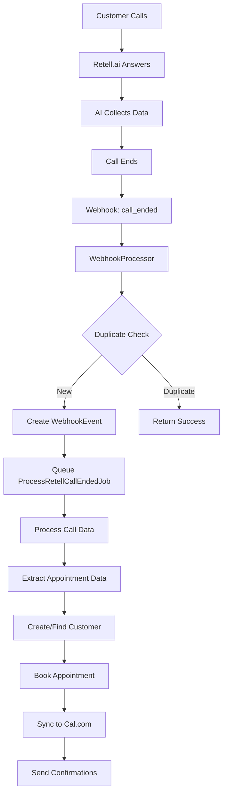

# AskProAI - Retell.ai Integration & Data Flow Analysis

## Executive Summary

The AskProAI system implements a sophisticated webhook-based integration with Retell.ai for processing phone calls and converting them into appointments. The system uses a multi-layered architecture with proper security, deduplication, and error handling. However, there are several areas that need attention for optimal performance and reliability.

## 1. Retell.ai Integration Architecture

### 1.1 Webhook Flow Overview

```
Phone Call → Retell.ai → Webhook → AskProAI → Processing → Appointment
```

#### Key Components:
1. **RetellWebhookController** - Entry point for webhooks
2. **WebhookProcessor** - Central processing service with deduplication
3. **RetellWebhookHandler** - Business logic for Retell events
4. **ProcessRetellCallEndedJob** - Async job for call processing
5. **AppointmentBookingService** - Creates appointments from call data

### 1.2 Webhook Security & Verification

**Current Implementation:**
- **Signature Verification**: Using `VerifyRetellSignature` middleware (currently NOT applied to routes)
- **HMAC-SHA256**: Validates webhook authenticity
- **Timestamp Validation**: 5-minute window to prevent replay attacks
- **Flexible Format Support**: Handles both `v=timestamp,signature` and raw signature formats

**Issues Found:**
1. ❌ **Middleware Not Applied**: The signature verification middleware is NOT applied to the webhook routes
2. ⚠️ **Timestamp Handling**: Complex logic for milliseconds/microseconds conversion
3. ✅ **Proper HMAC Implementation**: Uses timing-safe comparison

### 1.3 Event Types Supported

```php
// From RetellWebhookHandler::getSupportedEvents()
- call_started    // Call initiated
- call_ended      // Call completed (main event for booking)
- call_analyzed   // AI analysis complete
- call_inbound    // Real-time inbound call (synchronous)
- call_outbound   // Outbound calls
```

## 2. Data Flow Analysis

### 2.1 Complete Flow: Phone Call → Appointment



### 2.2 Data Extraction Process

The system extracts appointment data from multiple sources:

1. **Primary Source**: `retell_llm_dynamic_variables`
   - Fields: `datum`, `uhrzeit`, `name`, `telefonnummer`, `dienstleistung`, etc.

2. **Secondary Source**: Custom fields with `_` prefix
   - Example: `_datum`, `_uhrzeit`, `_name`

3. **Tertiary Source**: `call_analysis.custom_analysis_data`

### 2.3 Phone Number Resolution

**Critical Component**: `PhoneNumberResolver` determines which branch/company owns the call

```
Resolution Priority:
1. Metadata: askproai_branch_id in webhook
2. Phone Number: Match against phone_numbers table
3. Branch Phone: Match against branch.phone_number
4. Agent ID: Match retell_agent_id to branch
5. Fallback: First active branch
```

**Issues Found:**
1. ⚠️ **No Phone Number in Companies Table**: Companies don't have phone numbers, only branches do
2. ✅ **Good Caching**: 5-minute cache for phone lookups
3. ⚠️ **Weak Fallback**: Falls back to "first company/branch" which may be wrong

## 3. Critical Issues & Recommendations

### 3.1 Security Issues

**CRITICAL**: Webhook routes are not protected by signature verification!

```php
// Current in routes/api.php:
Route::post('/retell/webhook', [RetellWebhookController::class, 'processWebhook']);
// Should be:
Route::post('/retell/webhook', [RetellWebhookController::class, 'processWebhook'])
    ->middleware(['verify.retell.signature']);
```

### 3.2 Data Flow Issues

1. **Missing Required Fields**:
   - No validation that required appointment fields are present
   - Service and Staff are made optional but may cause Cal.com sync failures

2. **Tenant Isolation Concerns**:
   - Phone number resolution fallback could assign calls to wrong company
   - No validation that resolved company matches expected tenant

3. **Async Processing Risks**:
   - Jobs could fail after responding success to Retell
   - No mechanism to notify Retell of processing failures

### 3.3 Calendar Integration Issues

1. **Cal.com Event Type Mapping**:
   - No clear mapping from service → Cal.com event type
   - Branch must have `calcom_event_type_id` configured

2. **Availability Checking**:
   - Real-time availability only works for `call_inbound` events
   - No availability validation for `call_ended` bookings

## 4. Current Implementation Status

### ✅ Working Components:
- Webhook receipt and logging
- Call data storage
- Customer creation from phone number
- Basic appointment creation
- Deduplication (Redis + Database)
- Transaction safety with locking

### ⚠️ Partially Working:
- Phone number → Branch resolution (depends on data quality)
- Cal.com integration (requires proper configuration)
- Real-time availability checking (only for inbound calls)

### ❌ Not Working/Missing:
- Webhook signature verification on routes
- Comprehensive error recovery
- Service/Staff validation
- Appointment confirmation emails
- No-show tracking
- Cancellation/rescheduling via phone

## 5. Recommendations for Immediate Action

### High Priority:
1. **Apply signature verification middleware to all webhook routes**
2. **Add validation for required appointment fields**
3. **Improve phone number resolution with better fallbacks**
4. **Add comprehensive logging with correlation IDs**

### Medium Priority:
1. **Implement proper service → event type mapping**
2. **Add availability validation before booking**
3. **Create monitoring dashboard for webhook processing**
4. **Implement retry mechanism with exponential backoff**

### Low Priority:
1. **Add webhook replay functionality for debugging**
2. **Implement webhook event archival after 30 days**
3. **Add metrics collection for processing times**
4. **Create admin UI for webhook inspection**

## 6. Testing Recommendations

### Unit Tests Needed:
- PhoneNumberResolver with various formats
- Signature verification with edge cases
- Appointment data extraction from different sources

### Integration Tests Needed:
- Complete webhook flow with mocked Retell data
- Cal.com availability and booking
- Multi-tenant isolation

### E2E Tests Needed:
- Full phone call → appointment flow
- Concurrent booking scenarios
- Error recovery paths

## 7. Configuration Requirements

For successful operation, ensure:

1. **Environment Variables**:
   ```env
   RETELL_API_KEY=your_key
   RETELL_WEBHOOK_SECRET=your_secret
   DEFAULT_CALCOM_API_KEY=your_key
   ```

2. **Database Setup**:
   - Branches must have phone numbers
   - Branches must have `calcom_event_type_id`
   - Staff must be assigned to branches
   - Services must exist in the system

3. **Retell.ai Configuration**:
   - Webhook URL: `https://yourdomain.com/api/retell/webhook`
   - Events: `call_ended`, `call_analyzed`
   - Custom fields in AI prompt for appointment data

## Conclusion

The system has a solid foundation but requires immediate attention to security (webhook verification) and data validation. The phone number resolution is a critical component that needs robust configuration and better error handling. With the recommended improvements, the system can reliably convert phone calls to appointments at scale.