# Retell Agent V110 - Architecture Documentation

**Version:** V110
**Letzte Aktualisierung:** 2025-11-10

---

## Table of Contents

1. [High-Level Architecture](#1-high-level-architecture)
2. [Conversation Flow Diagram](#2-conversation-flow-diagram)
3. [Booking Flow Detailed](#3-booking-flow-detailed)
4. [Error Handling Flow](#4-error-handling-flow)
5. [Data Flow](#5-data-flow)
6. [Node Type Reference](#6-node-type-reference)

---

## 1. High-Level Architecture


---

## 2. Conversation Flow Diagram

### Complete Flow Overview


### Legend

- 🟡 **Yellow Nodes** = V110 New Features
- 🔴 **Pink Node** = Silent Router (no speech)
- 🟢 **Green Nodes** = Two-Step Booking

---

## 3. Booking Flow Detailed

### Happy Path (Available)

```mermaid
sequenceDiagram
    participant User
    participant Agent
    participant IntentRouter as intent_router<br/>(SILENT)
    participant Extract as node_extract_booking_variables
    participant Collect as node_collect_missing_data
    participant CheckAvail as func_check_availability
    participant Present as node_present_result
    participant CollectFinal as node_collect_final_booking_data
    participant StartBook as func_start_booking
    participant ConfirmBook as func_confirm_booking
    participant Success as node_booking_success

    User->>Agent: "Termin morgen 10 Uhr"
    Agent->>IntentRouter: Classify intent (SILENT)
    IntentRouter-->>Extract: → BOOKING intent
    Extract->>Extract: Extract: service, date, time
    Extract->>Collect: Check missing data

    alt Service from check_customer
        Collect->>Collect: Service already known (confidence 0.8)
        Collect->>Agent: "Wann hätten Sie Zeit?"
    else Service unknown
        Collect->>Agent: "Welche Dienstleistung?"
        User->>Agent: "Herrenhaarschnitt"
        Collect->>Agent: "Wann hätten Sie Zeit?"
    end

    User->>Agent: "Morgen 10 Uhr"
    Collect->>CheckAvail: Call API

    Note over CheckAvail: "Einen Moment, ich prüfe..."
    CheckAvail-->>Present: available=true

    Present->>Agent: "Der Termin ist frei! Soll ich buchen?"
    User->>Agent: "Ja bitte"

    Present->>CollectFinal: Check name/contact

    alt Data from check_customer
        CollectFinal->>CollectFinal: Name+Phone already known
    else New customer
        CollectFinal->>Agent: "Darf ich noch Ihren Namen erfragen?"
        User->>Agent: "Max Müller"
    end

    CollectFinal->>StartBook: All data complete
    Note over StartBook: "Einen Moment, ich validiere..."
    StartBook-->>ConfirmBook: status=validating

    Note over ConfirmBook: "Ich buche den Termin..."
    ConfirmBook-->>Success: success=true

    Success->>Agent: "Ihr Termin ist gebucht für morgen 10 Uhr."
    Agent->>User: "Kann ich sonst noch helfen?"
```



### Near-Match Path (Alternative ±30 min)


### Error with Callback Flow


---

## 4. Error Handling Flow


---

## 5. Data Flow

### Call Initialization

```mermaid
graph LR
    A[Call Start] --> B[get_current_context]
    B --> C{Response}
    C -->|Success| D[Set Variables:<br/>{{current_date}}<br/>{{current_time}}<br/>{{day_name}}]
    D --> E[check_customer]
    E --> F{Customer Found?}
    F -->|Yes| G[Set Variables:<br/>{{customer_name}}<br/>{{customer_phone}}<br/>{{customer_email}}<br/>{{predicted_service}}<br/>{{service_confidence}}<br/>{{preferred_staff}}]
    F -->|No| H[Variables empty]
    G --> I[intent_router]
    H --> I

    style D fill:#4CAF50,stroke:#333,stroke-width:2px
    style G fill:#FFD700,stroke:#333,stroke-width:2px
```

### Variable Propagation


---

## 6. Node Type Reference

### Conversation Nodes

**Purpose:** Dialogue with user, collect verbal information

**Properties:**
- `type: "conversation"`
- `instruction: { type: "prompt", text: "..." }`
- Can have multiple edges with conditions

**Examples:**
- node_greeting
- node_collect_missing_booking_data
- node_present_alternatives

### Function Nodes

**Purpose:** Call external APIs or backend functions

**Properties:**
- `type: "function"`
- `tool_id: "tool-name"`
- `parameter_mapping: { ... }`
- `speak_during_execution: true/false`
- `wait_for_result: true/false`

**Examples:**
- func_check_availability
- func_start_booking
- func_confirm_booking

### Extract Dynamic Variables Nodes

**Purpose:** Extract structured data from user input

**Properties:**
- `type: "extract_dynamic_variables"`
- `variables: [...]`
- Automatically populates {{variables}}

**Examples:**
- node_extract_booking_variables
- node_extract_alternative_selection

### End Nodes

**Purpose:** Terminate the call

**Properties:**
- `type: "end"`
- No outgoing edges

**Example:**
- node_goodbye

---

## Edge Transition Types

### Type 1: prompt (User Message Condition)

```json
{
  "type": "prompt",
  "prompt": "User wants to book appointment"
}
```

**Use:** When routing based on user intent or message content

### Type 2: equation (Variable Condition)

```json
{
  "type": "equation",
  "equations": [
    {"left": "customer_name", "operator": "exists"}
  ],
  "operator": "&&"
}
```

**Use:** When checking if variables are populated

### Type 3: always (Unconditional)

```json
{
  "type": "always"
}
```

**Use:** For mandatory transitions (e.g., after success message)

---

## Node Execution Order

### Priority Rules

1. **Equation edges** evaluated first
2. **Prompt edges** evaluated if no equation matches
3. **Always edges** as fallback

### Example

```json
{
  "edges": [
    {
      "type": "equation",
      "condition": "{{service_name}} exists",
      "destination": "func_check_availability"
    },
    {
      "type": "prompt",
      "prompt": "User provides service",
      "destination": "node_extract_booking_variables"
    }
  ]
}
```

**Execution:**
1. Check if `service_name` variable exists → If yes, go to check_availability
2. If no, evaluate prompt condition → If user mentioned service, extract it
3. If neither matches, stay in current node

---

## Performance Characteristics

### Node Execution Times

| Node Type | Typical Duration | Max Duration |
|-----------|------------------|--------------|
| Conversation | 50-200ms | 500ms |
| Function (fast) | 100-500ms | 5s |
| Function (slow) | 2-5s | 30s |
| Extract Variables | 50-150ms | 300ms |
| End | Immediate | - |

### Critical Path Timing (Happy Path)

```
Call Start → greeting (100ms)
→ init context (200ms)
→ check customer (300ms)
→ intent router (100ms)
→ extract vars (150ms)
→ collect data (USER: 5s)
→ check availability (1s)
→ present result (100ms)
→ collect final (USER: 3s)
→ start booking (400ms)
→ confirm booking (4s)
→ success (100ms)
→ goodbye (100ms)

Total Agent Time: ~6.5s
Total Call Time: ~14.5s (with user responses)
```

**Target: <25s total call duration** ✅

---

## Scalability Considerations

### Concurrent Calls

**Current:** Single-threaded per call (Retell handles concurrency)

**Backend Capacity:**
- **check_availability:** 60 calls/min
- **booking functions:** 30 calls/min
- **Redis cache:** 10,000 ops/sec

### Bottlenecks

1. **Cal.com API** (30s timeout)
   - Mitigation: Two-step booking (validate fast, execute slow)

2. **Redis Cache** (shared resource)
   - Mitigation: Key namespacing per company

3. **Database Connections** (limited pool)
   - Mitigation: Connection pooling + read replicas

---

## Security Architecture

### Authentication Flow


### Data Protection

**PII Handling:**
- `customer_name` → Stored encrypted at rest
- `customer_phone` → Stored encrypted, hashed for lookup
- `customer_email` → Stored encrypted
- `call transcripts` → Retained 90 days, then deleted

**Compliance:**
- GDPR: Right to deletion implemented
- DSGVO: Consent tracking for recordings

---

**Version:** V110 Architecture Documentation
**Last Updated:** 2025-11-10
**Diagrams:** 8 Mermaid diagrams
**Coverage:** Complete system architecture
