# Retell Agent V110 - Troubleshooting Guide

**Version:** V110 Production-Ready
**Datum:** 2025-11-10
**Zielgruppe:** DevOps, Backend Engineers, Support

---

## 🔍 Quick Diagnosis Flowchart

```mermaid
flowchart TD
    Start[Problem aufgetreten] --> Type{Problem-Typ?}

    Type -->|Deployment| Deploy[Deployment Issues]
    Type -->|Runtime| Runtime[Runtime Issues]
    Type -->|Agent Behavior| Behavior[Agent Behavior]
    Type -->|Backend| Backend[Backend Issues]

    Deploy --> DeployCheck{Was ist der Fehler?}
    DeployCheck -->|401 Unauthorized| Auth[Check API Token]
    DeployCheck -->|400 Bad Request| JSON[Validate JSON]
    DeployCheck -->|404 Not Found| Endpoint[Check Endpoint URL]

    Runtime --> RuntimeCheck{Was passiert?}
    RuntimeCheck -->|500 Error| FuncError[Function Call Failed]
    RuntimeCheck -->|Timeout| Timeout[Function Timeout]
    RuntimeCheck -->|No Response| NoResp[Check Backend]

    Behavior --> BehaviorCheck{Welches Verhalten?}
    BehaviorCheck -->|Agent spricht bei Intent| SilentRouter[Silent Router Fix]
    BehaviorCheck -->|Negative Formulierung| NearMatch[Near-Match Fix]
    BehaviorCheck -->|Keine Phone Collection| PhoneCollect[Phone Collection Fix]
    BehaviorCheck -->|Doppelte Fragen| DupQuest[Duplicate Questions Fix]

    Backend --> BackendCheck{Backend Problem?}
    BackendCheck -->|check_customer 404| Impl404[Endpoint nicht implementiert]
    BackendCheck -->|check_customer 500| Impl500[Backend Code Error]
    BackendCheck -->|Falsche Response| ImplResp[Response Schema falsch]

    Auth --> AuthSolution[export RETELL_TOKEN=key_6ff998ba48e842092e04a5455d19]
    JSON --> JSONSolution[jq . conversation_flow_v110_production_ready.json]
    Endpoint --> EndpointSolution[Use: /create-conversation-flow NOT /v2/conversation-flow]

    FuncError --> FuncCheck{Welche Function?}
    FuncCheck -->|check_customer| CheckCust[Backend implementieren]
    FuncCheck -->|check_availability| CheckAvail[Cal.com Connection prüfen]
    FuncCheck -->|start_booking| StartBook[Parameter Mapping prüfen]

    SilentRouter --> SilentFix[Prüfe global_prompt STUMMER ROUTER Sektion]
    NearMatch --> NearFix[Prüfe node_present_alternatives instruction]
    PhoneCollect --> PhoneFix[Prüfe node_collect_callback_phone exists]
    DupQuest --> DupFix[Prüfe check_customer Response + Extraction Rules]

    Impl404 --> Impl404Fix[Siehe: Backend Setup in Quick Start Guide]
    Impl500 --> Impl500Fix[Check Laravel logs: storage/logs/laravel.log]
    ImplResp --> ImplRespFix[Compare mit API Reference Schema]
```



---

## 🚨 Critical Issues (P0)

### Issue 1: Agent Published but Old Version Active

**Symptom:**
```bash
curl -X GET "https://api.retellai.com/get-agent/$AGENT_ID" \
  -H "Authorization: Bearer $RETELL_TOKEN" | jq '.response_engine.version'
# Output: 109 (Expected: 110)
```

**Root Cause:** Agent updated but not published

**Solution:**
```bash
# Check if agent is published
curl -X GET "https://api.retellai.com/get-agent/$AGENT_ID" \
  -H "Authorization: Bearer $RETELL_TOKEN" \
  | jq '.is_published'

# If false, publish it
curl -X POST "https://api.retellai.com/publish-agent/$AGENT_ID" \
  -H "Authorization: Bearer $RETELL_TOKEN"

# Verify
curl -X GET "https://api.retellai.com/get-agent/$AGENT_ID" \
  -H "Authorization: Bearer $RETELL_TOKEN" \
  | jq '{is_published, version: .response_engine.version}'
```

**Expected Output:**
```json
{
  "is_published": true,
  "version": 110
}
```

---

### Issue 2: All Function Calls Return 500 Error

**Symptom:**
```
Agent: "Es tut mir leid, es gab ein technisches Problem."
(ALL functions failing, not just one)
```

**Root Cause:** Wrong webhook URL or backend down

**Diagnosis:**
```bash
# 1. Check backend is running
curl -X GET "https://api.askproai.de/api/health"
# Expected: {"status": "ok"}

# 2. Check Retell webhook URL
curl -X GET "https://api.retellai.com/get-agent/$AGENT_ID" \
  -H "Authorization: Bearer $RETELL_TOKEN" \
  | jq '.general_tools[0].url'
# Expected: "https://api.askproai.de/api/webhooks/retell/collect-appointment-info"

# 3. Test webhook directly
curl -X POST "https://api.askproai.de/api/webhooks/retell/collect-appointment-info" \
  -H "Content-Type: application/json" \
  -d '{"call_id": "test_123", "name": "Test", "dienstleistung": "Haarschnitt"}'
# Expected: {"status": "success", ...}
```

**Solution:**
```bash
# If webhook URL wrong, update agent
curl -X PATCH "https://api.retellai.com/update-agent/$AGENT_ID" \
  -H "Authorization: Bearer $RETELL_TOKEN" \
  -H "Content-Type: application/json" \
  -d '{
    "general_tools": [
      {
        "name": "collect_appointment_info",
        "url": "https://api.askproai.de/api/webhooks/retell/collect-appointment-info"
      }
    ]
  }'
```

---

### Issue 3: check_customer Always Returns "found": false

**Symptom:**
```json
{
  "found": false
}
```
**Expected:** Customer should be found for existing phone numbers

**Diagnosis:**
```bash
# 1. Check endpoint exists
curl -X POST "https://api.askproai.de/api/webhooks/retell/check-customer" \
  -H "Content-Type: application/json" \
  -d '{"call_id": "call_abc123"}'

# 2. Check database has customers
mysql -e "SELECT COUNT(*) FROM customers WHERE phone IS NOT NULL;" api_gateway

# 3. Test with known phone number
curl -X POST "https://api.askproai.de/api/webhooks/retell/check-customer" \
  -H "Content-Type: application/json" \
  -d '{"call_id": "call_abc123", "from_number": "+491234567890"}'
```

**Common Issues:**

**Issue 3a: Endpoint nicht implementiert**
```bash
# Response: 404 Not Found
```
**Solution:** Implementiere Backend Endpoint (siehe Quick Start Guide Section "Backend Setup")

**Issue 3b: Phone Format Mismatch**
```bash
# Database: +491234567890
# Retell sends: 491234567890 (no +)
```
**Solution:**
```php
// In CheckCustomerController.php
$phoneNumber = $request->input('from_number');

// Normalize phone format
if (!str_starts_with($phoneNumber, '+')) {
    $phoneNumber = '+' . $phoneNumber;
}

$customer = Customer::where('phone', $phoneNumber)
    ->orWhere('phone', ltrim($phoneNumber, '+'))
    ->first();
```

**Issue 3c: call_id nicht übergeben**
```bash
# Check parameter mapping in flow
jq '.nodes[] | select(.id=="func_check_customer") | .parameter_mapping' \
  conversation_flow_v110_production_ready.json
```
**Expected:**
```json
{
  "call_id": "{{call_id}}"
}
```

---

## ⚠️ High Priority Issues (P1)

### Issue 4: Agent Spricht beim Intent Router

**Symptom:**
```
User: "Ich möchte einen Termin buchen"
Agent: "Ich verstehe, Sie möchten einen Termin buchen. Lassen Sie mich das prüfen..."
```
**Expected:** SILENT transition ohne Agent-Speech

**Diagnosis:**
```bash
# 1. Check global_prompt contains STUMMER ROUTER
jq '.global_prompt | contains("STUMMER ROUTER")' conversation_flow_v110_production_ready.json
# Expected: true

# 2. Check intent_router node instruction
jq '.nodes[] | select(.id=="intent_router") | .instruction.text' \
  conversation_flow_v110_production_ready.json
# Should contain: "VERBOTEN: ❌ Verfügbarkeit prüfen"
```

**Solution:**

**Option 1: Re-upload Flow**
```bash
# If global_prompt missing STUMMER ROUTER section, re-upload
curl -X POST "https://api.retellai.com/create-conversation-flow" \
  -H "Authorization: Bearer $RETELL_TOKEN" \
  -H "Content-Type: application/json" \
  -d @conversation_flow_v110_production_ready.json
```

**Option 2: Hotfix Global Prompt**
```bash
# Extract current flow
curl -X GET "https://api.retellai.com/get-conversation-flow/$FLOW_ID" \
  -H "Authorization: Bearer $RETELL_TOKEN" \
  > current_flow.json

# Edit global_prompt (add STUMMER ROUTER section)
# Then update
curl -X PATCH "https://api.retellai.com/update-conversation-flow/$FLOW_ID" \
  -H "Authorization: Bearer $RETELL_TOKEN" \
  -H "Content-Type: application/json" \
  -d @current_flow.json
```

**STUMMER ROUTER Section to Add:**
```
## 🔇 SILENT INTENT ROUTER

**KRITISCH: Du bist ein STUMMER ROUTER!**

Deine EINZIGE Aufgabe beim intent_router Node:
1. Kundenabsicht erkennen (buchen / stornieren / umbuchen / info)
2. SOFORT zum passenden Node transitionieren

**VERBOTEN:**
❌ Verfügbarkeit prüfen
❌ Termine vorschlagen
❌ Irgendwas antworten wie "Ich verstehe..." oder "Lassen Sie mich..."

**ERLAUBT:**
✅ NUR silent transition
```

---

### Issue 5: Near-Match wird NEGATIV formuliert

**Symptom:**
```
User: "Termin morgen 10 Uhr"
Agent: "Um 10 Uhr ist leider nicht verfügbar. Ich habe 9:45 oder 10:15..."
```
**Expected:**
```
Agent: "Um 10 Uhr ist morgen schon belegt, aber ich kann Ihnen 9:45 oder 10:15 anbieten. Was passt Ihnen besser?"
```

**Diagnosis:**
```bash
# 1. Check node_present_alternatives instruction
jq '.nodes[] | select(.id=="node_present_alternatives") | .instruction.text' \
  conversation_flow_v110_production_ready.json
# Should contain: "NEAR-MATCH LOGIC"

# 2. Check backend response
curl -X POST "https://api.askproai.de/api/webhooks/retell/check-availability" \
  -H "Content-Type: application/json" \
  -d '{
    "call_id": "test_123",
    "datum": "2025-11-11",
    "uhrzeit": "10:00"
  }' | jq '.alternatives'
```

**Expected Backend Response:**
```json
{
  "available": false,
  "alternatives": [
    {
      "time": "09:45",
      "date": "2025-11-11",
      "distance_minutes": -15
    },
    {
      "time": "10:15",
      "date": "2025-11-11",
      "distance_minutes": 15
    }
  ]
}
```

**Solution:**

**Backend Fix (if distance_minutes missing):**
```php
// In CheckAvailabilityService.php

public function findAlternatives($requestedTime, $requestedDate)
{
    $requested = Carbon::parse("$requestedDate $requestedTime");

    $alternatives = $this->getAvailableSlots($requestedDate)
        ->map(function($slot) use ($requested) {
            $slotTime = Carbon::parse($slot['time']);
            return [
                'time' => $slot['time'],
                'date' => $slot['date'],
                'distance_minutes' => $requested->diffInMinutes($slotTime, false)
            ];
        })
        ->sortBy(fn($alt) => abs($alt['distance_minutes']))
        ->take(5)
        ->values()
        ->toArray();

    return $alternatives;
}
```

**Flow Fix (if instruction wrong):**
```bash
# Check if NEAR-MATCH LOGIC exists
grep -q "NEAR-MATCH LOGIC" conversation_flow_v110_production_ready.json
# If not found, re-upload correct flow
```

---

### Issue 6: Telefonnummer wird NICHT gesammelt bei Callback

**Symptom:**
```
Agent: "Es gab ein technisches Problem. Wir rufen Sie zurück."
(Direkt zu func_request_callback ohne phone_number zu fragen)
```
**Expected:** Agent fragt nach Telefonnummer wenn {{customer_phone}} fehlt

**Diagnosis:**
```bash
# 1. Check if node_collect_callback_phone exists
jq '.nodes[] | select(.id=="node_collect_callback_phone")' \
  conversation_flow_v110_production_ready.json
# Should return node object

# 2. Check edge from node_booking_failed
jq '.nodes[] | select(.id=="node_booking_failed") | .edges' \
  conversation_flow_v110_production_ready.json
# Should have edge to node_collect_callback_phone

# 3. Check conditional edge
jq '.nodes[] | select(.id=="node_collect_callback_phone") | .edges[0].transition_condition' \
  conversation_flow_v110_production_ready.json
```

**Expected Edge Structure:**
```json
{
  "nodes": [
    {
      "id": "node_booking_failed",
      "edges": [
        {
          "destination_node_id": "node_collect_callback_phone",
          "transition_condition": {
            "type": "always"
          }
        }
      ]
    },
    {
      "id": "node_collect_callback_phone",
      "edges": [
        {
          "destination_node_id": "func_request_callback",
          "transition_condition": {
            "type": "equation",
            "equations": [
              {
                "left": "customer_phone",
                "operator": "exists"
              }
            ]
          }
        }
      ]
    }
  ]
}
```

**Solution:**

**If node missing:** Re-upload flow with correct JSON

**If edge wrong:** Update flow:
```bash
# Get current flow
curl -X GET "https://api.retellai.com/get-conversation-flow/$FLOW_ID" \
  -H "Authorization: Bearer $RETELL_TOKEN" \
  > current_flow.json

# Edit edges in current_flow.json
# Add node_collect_callback_phone between node_booking_failed and func_request_callback

# Upload fixed flow
curl -X PATCH "https://api.retellai.com/update-conversation-flow/$FLOW_ID" \
  -H "Authorization: Bearer $RETELL_TOKEN" \
  -H "Content-Type: application/json" \
  -d @current_flow.json
```

---

## 📊 Medium Priority Issues (P2)

### Issue 7: Service wird DOPPELT gefragt

**Symptom:**
```
Agent: "Guten Tag! Ich sehe Sie waren bereits bei uns. Möchten Sie wieder einen Herrenhaarschnitt buchen?"
User: "Ja"
Agent: "Welche Dienstleistung möchten Sie buchen?"
```
**Expected:** Service NICHT nochmal fragen wenn bereits bekannt

**Diagnosis:**
```bash
# 1. Check check_customer response
curl -X POST "https://api.askproai.de/api/webhooks/retell/check-customer" \
  -H "Content-Type: application/json" \
  -d '{"call_id": "test", "from_number": "+491234567890"}' \
  | jq '{predicted_service, service_confidence}'

# 2. Check extraction rules
jq '.nodes[] | select(.id=="node_extract_booking_variables") | .extraction_rules' \
  conversation_flow_v110_production_ready.json
```

**Expected extraction_rules:**
```json
{
  "extraction_rules": [
    {
      "variable_name": "service_name",
      "instruction": "Falls {{predicted_service}} existiert UND {{service_confidence}} >= 0.8: Verwende {{predicted_service}} direkt. NICHT nochmal fragen.",
      "required": true
    }
  ]
}
```

**Solution:**

**Backend Fix:**
```php
// Ensure service_confidence is calculated correctly
$serviceConfidence = $totalAppointments > 0 && $predictedService
    ? $serviceCounts[$predictedService] / $totalAppointments
    : 0;

return response()->json([
    'predicted_service' => $predictedService,
    'service_confidence' => round($serviceConfidence, 2) // 0.00 to 1.00
]);
```

**Flow Fix:**
```bash
# Update extraction rules to respect confidence threshold
# Edit conversation_flow_v110_production_ready.json
# Then re-upload
```

---

### Issue 8: Function Call Timeout (>30s)

**Symptom:**
```
Agent: "Einen Moment, ich prüfe die Verfügbarkeit..."
(Lange Pause >30 Sekunden)
Agent: "Es gab ein technisches Problem..."
```

**Diagnosis:**
```bash
# 1. Check backend logs
tail -n 100 /var/www/api-gateway/storage/logs/laravel.log | grep "check_availability"

# 2. Test function directly with timing
time curl -X POST "https://api.askproai.de/api/webhooks/retell/check-availability" \
  -H "Content-Type: application/json" \
  -d '{"call_id": "test", "datum": "2025-11-11", "uhrzeit": "10:00"}'
# Should complete in <5 seconds
```

**Common Causes:**

**8a: Cal.com API Slow**
```bash
# Check Cal.com API response time
time curl -X GET "https://cal.askproai.de/api/availability" \
  -H "Authorization: Bearer $CALCOM_TOKEN"
```
**Solution:** Implement caching
```php
// Use Redis cache for availability
$cacheKey = "availability:{$date}:{$service}";
$availability = Cache::remember($cacheKey, 300, function() use ($date, $service) {
    return $this->calcomService->getAvailability($date, $service);
});
```

**8b: Database Query N+1 Problem**
```bash
# Enable query log
mysql -e "SET GLOBAL general_log = 'ON';"

# Make test call, check query count
tail -f /var/log/mysql/general.log | grep "SELECT"
```
**Solution:** Use eager loading
```php
// Bad: N+1 queries
$appointments = Appointment::where('customer_id', $customerId)->get();
foreach ($appointments as $apt) {
    echo $apt->service->name; // N+1!
}

// Good: 2 queries total
$appointments = Appointment::with('service')
    ->where('customer_id', $customerId)
    ->get();
```

**8c: timeout_ms zu niedrig**
```bash
# Check timeout setting
jq '.nodes[] | select(.id=="func_check_availability") | .timeout_ms' \
  conversation_flow_v110_production_ready.json
```
**Expected:** 15000 (15 seconds) for check_availability

**Solution:** Update timeout
```json
{
  "id": "func_check_availability",
  "timeout_ms": 15000
}
```

---

## 🔧 Low Priority Issues (P3)

### Issue 9: Agent wiederholt Kundennamen falsch

**Symptom:**
```
User: "Müller"
Agent: "Vielen Dank Herr Muller..." (ohne Umlaut)
```

**Solution:**
```bash
# Check global_prompt für deutsche Aussprache-Regeln
jq '.global_prompt | contains("DEUTSCHE NAMEN")' conversation_flow_v110_production_ready.json

# Falls fehlt, add to global_prompt:
```
```
## 🇩🇪 DEUTSCHE NAMEN & AUSSPRACHE

**Umlaute EXAKT wiederholen:**
- Müller → "Müller" (nicht "Muller")
- Schäfer → "Schäfer" (nicht "Schaefer")
- Köhler → "Köhler" (nicht "Koehler")

**Bei Unsicherheit:**
"Entschuldigung, wie war Ihr Name genau?" (lasse User wiederholen)
```

---

### Issue 10: Call Duration >45 Sekunden

**Symptom:** Anrufe dauern länger als Target (<25s)

**Diagnosis:**
```bash
# Check Retell Dashboard
# → Analytics → Avg Call Duration

# Or via API (if available)
curl -X GET "https://api.retellai.com/get-call-analytics" \
  -H "Authorization: Bearer $RETELL_TOKEN" \
  | jq '.avg_call_duration'
```

**Optimization:**

**10a: Reduce Agent Verbosity**
```bash
# Update global_prompt
```
```
## ⏱️ EFFIZIENZ & GESCHWINDIGKEIT

**KURZ & PRÄGNANT sprechen:**
❌ "Vielen Dank für Ihre Anfrage. Lassen Sie mich das für Sie prüfen und schauen..."
✅ "Einen Moment, ich prüfe das."

❌ "Möchten Sie diesen Termin so buchen oder soll ich Ihnen noch weitere Alternativen zeigen?"
✅ "Soll ich den Termin so buchen?"
```

**10b: Parallelize Function Calls**
```json
{
  "id": "func_initialize_context",
  "wait_for_result": true,
  "edges": [
    {
      "destination_node_id": "func_check_customer"
    }
  ]
}
```
**Change to:**
```json
{
  "id": "node_parallel_init",
  "type": "conversation",
  "edges": [
    {
      "destination_node_id": "func_initialize_context"
    },
    {
      "destination_node_id": "func_check_customer"
    }
  ]
}
```

**10c: Skip Repeated Questions**
```
Use check_customer data to pre-fill variables:
- customer_name
- customer_phone
- predicted_service (if confidence >= 0.8)
```

---

## 🛠️ Debug Commands Reference

### Get Current Agent Configuration
```bash
export RETELL_TOKEN="key_6ff998ba48e842092e04a5455d19"
export AGENT_ID="agent_45daa54928c5768b52ba3db736"

curl -X GET "https://api.retellai.com/get-agent/$AGENT_ID" \
  -H "Authorization: Bearer $RETELL_TOKEN" \
  | jq '.'
```

### Get Current Conversation Flow
```bash
# Get flow_id from agent
FLOW_ID=$(curl -s -X GET "https://api.retellai.com/get-agent/$AGENT_ID" \
  -H "Authorization: Bearer $RETELL_TOKEN" \
  | jq -r '.response_engine.conversation_flow_id')

# Get flow details
curl -X GET "https://api.retellai.com/get-conversation-flow/$FLOW_ID" \
  -H "Authorization: Bearer $RETELL_TOKEN" \
  | jq '.' > current_flow.json
```

### Validate JSON Structure
```bash
# Check if valid JSON
jq empty conversation_flow_v110_production_ready.json
# No output = valid

# Check nodes count
jq '.nodes | length' conversation_flow_v110_production_ready.json

# Check for duplicate node IDs
jq '[.nodes[].id] | group_by(.) | map(select(length > 1))' \
  conversation_flow_v110_production_ready.json
# Should be: []

# Check all edges have valid destinations
jq '.nodes[] | .edges[]?.destination_node_id' conversation_flow_v110_production_ready.json \
  | sort | uniq > edge_destinations.txt
jq '.nodes[].id' conversation_flow_v110_production_ready.json \
  | sort > node_ids.txt
comm -23 edge_destinations.txt node_ids.txt
# Should be empty (all destinations exist)
```

### Test Backend Endpoints
```bash
# Test all endpoints
for endpoint in \
  "initialize-context" \
  "check-customer" \
  "collect-appointment-info" \
  "check-availability" \
  "present-alternatives" \
  "start-booking" \
  "confirm-booking" \
  "cancel-appointment" \
  "reschedule-appointment" \
  "provide-info" \
  "request-callback"
do
  echo "Testing: $endpoint"
  curl -s -o /dev/null -w "%{http_code}" \
    -X POST "https://api.askproai.de/api/webhooks/retell/$endpoint" \
    -H "Content-Type: application/json" \
    -d '{"call_id": "test_123"}'
  echo ""
done
```

### Check Laravel Logs for Errors
```bash
# Last 50 errors
grep -i "error" /var/www/api-gateway/storage/logs/laravel.log | tail -50

# Retell-specific errors
grep "retell" /var/www/api-gateway/storage/logs/laravel.log | grep -i "error"

# Function call failures
grep "Function call failed" /var/www/api-gateway/storage/logs/laravel.log
```

---

## 📞 Escalation Procedures

### When to Escalate

| Severity | Criteria | Response Time | Escalate To |
|----------|----------|---------------|-------------|
| P0 | Production down, all calls failing | <15 min | DevOps Lead + CTO |
| P1 | Critical feature broken (>50% calls affected) | <1 hour | Engineering Lead |
| P2 | Moderate issue (10-50% calls affected) | <4 hours | Backend Team |
| P3 | Minor issue (<10% calls affected) | <24 hours | Support Ticket |

### Escalation Template

**Subject:** [P0/P1/P2/P3] Retell V110 Issue - [Brief Description]

**Summary:**
- **Issue:** [What's happening]
- **Impact:** [How many calls/users affected]
- **Since:** [When did it start]
- **Reproduction:** [Steps to reproduce]

**Diagnosis Completed:**
- [x] Checked agent is published
- [x] Verified backend endpoints responding
- [x] Checked Laravel logs for errors
- [x] Tested function calls directly

**Logs:**
```
[Relevant log excerpts]
```

**Request:**
- **Action Needed:** [What needs to be done]
- **ETA Required:** [Yes/No]

---

## 📚 Additional Resources

- **Deployment Guide:** `RETELL_V110_DEPLOYMENT_GUIDE.md`
- **API Reference:** `RETELL_V110_API_REFERENCE.md`
- **Architecture Diagrams:** `RETELL_V110_ARCHITECTURE.md`
- **Quick Start:** `RETELL_V110_QUICK_START.md`
- **Executive Summary:** `RETELL_V110_EXECUTIVE_SUMMARY.md`
- **Validation Report:** `RETELL_V110_VALIDATION_REPORT.md`

---

**Version:** V110 Production-Ready
**Letzte Aktualisierung:** 2025-11-10
**Maintainer:** DevOps Team
