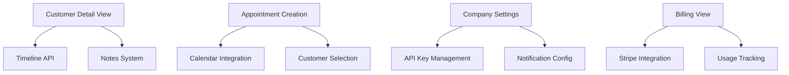

# 🎯 Strategic Roadmap - AskProAI (2025-07-14)

## 📊 Current State Analysis

### ✅ Achievements
- **Test Suite**: 93 individual tests across 132 test files (target: 100+)
- **Admin Panel**: Gray screen issue fixed, dropdown stacking resolved
- **Documentation**: Best practices established, automated checks in place
- **Infrastructure**: MCP servers, data flow tracking, impact analysis tools ready

### 🚨 Critical Issues
1. **React Admin Portal**: 30-70% features missing, many views are placeholders
2. **Customer Management**: No detail view, no timeline, no communication features
3. **Appointment System**: Cannot create/edit appointments in React portal
4. **Business Operations**: No billing view, no team management, settings placeholder only
5. **Test Suite**: Syntax errors preventing full test runs

### 🎯 Business Impact Assessment
- **Revenue Risk**: Cannot onboard new customers effectively (missing features)
- **Customer Satisfaction**: Current customers cannot self-service (no portal)
- **Operational Efficiency**: Manual workarounds needed for basic tasks
- **Competitive Position**: Incomplete product vs competitors

## 🚀 Strategic Roadmap

### 🔴 Immediate Actions (Next 24 Hours)

#### 1. Fix Test Suite Blockers
```bash
# Already removed LoginDebugger.php
# Run full test suite
php artisan test

# Fix any remaining syntax errors
composer pint
composer stan
```

#### 2. Critical React Admin Features
**Priority: Customer Detail View**
- Full customer information display
- Activity timeline (calls, appointments)
- Notes and communication
- Portal access management

**Implementation Plan:**
1. Create `CustomerDetailView.jsx` component
2. Add API endpoints for customer timeline
3. Implement notes functionality
4. Add portal access toggle

#### 3. Appointment Management
**Priority: Create/Edit Appointments**
- Modal for appointment creation
- Calendar integration
- Status management
- Edit existing appointments

### 🟡 Short-term Goals (Next Week)

#### Week 1: Core Business Features
**Day 1-2: Customer Management**
- ✅ Customer Detail View
- ✅ Timeline Component
- ✅ Notes System
- ✅ Communication Log

**Day 3-4: Appointment System**
- ✅ Create/Edit Modal
- ✅ Calendar View Integration
- ✅ Status Management
- ✅ Reminder System

**Day 5-7: Company & Branch Management**
- ✅ Company Settings (API keys, notifications)
- ✅ Branch Management (not placeholder)
- ✅ Service Configuration
- ✅ Working Hours Setup

#### Quick Wins (Can be done in parallel)
1. **Dashboard Real Data**: Replace static stats with live data
2. **Translation Completion**: Fix hardcoded strings
3. **Error Handling**: Add proper error boundaries
4. **Loading States**: Add skeleton loaders

### 🟢 Medium-term Objectives (Next Month)

#### Week 2: Financial & Team Features
- Billing View (invoices, usage, prepaid balance)
- Team Management (staff CRUD, permissions)
- Settings Page (user preferences, system config)
- Analytics with real data

#### Week 3: Advanced Features
- Multi-language support completion
- Email template editor
- SMS/WhatsApp notifications
- Advanced reporting

#### Week 4: Polish & Performance
- Performance optimization
- Mobile responsiveness
- Accessibility compliance
- Documentation in Notion

## 📈 Implementation Strategy

### 1. Parallel Development Tracks
**Track A: React Portal** (Primary Focus)
- Developer 1: Customer features
- Developer 2: Appointment features
- Developer 3: Company/Branch features

**Track B: Testing & Quality**
- Increase test coverage to 100+
- Fix all PHPStan issues
- Document in Notion

**Track C: Quick Fixes**
- Dashboard real data
- Translation fixes
- Error handling

### 2. Daily Objectives
```bash
# Morning
- Review overnight monitoring
- Check error logs
- Plan day's tasks in TodoWrite

# Development
- Use MCP discovery for tasks
- Track data flows
- Write tests alongside features

# Evening
- Run full test suite
- Update documentation
- Commit with conventional messages
```

### 3. Risk Mitigation
**High Risk Areas:**
1. **Customer Portal Access**: Test thoroughly, gradual rollout
2. **Billing Integration**: Extensive testing, monitoring
3. **Data Migration**: Backup before any schema changes
4. **API Changes**: Version properly, maintain backwards compatibility

### 4. Success Metrics
**Week 1 Targets:**
- React Admin Portal: 70% → 90% complete
- Test Suite: 93 → 120 tests
- Customer Features: 0% → 100% complete
- Zero critical bugs in production

**Month 1 Targets:**
- Full feature parity with Filament admin
- 150+ automated tests
- Complete Notion documentation
- 5-minute onboarding achieved

## 🛠️ Technical Approach

### Component Architecture
```javascript
// Standardized component structure
src/
  components/
    customers/
      CustomerDetailView.jsx
      CustomerTimeline.jsx
      CustomerNotes.jsx
    appointments/
      AppointmentModal.jsx
      AppointmentCalendar.jsx
    shared/
      LoadingStates.jsx
      ErrorBoundary.jsx
```

### API Standardization
```javascript
// Consistent API patterns
GET    /api/v2/customers/:id/timeline
POST   /api/v2/customers/:id/notes
PUT    /api/v2/appointments/:id
DELETE /api/v2/appointments/:id
```

### State Management
```javascript
// Use React Query for server state
const { data, isLoading, error } = useQuery({
  queryKey: ['customer', customerId],
  queryFn: () => fetchCustomer(customerId)
});
```

## 🔄 Continuous Improvement

### Daily Standup Questions
1. What critical features were completed?
2. What blockers were encountered?
3. What's the next priority?

### Weekly Review
1. Feature completion percentage
2. Test coverage increase
3. Bug count trend
4. Customer feedback

### Monthly Retrospective
1. What went well?
2. What could improve?
3. What processes to adjust?

## 📊 Dependency Map



## 🎯 Success Criteria

### Immediate (24h)
- [ ] Test suite running without errors
- [ ] Customer Detail View component created
- [ ] At least 3 new features implemented

### Short-term (1 week)
- [ ] Customer management 100% complete
- [ ] Appointments fully manageable
- [ ] Company settings functional
- [ ] 120+ tests passing

### Medium-term (1 month)
- [ ] React Admin Portal feature-complete
- [ ] 150+ tests with 80% coverage
- [ ] Zero critical bugs
- [ ] Complete Notion documentation

## 🚨 Escalation Path

1. **Blocker Found**: Document in ERROR_PATTERNS.md
2. **Architecture Decision**: Team discussion, document decision
3. **Performance Issue**: Profile, optimize, document solution
4. **Security Concern**: Immediate fix, security audit

## 📝 Next Steps

1. **NOW**: Fix test suite, start Customer Detail View
2. **Today**: Complete at least one major feature
3. **Tomorrow**: Continue feature implementation, increase tests
4. **This Week**: Achieve 90% React portal completion

Remember: **Simple solutions, maximum impact, automate everything!**