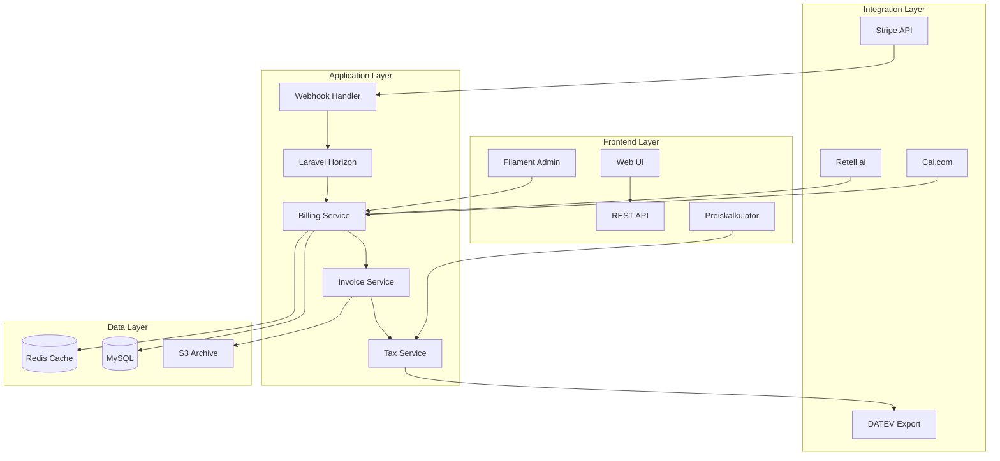

# 🎯 AskProAI Stripe Integration - Finaler Implementierungsplan

**Version**: 1.0  
**Datum**: 2025-06-19  
**Status**: Bereit zur Umsetzung  
**Erstellt durch**: 3-Agenten Analyse (Tax Expert, UX/UI Expert, Technical Architect)

## 📋 Executive Summary

Die Stripe-Integration für AskProAI wurde durch drei spezialisierte Experten-Agenten analysiert. Das Ergebnis ist ein umfassender Plan, der deutsche Steuervorschriften (insbesondere Kleinunternehmerregelung), optimale User Experience und eine skalierbare technische Architektur vereint.

### Kernziele
- ✅ Vollständige deutsche Steuer-Compliance (§19 UStG Kleinunternehmer)
- ✅ Flexible Rechnungsbearbeitung mit manuellen Anpassungen
- ✅ Proberechnungen und Preiskalkulatoren
- ✅ Self-Service Kundenportal
- ✅ Skalierbare Event-Driven Architektur

## 🏗️ Systemarchitektur



## 💰 Preismodelle

### Kleinunternehmer-Paket (0% MwSt)
Hinweis auf Rechnung: "Umsatzsteuerbefreit nach §19 UStG"

| Paket | Preis/Monat | Inklusiv-Minuten | Zusatz-Minute | Features |
|-------|-------------|------------------|---------------|----------|
| **Starter** | 49€ | 100 Min | 0,29€ | 1 Standort, Basis-Support |
| **Professional** | 149€ | 500 Min | 0,19€ | 3 Standorte, Priority Support |
| **Enterprise** | Individuell | Unbegrenzt | - | Alles inklusive, SLA |

### Reguläre Besteuerung (19% MwSt)
Automatische Umschaltung bei Überschreitung der Kleinunternehmergrenze

## 🛠️ Technische Komponenten

### 1. Datenbank-Schema

```sql
-- Haupttabellen
companies (erweitert)
├── is_small_business (boolean)
├── tax_id (varchar)
├── invoice_settings (json)
└── revenue_ytd (decimal)

tax_rates
├── company_id
├── name
├── rate (0, 7, 19)
├── is_default
└── valid_from/until

invoices (erweitert)
├── manual_editable (boolean)
├── finalized_at (timestamp)
├── tax_note (text)
└── audit_log (json)

invoice_items_flexible
├── period_start/end
├── custom_price
├── tax_rate_override
└── manual_description
```

### 2. Service Layer

```php
// Kern-Services
TaxService
├── calculateTax()
├── checkSmallBusinessThreshold()
├── validateUstId()
└── generateTaxNote()

EnhancedStripeInvoiceService
├── createDraftInvoice()
├── previewInvoice()
├── finalizeInvoice()
├── bulkGenerate()
└── applyManualChanges()

InvoiceComplianceService
├── generateCompliantNumber()
├── createDatevExport()
├── archivePDF()
└── auditLog()

PricingCalculatorService
├── calculateMonthlyPrice()
├── comparePackages()
├── estimateROI()
└── generateQuote()
```

### 3. UI/UX Komponenten

#### Admin Dashboard
```php
// Neue Filament Pages
InvoiceEditorPage
├── DraftSection
├── ItemsRepeater
├── PreviewPanel
└── QuickActions

BillingDashboard
├── RevenueMetrics
├── PendingInvoices
├── QuickStats
└── AlertsWidget

TaxCompliancePage
├── SmallBusinessToggle
├── ThresholdMonitor
├── TaxRatesManager
└── DatevExporter
```

#### Customer Portal
```php
// Self-Service Features
CustomerPortalController
├── invoiceHistory()
├── downloadInvoice()
├── updatePaymentMethod()
├── changeSubscription()
└── usageTracking()
```

### 4. Webhook Architecture

```php
// Asynchrone Verarbeitung
StripeWebhookController
    ↓ (200 OK)
ProcessStripeWebhookJob
    ↓
WebhookEventHandler
    ├── PaymentHandler
    ├── InvoiceHandler
    └── SubscriptionHandler
    ↓
BillingEventDispatcher
    ├── InvoicePaidEvent
    ├── SubscriptionChangedEvent
    └── PaymentFailedEvent
```

## 📊 Implementation Roadmap

### Phase 1: Foundation (Woche 1-2)
- [x] Planungsdokumente erstellen
- [ ] Datenbank-Migrations
- [ ] Basis Tax Service
- [ ] Stripe Konfiguration

### Phase 2: Core Services (Woche 3-4)
- [ ] Enhanced Invoice Service
- [ ] Tax Compliance Service
- [ ] Webhook Handler
- [ ] Queue Jobs

### Phase 3: Admin UI (Woche 5-6)
- [ ] Invoice Editor
- [ ] Billing Dashboard
- [ ] Tax Compliance Page
- [ ] Bulk Operations

### Phase 4: Customer Portal (Woche 7-8)
- [ ] Self-Service UI
- [ ] Payment Methods
- [ ] Usage Tracking
- [ ] Mobile Optimization

### Phase 5: Testing & Launch (Woche 9-10)
- [ ] Integration Tests
- [ ] Performance Tests
- [ ] Security Audit
- [ ] Soft Launch

## 🔒 Security & Compliance

### Datenschutz (DSGVO)
- Verschlüsselung sensibler Daten
- Recht auf Löschung implementiert
- Datenminimierung
- Audit Logs

### Steuer-Compliance
- GoBD-konforme Archivierung
- Unveränderbare Rechnungsnummern
- DATEV-Export
- Revisionssichere Speicherung

### Payment Security
- PCI DSS Compliance (via Stripe)
- Keine Kartendaten speichern
- Sichere Webhooks
- Rate Limiting

## 📈 Success Metrics

### Technical KPIs
- Invoice Generation < 2s
- Dashboard Load < 200ms
- 99.9% Uptime
- Zero Security Incidents

### Business KPIs
- 80% Self-Service Rate
- < 5% Payment Failures
- 95% Invoice Accuracy
- < 3min Support Response

## 🚀 Go-Live Checklist

### Pre-Launch
- [ ] Alle Tests grün
- [ ] Security Audit passed
- [ ] DATEV Export validiert
- [ ] Dokumentation komplett
- [ ] Team Training done

### Launch Day
- [ ] Monitoring aktiv
- [ ] Support bereit
- [ ] Rollback Plan ready
- [ ] Kommunikation vorbereitet

### Post-Launch
- [ ] Performance Monitoring
- [ ] User Feedback sammeln
- [ ] Iterative Verbesserungen
- [ ] Erfolgs-Metriken tracken

## 💡 Besondere Features

### 1. Smart Invoice Builder
- Live-Vorschau während Bearbeitung
- Drag & Drop für Positionen
- Template System
- Batch Editing

### 2. Interaktiver Preiskalkulator
- Was-wäre-wenn Szenarien
- ROI Berechnung
- Paket-Vergleich
- Sofort-Angebot

### 3. Automatische Compliance
- Kleinunternehmer-Monitoring
- Schwellenwert-Alarme
- Automatische Umschaltung
- Compliance Reports

### 4. DATEV Integration
- Ein-Klick Export
- Automatische Konten-Zuordnung
- Monats/Quartals-Exporte
- Steuerberater-Portal

## 📝 Offene Entscheidungen

1. **Zahlungsziele**: Standard 14, 30 oder 60 Tage?
2. **Mahnwesen**: Automatisch oder manuell?
3. **Gutschriften**: Workflow definieren
4. **Multi-Currency**: EUR only oder international?
5. **Partnerprogramm**: Provisions-Abrechnungen?

## 🎯 Nächste Schritte

1. **Sofort**: Review mit Stakeholdern
2. **Diese Woche**: Technische Spezifikation finalisieren
3. **Nächste Woche**: Development Sprint 1 starten
4. **In 2 Wochen**: Erste Demo-Version
5. **In 10 Wochen**: Production Launch

---

**Dieser Plan vereint die Expertise von drei spezialisierten Agenten und bietet eine vollständige, production-ready Lösung für die Stripe-Integration in AskProAI.**

**Dokumente für Details**:
- `STRIPE_INTEGRATION_TAX_COMPLIANCE.md` - Vollständige Steuer-Spezifikation
- `STRIPE_INTEGRATION_UX_UI_DESIGN.md` - UI/UX Designs und Wireframes
- `STRIPE_INTEGRATION_TECHNICAL_ARCHITECTURE.md` - Technische Architektur

**Kontakt**: Bei Fragen oder zur Diskussion der nächsten Schritte stehe ich jederzeit zur Verfügung.