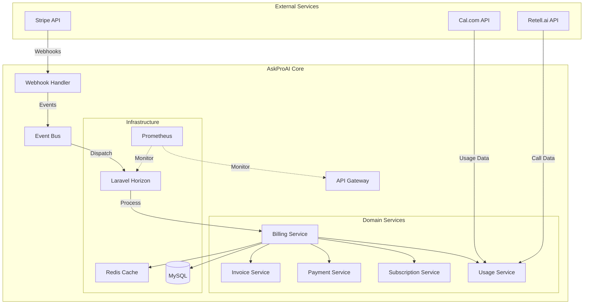
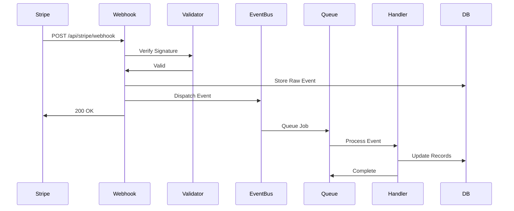
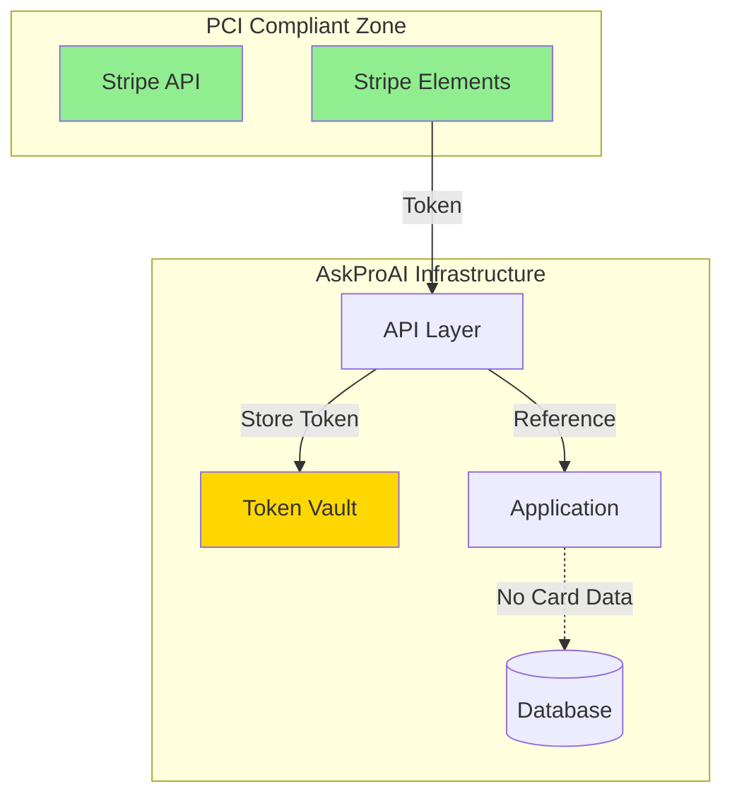

# Stripe Integration Technical Architecture for AskProAI

## Executive Summary

Diese technische Spezifikation definiert die optimale Architektur für die Stripe-Integration in AskProAI. Die Lösung nutzt einen **Event-Driven Architecture** Ansatz mit **asynchroner Verarbeitung** für maximale Zuverlässigkeit und Skalierbarkeit.

## 1. System Architecture

### 1.1 Architecture Pattern: Event-Driven Monolith



### 1.2 Key Architecture Decisions

1. **Monolith über Microservices**
   - Reduzierte Komplexität
   - Einfacheres Deployment
   - Transaktionale Konsistenz
   - Bestehende Laravel-Infrastruktur nutzen

2. **Event-Driven Design**
   - Lose Kopplung zwischen Komponenten
   - Bessere Testbarkeit
   - Einfache Erweiterbarkeit
   - Auditierbarkeit aller Aktionen

3. **Asynchrone Verarbeitung**
   - Webhook-Timeouts vermeiden
   - Bessere Fehlerbehandlung
   - Retry-Mechanismen
   - Rate Limiting Compliance

## 2. Stripe Integration Architecture

### 2.1 Webhook Processing Flow



### 2.2 Webhook Reliability Pattern

```php
class StripeWebhookController extends Controller
{
    public function handle(Request $request)
    {
        // 1. Signature Verification
        $signature = $request->header('Stripe-Signature');
        $event = $this->verifyWebhookSignature($request->getContent(), $signature);
        
        // 2. Idempotency Check
        if ($this->isDuplicateEvent($event->id)) {
            return response()->json(['status' => 'duplicate'], 200);
        }
        
        // 3. Store Raw Event
        WebhookEvent::create([
            'provider' => 'stripe',
            'event_id' => $event->id,
            'type' => $event->type,
            'payload' => $event,
            'status' => 'received'
        ]);
        
        // 4. Dispatch Async Processing
        ProcessStripeWebhook::dispatch($event)
            ->onQueue('webhooks-high');
        
        // 5. Immediate Response
        return response()->json(['status' => 'accepted'], 200);
    }
}
```

### 2.3 Circuit Breaker Implementation

```php
class StripeApiService
{
    private CircuitBreaker $circuitBreaker;
    
    public function __construct()
    {
        $this->circuitBreaker = new CircuitBreaker(
            'stripe',
            failureThreshold: 5,
            resetTimeout: 60,
            halfOpenRequests: 3
        );
    }
    
    public function createInvoice(array $data)
    {
        return $this->circuitBreaker->call(function() use ($data) {
            return $this->stripe->invoices->create($data);
        });
    }
}
```

## 3. Data Architecture

### 3.1 Optimized Table Structure

```sql
-- Core Billing Tables
CREATE TABLE billing_events (
    id BIGINT PRIMARY KEY,
    company_id INT NOT NULL,
    event_type VARCHAR(50) NOT NULL,
    event_id VARCHAR(255) UNIQUE NOT NULL,
    payload JSON NOT NULL,
    processed_at TIMESTAMP NULL,
    created_at TIMESTAMP DEFAULT CURRENT_TIMESTAMP,
    INDEX idx_company_event (company_id, event_type),
    INDEX idx_created_at (created_at),
    INDEX idx_event_id (event_id)
) ENGINE=InnoDB;

CREATE TABLE invoices (
    id BIGINT PRIMARY KEY,
    company_id INT NOT NULL,
    stripe_invoice_id VARCHAR(255) UNIQUE,
    invoice_number VARCHAR(50) UNIQUE NOT NULL,
    status ENUM('draft', 'open', 'paid', 'void', 'uncollectible'),
    subtotal DECIMAL(10,2) NOT NULL,
    tax_amount DECIMAL(10,2) NOT NULL,
    total DECIMAL(10,2) NOT NULL,
    currency CHAR(3) DEFAULT 'EUR',
    invoice_date DATE NOT NULL,
    due_date DATE NOT NULL,
    paid_date DATE NULL,
    pdf_url VARCHAR(500),
    metadata JSON,
    created_at TIMESTAMP DEFAULT CURRENT_TIMESTAMP,
    updated_at TIMESTAMP DEFAULT CURRENT_TIMESTAMP ON UPDATE CURRENT_TIMESTAMP,
    INDEX idx_company_status (company_id, status),
    INDEX idx_invoice_date (invoice_date),
    INDEX idx_due_date (due_date),
    FULLTEXT idx_invoice_number (invoice_number)
) ENGINE=InnoDB;

CREATE TABLE usage_records (
    id BIGINT PRIMARY KEY,
    company_id INT NOT NULL,
    branch_id INT NULL,
    resource_type ENUM('retell_minutes', 'calcom_bookings', 'custom'),
    quantity DECIMAL(10,4) NOT NULL,
    unit_price DECIMAL(10,4) NOT NULL,
    period_start DATE NOT NULL,
    period_end DATE NOT NULL,
    metadata JSON,
    created_at TIMESTAMP DEFAULT CURRENT_TIMESTAMP,
    INDEX idx_company_period (company_id, period_start, period_end),
    INDEX idx_branch_period (branch_id, period_start, period_end)
) ENGINE=InnoDB PARTITION BY RANGE (YEAR(period_start)) (
    PARTITION p2024 VALUES LESS THAN (2025),
    PARTITION p2025 VALUES LESS THAN (2026),
    PARTITION p2026 VALUES LESS THAN (2027)
);

-- High-Performance Aggregation Table
CREATE TABLE billing_aggregates (
    company_id INT NOT NULL,
    branch_id INT NULL,
    period_start DATE NOT NULL,
    period_end DATE NOT NULL,
    total_minutes DECIMAL(10,2),
    total_bookings INT,
    total_revenue DECIMAL(10,2),
    total_cost DECIMAL(10,2),
    last_calculated_at TIMESTAMP,
    PRIMARY KEY (company_id, IFNULL(branch_id, 0), period_start),
    INDEX idx_period (period_start, period_end)
) ENGINE=InnoDB;
```

### 3.2 Indexing Strategy

```sql
-- Performance-Critical Indexes
CREATE INDEX idx_calls_billing ON calls(company_id, created_at, duration_sec) 
    WHERE duration_sec > 0;

CREATE INDEX idx_appointments_billing ON appointments(company_id, branch_id, scheduled_date)
    WHERE status = 'completed';

-- Materialized View for Real-time Dashboards
CREATE VIEW billing_dashboard_view AS
SELECT 
    c.id as company_id,
    c.name as company_name,
    DATE_FORMAT(NOW(), '%Y-%m') as current_period,
    COALESCE(ba.total_minutes, 0) as total_minutes,
    COALESCE(ba.total_bookings, 0) as total_bookings,
    COALESCE(ba.total_revenue, 0) as total_revenue,
    cp.included_minutes,
    cp.price_per_minute,
    GREATEST(0, COALESCE(ba.total_minutes, 0) - cp.included_minutes) as overage_minutes
FROM companies c
LEFT JOIN billing_aggregates ba ON 
    c.id = ba.company_id 
    AND ba.period_start = DATE_FORMAT(NOW(), '%Y-%m-01')
LEFT JOIN company_pricing cp ON 
    c.id = cp.company_id 
    AND cp.is_active = 1;
```

### 3.3 Data Archiving Strategy

```php
class BillingArchiveService
{
    public function archiveOldData(): void
    {
        DB::transaction(function() {
            // Move data older than 2 years to archive tables
            $cutoffDate = now()->subYears(2);
            
            // Archive billing events
            DB::statement("
                INSERT INTO billing_events_archive 
                SELECT * FROM billing_events 
                WHERE created_at < ?
            ", [$cutoffDate]);
            
            DB::table('billing_events')
                ->where('created_at', '<', $cutoffDate)
                ->delete();
            
            // Archive usage records (already partitioned)
            DB::statement("
                ALTER TABLE usage_records 
                DROP PARTITION p" . ($cutoffDate->year - 1)
            );
        });
    }
}
```

## 4. Security & Compliance

### 4.1 PCI DSS Compliance Architecture



### 4.2 Encryption Implementation

```php
class SecurePaymentService
{
    private EncryptionService $encryption;
    
    public function storePaymentMethod(string $stripePaymentMethodId): string
    {
        // Generate secure reference
        $reference = Str::uuid();
        
        // Store encrypted mapping
        DB::table('payment_method_vault')->insert([
            'reference' => $reference,
            'encrypted_stripe_id' => $this->encryption->encrypt($stripePaymentMethodId),
            'company_id' => auth()->user()->company_id,
            'created_at' => now(),
            'expires_at' => now()->addYears(5)
        ]);
        
        return $reference;
    }
    
    public function getStripePaymentMethod(string $reference): ?string
    {
        $record = DB::table('payment_method_vault')
            ->where('reference', $reference)
            ->where('company_id', auth()->user()->company_id)
            ->where('expires_at', '>', now())
            ->first();
            
        return $record 
            ? $this->encryption->decrypt($record->encrypted_stripe_id) 
            : null;
    }
}
```

### 4.3 Audit Logging

```php
class BillingAuditService
{
    public function logBillingEvent(string $action, array $data): void
    {
        BillingAuditLog::create([
            'action' => $action,
            'company_id' => $data['company_id'] ?? null,
            'user_id' => auth()->id(),
            'ip_address' => request()->ip(),
            'user_agent' => request()->userAgent(),
            'metadata' => Arr::except($data, ['card_number', 'cvv']),
            'created_at' => now()
        ]);
    }
}
```

### 4.4 DSGVO Compliance

```php
class GdprComplianceService
{
    public function anonymizeCustomerData(int $customerId): void
    {
        DB::transaction(function() use ($customerId) {
            // Anonymize personal data
            Customer::where('id', $customerId)->update([
                'name' => 'GDPR_DELETED_' . $customerId,
                'email' => 'deleted_' . $customerId . '@gdpr.invalid',
                'phone' => 'DELETED',
                'address' => 'DELETED',
                'anonymized_at' => now()
            ]);
            
            // Keep billing records for legal requirements
            // but remove personal identifiers
            Invoice::where('customer_id', $customerId)->update([
                'customer_name' => 'GDPR_DELETED',
                'customer_email' => null,
                'customer_address' => null
            ]);
        });
    }
}
```

## 5. Performance & Scalability

### 5.1 Caching Strategy

```php
class BillingCacheService
{
    private const CACHE_TTL = 300; // 5 minutes
    
    public function getCurrentUsage(int $companyId): array
    {
        return Cache::remember(
            "billing:usage:{$companyId}:" . now()->format('Y-m'),
            self::CACHE_TTL,
            function() use ($companyId) {
                return DB::table('billing_aggregates')
                    ->where('company_id', $companyId)
                    ->where('period_start', now()->startOfMonth())
                    ->first();
            }
        );
    }
    
    public function invalidateCompanyCache(int $companyId): void
    {
        Cache::tags(["billing:company:{$companyId}"])->flush();
    }
}
```

### 5.2 Bulk Invoice Generation

```php
class BulkInvoiceService
{
    public function generateMonthlyInvoices(): void
    {
        Company::active()
            ->chunk(100, function($companies) {
                $jobs = $companies->map(function($company) {
                    return new GenerateCompanyInvoice($company);
                });
                
                Bus::batch($jobs)
                    ->name('Monthly Invoice Generation')
                    ->onQueue('billing-bulk')
                    ->dispatch();
            });
    }
}

class GenerateCompanyInvoice implements ShouldQueue
{
    use Batchable, Queueable;
    
    public function handle(): void
    {
        if ($this->batch()->cancelled()) {
            return;
        }
        
        // Generate invoice logic
        $this->invoiceService->generateMonthlyInvoice($this->company);
    }
}
```

### 5.3 Real-time Dashboard Updates

```php
class RealtimeBillingService
{
    public function broadcastUsageUpdate(Call $call): void
    {
        $usage = $this->calculateCurrentUsage($call->company_id);
        
        broadcast(new UsageUpdated($call->company_id, $usage))
            ->toOthers();
    }
    
    public function streamDashboardData(int $companyId): JsonResponse
    {
        return response()->stream(function() use ($companyId) {
            while (true) {
                echo "data: " . json_encode([
                    'usage' => $this->getCurrentUsage($companyId),
                    'revenue' => $this->getCurrentRevenue($companyId),
                    'timestamp' => now()
                ]) . "\n\n";
                
                ob_flush();
                flush();
                sleep(5);
            }
        }, 200, [
            'Content-Type' => 'text/event-stream',
            'Cache-Control' => 'no-cache',
        ]);
    }
}
```

### 5.4 Performance Optimization

```php
class PerformanceOptimizedBillingService
{
    public function getCompanyBillingOverview(int $companyId): array
    {
        // Single query with all needed data
        $data = DB::selectOne("
            SELECT 
                c.id,
                c.name,
                cp.price_per_minute,
                cp.included_minutes,
                cp.monthly_base_fee,
                COALESCE(ba.total_minutes, 0) as used_minutes,
                COALESCE(ba.total_revenue, 0) as current_revenue,
                COUNT(DISTINCT i.id) as invoice_count,
                SUM(CASE WHEN i.status = 'paid' THEN i.total ELSE 0 END) as paid_total,
                SUM(CASE WHEN i.status = 'open' THEN i.total ELSE 0 END) as open_total
            FROM companies c
            LEFT JOIN company_pricing cp ON c.id = cp.company_id AND cp.is_active = 1
            LEFT JOIN billing_aggregates ba ON c.id = ba.company_id 
                AND ba.period_start = DATE_FORMAT(NOW(), '%Y-%m-01')
            LEFT JOIN invoices i ON c.id = i.company_id 
                AND i.invoice_date >= DATE_SUB(NOW(), INTERVAL 12 MONTH)
            WHERE c.id = ?
            GROUP BY c.id
        ", [$companyId]);
        
        return (array) $data;
    }
}
```

## 6. Integration Points

### 6.1 Cal.com Integration

```php
class CalcomBillingIntegration
{
    public function syncBookingUsage(): void
    {
        $bookings = DB::table('appointments')
            ->where('status', 'completed')
            ->where('synced_to_billing', false)
            ->where('created_at', '>=', now()->startOfMonth())
            ->get();
            
        foreach ($bookings as $booking) {
            UsageRecord::create([
                'company_id' => $booking->company_id,
                'branch_id' => $booking->branch_id,
                'resource_type' => 'calcom_bookings',
                'quantity' => 1,
                'unit_price' => 0, // Included in subscription
                'period_start' => now()->startOfMonth(),
                'period_end' => now()->endOfMonth(),
                'metadata' => [
                    'appointment_id' => $booking->id,
                    'service_id' => $booking->service_id
                ]
            ]);
            
            DB::table('appointments')
                ->where('id', $booking->id)
                ->update(['synced_to_billing' => true]);
        }
    }
}
```

### 6.2 Retell.ai Integration

```php
class RetellBillingIntegration
{
    public function processCallUsage(Call $call): void
    {
        if ($call->duration_sec <= 0) {
            return;
        }
        
        $pricing = $this->pricingService->getPricingForCall($call);
        
        UsageRecord::create([
            'company_id' => $call->company_id,
            'branch_id' => $call->branch_id,
            'resource_type' => 'retell_minutes',
            'quantity' => $call->duration_sec / 60,
            'unit_price' => $pricing->price_per_minute,
            'period_start' => $call->created_at->startOfDay(),
            'period_end' => $call->created_at->endOfDay(),
            'metadata' => [
                'call_id' => $call->id,
                'retell_call_id' => $call->retell_call_id,
                'phone_number' => $call->phone_number
            ]
        ]);
        
        // Update real-time aggregates
        $this->updateBillingAggregates($call->company_id);
    }
}
```

### 6.3 External Accounting Integration

```php
interface AccountingIntegration
{
    public function exportInvoice(Invoice $invoice): string;
    public function syncPayment(Payment $payment): void;
    public function getCustomerBalance(string $customerId): float;
}

class DatevIntegration implements AccountingIntegration
{
    public function exportInvoice(Invoice $invoice): string
    {
        $xml = new SimpleXMLElement('<invoice/>');
        $xml->addChild('number', $invoice->invoice_number);
        $xml->addChild('date', $invoice->invoice_date->format('Y-m-d'));
        $xml->addChild('customer', $invoice->company->name);
        $xml->addChild('total', $invoice->total);
        $xml->addChild('tax', $invoice->tax_amount);
        
        foreach ($invoice->items as $item) {
            $itemNode = $xml->addChild('item');
            $itemNode->addChild('description', $item->description);
            $itemNode->addChild('quantity', $item->quantity);
            $itemNode->addChild('price', $item->unit_price);
        }
        
        return $xml->asXML();
    }
}
```

## 7. Monitoring & Alerting

### 7.1 Metrics Collection

```php
class BillingMetricsCollector
{
    private MetricsRegistry $metrics;
    
    public function recordInvoiceGeneration(float $duration, string $status): void
    {
        $this->metrics->histogram(
            'billing_invoice_generation_duration_seconds',
            $duration,
            ['status' => $status]
        );
        
        $this->metrics->increment(
            'billing_invoice_generation_total',
            ['status' => $status]
        );
    }
    
    public function recordPaymentProcessing(float $amount, string $currency, string $status): void
    {
        $this->metrics->histogram(
            'billing_payment_amount',
            $amount,
            ['currency' => $currency, 'status' => $status]
        );
    }
}
```

### 7.2 Alert Configuration

```yaml
# prometheus/alerts/billing.yml
groups:
  - name: billing
    interval: 30s
    rules:
      - alert: HighPaymentFailureRate
        expr: |
          rate(billing_payment_total{status="failed"}[5m]) 
          / rate(billing_payment_total[5m]) > 0.05
        for: 5m
        labels:
          severity: critical
        annotations:
          summary: High payment failure rate detected
          description: "Payment failure rate is {{ $value | humanizePercentage }}"
      
      - alert: InvoiceGenerationBacklog
        expr: |
          billing_invoice_queue_size > 1000
        for: 10m
        labels:
          severity: warning
        annotations:
          summary: Large invoice generation backlog
          description: "{{ $value }} invoices pending generation"
      
      - alert: StripeWebhookProcessingDelay
        expr: |
          histogram_quantile(0.95, billing_webhook_processing_duration_seconds) > 5
        for: 5m
        labels:
          severity: warning
        annotations:
          summary: Stripe webhook processing is slow
          description: "95th percentile processing time is {{ $value }}s"
```

### 7.3 Dashboard Configuration

```php
class BillingDashboardController
{
    public function metrics(): JsonResponse
    {
        $metrics = Cache::remember('billing:dashboard:metrics', 60, function() {
            return [
                'revenue' => [
                    'today' => $this->getRevenue('today'),
                    'month' => $this->getRevenue('month'),
                    'year' => $this->getRevenue('year'),
                ],
                'invoices' => [
                    'pending' => Invoice::where('status', 'open')->count(),
                    'overdue' => Invoice::where('status', 'open')
                        ->where('due_date', '<', now())
                        ->count(),
                ],
                'usage' => [
                    'total_minutes' => $this->getTotalMinutes(),
                    'active_companies' => $this->getActiveCompanies(),
                ],
                'health' => [
                    'stripe_api' => $this->checkStripeHealth(),
                    'webhook_queue' => $this->getWebhookQueueSize(),
                ],
            ];
        });
        
        return response()->json($metrics);
    }
}
```

## 8. Migration & Rollout Plan

### 8.1 Phase 1: Foundation (Week 1-2)
- [ ] Database schema implementation
- [ ] Core billing models
- [ ] Stripe webhook infrastructure
- [ ] Basic security implementation

### 8.2 Phase 2: Core Features (Week 3-4)
- [ ] Invoice generation service
- [ ] Payment processing
- [ ] Usage tracking
- [ ] Pricing calculations

### 8.3 Phase 3: Integration (Week 5-6)
- [ ] Cal.com usage sync
- [ ] Retell.ai billing integration
- [ ] External accounting connectors
- [ ] Admin dashboard

### 8.4 Phase 4: Optimization (Week 7-8)
- [ ] Performance tuning
- [ ] Caching implementation
- [ ] Monitoring setup
- [ ] Load testing

### 8.5 Phase 5: Go-Live (Week 9-10)
- [ ] Data migration
- [ ] Gradual rollout
- [ ] Production monitoring
- [ ] Customer communication

## 9. Testing Strategy

### 9.1 Unit Testing
```php
class InvoiceGenerationTest extends TestCase
{
    public function test_generates_invoice_with_correct_usage()
    {
        $company = Company::factory()->create();
        $pricing = CompanyPricing::factory()->create([
            'company_id' => $company->id,
            'price_per_minute' => 0.05,
            'included_minutes' => 1000
        ]);
        
        Call::factory()->count(5)->create([
            'company_id' => $company->id,
            'duration_sec' => 300 // 5 minutes each
        ]);
        
        $invoice = $this->invoiceService->generateMonthlyInvoice($company);
        
        $this->assertEquals(25, $invoice->items->sum('quantity')); // 25 minutes
        $this->assertEquals(0, $invoice->subtotal); // Within included minutes
    }
}
```

### 9.2 Integration Testing
```php
class StripeWebhookIntegrationTest extends TestCase
{
    public function test_processes_payment_succeeded_webhook()
    {
        $payload = $this->getStripeWebhookPayload('invoice.payment_succeeded');
        
        $response = $this->postJson('/api/stripe/webhook', $payload, [
            'Stripe-Signature' => $this->generateSignature($payload)
        ]);
        
        $response->assertOk();
        
        $this->assertDatabaseHas('payments', [
            'stripe_invoice_id' => $payload['data']['object']['id'],
            'status' => 'completed'
        ]);
    }
}
```

### 9.3 Load Testing
```javascript
// k6 load test script
import http from 'k6/http';
import { check } from 'k6';

export const options = {
    stages: [
        { duration: '2m', target: 100 },
        { duration: '5m', target: 1000 },
        { duration: '2m', target: 0 },
    ],
};

export default function() {
    const res = http.post('https://api.askproai.de/api/usage', {
        company_id: Math.floor(Math.random() * 10000),
        minutes: Math.random() * 60,
        timestamp: new Date().toISOString(),
    });
    
    check(res, {
        'status is 200': (r) => r.status === 200,
        'response time < 200ms': (r) => r.timings.duration < 200,
    });
}
```

## 10. Fazit

Diese Architektur bietet:

1. **Zuverlässigkeit** durch Event-Driven Design und asynchrone Verarbeitung
2. **Skalierbarkeit** für 10.000+ Kunden durch optimierte Datenstrukturen
3. **Sicherheit** durch PCI DSS Compliance und Verschlüsselung
4. **Performance** durch Caching und Bulk-Operationen
5. **Wartbarkeit** durch klare Trennung der Verantwortlichkeiten

Die Implementierung nutzt bewährte Laravel-Patterns und die bestehende Infrastruktur optimal aus, während sie gleichzeitig zukunftssicher für Wachstum und Erweiterungen ist.