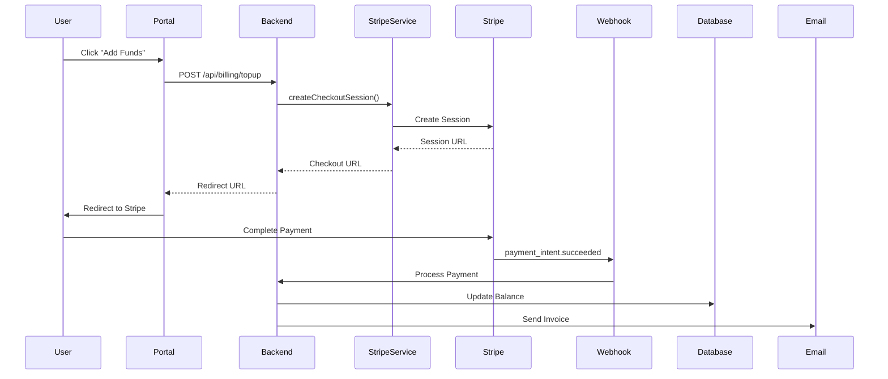
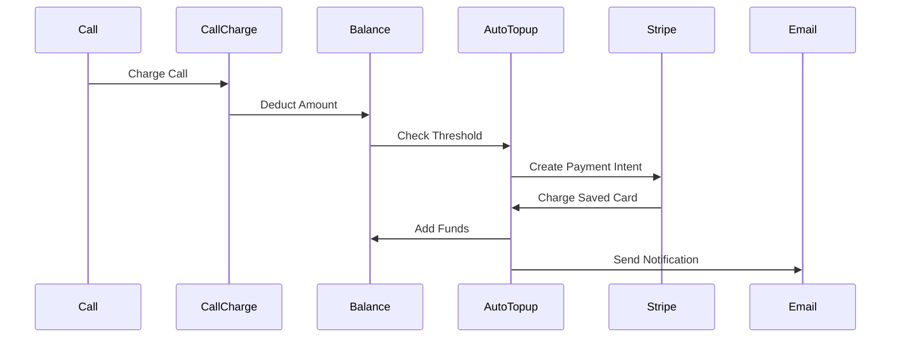
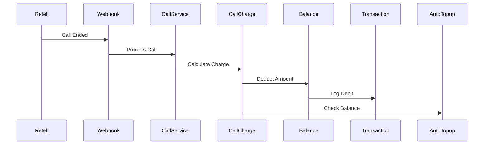

# 🏦 Stripe Payment System Documentation for AskProAI

## 📋 Table of Contents
1. [System Overview](#system-overview)
2. [Architecture](#architecture)
3. [Core Components](#core-components)
4. [Payment Flows](#payment-flows)
5. [Configuration](#configuration)
6. [Testing](#testing)
7. [Operations Guide](#operations-guide)
8. [Troubleshooting](#troubleshooting)
9. [Security](#security)
10. [Monitoring](#monitoring)

---

## 🌟 System Overview

AskProAI implements a **prepaid billing system** where companies maintain a balance that is consumed by phone calls. The system integrates with Stripe for payment processing and supports multiple payment methods including credit cards and SEPA direct debit.

### Key Features
- **Prepaid Balance Management**: Companies top up their balance before using services
- **Usage-Based Billing**: Charges per minute of phone calls (configurable rate)
- **Auto-Topup**: Automatic balance replenishment when threshold is reached
- **Multiple Payment Methods**: Cards, SEPA Direct Debit, Giropay, Sofort
- **Invoice Generation**: Automatic PDF invoices for all transactions
- **Bonus System**: Configurable bonus rules for topups
- **Refund Processing**: Full or partial refunds for calls
- **Multi-Currency**: Support for EUR (primary) and other currencies

### Business Model
- **Primary Model**: Prepaid balance with per-minute charging
- **Billing Rate**: €0.42/minute (configurable per company)
- **Billing Increment**: Second-based (configurable)
- **Auto-Topup**: Optional automatic balance replenishment
- **Bonus Rules**: Volume-based bonuses on topups

---

## 🏗️ Architecture

### High-Level Architecture
```
┌─────────────────┐     ┌─────────────────┐     ┌─────────────────┐
│  Business       │────▶│   AskProAI      │────▶│     Stripe      │
│  Portal UI      │     │   Backend       │     │      API        │
└─────────────────┘     └─────────────────┘     └─────────────────┘
                              │                         │
                              ▼                         ▼
                        ┌─────────────────┐     ┌─────────────────┐
                        │   Database      │     │    Webhooks     │
                        │  (MariaDB)      │◀────│    Endpoint     │
                        └─────────────────┘     └─────────────────┘
```

### Database Schema
```sql
prepaid_balances
├── id
├── company_id (unique)
├── balance (current balance)
├── reserved_balance (for ongoing calls)
├── low_balance_threshold
├── auto_topup_enabled
├── auto_topup_threshold
├── auto_topup_amount
├── stripe_payment_method_id
└── timestamps

balance_topups
├── id
├── company_id
├── amount
├── currency
├── status (pending|processing|succeeded|failed)
├── stripe_payment_intent_id
├── stripe_checkout_session_id
├── invoice_id
├── initiated_by (portal_user_id)
└── timestamps

balance_transactions
├── id
├── company_id
├── type (topup|charge|refund|adjustment)
├── amount (+/- value)
├── balance_before
├── balance_after
├── description
├── reference_type
├── reference_id
└── timestamps

call_charges
├── id
├── call_id
├── company_id
├── duration_seconds
├── rate_per_minute
├── amount_charged
├── refund_status
├── refunded_amount
└── timestamps
```

---

## 🔧 Core Components

### 1. StripeTopupService
**Location**: `app/Services/StripeTopupService.php`

Primary service for handling Stripe payments:
- Creates Checkout Sessions for web-based payments
- Creates Payment Intents for direct API payments
- Manages Stripe customers
- Handles payment methods
- Processes webhooks
- Generates invoices

**Key Methods**:
```php
// Create web checkout
createCheckoutSession(Company $company, float $amount, PortalUser $user)

// Direct payment
createPaymentIntent(Company $company, float $amount, PortalUser $user)

// Auto-topup
createPaymentIntentWithPaymentMethod(Company $company, float $amount, string $paymentMethodId)

// Customer management
getOrCreateCustomer(Company $company)
listPaymentMethods(Company $company)
```

### 2. AutoTopupService
**Location**: `app/Services/AutoTopupService.php`

Manages automatic balance replenishment:
- Monitors balance thresholds
- Executes automatic payments
- Enforces daily/monthly limits
- Sends notifications

**Key Features**:
- Threshold monitoring after each call
- Daily limit: 2 auto-topups
- Monthly limit: Configurable per company
- Email notifications on success/failure

### 3. PrepaidBillingService
**Location**: `app/Services/PrepaidBillingService.php`

Core billing logic:
- Balance management (add/deduct/reserve)
- Transaction logging
- Bonus rule application
- Usage analytics

### 4. StripeWebhookController
**Location**: `app/Http/Controllers/StripeWebhookController.php`

Webhook endpoint for Stripe events:
- Signature verification
- Event routing
- Asynchronous processing
- Error handling

**Supported Events**:
- `payment_intent.succeeded`
- `payment_intent.payment_failed`
- `checkout.session.completed`
- `charge.refunded`

### 5. StripeMCPServer
**Location**: `app/Services/MCP/StripeMCPServer.php`

MCP interface for Stripe operations:
- Payment overview dashboards
- Customer payment history
- Invoice management
- Refund processing
- Financial reporting

---

## 💳 Payment Flows

### 1. Manual Topup Flow


### 2. Auto-Topup Flow


### 3. Call Charging Flow


---

## ⚙️ Configuration

### Environment Variables
```env
***REMOVED***
STRIPE_KEY=pk_test_... # Publishable key
STRIPE_SECRET=sk_test_... # Secret key
STRIPE_WEBHOOK_SECRET=whsec_... # Webhook signing secret

# Feature Flags
STRIPE_TEST_MODE=true # Enable test mode
PREPAID_BILLING_ENABLED=true # Enable prepaid system
AUTO_TOPUP_ENABLED=true # Enable auto-topup feature

# Default Settings
DEFAULT_BILLING_RATE=0.42 # EUR per minute
DEFAULT_LOW_BALANCE_THRESHOLD=20.00 # EUR
DEFAULT_AUTO_TOPUP_THRESHOLD=10.00 # EUR
DEFAULT_AUTO_TOPUP_AMOUNT=50.00 # EUR
```

### Stripe Dashboard Configuration

#### 1. Payment Methods
Enable in Dashboard → Settings → Payment Methods:
- ✅ Cards (Required)
- ✅ SEPA Direct Debit (Recommended for EU)
- ✅ Giropay (Optional)
- ✅ Sofort (Optional)

#### 2. Webhooks
Create webhook at Dashboard → Webhooks:
- **Endpoint URL**: `https://api.askproai.de/api/stripe/webhook`
- **Events**:
  - `checkout.session.completed`
  - `payment_intent.succeeded`
  - `payment_intent.payment_failed`
  - `charge.succeeded`
  - `charge.failed`
  - `charge.refunded`

#### 3. Checkout Settings
Configure at Dashboard → Settings → Checkout:
- **Allowed countries**: Germany, Austria, Switzerland
- **Collect billing address**: Yes
- **Phone number**: Optional

---

## 🧪 Testing

### Test Mode Setup
```bash
# Enable test mode
./test-stripe-billing.sh start

# Run configuration check
php stripe-test-checklist.php

# Test topup flow
php test-public-topup.php
```

### Test Cards
```
✅ Success:           4242 4242 4242 4242
❌ Decline:           4000 0000 0000 9995
🔐 3D Secure:         4000 0025 0000 3155
💶 SEPA:              DE89 3704 0044 0532 0130 00
```

### Integration Tests
```bash
# Run Stripe integration tests
php artisan test --testsuite=Integration --filter=Stripe

# Test webhook processing
php artisan test tests/Integration/Stripe/StripeWebhookIntegrationTest.php

# Test invoice workflow
php artisan test tests/Integration/Stripe/StripeInvoiceWorkflowTest.php
```

### Manual Testing Checklist
1. **Topup Flow**
   - [ ] Access topup page
   - [ ] Complete Stripe checkout
   - [ ] Verify balance updated
   - [ ] Check invoice generated
   - [ ] Confirm email sent

2. **Auto-Topup**
   - [ ] Configure auto-topup
   - [ ] Trigger low balance
   - [ ] Verify automatic charge
   - [ ] Check notifications

3. **Refunds**
   - [ ] Process refund in admin
   - [ ] Verify Stripe refund
   - [ ] Check balance updated
   - [ ] Confirm transaction logged

---

## 📊 Operations Guide

### Daily Operations

#### Check Payment Health
```bash
# View recent topups
php artisan tinker
>>> BalanceTopup::where('created_at', '>=', now()->subDay())->get()

# Check failed payments
>>> BalanceTopup::where('status', 'failed')->where('created_at', '>=', now()->subWeek())->get()

# Monitor auto-topup activity
>>> DB::table('balance_transactions')->where('reference_type', 'auto_topup')->where('created_at', '>=', now()->subDay())->get()
```

#### Balance Monitoring
```sql
-- Companies with low balance
SELECT c.name, pb.balance, pb.auto_topup_enabled
FROM prepaid_balances pb
JOIN companies c ON c.id = pb.company_id
WHERE pb.balance < pb.low_balance_threshold
ORDER BY pb.balance ASC;

-- Daily revenue
SELECT DATE(created_at) as date, SUM(amount) as revenue
FROM balance_topups
WHERE status = 'succeeded'
GROUP BY DATE(created_at)
ORDER BY date DESC
LIMIT 30;
```

### Manual Balance Adjustment
```php
// In admin panel or via tinker
$company = Company::find($companyId);
$balance = $company->prepaidBalance;

// Add credit
$balance->addBalance(50.00, 'Manual credit by admin', 'admin_adjustment');

// Deduct amount
$balance->deductBalance(10.00, 'Manual debit - refund', 'admin_adjustment');
```

### Invoice Management
```php
// Regenerate invoice
$topup = BalanceTopup::find($topupId);
$invoiceService = app(StripeTopupService::class);
$invoice = $invoiceService->createTopupInvoice($topup);

// Send invoice manually
Mail::to($company->email)->send(new InvoiceMail($invoice));
```

---

## 🔧 Troubleshooting

### Common Issues

#### 1. Payment Fails with "Invalid API Key"
**Cause**: Mismatch between test/live mode
**Solution**:
```bash
# Check current mode
php artisan tinker
>>> config('services.stripe.secret')

# Verify in Stripe dashboard that key matches mode
```

#### 2. Webhook Signature Verification Failed
**Cause**: Wrong webhook secret
**Solution**:
```bash
# Get webhook secret from Stripe Dashboard
# Update .env
STRIPE_WEBHOOK_SECRET=whsec_correct_secret_here

# Clear config cache
php artisan config:clear
```

#### 3. Balance Not Updated After Payment
**Cause**: Webhook not processed
**Solution**:
```bash
# Check webhook logs
tail -f storage/logs/laravel.log | grep -i stripe

# Check failed jobs
php artisan queue:failed

# Retry webhook manually
php artisan queue:retry {job-id}
```

#### 4. Auto-Topup Not Triggering
**Checklist**:
```sql
-- Check configuration
SELECT * FROM prepaid_balances WHERE company_id = ?;

-- Verify payment method
SELECT stripe_payment_method_id FROM prepaid_balances WHERE company_id = ?;

-- Check daily limits
SELECT COUNT(*) FROM balance_transactions 
WHERE company_id = ? 
AND reference_type = 'auto_topup' 
AND DATE(created_at) = CURDATE();
```

#### 5. Invoice Not Generated
**Debug Steps**:
```php
// Check if invoice service is working
$topup = BalanceTopup::latest()->first();
$service = app(StripeTopupService::class);
$invoice = $service->createTopupInvoice($topup);
dd($invoice);
```

### Error Recovery

#### Failed Payment Recovery
```php
// Find failed topup
$topup = BalanceTopup::where('status', 'failed')->find($topupId);

// Create new payment intent
$service = app(StripeTopupService::class);
$intent = $service->createPaymentIntent(
    $topup->company,
    $topup->amount,
    $topup->initiatedBy
);

// Update topup
$topup->update([
    'stripe_payment_intent_id' => $intent->id,
    'status' => 'processing'
]);
```

#### Webhook Reprocessing
```php
// Replay webhook from Stripe Dashboard
// Or manually process:
$controller = app(StripeWebhookController::class);
$request = Request::create('/webhook', 'POST', [], [], [], [], $webhookPayload);
$request->headers->set('Stripe-Signature', $signature);
$response = $controller->handleWebhook($request);
```

---

## 🔐 Security

### Security Measures

1. **Webhook Signature Verification**
   - All webhooks verified using Stripe signature
   - Prevents replay attacks
   - Validates payload integrity

2. **API Key Protection**
   - Keys stored in environment variables
   - Never exposed in client-side code
   - Separate test/live keys

3. **Payment Method Security**
   - Payment methods validated against customer
   - No card details stored locally
   - PCI compliance through Stripe

4. **Access Control**
   - Portal users need billing permissions
   - Admin-only balance adjustments
   - Audit trail for all transactions

### Security Checklist
- [ ] Webhook endpoint uses HTTPS
- [ ] Webhook signature verification enabled
- [ ] API keys rotated regularly
- [ ] Test mode disabled in production
- [ ] Error messages don't expose sensitive data
- [ ] Transaction logs exclude card numbers
- [ ] Database backups encrypted

---

## 📈 Monitoring

### Key Metrics

#### Business Metrics
```sql
-- Daily Active Companies (making calls)
SELECT COUNT(DISTINCT company_id) as active_companies
FROM call_charges
WHERE DATE(charged_at) = CURDATE();

-- Average Balance
SELECT AVG(balance) as avg_balance
FROM prepaid_balances
WHERE balance > 0;

-- Topup Frequency
SELECT company_id, COUNT(*) as topup_count
FROM balance_topups
WHERE status = 'succeeded'
AND created_at >= DATE_SUB(NOW(), INTERVAL 30 DAY)
GROUP BY company_id;
```

#### System Health
```sql
-- Failed payment rate
SELECT 
    DATE(created_at) as date,
    COUNT(CASE WHEN status = 'failed' THEN 1 END) as failed,
    COUNT(*) as total,
    (COUNT(CASE WHEN status = 'failed' THEN 1 END) / COUNT(*)) * 100 as failure_rate
FROM balance_topups
GROUP BY DATE(created_at)
ORDER BY date DESC
LIMIT 7;

-- Webhook processing time
SELECT 
    event_type,
    AVG(processed_at - created_at) as avg_processing_time,
    MAX(processed_at - created_at) as max_processing_time
FROM webhook_events
WHERE provider = 'stripe'
AND created_at >= DATE_SUB(NOW(), INTERVAL 24 HOUR)
GROUP BY event_type;
```

### Alerts to Configure

1. **Low Balance Alert**
   - Trigger: Balance < threshold
   - Action: Send email to company
   - Frequency: Once per day

2. **Payment Failure Alert**
   - Trigger: Payment failed
   - Action: Notify company + admin
   - Include: Failure reason

3. **High Failure Rate**
   - Trigger: >10% failures in 1 hour
   - Action: Alert technical team
   - Check: Stripe API status

4. **Auto-Topup Failure**
   - Trigger: Auto-topup failed
   - Action: Email company
   - Suggest: Update payment method

### Monitoring Dashboard
Access Filament admin panel:
- **Prepaid Balances**: `/admin/prepaid-balances`
- **Transactions**: View via company detail
- **Stripe Status**: Widget on dashboard
- **Failed Payments**: Filter in topups list

---

## 🚀 Deployment Checklist

### Pre-Deployment
- [ ] Test payments in test mode
- [ ] Verify webhook configuration
- [ ] Check invoice templates
- [ ] Test email delivery
- [ ] Verify auto-topup logic
- [ ] Review security settings

### Deployment Steps
1. **Update Environment**
   ```bash
   # Add production Stripe keys
   STRIPE_KEY=pk_live_...
   STRIPE_SECRET=sk_live_...
   STRIPE_WEBHOOK_SECRET=whsec_live_...
   ```

2. **Run Migrations**
   ```bash
   php artisan migrate --force
   ```

3. **Configure Webhooks**
   - Create production webhook in Stripe
   - Update webhook secret
   - Test webhook endpoint

4. **Enable Features**
   ```bash
   # Enable for specific companies
   php artisan tinker
   >>> Company::find($id)->update(['prepaid_billing_enabled' => true])
   ```

### Post-Deployment
- [ ] Process test payment (€1)
- [ ] Verify webhook received
- [ ] Check balance updated
- [ ] Confirm invoice generated
- [ ] Test auto-topup trigger
- [ ] Monitor error logs

---

## 📚 Additional Resources

### Internal Documentation
- [Stripe Integration Plan](./STRIPE_INTEGRATION_PLAN_2025-06-19.md)
- [Stripe Testing Guide](./STRIPE_TESTING_GUIDE.md)
- [Webhook Testing Guide](./STRIPE_WEBHOOK_TESTING_GUIDE.md)

### External Resources
- [Stripe API Docs](https://stripe.com/docs/api)
- [Stripe PHP SDK](https://github.com/stripe/stripe-php)
- [Stripe Test Cards](https://stripe.com/docs/testing)
- [Stripe Webhooks](https://stripe.com/docs/webhooks)

### Support Contacts
- **Technical Issues**: Check Laravel logs first
- **Stripe Support**: Available in Stripe Dashboard
- **Integration Help**: Refer to MCP tools

---

## 🔄 Maintenance

### Regular Tasks

#### Daily
- Monitor failed payments
- Check low balance companies
- Review error logs

#### Weekly
- Audit suspicious transactions
- Review auto-topup patterns
- Check webhook delivery rate

#### Monthly
- Rotate API keys (if needed)
- Review pricing/rates
- Audit access permissions
- Generate financial reports

### Update Procedures

#### Updating Stripe SDK
```bash
composer update stripe/stripe-php
php artisan test --filter=Stripe
```

#### Adding New Payment Method
1. Enable in Stripe Dashboard
2. Update checkout configuration
3. Test payment flow
4. Update documentation

#### Changing Billing Rates
```php
// Update default rate
BillingRate::where('company_id', $companyId)->update([
    'rate_per_minute' => 0.50
]);

// Apply to new calls only
```

---

This documentation covers all aspects of the Stripe payment integration in AskProAI. For specific implementation details, refer to the source code and inline documentation.