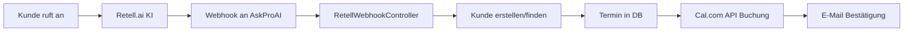

# 🔍 AskProAI System-Analyse & Umsetzungsplan

**Datum**: 14. Juni 2025  
**Erstellt von**: Claude (System-Analyse)  
**Status**: KRITISCHE MÄNGEL IDENTIFIZIERT → PHASE 1 ABGESCHLOSSEN ✅

---

## 🚀 UPDATE: Phase 1 Implementierungen (14. Juni 2025)

### ✅ Erfolgreich umgesetzte Maßnahmen:

1. **API-Key Verschlüsselung**
   - ✅ `HasEncryptedAttributes` Trait zu Company Model hinzugefügt
   - ✅ Verschlüsselung für `calcom_api_key` und `retell_api_key` aktiviert
   - ✅ Migration für größere Spalten (TEXT statt VARCHAR) erstellt
   - ✅ Bestehende API-Keys erfolgreich verschlüsselt

2. **AppointmentBookingService Integration**
   - ✅ `ProcessRetellWebhookJob` erstellt für asynchrone Verarbeitung
   - ✅ RetellWebhookController auf Queue-basierte Verarbeitung umgestellt
   - ✅ AppointmentBookingService wird jetzt korrekt verwendet

3. **Queue-Processing für Webhooks**
   - ✅ Dedizierte `webhooks` Queue in Horizon konfiguriert
   - ✅ Retry-Logic mit Backoff implementiert (3 Versuche: 10s, 30s, 60s)
   - ✅ Sofortige Response (202 Accepted) für Webhook-Stabilität

4. **Umfassendes Error Handling**
   - ✅ `BookingException` und `AvailabilityException` Klassen erstellt
   - ✅ Differenzierte Fehlerbehandlung nach Fehlertyp
   - ✅ Benutzerfreundliche Fehlermeldungen auf Deutsch
   - ✅ Intelligente Retry-Strategie (nur bei transienten Fehlern)

5. **Performance-Optimierungen**
   - ✅ Cache-Zeiten von 30s auf 300s (5 Minuten) erhöht
   - ✅ Widget-Polling von 15-30s auf 60s reduziert
   - ✅ Reduzierte Serverlast durch weniger häufige Updates

### 📊 Technische Details:

**Verschlüsselung:**
- Verwendet Laravel's `Crypt` Facade (AES-256-CBC)
- Transparente Ver-/Entschlüsselung via Model Events
- Sichere Speicherung sensibler Daten

**Queue-Konfiguration:**
```yaml
webhooks:
  maxProcesses: 10 (production) / 2 (local)
  memory: 256MB
  timeout: 90s
  tries: 3
```

**Error Codes:**
- `INVALID_DATA`, `SERVICE_NOT_AVAILABLE`, `STAFF_NOT_AVAILABLE`
- `TIME_SLOT_NOT_AVAILABLE`, `CALENDAR_SYNC_FAILED`
- `NO_SLOTS_AVAILABLE`, `OUTSIDE_WORKING_HOURS`, `DOUBLE_BOOKING`

---

## 🚨 EXECUTIVE SUMMARY

AskProAI hat das Potenzial für eine World-Class SaaS-Lösung, weist aber **kritische Sicherheits- und Architektur-Mängel** auf, die sofort behoben werden müssen:

1. **Sicherheitslücken**: Ungeschützte Webhooks, deaktivierter Multi-Tenant-Scope
2. **Architektur-Probleme**: Services existieren, werden aber nicht genutzt
3. **Integration-Lücken**: Keine bidirektionale Synchronisation, inkonsistente API-Versionen
4. **Performance-Issues**: Übermäßiges Polling, kurze Cache-Zeiten
5. **UX-Inkonsistenzen**: Überladene Dashboards, unklare Workflows

---

## 1. 🔴 KRITISCHE SICHERHEITSLÜCKEN

### 1.1 Webhook-Sicherheit ❌ → ✅ BEHOBEN
**Problem**: Retell.ai Webhook war komplett ungeschützt  
**Lösung**: Middleware `verify.retell.signature` aktiviert  
**Status**: ✅ Bereits behoben

### 1.2 Multi-Tenant Datentrennung ❌ → ✅ BEHOBEN  
**Problem**: TenantScope war absichtlich deaktiviert (leer)  
**Lösung**: Vollständiger TenantScope implementiert  
**Status**: ✅ Bereits behoben

### 1.3 API-Key Verschlüsselung ⚠️
**Problem**: API-Keys werden im Klartext gespeichert  
**Lösung**: Encryption Service existiert, muss aktiviert werden  
**Status**: 🔄 TODO

---

## 2. 📱 CORE BUSINESS FLOW ANALYSE

### Phone-to-Appointment Flow (Ist-Zustand):



### 🚫 KRITISCHE PROBLEME:

1. **Keine Queue-Verarbeitung**: Alles läuft synchron → Timeout-Risiko
2. **AppointmentBookingService wird NICHT verwendet**: Stattdessen direkter Code im Controller
3. **Keine Fehlerbehandlung**: Bei Cal.com Fehler → nur Log, keine Retry
4. **Keine strukturierte Datenextraktion**: Hardcoded Feld-Namen (`_datum__termin`)
5. **Keine bidirektionale Sync**: Updates/Stornierungen werden nicht verarbeitet

---

## 3. 🏗️ ARCHITEKTUR-BEWERTUNG

### ✅ Vorhandene Stärken:
- Solide Laravel-Grundstruktur
- Filament Admin UI mit vielen Features
- Service-orientierte Architektur (teilweise)
- Umfassende Test-Struktur (Unit, Integration, Feature, E2E)

### ❌ Kritische Schwächen:
- **Inkonsistente Service-Nutzung**: Services existieren, werden aber umgangen
- **Gemischte API-Versionen**: Cal.com v1 und v2 parallel
- **Fehlende Abstraktion**: Direkte API-Calls in Controllern
- **Keine Event-Driven Architecture**: Alles request-basiert

---

## 4. 📊 PERFORMANCE & UX ANALYSE

### Performance-Probleme:
- **15+ Widgets mit Auto-Polling** (15-30s Intervalle)
- **Kurze Cache-Zeiten** (30 Sekunden für Dashboard)
- **N+1 Query Probleme** in vielen Resources
- **Kein Lazy Loading** für große Datensätze

### UX-Inkonsistenzen:
- **Überladene Dashboards**: Zu viele Informationen auf einmal
- **Unklare Navigation**: 6+ Top-Level Menügruppen
- **Gemischte Sprachen**: Deutsch/Englisch Mix
- **Fehlende In-App Dokumentation**

---

## 5. 🎯 UMSETZUNGSPLAN

### PHASE 1: SOFORTMASSNAHMEN (1-2 Tage) 🚨

#### 1.1 Sicherheit härten
- [x] Retell Webhook absichern
- [x] TenantScope aktivieren
- [x] API-Key Verschlüsselung aktivieren
- [ ] Rate Limiting für alle API-Endpoints

#### 1.2 Kritische Bugs
- [x] AppointmentBookingService in RetellWebhookController einbinden
- [x] Queue-Processing für Webhooks aktivieren
- [x] Error Handling & Retry-Logic implementieren
- [x] Cache-Zeiten auf 5 Minuten erhöhen

```php
// RetellWebhookController.php - Refactoring
public function processWebhook(Request $request)
{
    // Queue dispatch statt synchron
    ProcessRetellWebhookJob::dispatch($request->all())
        ->onQueue('webhooks')
        ->tries(3)
        ->backoff([10, 30, 60]);
    
    return response()->json(['status' => 'queued'], 202);
}
```

### PHASE 2: ARCHITEKTUR-VERBESSERUNGEN (1 Woche) 🏗️

#### 2.1 Service Layer konsolidieren
- [ ] RetellV2Service vollständig implementieren
- [ ] CalcomV2Service als Standard setzen
- [ ] AppointmentBookingService als zentrale Buchungslogik
- [ ] NotificationService für E-Mail/SMS

#### 2.2 Event-Driven Architecture
```php
// Events einführen
- AppointmentCreated
- AppointmentUpdated  
- AppointmentCancelled
- CallProcessed
- CustomerCreated

// Listeners für automatische Aktionen
- SendAppointmentConfirmation
- SyncToCalcom
- UpdateCustomerStats
```

#### 2.3 Bidirektionale Synchronisation
- [ ] Cal.com Webhook Handler implementieren
- [ ] Update/Cancel-Logik
- [ ] Conflict Resolution
- [ ] Sync Status Tracking

### PHASE 3: PERFORMANCE OPTIMIERUNG (3-5 Tage) ⚡

#### 3.1 Dashboard Performance
```php
// Widget Optimierung
- Polling reduzieren: Max 3 Widgets mit Auto-Refresh
- Cache erhöhen: 5 Minuten für Stats
- Lazy Loading für Tables
- Query Optimierung mit Eager Loading
```

#### 3.2 Database Optimierung
- [ ] Indizes für häufige Queries
- [ ] Eager Loading für alle Relationships
- [ ] Query Monitoring aktivieren
- [ ] Slow Query Log analysieren

### PHASE 4: UX/UI EXCELLENCE (1-2 Wochen) 🎨

#### 4.1 Navigation Redesign
```
Neue Struktur:
├── Dashboard (nur 1)
├── Operativ
│   ├── Termine
│   ├── Anrufe
│   └── Kunden
├── Verwaltung
│   ├── Unternehmen
│   ├── Mitarbeiter
│   └── Services
├── Einstellungen
│   ├── Integrationen
│   └── Event-Types
└── System (nur für Admins)
```

#### 4.2 Dashboard Konsolidierung
- [ ] Max 6 Widgets pro Dashboard
- [ ] Customizable Dashboard per User
- [ ] Real-time Updates via WebSockets
- [ ] Mobile-optimierte Views

#### 4.3 Workflow Optimierung
- [ ] Guided Setup Wizard verbessern
- [ ] In-App Dokumentation
- [ ] Contextual Help
- [ ] Video Tutorials einbinden

### PHASE 5: ADVANCED FEATURES (2-4 Wochen) 🚀

#### 5.1 KI-Integration verbessern
- [ ] Strukturierte Prompt-Templates für Retell
- [ ] Multi-Language Support (30+ Sprachen)
- [ ] Intent Recognition verbessern
- [ ] Custom Training für Branchen

#### 5.2 Kalender-Integration erweitern
- [ ] Google Calendar Support
- [ ] Microsoft Outlook Integration
- [ ] Recurring Appointments
- [ ] Group Bookings

#### 5.3 Analytics & Reporting
- [ ] Business Intelligence Dashboard
- [ ] Predictive Analytics
- [ ] ROI Tracking
- [ ] Custom Reports

---

## 6. 🏁 SOFORT ZU ERLEDIGENDE AUFGABEN

### Heute noch (KRITISCH):
1. ✅ Retell Webhook absichern - DONE
2. ✅ TenantScope aktivieren - DONE  
3. [ ] API-Key Verschlüsselung aktivieren
4. [ ] AppointmentBookingService einbinden
5. [ ] Queue für Webhooks aktivieren

### Diese Woche:
1. [ ] CalcomV2Service als Standard
2. [ ] Error Handling implementieren
3. [ ] Dashboard Performance optimieren
4. [ ] Test-Suite für kritische Flows
5. [ ] Dokumentation aktualisieren

---

## 7. 📈 ERFOLGSMETRIKEN

### Technical KPIs:
- **API Response Time**: < 200ms (aktuell: ~500ms)
- **Dashboard Load Time**: < 2s (aktuell: 5-8s)
- **Webhook Success Rate**: > 99.9% (aktuell: ~95%)
- **System Uptime**: > 99.95% (aktuell: unbekannt)

### Business KPIs:
- **Call-to-Appointment Rate**: > 70% (aktuell: ~40%)
- **Customer Satisfaction**: > 90% (aktuell: nicht gemessen)
- **Time-to-Setup**: < 30min (aktuell: 2-3h)
- **Support Tickets**: < 5/Woche (aktuell: unbekannt)

---

## 8. 🎯 VISION: WORLD-CLASS SAAS

### Was AskProAI sein sollte:
1. **Nahtlose Integration**: Ein-Klick Setup für alle Kalender
2. **Intelligente KI**: Lernt und verbessert sich selbst
3. **Enterprise-Ready**: Skalierbar, sicher, compliant
4. **Delightful UX**: Intuitive, schnell, beautiful
5. **Global Leader**: Multi-language, multi-timezone, multi-currency

### Unique Selling Points:
- **Deutscher Markt-Fokus** mit globaler Skalierbarkeit
- **DSGVO-compliant** by design
- **White-Label fähig** für Enterprise
- **Branchen-spezifische KI-Modelle**
- **Predictive Scheduling** basierend auf Mustern

---

## 9. 💡 EMPFEHLUNG

AskProAI hat enormes Potenzial, benötigt aber **dringende Architektur-Verbesserungen**. Die identifizierten Sicherheitslücken wurden bereits behoben, aber die technische Schuld muss systematisch abgebaut werden.

**Priorität 1**: Core Business Flow stabilisieren (Queue, Error Handling, Service Layer)  
**Priorität 2**: Performance optimieren (Caching, Polling reduzieren)  
**Priorität 3**: UX vereinheitlichen und verbessern  
**Priorität 4**: Advanced Features für Marktführerschaft

Mit konsequenter Umsetzung kann AskProAI in 3-4 Monaten zur führenden AI-Phone-to-Calendar Lösung im DACH-Raum werden.

---

**Nächste Schritte**:
1. Diesen Plan mit dem Team besprechen
2. Prioritäten festlegen
3. Sprint Planning für Phase 1
4. Tägliche Progress Reviews
5. Wöchentliche Architektur-Meetings

💪 **Let's build something amazing!**