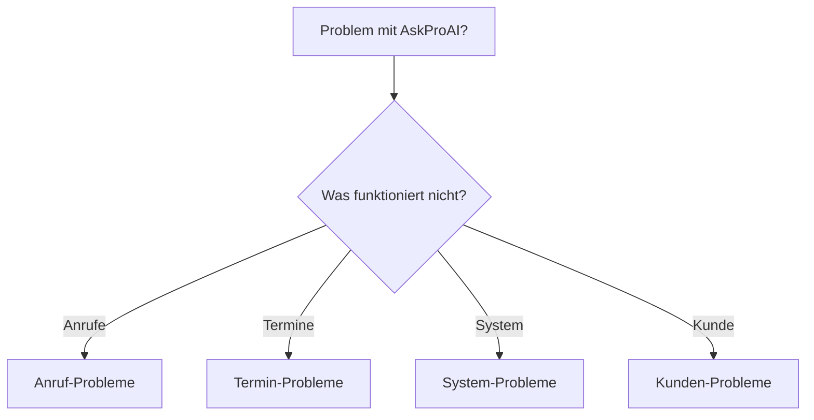

# 🔍 Troubleshooting Decision Tree - Problem → Lösung in max. 5 Klicks

> **Interaktiv**: Klicke auf [Check] Buttons für automatische Diagnose!

## 🎯 START HIER


---

## 📞 ANRUF-PROBLEME

### ❓ "Keine Anrufe kommen an"
```bash
# [Check 1] Horizon läuft?
php artisan horizon:status
```
↓ **Horizon inactive?** → [Fix](#fix-horizon)  
↓ **Horizon active?** → Weiter

```bash
# [Check 2] Retell Agent Status
php artisan retell:check-agent --company-id=X
```
↓ **Agent inaktiv?** → [Fix](#fix-agent-inactive)  
↓ **Agent aktiv?** → Weiter

```bash
# [Check 3] Telefonnummer-Mapping
php test-phone-resolution.php
```
↓ **Nicht gemapped?** → [Fix](#fix-phone-mapping)  
↓ **Korrekt gemapped?** → Weiter

```bash
# [Check 4] Webhook-Konfiguration
php verify-webhook-status.php
```
↓ **Webhook falsch?** → [Fix](#fix-webhook-config)  
↓ **Alles OK?** → [Eskalation](#escalation)

### ❓ "AI versteht Kunden nicht"
```bash
# [Check 1] Sprach-Einstellungen
php artisan retell:check-language --company-id=X
```
↓ **Falsche Sprache?** → [Fix](#fix-language)  
↓ **Sprache OK?** → Weiter

```bash
# [Check 2] Prompt-Qualität
php artisan ai:analyze-prompt --company-id=X
```
↓ **Score < 70%?** → [Fix](#fix-prompt)  
↓ **Prompt OK?** → [Fix](#fix-voice-settings)

### ❓ "Anrufe brechen ab"
```bash
# [Check 1] Timeout-Settings
php artisan config:get retell.call_timeout
```
↓ **< 300 Sekunden?** → [Fix](#fix-timeout)  
↓ **Timeout OK?** → Weiter

```bash
# [Check 2] Webhook-Performance
php artisan webhook:measure-response-time
```
↓ **> 500ms?** → [Fix](#fix-webhook-performance)  
↓ **Performance OK?** → [Fix](#fix-memory-limit)

### ❓ "Anrufe werden nicht automatisch importiert"
```bash
# [Check 1] Cron-Jobs prüfen
crontab -l | grep retell
```
↓ **Keine Cron-Jobs?** → [Fix](#fix-cron-jobs)  
↓ **Cron-Jobs vorhanden?** → Weiter

```bash
# [Check 2] Import-Log prüfen
tail -50 /var/www/api-gateway/storage/logs/manual-retell-import.log
```
↓ **Fehler im Log?** → [Fix](#fix-import-errors)  
↓ **Log OK?** → [Fix](#fix-api-key)

### ❓ "Falsche Zeiten bei Anrufen"
```bash
# [Check 1] Zeitzone prüfen
php -r "echo date_default_timezone_get() . PHP_EOL;"
```
↓ **Nicht Europe/Berlin?** → [Fix](#fix-timezone)  
↓ **Zeitzone OK?** → [Fix](#fix-utc-conversion)

---

## 📅 TERMIN-PROBLEME

### ❓ "Keine Termine verfügbar"
```bash
# [Check 1] Cal.com Sync Status
php artisan calcom:check-sync --company-id=X
```
↓ **Sync failed?** → [Fix](#fix-calcom-sync)  
↓ **Sync OK?** → Weiter

```bash
# [Check 2] Verfügbarkeit prüfen
php artisan availability:check --branch-id=X --next-days=7
```
↓ **Keine Slots?** → [Fix](#fix-availability)  
↓ **Slots vorhanden?** → Weiter

```bash
# [Check 3] Event Type Mapping
php artisan branch:check-event-type --branch-id=X
```
↓ **Nicht gemapped?** → [Fix](#fix-event-type)  
↓ **Alles OK?** → [Fix](#fix-timezone)

### ❓ "Doppelte Termine"
```bash
# [Check 1] Webhook-Deduplizierung
php artisan webhook:check-duplicates --last-hour
```
↓ **Duplicates gefunden?** → [Fix](#fix-deduplication)  
↓ **Keine Duplicates?** → Weiter

```bash
# [Check 2] Queue-Status
php artisan queue:failed | grep appointment
```
↓ **Failed Jobs?** → [Fix](#fix-failed-jobs)  
↓ **Queue OK?** → [Fix](#fix-race-condition)

### ❓ "Falscher Mitarbeiter zugewiesen"
```bash
# [Check 1] Staff-Service Mapping
php artisan staff:check-assignments --branch-id=X
```
↓ **Falsche Zuordnung?** → [Fix](#fix-staff-assignment)  
↓ **Mapping OK?** → Weiter

```bash
# [Check 2] Service-Einstellungen
php artisan service:validate --branch-id=X
```
↓ **Services falsch?** → [Fix](#fix-service-config)  
↓ **Alles OK?** → [Fix](#fix-routing-logic)

---

## 💻 SYSTEM-PROBLEME

### ❓ "Dashboard lädt nicht"
```bash
# [Check 1] Server-Status
php artisan system:health-check
```
↓ **Services down?** → [Fix](#fix-services)  
↓ **Alles läuft?** → Weiter

```bash
# [Check 2] Cache-Probleme
php artisan cache:check-corruption
```
↓ **Cache corrupt?** → [Fix](#fix-cache)  
↓ **Cache OK?** → [Fix](#fix-permissions)

### ❓ "Emails kommen nicht an"
```bash
# [Check 1] Queue läuft?
php artisan queue:monitor emails
```
↓ **Queue stopped?** → [Fix](#fix-queue)  
↓ **Queue läuft?** → Weiter

```bash
# [Check 2] SMTP-Verbindung
php artisan email:test-smtp
```
↓ **SMTP failed?** → [Fix](#fix-smtp)  
↓ **SMTP OK?** → [Fix](#fix-spam-filter)

---

## 🧑‍💼 KUNDEN-PROBLEME

### ❓ "Kunde kann sich nicht einloggen"
```bash
# [Check 1] Account-Status
php artisan customer:check --email=kunde@example.de
```
↓ **Account locked?** → [Fix](#fix-account-locked)  
↓ **Account OK?** → Weiter

```bash
# [Check 2] Password-Reset
php artisan customer:can-reset-password --email=kunde@example.de
```
↓ **Reset blocked?** → [Fix](#fix-password-reset)  
↓ **Reset OK?** → [Fix](#fix-session)

---

## 🔧 FIX-ANLEITUNGEN

### <a id="fix-horizon"></a>**Fix: Horizon starten**
```bash
# Horizon starten
php artisan horizon

# Als Service einrichten (empfohlen)
sudo supervisorctl start horizon

# Prüfen
php artisan horizon:status
```

### <a id="fix-agent-inactive"></a>**Fix: Agent Inactive**
```bash
# Agent aktivieren
php artisan retell:activate-agent --company-id=X
# Oder in Retell Dashboard: Agent → Status → Active
```

### <a id="fix-phone-mapping"></a>**Fix: Phone Mapping**
```bash
# Telefonnummer zu Branch mappen
php artisan phone:assign --number="+49..." --branch-id=X
# Verification
php test-phone-resolution.php

# WICHTIG: Telefonnummer muss BEIDE haben:
# - company_id
# - branch_id
```

### <a id="fix-webhook-config"></a>**Fix: Webhook Config**
```bash
# In Retell Dashboard:
# 1. Webhook URL: https://api.askproai.de/api/retell/webhook
# 2. Events: call_started, call_ended, call_analyzed
# 3. WICHTIG: API Key = Webhook Secret (gleicher Wert!)

# Testen
php trigger-simple-webhook.php
```

### <a id="fix-language"></a>**Fix: Language Settings**
```json
// In Retell Agent Settings:
{
  "language": "de-DE",
  "voice": "de-DE-KatjaNeural"
}
```

### <a id="fix-prompt"></a>**Fix: Prompt Quality**
```bash
# Optimierten Prompt laden
php artisan ai:load-optimized-prompt --company-id=X --industry=medical
# Custom anpassen in Retell Dashboard
```

### <a id="fix-voice-settings"></a>**Fix: Voice Settings**
```json
{
  "voice_settings": {
    "speed": 0.9,
    "pitch": 1.0,
    "stability": 0.85
  }
}
```

### <a id="fix-timeout"></a>**Fix: Timeout**
```bash
php artisan config:set retell.call_timeout=600
php artisan cache:clear
```

### <a id="fix-webhook-performance"></a>**Fix: Webhook Performance**
```bash
# Webhook-Queue aktivieren
php artisan config:set webhook.async=true
php artisan queue:restart
```

### <a id="fix-calcom-sync"></a>**Fix: Cal.com Sync**
```bash
# Force Sync
php artisan calcom:force-sync --company-id=X
# Circuit Breaker reset
php artisan circuit-breaker:reset calcom
```

### <a id="fix-availability"></a>**Fix: Availability**
```bash
# Working Hours prüfen
php artisan branch:show-hours --branch-id=X
# Manuelle Slots hinzufügen
php artisan availability:add-slots --branch-id=X --next-days=7
```

### <a id="fix-deduplication"></a>**Fix: Deduplication**
```bash
# Dedup-Window erhöhen
php artisan config:set webhook.deduplication_window=10
# Duplicates entfernen
php artisan appointments:remove-duplicates --confirm
```

### <a id="fix-cache"></a>**Fix: Cache**
```bash
# Kompletter Cache-Reset
php artisan optimize:clear
redis-cli FLUSHALL
php artisan config:cache
php artisan route:cache
```

### <a id="fix-cron-jobs"></a>**Fix: Cron Jobs einrichten**
```bash
# Crontab bearbeiten
crontab -e

# Diese Zeilen hinzufügen:
*/15 * * * * /usr/bin/php /var/www/api-gateway/manual-retell-import.php
*/5 * * * * /usr/bin/php /var/www/api-gateway/cleanup-stale-calls.php

# Prüfen
crontab -l
```

### <a id="fix-import-errors"></a>**Fix: Import Errors**
```bash
# Manueller Import
php import-retell-calls.php

# Bei API Key Fehler
php artisan tinker
>>> Company::first()->update(['retell_api_key' => config('services.retell.api_key')]);
```

### <a id="fix-api-key"></a>**Fix: API Key**
```bash
# API Key prüfen
grep RETELL_TOKEN .env

# In DB prüfen
mysql -u askproai_user -p'lkZ57Dju9EDjrMxn' askproai_db
SELECT id, name, retell_api_key FROM companies;
```

### <a id="fix-timezone"></a>**Fix: Timezone**
```bash
# In .env
APP_TIMEZONE=Europe/Berlin

# Cache clearen
php artisan config:cache
```

### <a id="fix-utc-conversion"></a>**Fix: UTC Conversion**
```bash
# Bereits im Code behoben!
# Alle neuen Anrufe werden automatisch konvertiert
# Für alte Anrufe:
php fix-call-timestamps.php
```

### <a id="fix-queue"></a>**Fix: Queue**
```bash
# Queue neu starten
php artisan queue:restart
php artisan horizon:terminate
php artisan horizon
```

### <a id="fix-smtp"></a>**Fix: SMTP**
```bash
# Backup SMTP aktivieren
php artisan config:set mail.mailer=backup_smtp
# Test-Mail senden
php artisan email:test --to=test@askproai.de
```

---

## 🚨 <a id="escalation"></a>ESKALATION

### Wenn nichts hilft:
1. **Sammle Infos**:
   ```bash
   php artisan debug:collect-info --output=debug-info.zip
   ```

2. **Erstelle Ticket**:
   ```bash
   php artisan support:create-ticket --priority=high --attach=debug-info.zip
   ```

3. **Notfall-Kontakt**:
   - Tech Support: +49 30 TECH-HELP
   - WhatsApp: +49 176 EMERGENCY
   - Email: urgent@askproai.de

---

## 📱 INTERAKTIVE WEB-VERSION

```html
<!DOCTYPE html>
<html>
<head>
    <title>AskProAI Troubleshooting</title>
    <style>
        .decision-node {
            background: #f3f4f6;
            border: 2px solid #e5e7eb;
            border-radius: 8px;
            padding: 16px;
            margin: 8px;
            cursor: pointer;
        }
        .decision-node:hover {
            border-color: #3b82f6;
        }
        .check-button {
            background: #3b82f6;
            color: white;
            border: none;
            padding: 8px 16px;
            border-radius: 4px;
            cursor: pointer;
        }
        .solution {
            background: #10b981;
            color: white;
            padding: 12px;
            border-radius: 6px;
            margin-top: 8px;
        }
    </style>
</head>
<body>
    <h1>🔍 Was funktioniert nicht?</h1>
    
    <div id="decision-tree">
        <div class="decision-node" onclick="showCallProblems()">
            📞 Anruf-Probleme
        </div>
        <div class="decision-node" onclick="showAppointmentProblems()">
            📅 Termin-Probleme
        </div>
        <div class="decision-node" onclick="showSystemProblems()">
            💻 System-Probleme
        </div>
    </div>
    
    <div id="problem-detail" style="display:none;">
        <!-- Dynamisch gefüllt -->
    </div>
    
    <script>
    async function runCheck(command) {
        const response = await fetch('/api/troubleshoot', {
            method: 'POST',
            body: JSON.stringify({ command }),
            headers: { 'Content-Type': 'application/json' }
        });
        return await response.json();
    }
    
    function showCallProblems() {
        document.getElementById('problem-detail').innerHTML = `
            <h2>Was genau ist das Problem?</h2>
            <button class="check-button" onclick="diagnose('no-calls')">
                Keine Anrufe kommen an
            </button>
            <button class="check-button" onclick="diagnose('ai-understanding')">
                AI versteht Kunden nicht
            </button>
        `;
        document.getElementById('problem-detail').style.display = 'block';
    }
    
    async function diagnose(problem) {
        // Führt automatische Checks durch
        const result = await runCheck(`diagnose:${problem}`);
        showSolution(result);
    }
    </script>
</body>
</html>
```

> 💡 **Pro-Tipp**: Speichere häufige Probleme als Bookmarks für 1-Klick-Lösung!