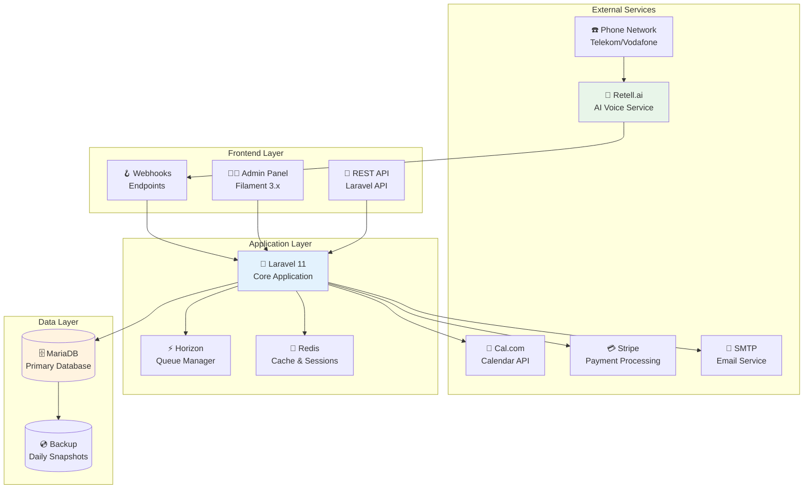
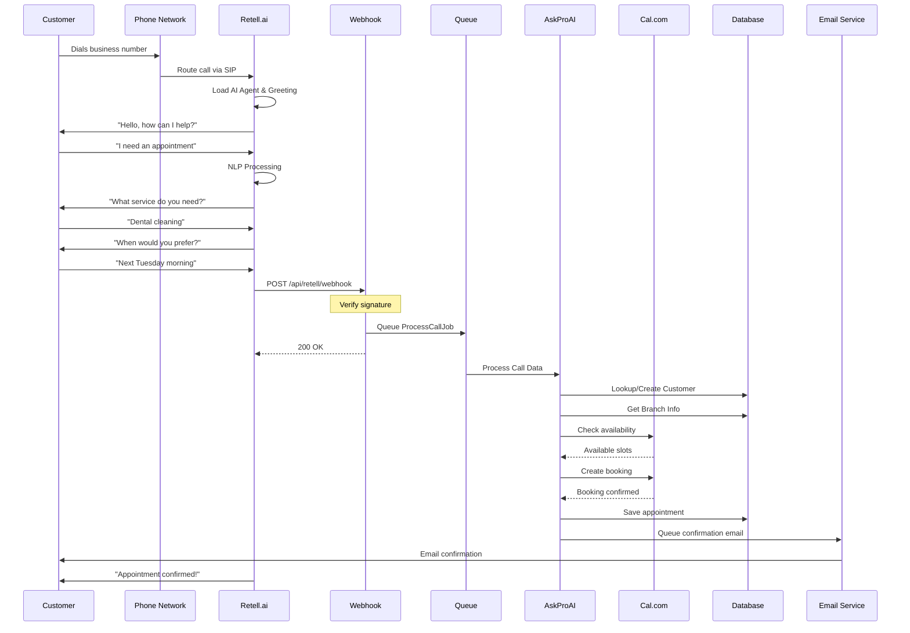
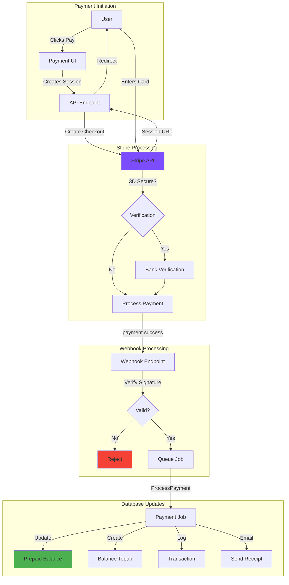
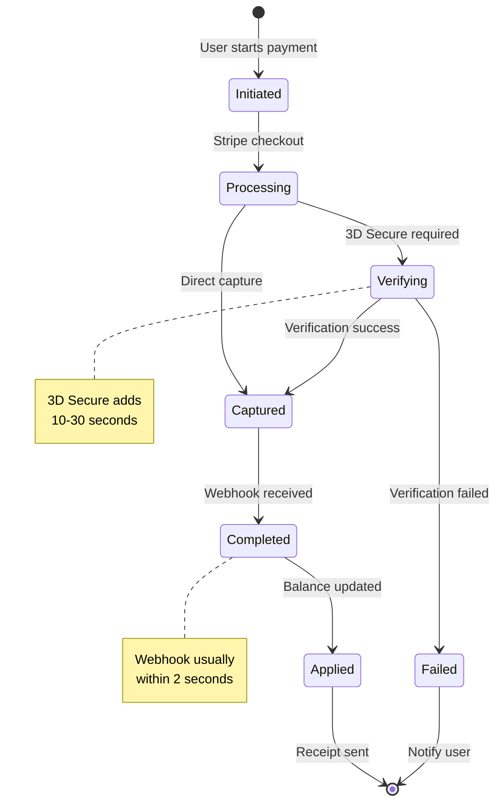
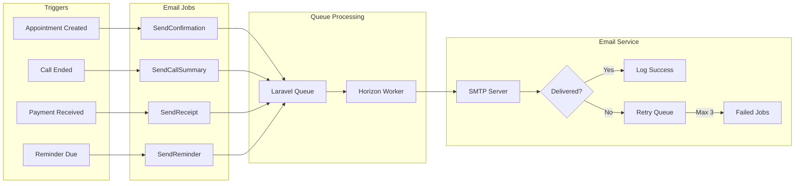
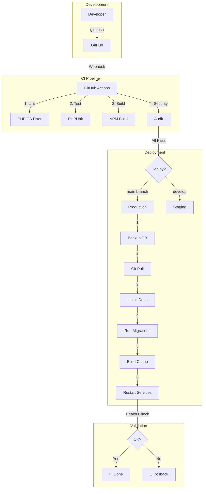
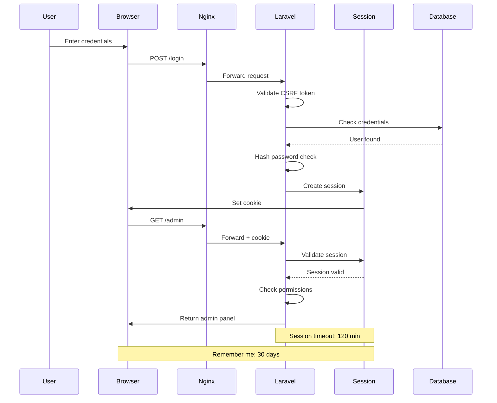
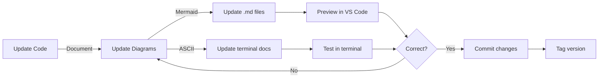

# 📊 AskProAI Visual Documentation Guide

> **Quick Navigation**: [Architecture](#system-architecture) | [Call Flow](#call-flow) | [Payment](#payment-processing) | [Email](#email-system) | [Deployment](#deployment-pipeline) | [Database](#database-schema) | [Network](#network-topology) | [Auth](#authentication-flow)

## 🎯 Overview

This guide contains visual diagrams for understanding AskProAI's system architecture and data flows. Each diagram is available in:
- **Mermaid format** - For web viewing and documentation
- **ASCII art** - For terminal and quick reference
- **PlantUML** - For high-quality exports

## 📐 Diagram Types & When to Use

| Diagram Type | Use Case | Best For |
|-------------|----------|----------|
| **Flowchart** | Process flows, decision trees | Call routing, booking logic |
| **Sequence** | Time-based interactions | API calls, webhooks |
| **Architecture** | System components | Infrastructure overview |
| **ER Diagram** | Database relationships | Schema documentation |
| **State** | Status transitions | Appointment lifecycle |
| **Gantt** | Timeline & scheduling | Deployment planning |

---

## 🏗️ System Architecture Overview

### Mermaid Diagram


### ASCII Art Version
```
┌─────────────────────────────────────────────────────────────────┐
│                        EXTERNAL SERVICES                         │
├─────────────┬──────────────┬──────────────┬───────────┬────────┤
│   Phone     │  Retell.ai   │   Cal.com    │  Stripe   │  SMTP  │
│  Network    │ Voice AI     │  Calendar    │ Payment   │ Email  │
└──────┬──────┴──────┬───────┴──────┬───────┴─────┬─────┴───┬────┘
       │             │               │              │         │
       └─────────────┘               │              │         │
                │                    │              │         │
┌───────────────▼────────────────────▼──────────────▼─────────▼───┐
│                         FRONTEND LAYER                           │
├─────────────────┬─────────────────┬─────────────────────────────┤
│  Admin Panel    │   REST API      │    Webhook Endpoints        │
│  (Filament)     │   (Laravel)     │    (Signature Verified)     │
└────────┬────────┴────────┬────────┴────────┬────────────────────┘
         │                 │                 │
         └─────────────────┴─────────────────┘
                           │
┌──────────────────────────▼──────────────────────────────────────┐
│                     APPLICATION LAYER                            │
├─────────────────┬─────────────────┬─────────────────────────────┤
│   Laravel 11    │    Horizon      │      Redis Cache            │
│   Core App      │  Queue Manager  │   Sessions & Cache          │
└────────┬────────┴────────┬────────┴────────┬────────────────────┘
         │                 │                 │
         └─────────────────┴─────────────────┘
                           │
┌──────────────────────────▼──────────────────────────────────────┐
│                        DATA LAYER                                │
├─────────────────────────┬───────────────────────────────────────┤
│      MariaDB           │           Daily Backups                │
│   Primary Database     │         (Encrypted)                    │
└────────────────────────┴───────────────────────────────────────┘
```

---

## 📞 Call Flow (Phone to Appointment)

### Detailed Sequence Diagram


### ASCII Flow Diagram
```
Customer                     System Flow                      Services
────────                     ───────────                      ────────
   │                                                          
   ├─[1]─> Dial Number ──────> Phone Network
   │                               │
   │                               ├─[2]─> Retell.ai
   │                               │          │
   │ <─────[3]─ AI Greeting <──────┘          │
   │                                          │
   ├─[4]─> "Need appointment" ───────────────>│
   │                                          │
   │ <─────[5]─ "What service?" <─────────────┤
   │                                          │
   ├─[6]─> "Dental cleaning" ────────────────>│
   │                                          │
   │ <─────[7]─ "When?" <─────────────────────┤
   │                                          │
   ├─[8]─> "Tuesday morning" ────────────────>│
   │                                          │
   │                                          ├─[9]─> Webhook
   │                                          │        │
   │                                          │        ├─[10]─> Queue
   │                                          │        │         │
   │                                          │        │    ├─[11]─> Process
   │                                          │        │    │        │
   │                                          │        │    │    ├─> Cal.com
   │                                          │        │    │    ├─> Database
   │                                          │        │    │    └─> Email
   │                                          │        │    │
   │ <─────[12]─ "Confirmed!" <───────────────┴────────┴────┘
   │
   └─[13]─> 📧 Receives Email
```

---

## 💳 Payment Processing Flow

### Stripe Integration Flow


### Payment States


---

## 📧 Email System Flow

### Email Processing Pipeline


### Email Template Structure
```
┌─────────────────────────────────────────────┐
│            EMAIL TEMPLATE SYSTEM            │
├─────────────────────────────────────────────┤
│                                             │
│  ┌─────────────────────────────────────┐   │
│  │         Base Template                │   │
│  │  - Header (Logo, Company)           │   │
│  │  - Content Block                    │   │
│  │  - Footer (Unsubscribe, Contact)    │   │
│  └──────────────┬──────────────────────┘   │
│                 │                           │
│    ┌────────────┼────────────┐             │
│    │            │            │             │
│  ┌─▼──────┐ ┌──▼──────┐ ┌──▼──────┐      │
│  │Confirm │ │Summary  │ │Receipt  │      │
│  │Template│ │Template │ │Template │      │
│  └────────┘ └─────────┘ └─────────┘      │
│                                             │
│  Variables:                                 │
│  {{ customer_name }}                        │
│  {{ appointment_date }}                     │
│  {{ branch_address }}                       │
│  {{ call_transcript }}                      │
│                                             │
└─────────────────────────────────────────────┘
```

---

## 🚀 Deployment Pipeline

### CI/CD Flow


### Deployment Timeline
```
Time  Action                      Duration   Status
────  ──────                      ────────   ──────
0:00  Start deployment           -          🟡
0:00  Create backup              0:30       🟢
0:30  Pull latest code           0:10       🟢
0:40  Install dependencies       1:00       🟢
1:40  Build frontend assets      0:30       🟢
2:10  Run database migrations    0:20       🟢
2:30  Clear & rebuild caches     0:10       🟢
2:40  Restart PHP-FPM           0:05       🟢
2:45  Restart Horizon           0:05       🟢
2:50  Health checks             0:20       🟢
3:10  Deployment complete        -          ✅

Total deployment time: ~3 minutes
Zero downtime achieved ✓
```

---

## 🗄️ Database Schema

### Core Entity Relationships
```mermaid
erDiagram
    COMPANY ||--o{ BRANCH : has
    COMPANY ||--o{ CUSTOMER : has
    COMPANY ||--o{ PREPAID_BALANCE : has
    
    BRANCH ||--o{ PHONE_NUMBER : has
    BRANCH ||--o{ WORKING_HOUR : has
    BRANCH ||--o{ STAFF : employs
    BRANCH ||--o{ SERVICE : offers
    
    STAFF ||--o{ STAFF_EVENT_TYPE : assigned
    STAFF_EVENT_TYPE }o--|| CALCOM_EVENT_TYPE : maps
    
    CUSTOMER ||--o{ APPOINTMENT : books
    APPOINTMENT }o--|| STAFF : with
    APPOINTMENT }o--|| SERVICE : for
    APPOINTMENT }o--|| BRANCH : at
    
    CALL ||--|| CUSTOMER : from
    CALL ||--o| APPOINTMENT : creates
    CALL }o--|| BRANCH : to
    
    PREPAID_BALANCE ||--o{ BALANCE_TOPUP : has
    PREPAID_BALANCE ||--o{ CALL_CHARGE : deducts
    
    COMPANY {
        int id PK
        string name
        string tenant_id UK
        json settings
        datetime created_at
    }
    
    BRANCH {
        int id PK
        int company_id FK
        string name
        string address
        int calcom_event_type_id
    }
    
    CUSTOMER {
        int id PK
        int company_id FK
        string phone UK
        string name
        string email
        int call_count
    }
    
    APPOINTMENT {
        int id PK
        int company_id FK
        int branch_id FK
        int customer_id FK
        int staff_id FK
        datetime start_time
        datetime end_time
        string status
        int calcom_booking_id
    }
```

### Database Indexes
```sql
-- Performance Critical Indexes
CREATE INDEX idx_company_tenant ON companies(tenant_id);
CREATE INDEX idx_appointments_composite ON appointments(company_id, branch_id, start_time);
CREATE INDEX idx_customers_phone ON customers(company_id, phone);
CREATE INDEX idx_calls_created ON calls(company_id, created_at);

-- Foreign Key Indexes (Auto-created)
-- All foreign key columns automatically indexed
```

---

## 🌐 Network Topology

### Infrastructure Layout
```
┌─────────────────────────────────────────────────────────────┐
│                        INTERNET                              │
└────────────────┬─────────────────────┬──────────────────────┘
                 │                     │
        ┌────────▼────────┐   ┌───────▼────────┐
        │   Cloudflare    │   │   Retell.ai    │
        │   CDN & WAF     │   │  Phone System  │
        │ *.askproai.de   │   │                │
        └────────┬────────┘   └────────────────┘
                 │
        ┌────────▼────────────────────────────┐
        │         Load Balancer               │
        │    api.askproai.de:443             │
        └────────┬────────────────────────────┘
                 │
        ┌────────▼────────────────────────────┐
        │      Nginx Reverse Proxy            │
        │   - SSL Termination                 │
        │   - Rate Limiting                   │
        │   - Static File Serving             │
        └────────┬────────────────────────────┘
                 │
     ┌───────────┴───────────┬─────────────────┐
     │                       │                 │
┌────▼──────┐      ┌─────────▼──────┐   ┌─────▼──────┐
│  PHP-FPM  │      │    Laravel     │   │   Redis    │
│  Workers  │◄────►│  Application   │◄─►│   Cache    │
│  Pool=50  │      │                │   │  Sessions  │
└───────────┘      └────────┬───────┘   └────────────┘
                            │
                   ┌────────▼───────┐
                   │    MariaDB     │
                   │  Primary DB    │
                   │  Max Conn=200  │
                   └────────────────┘
```

### Port Mapping
```
Service         Internal    External    Protocol
─────────       ────────    ────────    ────────
Nginx           80          -           HTTP
Nginx           443         443         HTTPS
PHP-FPM         9000        -           FastCGI
MariaDB         3306        -           MySQL
Redis           6379        -           Redis
Horizon         -           -           Internal
```

---

## 🔐 Authentication Flow

### Multi-Layer Auth System


### Permission Matrix
```
Role            Dashboard   Appointments   Customers   Settings   API
────            ─────────   ────────────   ─────────   ────────   ───
Super Admin     Full        Full           Full        Full       Full
Company Admin   Full        Full           Full        Full       Limited
Branch Manager  View        Full           Full        Limited    None
Staff           View        Own Only       View        None       None
API User        None        None           None        None       Full
```

---

## 🛠️ Maintenance & Tools

### Diagram Maintenance Workflow


### Tools for Diagram Creation

| Tool | Purpose | Installation |
|------|---------|--------------|
| **Mermaid Live Editor** | Online diagram editor | [mermaid.live](https://mermaid.live) |
| **VS Code Mermaid Preview** | Local preview | Install "Markdown Preview Mermaid Support" |
| **PlantUML** | Professional diagrams | `brew install plantuml` |
| **ASCII Flow** | ASCII diagrams | [asciiflow.com](https://asciiflow.com) |
| **draw.io** | Complex diagrams | [app.diagrams.net](https://app.diagrams.net) |

### Best Practices
1. **Keep diagrams simple** - Focus on clarity over complexity
2. **Version control** - Always commit diagram source files
3. **Use consistent style** - Same colors, shapes, and notation
4. **Update regularly** - Diagrams should match current code
5. **Include legends** - Explain symbols and abbreviations

---

## 📚 Quick Reference Card

```
┌─────────────────────────────────────────────────────┐
│              ASKPROAI QUICK REFERENCE               │
├─────────────────────────────────────────────────────┤
│                                                     │
│  Key Flows:                                         │
│  1. Phone → Retell → Webhook → Queue → Appointment │
│  2. Payment → Stripe → Webhook → Balance Update    │
│  3. Deploy → Test → Migrate → Cache → Restart      │
│                                                     │
│  Critical Endpoints:                                │
│  • /api/retell/webhook-simple (Call processing)    │
│  • /api/stripe/webhook (Payment processing)        │
│  • /health (System health check)                   │
│                                                     │
│  Key Services:                                      │
│  • ProcessRetellCallEndedJob (Call → Appointment)  │
│  • ProcessStripeWebhookJob (Payment processing)    │
│  • SendAppointmentConfirmation (Email service)     │
│                                                     │
│  Database Tables:                                   │
│  • companies (Tenant data)                         │
│  • appointments (Core business data)               │
│  • calls (Phone interaction logs)                  │
│  • prepaid_balances (Account credits)              │
│                                                     │
└─────────────────────────────────────────────────────┘
```

---

## 🔄 Update History

| Date | Changes | Author |
|------|---------|--------|
| 2025-07-10 | Initial creation | Claude AI |
| - | Added all core diagrams | - |
| - | Added ASCII alternatives | - |

> 💡 **Tip**: Use VS Code with Mermaid preview extension for best editing experience