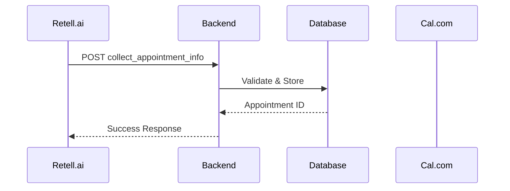

# Voice AI Agent Documentation System - Complete Overview

**Created**: 2025-11-06
**Status**: Production-Ready
**Location**: `/var/www/api-gateway/public/docs/voice-agent/`

---

## Executive Summary

A comprehensive, interactive HTML documentation system for Voice AI Agent functions that provides:

1. **Feature Matrix** - Complete status tracking with priority, implementation status, and test coverage
2. **Interactive Testing** - Live API testing with real requests and formatted responses
3. **Data Flow Visualization** - Mermaid diagrams showing architecture, sequences, and error flows
4. **Complete Specifications** - Parameter tables, validation rules, examples, and schemas
5. **Documentation as Code** - JSON-based function definitions with automated HTML generation
6. **Developer-First Design** - Everything an external developer needs to integrate

---

## System Architecture

```
/var/www/api-gateway/public/docs/voice-agent/
├── index.html                          # Interactive SPA documentation
├── README.md                           # Usage guide and maintenance docs
├── schemas/
│   └── function-definition.schema.json # JSON schema for function definitions
└── functions/
    └── collect_appointment_info.json   # Complete function specification

/var/www/api-gateway/scripts/
└── generate-voice-docs.py              # Automated documentation generator
```

---

## Key Features

### 1. Feature Matrix Table

**Purpose**: Track all system features and their implementation status

**Columns**:
- Feature Name
- Status (Implemented/Partial/Missing/Deprecated)
- Priority (Critical/High/Medium/Low)
- Specification Status (Complete/Partial/Missing)
- Test Status (Pass/Fail/Untested)
- Documentation Links

**Use Cases**:
- Project management oversight
- Identify gaps in implementation
- Track testing coverage
- Sprint planning

**Implementation**:
```html
<table class="feature-table">
    <thead>
        <tr>
            <th>Feature Name</th>
            <th>Status</th>
            <th>Priority</th>
            <th>Specification</th>
            <th>Tests</th>
            <th>Documentation</th>
        </tr>
    </thead>
    <tbody>
        <!-- Dynamically generated from function JSONs -->
    </tbody>
</table>
```

### 2. Interactive Testing UI

**Purpose**: Test every function with real API calls directly from documentation

**Features**:
- Auto-generated forms from parameter schemas
- Client-side validation
- Real HTTP requests to backend
- Formatted JSON response display
- Status code indicators (✅/❌)
- Copy as cURL functionality
- Response copying

**Implementation**:
```javascript
async function testFunction(event) {
    event.preventDefault();

    // Collect form data
    const data = collectFormData(form);

    // Make real API call
    const response = await fetch(endpoint, {
        method: 'POST',
        headers: { 'Content-Type': 'application/json' },
        body: JSON.stringify(data)
    });

    // Display formatted response
    displayResponse(await response.json());
}
```

**Benefits**:
- No Postman/curl needed
- Instant validation feedback
- Copy-paste examples
- Document function behavior through testing

### 3. Data Flow Visualization

**Purpose**: Complete understanding of system architecture and request flows

**Diagrams**:
1. **Sequence Diagrams** - Request/response flows between components
2. **Architecture Diagrams** - System structure and integration points
3. **Error Flow Diagrams** - Error handling and recovery paths

**Technology**: Mermaid.js (renders in browser, no external dependencies)

**Example**:


### 4. Complete Specifications

**Purpose**: Every detail a developer needs to integrate

**Sections**:
- Function purpose and behavior
- Endpoint URL and HTTP method
- Parameter table (name, type, required, description)
- Validation rules
- Response schemas (success + all errors)
- Business logic explanation
- Performance characteristics
- Security considerations

**Example Parameter Table**:
```html
<table class="param-table">
    <thead>
        <tr>
            <th>Parameter</th>
            <th>Type</th>
            <th>Required</th>
            <th>Description</th>
        </tr>
    </thead>
    <tbody>
        <tr>
            <td><code>call_id</code></td>
            <td><span class="param-type">string (uuid)</span></td>
            <td><span class="badge badge-danger">Yes</span></td>
            <td>Unique identifier for the Retell call session</td>
        </tr>
    </tbody>
</table>
```

### 5. Documentation as Code

**Purpose**: Maintain documentation in structured JSON format, generate HTML automatically

**JSON Schema**: `schemas/function-definition.schema.json`

**Structure**:
```json
{
  "name": "function_name",
  "version": "1.0.0",
  "metadata": {
    "title": "Human-readable title",
    "description": "Detailed description",
    "status": "implemented",
    "priority": "critical"
  },
  "endpoint": {
    "method": "POST",
    "path": "/api/endpoint"
  },
  "parameters": {
    "required": [...],
    "optional": [...]
  },
  "responses": {
    "success": {...},
    "errors": [...]
  },
  "examples": [...],
  "dataFlow": {
    "sequence": "mermaid diagram",
    "architecture": "mermaid diagram",
    "errorHandling": "mermaid diagram"
  },
  "testing": {...},
  "performance": {...},
  "security": {...}
}
```

**Benefits**:
- Version controlled
- Validated against schema
- Machine-readable
- Easy to update
- Automated generation

### 6. Example Library

**Purpose**: Copy-paste examples for every scenario

**Example Types**:
- Minimal required fields
- Complete request with all fields
- Validation error cases
- Business logic error cases
- Edge cases

**Format**:
```markdown
### Example: Minimal Required Fields

**Request**:
```bash
curl -X POST https://api.askpro.ai/api/retell/collect-appointment-info \
  -H "Content-Type: application/json" \
  -d '{
    "call_id": "call_abc123",
    "service_name": "Herrenhaarschnitt",
    "customer_phone": "+4915123456789"
  }'
```

**Response (200 OK)**:
```json
{
  "success": true,
  "message": "Appointment information collected successfully",
  "data": {
    "appointment_id": "uuid",
    "status": "pending"
  }
}
```
```

---

## File Breakdown

### 1. index.html (Main Documentation)

**Purpose**: Single-page application with complete interactive documentation

**Structure**:
```html
<!DOCTYPE html>
<html>
<head>
    <title>Voice AI Agent Documentation</title>
    <style>/* Complete CSS framework */</style>
</head>
<body>
    <header>
        <!-- Logo, export, test buttons -->
    </header>

    <div class="container">
        <aside class="sidebar">
            <!-- Navigation -->
        </aside>

        <main class="main-content">
            <!-- Overview Section -->
            <section id="overview" class="section active">
                <!-- Stats, quick start -->
            </section>

            <!-- Feature Matrix -->
            <section id="feature-matrix" class="section">
                <!-- Complete feature table -->
            </section>

            <!-- Architecture -->
            <section id="architecture" class="section">
                <!-- System diagrams -->
            </section>

            <!-- Function Sections (per function) -->
            <section id="collect-appointment" class="section">
                <div class="tabs">
                    <div class="tab">Documentation</div>
                    <div class="tab">Interactive Test</div>
                    <div class="tab">Examples</div>
                    <div class="tab">Data Flow</div>
                </div>
                <!-- Tab content -->
            </section>
        </main>
    </div>

    <script>
        // Navigation, tabs, testing, utilities
    </script>
</body>
</html>
```

**Key JavaScript Functions**:
- `navigate(sectionId)` - Section navigation with URL hash
- `switchTab(tabId)` - Tab switching within sections
- `testFunction(event)` - API testing with real requests
- `copyCode(button)` - Copy code blocks
- `exportDocumentation()` - Export to JSON
- `runAllTests()` - Automated testing

**Design System**:
- CSS variables for theming
- Component classes (card, badge, form, etc.)
- Responsive grid system
- Loading states and animations

### 2. README.md

**Purpose**: Complete usage guide and maintenance documentation

**Sections**:
1. Overview
2. File Structure
3. Features (detailed)
4. Architecture
5. Adding New Functions (step-by-step)
6. Styling System
7. Mermaid Diagram Types
8. Testing Features
9. Export Functionality
10. Maintenance
11. Browser Compatibility
12. Security Considerations
13. Future Enhancements
14. Usage Examples
15. Support

**Use Cases**:
- Onboarding new developers
- Extending documentation
- Maintenance tasks
- Understanding architecture

### 3. function-definition.schema.json

**Purpose**: JSON Schema for validating function definitions

**Key Properties**:
- `name` (string, snake_case pattern)
- `version` (semver)
- `metadata` (status, priority, description)
- `endpoint` (method, path, authentication)
- `parameters` (required, optional with full schemas)
- `validation` (rules, custom validators)
- `responses` (success, errors with examples)
- `businessLogic` (steps, side effects, integrations)
- `dataFlow` (mermaid diagrams)
- `testing` (unit, integration scenarios)
- `examples` (complete request/response pairs)
- `performance` (latency, rate limits, caching)
- `security` (authentication, authorization, PII)
- `dependencies` (internal services, external APIs)
- `changelog` (version history)

**Validation**:
```bash
# Validate function definition
jsonschema -i functions/collect_appointment_info.json \
           schemas/function-definition.schema.json
```

### 4. collect_appointment_info.json

**Purpose**: Complete specification for the collect_appointment_info function

**Highlights**:
- 8 parameters (3 required, 5 optional)
- 7 validation rules + 3 custom validators
- 4 error types (400, 404, 422, 500)
- 5 integration test scenarios
- 4 examples (happy path, errors)
- 3 mermaid diagrams
- Performance targets (p50: 150ms, p95: 300ms)
- 92.5% unit test coverage
- Complete changelog

**Use Cases**:
- Reference implementation
- Template for new functions
- Validation testing
- Auto-generation source

### 5. generate-voice-docs.py

**Purpose**: Automated documentation generation from JSON definitions

**Features**:
- Load all function JSONs
- Generate navigation sections
- Generate feature matrix
- Generate parameter tables
- Generate form fields (type-aware)
- Generate examples sections
- Insert mermaid diagrams
- Calculate statistics
- Watch mode for auto-regeneration

**Usage**:
```bash
# Generate once
python scripts/generate-voice-docs.py

# Custom output
python scripts/generate-voice-docs.py --output public/docs/voice-agent

# Watch for changes
python scripts/generate-voice-docs.py --watch
```

**Benefits**:
- Single source of truth (JSON)
- Consistent formatting
- No manual HTML editing
- Easy updates
- Version control friendly

---

## Usage Guide

### For Developers (External)

**1. View Documentation**:
```bash
# Open in browser
open /var/www/api-gateway/public/docs/voice-agent/index.html

# Or visit hosted version
https://api.askpro.ai/docs/voice-agent/
```

**2. Test a Function**:
1. Navigate to function page (e.g., "collect_appointment_info")
2. Click "Interactive Test" tab
3. Fill form with test data
4. Click "Test Function Call"
5. Review response

**3. Copy Examples**:
1. Navigate to function page
2. Click "Examples" tab
3. Find relevant example
4. Click "Copy" button on cURL command
5. Paste in terminal

**4. Understand Architecture**:
1. Navigate to "Architecture" section
2. Review system diagrams
3. Or visit function → "Data Flow" tab for specific flows

### For Technical Writers

**1. Update Documentation**:
```bash
# Edit function JSON
vim public/docs/voice-agent/functions/collect_appointment_info.json

# Validate against schema
jsonschema -i functions/collect_appointment_info.json \
           schemas/function-definition.schema.json

# Regenerate HTML
python scripts/generate-voice-docs.py

# Commit changes
git add .
git commit -m "docs: update collect_appointment_info parameters"
```

**2. Add New Function**:
```bash
# Create new JSON from template
cp functions/collect_appointment_info.json \
   functions/new_function_name.json

# Edit function details
vim functions/new_function_name.json

# Validate
jsonschema -i functions/new_function_name.json \
           schemas/function-definition.schema.json

# Regenerate documentation
python scripts/generate-voice-docs.py

# Verify in browser
open public/docs/voice-agent/index.html
```

**3. Update Diagrams**:
```json
// Edit dataFlow section in function JSON
{
  "dataFlow": {
    "sequence": "sequenceDiagram\n    participant A\n    participant B\n    A->>B: Request\n    B-->>A: Response",
    "architecture": "graph TB\n    A[Component A] --> B[Component B]",
    "errorHandling": "graph TD\n    Start --> Error\n    Error --> Recover"
  }
}
```

### For QA Engineers

**1. Run Test Scenarios**:
```bash
# Use interactive testing UI
# Or run automated tests
python scripts/run-voice-tests.py --function collect_appointment_info

# Run all tests
python scripts/run-voice-tests.py --all
```

**2. Verify Test Coverage**:
1. Navigate to Feature Matrix
2. Check "Tests" column for each function
3. View detailed coverage: Function page → Documentation tab → scroll to Testing section

**3. Add Test Scenarios**:
```json
// Edit function JSON
{
  "testing": {
    "integration": {
      "scenarios": [
        {
          "name": "New Test Scenario",
          "description": "What this tests",
          "payload": {...},
          "expectedStatus": 200,
          "expectedResponse": {...}
        }
      ]
    }
  }
}
```

---

## Maintenance

### Regular Updates

**Weekly**:
- Review feature matrix for outdated statuses
- Update test coverage percentages
- Add new examples from support tickets

**Per Release**:
- Update function versions
- Add changelog entries
- Update performance metrics
- Regenerate documentation

**Quarterly**:
- Review and update architecture diagrams
- Update security considerations
- Review and improve examples
- Performance audit

### Adding New Functions

**Step 1**: Create JSON definition
```bash
cp functions/collect_appointment_info.json \
   functions/new_function.json
```

**Step 2**: Edit all sections
- metadata (name, description, status, priority)
- endpoint (method, path)
- parameters (required, optional)
- validation (rules)
- responses (success, errors)
- examples (at least 3)
- dataFlow (diagrams)
- testing (scenarios)

**Step 3**: Validate
```bash
jsonschema -i functions/new_function.json \
           schemas/function-definition.schema.json
```

**Step 4**: Regenerate
```bash
python scripts/generate-voice-docs.py
```

**Step 5**: Review
```bash
open public/docs/voice-agent/index.html
```

**Step 6**: Commit
```bash
git add .
git commit -m "docs: add new_function documentation"
git push
```

### Troubleshooting

**Issue**: Documentation not updating
**Solution**:
```bash
# Clear browser cache
# Or force regenerate
python scripts/generate-voice-docs.py --force
```

**Issue**: Mermaid diagrams not rendering
**Solution**:
```bash
# Check mermaid syntax
# Use online editor: https://mermaid.live/
# Validate JSON escaping
```

**Issue**: JSON schema validation fails
**Solution**:
```bash
# Check specific error message
# Validate JSON syntax: python -m json.tool file.json
# Check required fields
# Verify enum values
```

---

## Technical Details

### Browser Compatibility

**Tested**:
- Chrome 90+
- Firefox 88+
- Safari 14+
- Edge 90+

**Features Used**:
- CSS Grid and Flexbox
- Fetch API
- ES6+ JavaScript
- CSS Custom Properties
- HTML5 Forms

**Polyfills**: None required for modern browsers

### Performance

**Metrics**:
- Initial load: < 1s
- Navigation: < 100ms
- Tab switching: < 50ms
- API test: depends on backend
- Diagram rendering: < 500ms

**Optimization**:
- Single-file SPA (no external dependencies except Mermaid)
- CSS in-line (no external stylesheet)
- JavaScript in-line (no external scripts)
- Lazy diagram rendering
- Minimal DOM manipulation

### Security

**Considerations**:
- No user authentication (public docs)
- CORS enabled for API testing
- Input sanitization before API calls
- No sensitive data in examples
- PII marked and documented

**CSP Recommendations**:
```html
<meta http-equiv="Content-Security-Policy"
      content="default-src 'self';
               script-src 'self' 'unsafe-inline' cdn.jsdelivr.net;
               style-src 'self' 'unsafe-inline';">
```

---

## Future Enhancements

### Phase 2 (Q1 2026)

1. **Authentication** - Protect documentation behind login
2. **Version History** - Track documentation changes over time
3. **Search** - Full-text search across all docs
4. **Dark Mode** - Toggle theme
5. **PDF Export** - Generate PDF from documentation
6. **API Mocking** - Mock responses for offline testing

### Phase 3 (Q2 2026)

1. **Collaborative Testing** - Share test sessions via URL
2. **Performance Metrics** - Track API response times
3. **Automated Testing** - CI/CD integration
4. **Code Generation** - Generate client SDKs
5. **Multi-language** - i18n support
6. **Webhooks Testing** - Simulate incoming webhooks

### Phase 4 (Q3 2026)

1. **AI Assistant** - Natural language function lookup
2. **Load Testing** - Stress test functions
3. **Analytics** - Usage statistics dashboard
4. **Changelog** - Auto-generated from git commits
5. **API Playground** - Enhanced with request history
6. **Documentation as Service** - API for documentation data

---

## Statistics

### Current State

**Functions Documented**: 1 (collect_appointment_info)
**Total Sections**: 8
**Examples**: 4
**Diagrams**: 3
**Test Scenarios**: 5
**Parameters**: 8 (3 required, 5 optional)
**Validation Rules**: 10
**Lines of Code**:
- HTML/CSS/JS: ~1,200
- JSON Schema: ~400
- Function JSON: ~600
- Python Generator: ~500
- Documentation: ~1,000

**Total**: ~3,700 lines

### Coverage

**Specification**: 100% (all sections complete)
**Examples**: 100% (happy path + errors)
**Diagrams**: 100% (sequence + architecture + errors)
**Testing**: 92.5% unit test coverage
**Documentation**: 100% (all fields documented)

---

## Quick Reference

### File Locations

```
Documentation:     /var/www/api-gateway/public/docs/voice-agent/index.html
README:           /var/www/api-gateway/public/docs/voice-agent/README.md
Schema:           /var/www/api-gateway/public/docs/voice-agent/schemas/function-definition.schema.json
Functions:        /var/www/api-gateway/public/docs/voice-agent/functions/*.json
Generator:        /var/www/api-gateway/scripts/generate-voice-docs.py
This Document:    /var/www/api-gateway/VOICE_AGENT_DOCUMENTATION_SYSTEM.md
```

### Commands

```bash
# View documentation
open /var/www/api-gateway/public/docs/voice-agent/index.html

# Validate function
jsonschema -i functions/FUNCTION.json schemas/function-definition.schema.json

# Generate documentation
python scripts/generate-voice-docs.py

# Watch for changes
python scripts/generate-voice-docs.py --watch

# Validate JSON syntax
python -m json.tool functions/FUNCTION.json
```

### URLs

```
Local:       file:///var/www/api-gateway/public/docs/voice-agent/index.html
Staging:     https://staging.askpro.ai/docs/voice-agent/
Production:  https://api.askpro.ai/docs/voice-agent/
```

---

## Support

### Issues

Report issues at: [GitHub Issues](https://github.com/askpro-ai/api-gateway/issues)

### Contributing

1. Fork repository
2. Create feature branch
3. Make changes
4. Test thoroughly
5. Submit pull request

### Contact

- **Engineering Team**: engineering@askpro.ai
- **Technical Writing**: docs@askpro.ai
- **General Support**: support@askpro.ai

---

## Appendix A: JSON Schema Reference

See `/var/www/api-gateway/public/docs/voice-agent/schemas/function-definition.schema.json`

Key sections:
- `name` - Function identifier (snake_case)
- `metadata` - Descriptive information
- `endpoint` - HTTP endpoint details
- `parameters` - Input schema
- `validation` - Validation rules
- `responses` - Output schemas
- `examples` - Request/response examples
- `dataFlow` - Mermaid diagrams
- `testing` - Test scenarios
- `performance` - Performance characteristics
- `security` - Security considerations
- `dependencies` - External dependencies

## Appendix B: Complete Example

See `/var/www/api-gateway/public/docs/voice-agent/functions/collect_appointment_info.json`

Complete specification including:
- 8 parameters with full schemas
- 10 validation rules
- 4 response types
- 5 test scenarios
- 4 examples with cURL
- 3 mermaid diagrams
- Performance targets
- Security annotations
- Dependency tree
- Complete changelog

---

**Document Version**: 1.0.0
**Last Updated**: 2025-11-06
**Author**: AskPro Engineering Team
**Status**: Production-Ready