# 🌟 World-Class Technical Specification & Execution Plan
## AskProAI - Engineering Excellence Framework

**Version**: 3.0 Elite  
**Date**: 2025-06-21  
**Status**: Gold Standard Architecture  
**Level**: Google/Netflix/Stripe Engineering Standards

---

## 🎯 Executive Vision

Transform AskProAI from a functional MVP into a world-class SaaS platform that sets the industry standard for AI-powered appointment booking systems. This specification represents the engineering practices of the top 1% of technology companies globally.

### Core Principles
- **Reliability First**: 99.99% uptime (52.56 minutes downtime/year)
- **Performance Excellence**: Sub-100ms response times globally
- **Security by Design**: Zero-trust architecture with defense in depth
- **Developer Joy**: Self-documenting, self-healing systems
- **Business Agility**: Deploy 100+ times per day with confidence

---

## 🏗️ Architectural Vision

### Current State → Target State Migration

```mermaid
graph TB
    subgraph "Current State - Monolithic"
        M[Laravel Monolith]
        DB[(Single MySQL)]
        R[(Redis)]
    end
    
    subgraph "Transition State - Service Oriented"
        API[API Gateway]
        BS[Booking Service]
        CS[Call Service]
        IS[Integration Service]
        DBP[(MySQL Primary)]
        DBR[(MySQL Replicas)]
        RC[(Redis Cluster)]
    end
    
    subgraph "Target State - Microservices"
        GW[GraphQL Gateway]
        MS1[Booking μService]
        MS2[Call μService]
        MS3[Customer μService]
        MS4[Integration μService]
        MS5[Analytics μService]
        EV[(Event Store)]
        TS[(Time Series DB)]
        GDB[(Graph DB)]
        CDC[Change Data Capture]
    end
    
    M -->|Phase 1| API
    API -->|Phase 2| GW
    DB -->|Replication| DBP
    DBP -->|CDC| EV
```



### Domain-Driven Design Architecture

```yaml
Bounded Contexts:
  Customer Management:
    - Aggregates: Customer, Preference, Communication
    - Services: CustomerService, DuplicateDetection, GDPR
    
  Appointment Booking:
    - Aggregates: Appointment, TimeSlot, Availability
    - Services: BookingOrchestrator, ConflictResolver, Optimizer
    
  Call Management:
    - Aggregates: Call, Transcript, Analysis
    - Services: CallProcessor, TranscriptAnalyzer, IntentExtractor
    
  Integration Hub:
    - Aggregates: Integration, Webhook, Sync
    - Services: WebhookProcessor, EventBus, CircuitBreaker
    
  Billing & Pricing:
    - Aggregates: Invoice, Subscription, Usage
    - Services: BillingEngine, UsageTracker, PricingCalculator
```

---

## 🚀 Technical Excellence Framework

### 1. Code Quality Standards (Google Level)

#### 1.1 Automated Code Quality Pipeline
```yaml
name: Elite Code Quality Pipeline
on: [push, pull_request]

jobs:
  static-analysis:
    steps:
      - name: PHPStan Level 9
        run: vendor/bin/phpstan analyse --level=9
        
      - name: Psalm Type Coverage
        run: vendor/bin/psalm --show-info=true
        
      - name: Architecture Tests
        run: vendor/bin/phparch check
        
      - name: Mutation Testing
        run: vendor/bin/infection --min-msi=80
        
      - name: Cognitive Complexity
        run: vendor/bin/phpmd src text cleancode --max-complexity=5
        
      - name: Security Audit
        run: |
          vendor/bin/security-checker security:check
          vendor/bin/psalm --taint-analysis
          
  performance-tests:
    steps:
      - name: Load Testing
        run: k6 run scripts/load-test.js --threshold="p95<100"
        
      - name: Memory Profiling
        run: vendor/bin/phpbench run --report=memory
        
      - name: Query Analysis
        run: php artisan db:analyze --slow-threshold=50ms
```

#### 1.2 Code Review Automation
```php
namespace App\CodeQuality;

class EliteCodeReviewer
{
    private array $rules = [
        'max_method_length' => 20,
        'max_class_length' => 200,
        'max_parameters' => 3,
        'cyclomatic_complexity' => 5,
        'cognitive_complexity' => 7,
        'coupling_threshold' => 5,
    ];
    
    public function review(string $file): ReviewResult
    {
        $ast = $this->parser->parse($file);
        
        $violations = collect([
            $this->checkComplexity($ast),
            $this->checkCoupling($ast),
            $this->checkNaming($ast),
            $this->checkTestability($ast),
            $this->checkDocumentation($ast),
            $this->checkPerformance($ast),
        ])->flatten();
        
        return new ReviewResult(
            $violations,
            $this->calculateScore($violations),
            $this->generateSuggestions($violations)
        );
    }
}
```

### 2. Performance Engineering (Netflix Standard)

#### 2.1 Adaptive Performance System
```php
namespace App\Performance;

class AdaptivePerformanceOptimizer
{
    private MetricsCollector $metrics;
    private MLPredictor $predictor;
    private CacheWarmer $warmer;
    
    public function optimize(): void
    {
        // Real-time performance adaptation
        $currentMetrics = $this->metrics->collect();
        $prediction = $this->predictor->predictLoad('+15m');
        
        if ($prediction->isSpike()) {
            $this->preScaleResources($prediction);
            $this->warmCriticalCaches();
            $this->enableAggressiveCaching();
        }
        
        // Query optimization
        $slowQueries = $this->metrics->getSlowQueries();
        foreach ($slowQueries as $query) {
            $this->optimizeQuery($query);
        }
        
        // Connection pool tuning
        $this->tuneConnectionPool($currentMetrics);
    }
    
    private function optimizeQuery(Query $query): void
    {
        $explainPlan = $query->explain();
        
        if ($explainPlan->lackingIndex()) {
            $this->createIndex($explainPlan->suggestedIndex());
        }
        
        if ($explainPlan->hasNPlusOne()) {
            $this->rewriteWithEagerLoading($query);
        }
        
        if ($explainPlan->canUseCache()) {
            $this->addQueryCache($query, $explainPlan->optimalTTL());
        }
    }
}
```

#### 2.2 Global Edge Computing
```yaml
# Cloudflare Workers Configuration
name: askproai-edge
compatibility_date: "2025-06-21"

routes:
  - pattern: "*/api/availability/*"
    zone_name: "askproai.de"

[[durable_objects.bindings]]
name = "AVAILABILITY_CACHE"
class_name = "AvailabilityCache"

[[kv_namespaces]]
binding = "BOOKING_CACHE"
id = "booking_cache_production"

[env.production]
vars = { 
  ORIGIN_URL = "https://api.askproai.de",
  CACHE_TTL = "300"
}
```

### 3. Security Architecture (Stripe Level)

#### 3.1 Zero-Trust Security Framework
```php
namespace App\Security;

class ZeroTrustGateway
{
    private array $securityLayers = [
        RateLimiter::class,
        GeofenceProtection::class,
        AnomalyDetection::class,
        TokenValidator::class,
        PermissionChecker::class,
        AuditLogger::class,
    ];
    
    public function protect(Request $request): SecurityContext
    {
        $context = new SecurityContext($request);
        
        // Multi-layer security validation
        foreach ($this->securityLayers as $layer) {
            $result = app($layer)->validate($context);
            
            if (!$result->passed()) {
                $this->handleSecurityViolation($result, $context);
                throw new SecurityException($result->reason());
            }
            
            $context->addValidation($result);
        }
        
        // Cryptographic request signing
        $context->sign($this->privateKey);
        
        return $context;
    }
    
    private function handleSecurityViolation(
        ValidationResult $result, 
        SecurityContext $context
    ): void {
        // Real-time threat intelligence
        $this->threatIntelligence->report($result, $context);
        
        // Adaptive response
        match($result->severity()) {
            'critical' => $this->blockIPRange($context->ipRange()),
            'high' => $this->enforceStrictMode($context->userId()),
            'medium' => $this->requireMFA($context->userId()),
            default => $this->logSuspiciousActivity($context),
        };
    }
}
```

#### 3.2 Encryption at Rest & In Transit
```php
namespace App\Security\Encryption;

class FieldLevelEncryption
{
    private array $sensitiveFields = [
        'phone_number' => EncryptionType::DETERMINISTIC,
        'email' => EncryptionType::DETERMINISTIC,
        'api_key' => EncryptionType::RANDOMIZED,
        'personal_notes' => EncryptionType::RANDOMIZED,
    ];
    
    public function encryptModel(Model $model): void
    {
        foreach ($this->sensitiveFields as $field => $type) {
            if ($model->hasAttribute($field)) {
                $model->$field = $this->encrypt(
                    $model->$field, 
                    $type,
                    $this->deriveKey($model, $field)
                );
            }
        }
    }
    
    private function encrypt(
        string $value, 
        EncryptionType $type, 
        string $key
    ): string {
        return match($type) {
            EncryptionType::DETERMINISTIC => $this->deterministicEncrypt($value, $key),
            EncryptionType::RANDOMIZED => $this->randomizedEncrypt($value, $key),
        };
    }
}
```

### 4. Observability & Monitoring (DataDog/NewRelic Standard)

#### 4.1 Distributed Tracing
```php
namespace App\Observability;

class DistributedTracer
{
    public function trace(string $operation, callable $callback): mixed
    {
        $span = $this->tracer->startSpan($operation);
        $span->setTag('service.name', 'askproai');
        $span->setTag('resource.name', $operation);
        
        try {
            // Automatic instrumentation
            $this->injectContext($span);
            
            // Performance tracking
            $startTime = hrtime(true);
            $startMemory = memory_get_usage(true);
            
            $result = $callback($span);
            
            // Metrics collection
            $span->setTag('duration.ns', hrtime(true) - $startTime);
            $span->setTag('memory.bytes', memory_get_usage(true) - $startMemory);
            
            return $result;
            
        } catch (\Throwable $e) {
            $span->setTag('error', true);
            $span->setTag('error.message', $e->getMessage());
            $span->setTag('error.type', get_class($e));
            throw $e;
        } finally {
            $span->finish();
        }
    }
}
```

#### 4.2 AI-Powered Anomaly Detection
```php
namespace App\Monitoring;

class AnomalyDetector
{
    private TensorFlowModel $model;
    private MetricsStore $metrics;
    
    public function detectAnomalies(): array
    {
        $currentMetrics = $this->metrics->getLast('5m');
        $predictions = $this->model->predict($currentMetrics);
        
        $anomalies = [];
        foreach ($predictions as $metric => $prediction) {
            if ($prediction['anomaly_score'] > 0.95) {
                $anomalies[] = new Anomaly(
                    $metric,
                    $prediction['expected'],
                    $prediction['actual'],
                    $prediction['severity'],
                    $this->generateExplanation($metric, $prediction)
                );
            }
        }
        
        return $anomalies;
    }
    
    private function generateExplanation(
        string $metric, 
        array $prediction
    ): string {
        // AI-generated human-readable explanation
        return $this->llm->complete(
            "Explain why {$metric} showing {$prediction['actual']} " .
            "instead of expected {$prediction['expected']} " .
            "in context of recent system changes"
        );
    }
}
```

### 5. Self-Healing Infrastructure

#### 5.1 Automated Recovery System
```php
namespace App\Infrastructure;

class SelfHealingOrchestrator
{
    private array $healers = [
        DatabaseHealer::class,
        QueueHealer::class,
        CacheHealer::class,
        ServiceHealer::class,
    ];
    
    public function diagnoseAndHeal(): HealingReport
    {
        $report = new HealingReport();
        
        foreach ($this->healers as $healerClass) {
            $healer = app($healerClass);
            $diagnosis = $healer->diagnose();
            
            if ($diagnosis->requiresHealing()) {
                $result = $healer->heal($diagnosis);
                $report->addHealing($result);
                
                // Verify healing was successful
                $postCheck = $healer->diagnose();
                if ($postCheck->requiresHealing()) {
                    $this->escalateToHumans($diagnosis, $result);
                }
            }
        }
        
        return $report;
    }
}

class DatabaseHealer implements Healer
{
    public function diagnose(): Diagnosis
    {
        return new Diagnosis([
            'slow_queries' => $this->findSlowQueries(),
            'connection_leaks' => $this->detectConnectionLeaks(),
            'replication_lag' => $this->checkReplicationLag(),
            'deadlocks' => $this->detectDeadlocks(),
        ]);
    }
    
    public function heal(Diagnosis $diagnosis): HealingResult
    {
        $actions = [];
        
        if ($diagnosis->has('slow_queries')) {
            $actions[] = $this->optimizeSlowQueries($diagnosis->get('slow_queries'));
        }
        
        if ($diagnosis->has('connection_leaks')) {
            $actions[] = $this->fixConnectionLeaks();
        }
        
        if ($diagnosis->has('replication_lag')) {
            $actions[] = $this->resyncReplicas();
        }
        
        return new HealingResult($actions);
    }
}
```

---

## 📊 Execution Plan

### Phase 1: Foundation (Weeks 1-4)
**Goal**: Establish world-class engineering practices

#### Week 1: Code Quality & Testing
```yaml
Monday-Tuesday:
  - Implement PHPStan Level 9 compliance
  - Set up mutation testing with 80% MSI
  - Create architecture tests
  
Wednesday-Thursday:
  - Implement comprehensive E2E test suite
  - Set up visual regression testing
  - Create performance benchmarks
  
Friday:
  - Code review process automation
  - Documentation generation pipeline
```

#### Week 2: Security Hardening
```yaml
Monday-Tuesday:
  - Implement zero-trust gateway
  - Field-level encryption
  - Security scanning automation
  
Wednesday-Thursday:
  - Penetration testing setup
  - OWASP compliance audit
  - Security monitoring dashboards
  
Friday:
  - Security runbook creation
  - Incident response automation
```

#### Week 3: Performance Engineering
```yaml
Monday-Tuesday:
  - Query optimization framework
  - Caching strategy implementation
  - CDN integration
  
Wednesday-Thursday:
  - Load testing infrastructure
  - Performance monitoring
  - Auto-scaling setup
  
Friday:
  - Performance baseline establishment
  - Optimization documentation
```

#### Week 4: Observability
```yaml
Monday-Tuesday:
  - Distributed tracing setup
  - Custom metrics implementation
  - Log aggregation pipeline
  
Wednesday-Thursday:
  - Anomaly detection system
  - Alert fatigue reduction
  - Dashboard creation
  
Friday:
  - Runbook automation
  - On-call rotation setup
```

### Phase 2: Service Migration (Weeks 5-8)
**Goal**: Transition to service-oriented architecture

#### Service Extraction Plan


### Phase 3: Advanced Features (Weeks 9-12)
**Goal**: Implement cutting-edge capabilities

#### AI-Powered Features
1. **Intelligent Scheduling**: ML-based optimal time slot suggestions
2. **Predictive No-Shows**: Reduce no-shows by 40% with AI
3. **Dynamic Pricing**: Revenue optimization through demand prediction
4. **Conversation Intelligence**: Extract insights from call transcripts

#### Developer Experience
1. **Self-Service Portal**: API playground with live examples
2. **SDK Generation**: Auto-generated SDKs for 10+ languages
3. **GraphQL API**: Flexible data fetching with subscriptions
4. **Webhook Debugger**: Real-time webhook testing tools

---

## 🎯 Success Metrics

### Technical KPIs
| Metric | Current | Target | Timeline |
|--------|---------|--------|----------|
| Response Time (p99) | 500ms | 100ms | 12 weeks |
| Uptime | 99.5% | 99.99% | 16 weeks |
| Test Coverage | 45% | 95% | 8 weeks |
| Deploy Frequency | Weekly | 100+/day | 12 weeks |
| MTTR | 4 hours | 15 min | 10 weeks |
| Error Rate | 2% | 0.1% | 8 weeks |

### Business Impact
| Metric | Current | Target | Timeline |
|--------|---------|--------|----------|
| Booking Success Rate | 85% | 98% | 8 weeks |
| Customer Onboarding | 3 hours | 3 minutes | 6 weeks |
| Support Tickets | 15% | 2% | 10 weeks |
| Developer Adoption | 10 | 1000+ | 16 weeks |
| Revenue per User | €50 | €150 | 12 weeks |

---

## 🚀 Innovation Roadmap

### Q3 2025: Foundation
- World-class engineering practices
- Service-oriented architecture
- Advanced monitoring & observability

### Q4 2025: Intelligence
- AI-powered scheduling optimization
- Predictive analytics dashboard
- Automated customer insights

### Q1 2026: Scale
- Global edge deployment
- Multi-region data residency
- 10,000+ API calls/second

### Q2 2026: Platform
- Marketplace for integrations
- White-label solution
- Enterprise feature set

---

## 🛡️ Risk Mitigation

### Technical Risks
1. **Migration Complexity**
   - Mitigation: Strangler Fig pattern with feature flags
   - Rollback: Blue-green deployments with instant rollback

2. **Performance Degradation**
   - Mitigation: Continuous performance testing
   - Rollback: Circuit breakers with fallback

3. **Security Vulnerabilities**
   - Mitigation: Automated security scanning
   - Response: Automated patching pipeline

### Business Risks
1. **Customer Disruption**
   - Mitigation: Gradual rollout with opt-in
   - Communication: Proactive status updates

2. **Competitor Response**
   - Mitigation: Rapid innovation cycle
   - Defense: Patent applications for novel approaches

---

## 🏆 Conclusion

This specification represents the gold standard of software engineering, incorporating practices from the world's leading technology companies. By following this plan, AskProAI will not just meet current needs but will establish itself as the technical leader in the AI-powered appointment booking space.

The journey from current state to world-class will require dedication, but the framework provided here offers a clear, actionable path to excellence. Every decision has been made with scalability, reliability, and developer experience in mind.

**Remember**: Excellence is not a destination but a continuous journey. This specification provides the foundation, but the culture of continuous improvement will drive long-term success.

---

*"The best way to predict the future is to invent it."* - Alan Kay

**Next Steps**: 
1. Review and approve specification
2. Assemble elite engineering team
3. Begin Phase 1 implementation
4. Measure, learn, iterate

🌟 **Welcome to the 1% Club of Engineering Excellence** 🌟