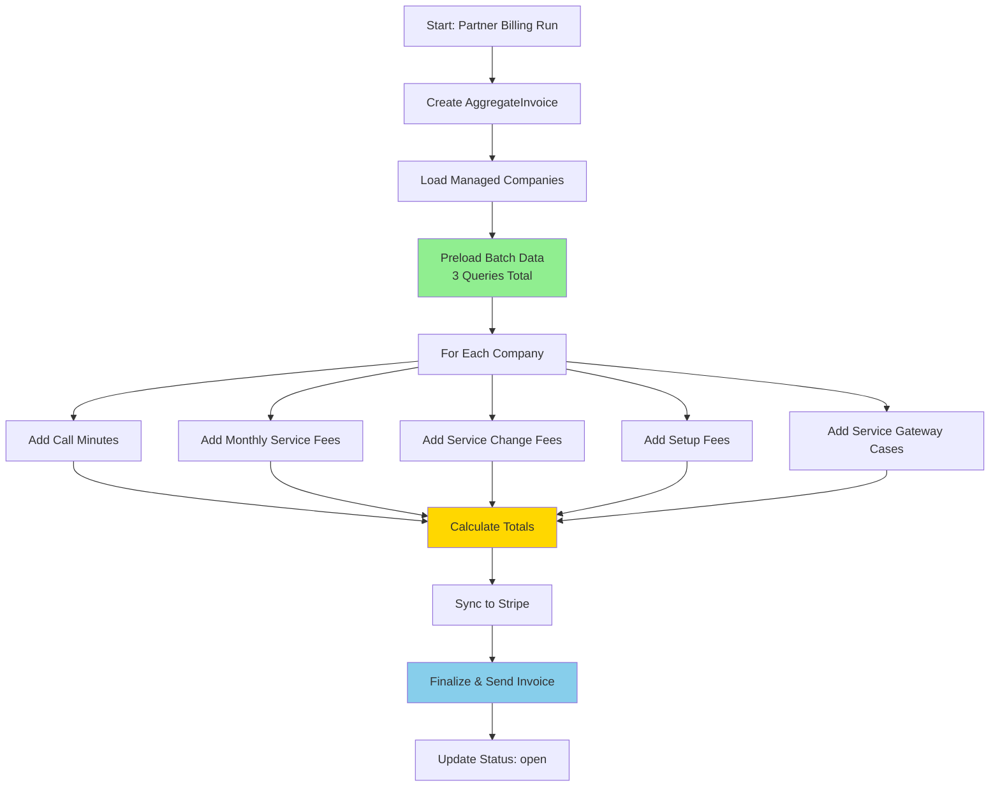
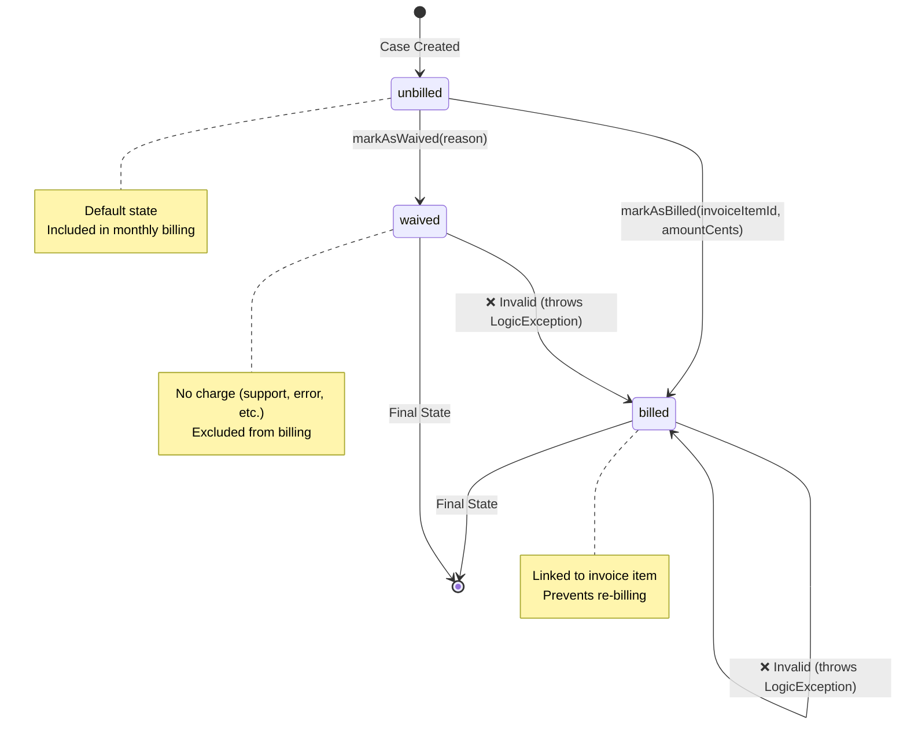
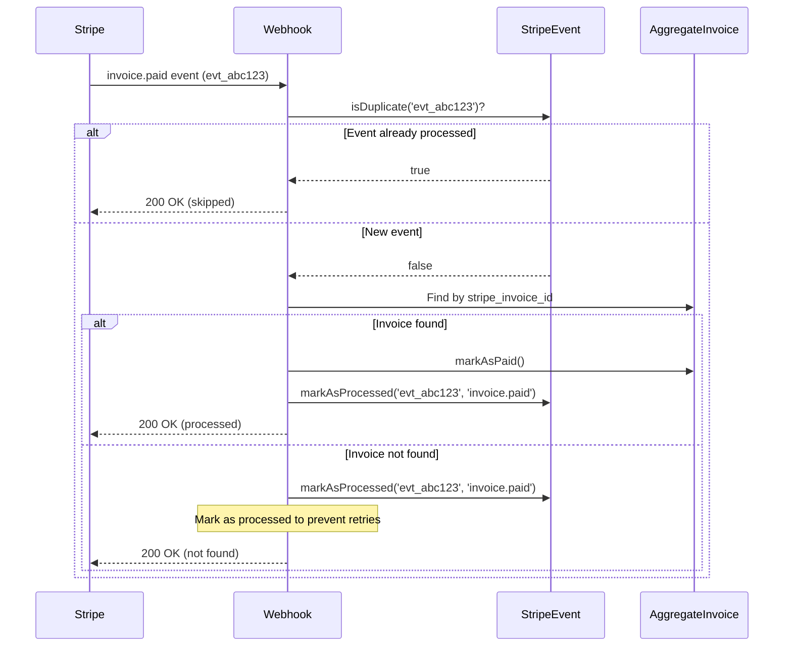
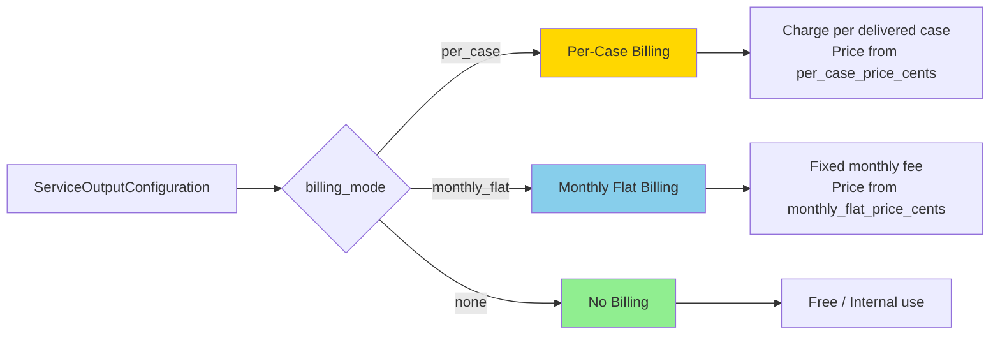

# Billing Architecture

**Last Updated:** 2026-01-12
**Status:** Production
**Owner:** Backend Team

## Overview

The AskPro Gateway billing system handles multi-tenant partner billing with support for:
- **Call minutes** (Retell AI voice calls)
- **Monthly service fees** (recurring services)
- **Service change fees** (one-time setup/migration charges)
- **Setup fees** (initial onboarding)
- **Service Gateway cases** (per-case and monthly flat pricing)

Partners receive aggregated monthly invoices covering all their managed companies, delivered via Stripe with automated payment processing.

---

## Table of Contents

1. [System Components](#system-components)
2. [MonthlyBillingAggregator Flow](#monthlybillingaggregator-flow)
3. [ServiceCase Billing Lifecycle](#servicecase-billing-lifecycle)
4. [Stripe Webhook Handling](#stripe-webhook-handling)
5. [Service Gateway Pricing Calculation](#service-gateway-pricing-calculation)
6. [Database Schema](#database-schema)
7. [N+1 Query Optimization](#n1-query-optimization)
8. [Security & Idempotency](#security--idempotency)
9. [Testing Strategy](#testing-strategy)

---

## System Components

### Core Models

| Model | Purpose | Key Fields |
|-------|---------|------------|
| `AggregateInvoice` | Partner invoice for billing period | `partner_company_id`, `stripe_invoice_id`, `status`, `total_cents` |
| `AggregateInvoiceItem` | Individual line items on invoice | `company_id`, `item_type`, `amount_cents`, `description` |
| `ServiceCase` | Service desk case with billing status | `billing_status`, `invoice_item_id`, `billed_amount_cents` |
| `ServiceOutputConfiguration` | Output delivery & pricing config | `billing_mode`, `per_case_price_cents`, `monthly_flat_price_cents` |
| `CompanyFeeSchedule` | Company-level billing overrides | `setup_fee`, `override_per_minute_rate` |
| `StripeEvent` | Webhook idempotency tracking | `event_id` (unique), `event_type`, `processed_at` |

### Core Services

| Service | Responsibility |
|---------|---------------|
| `MonthlyBillingAggregator` | Aggregates all charges for a billing period |
| `StripeInvoicingService` | Manages Stripe API integration and webhooks |

---

## MonthlyBillingAggregator Flow

The `MonthlyBillingAggregator` service orchestrates the monthly billing process:



### Batch Data Preloading

To prevent N+1 queries, all data is loaded in **3 batch queries** before iterating companies:

```php
// app/Services/Billing/MonthlyBillingAggregator.php
private function preloadBatchData(Collection $companies, Carbon $periodStart, Carbon $periodEnd): void
{
    $companyIds = $companies->pluck('id')->toArray();

    // Query 1: Batch load calls (grouped by company_id)
    $this->batchCallsData = Call::whereIn('company_id', $companyIds)
        ->whereBetween('created_at', [$periodStart, $periodEnd])
        ->whereIn('status', ['completed', 'ended'])
        ->get()
        ->groupBy('company_id');

    // Query 2: Batch load service pricings
    $this->batchServicePricings = CompanyServicePricing::whereIn('company_id', $companyIds)
        ->where('is_active', true)
        // ... date range filters
        ->with('template')
        ->get()
        ->groupBy('company_id');

    // Query 3: Batch load service change fees
    $this->batchServiceChanges = ServiceChangeFee::whereIn('company_id', $companyIds)
        ->whereBetween('service_date', [$periodStart, $periodEnd])
        ->where('status', 'completed')
        ->whereNull('invoice_id')
        ->get()
        ->groupBy('company_id');

    $this->batchDataLoaded = true;
}
```

Then use **O(1) lookups** during iteration:

```php
private function getBatchCalls(int $companyId): Collection
{
    return $this->batchCallsData->get($companyId, collect());
}
```

### Precision Math (bcmath)

All monetary calculations use **bcmath** for precision:

```php
// Convert seconds to minutes with 4 decimal places
$totalMinutes = bcdiv((string)$totalSeconds, '60', 4);

// Calculate cost with 4 decimal places
$totalCostPrecise = bcmul($totalMinutes, (string)$ratePerMinuteCents, 4);

// Round to integer cents for storage
$totalCents = (int)round((float)$totalCostPrecise);
```

**Why bcmath?**
- PHP float math has precision errors (`0.1 + 0.2 = 0.30000000000000004`)
- Financial calculations require exact decimal precision
- Scale of 4 decimals maintains accuracy, rounded to 2 for display

---

## ServiceCase Billing Lifecycle

Service Gateway cases follow a **state machine** for billing:



### State Machine Implementation

**Model Constants:**
```php
// app/Models/ServiceCase.php
const BILLING_UNBILLED = 'unbilled';
const BILLING_BILLED = 'billed';
const BILLING_WAIVED = 'waived';
```

**State Transition Methods:**
```php
/**
 * Mark case as billed and link to invoice item.
 *
 * @throws \LogicException if already billed or waived
 */
public function markAsBilled(int $invoiceItemId, int $amountCents): void
{
    if ($this->billing_status !== self::BILLING_UNBILLED) {
        throw new \LogicException(
            "Cannot bill ServiceCase #{$this->id}: status is '{$this->billing_status}'"
        );
    }

    $this->update([
        'billing_status' => self::BILLING_BILLED,
        'billed_at' => now(),
        'invoice_item_id' => $invoiceItemId,
        'billed_amount_cents' => $amountCents,
    ]);
}

/**
 * Mark case as waived (no charge).
 *
 * @throws \LogicException if already billed
 */
public function markAsWaived(string $reason): void
{
    if ($this->billing_status === self::BILLING_BILLED) {
        throw new \LogicException(
            "Cannot waive ServiceCase #{$this->id}: already billed"
        );
    }

    $this->update([
        'billing_status' => self::BILLING_WAIVED,
        'ai_metadata' => array_merge($this->ai_metadata ?? [], [
            'waived_reason' => $reason,
            'waived_at' => now()->toIso8601String(),
        ]),
    ]);
}
```

**Boot Validation (Security Layer):**
```php
protected static function boot()
{
    parent::boot();

    // Prevent mass assignment bypass of state machine
    static::saving(function (ServiceCase $case) {
        if ($case->isDirty('billing_status')) {
            $old = $case->getOriginal('billing_status');
            $new = $case->billing_status;

            // Enforce valid transitions
            $allowedTransitions = [
                self::BILLING_UNBILLED => [self::BILLING_BILLED, self::BILLING_WAIVED],
            ];

            if (!in_array($new, $allowedTransitions[$old] ?? [])) {
                throw new \LogicException(
                    "Invalid billing status transition: {$old} -> {$new}"
                );
            }
        }
    });
}
```

**Query Scopes:**
```php
public function scopeUnbilled($query)
{
    return $query->where('billing_status', self::BILLING_UNBILLED);
}

public function scopeBilled($query)
{
    return $query->where('billing_status', self::BILLING_BILLED);
}

public function scopeWaived($query)
{
    return $query->where('billing_status', self::BILLING_WAIVED);
}
```

### Relationship to Invoice

```php
public function invoiceItem(): BelongsTo
{
    return $this->belongsTo(AggregateInvoiceItem::class, 'invoice_item_id');
}
```

---

## Stripe Webhook Handling

Stripe webhooks handle payment status updates with **idempotency** to prevent duplicate processing.

### Idempotency Pattern



### Implementation

**StripeEvent Model:**
```php
// app/Models/StripeEvent.php
class StripeEvent extends Model
{
    /**
     * Check if a Stripe event has already been processed.
     */
    public static function isDuplicate(string $eventId): bool
    {
        return self::where('event_id', $eventId)->exists();
    }

    /**
     * Mark a Stripe event as processed.
     */
    public static function markAsProcessed(string $eventId, string $eventType): self
    {
        return self::updateOrCreate(
            ['event_id' => $eventId],
            [
                'event_type' => $eventType,
                'processed_at' => now(),
            ]
        );
    }
}
```

**Webhook Handler:**
```php
// app/Services/Billing/StripeInvoicingService.php
public function handleInvoicePaid(array $event): void
{
    $stripeInvoice = $event['data']['object'];
    $stripeInvoiceId = $stripeInvoice['id'];
    $stripeEventId = $event['id'] ?? null;

    // 1. Check for duplicate event
    if ($stripeEventId && StripeEvent::isDuplicate($stripeEventId)) {
        Log::info('Duplicate invoice.paid event, skipping', [
            'stripe_event_id' => $stripeEventId,
            'stripe_invoice_id' => $stripeInvoiceId,
        ]);
        return;
    }

    // 2. Find invoice
    $invoice = AggregateInvoice::where('stripe_invoice_id', $stripeInvoiceId)->first();

    if (!$invoice) {
        Log::warning('Received invoice.paid for unknown invoice', [
            'stripe_invoice_id' => $stripeInvoiceId,
        ]);

        // Mark as processed to prevent infinite retries
        if ($stripeEventId) {
            StripeEvent::markAsProcessed($stripeEventId, 'invoice.paid');
        }
        return;
    }

    // 3. Idempotency check: Skip if already paid
    if ($invoice->status === AggregateInvoice::STATUS_PAID) {
        Log::info('Invoice already paid, skipping duplicate webhook');

        if ($stripeEventId) {
            StripeEvent::markAsProcessed($stripeEventId, 'invoice.paid');
        }
        return;
    }

    // 4. Process payment
    $invoice->markAsPaid();

    // 5. Mark event as processed
    if ($stripeEventId) {
        StripeEvent::markAsProcessed($stripeEventId, 'invoice.paid');
    }

    Log::info('Invoice marked as paid via webhook', [
        'invoice_id' => $invoice->id,
    ]);
}
```

### Supported Webhook Events

| Event | Handler | Action |
|-------|---------|--------|
| `invoice.paid` | `handleInvoicePaid()` | Mark invoice as paid |
| `invoice.payment_failed` | `handleInvoicePaymentFailed()` | Log failure, notify admin |
| `invoice.finalized` | `handleInvoiceFinalized()` | Update PDF/hosted URLs |
| `invoice.voided` | `handleInvoiceVoided()` | Mark invoice as void |

**Key Principles:**
1. **Always check for duplicate events** using `StripeEvent::isDuplicate()`
2. **Always mark events as processed** even if invoice not found (prevents retry loops)
3. **Add idempotency checks** on status fields (e.g., skip if already paid)
4. **Log all webhook events** for observability

---

## Service Gateway Pricing Calculation

Service Gateway supports two billing modes:

### Billing Modes



### Per-Case Billing

**Configuration:**
```php
// app/Models/ServiceOutputConfiguration.php
const BILLING_MODE_PER_CASE = 'per_case';

protected $fillable = [
    'billing_mode',        // 'per_case'
    'per_case_price_cents', // e.g., 500 (€5.00 per case)
    // ...
];

public function usesPerCaseBilling(): bool
{
    return $this->billing_mode === self::BILLING_MODE_PER_CASE;
}

public function calculateCasePrice(): int
{
    return $this->per_case_price_cents ?? 0;
}
```

**Billing Logic:**
```php
// app/Services/Billing/MonthlyBillingAggregator.php
private function addServiceGatewayCases(
    AggregateInvoice $invoice,
    Company $company,
    Carbon $periodStart,
    Carbon $periodEnd
): void {
    // Get unbilled cases that were delivered
    $cases = ServiceCase::where('company_id', $company->id)
        ->unbilled()
        ->whereBetween('created_at', [$periodStart, $periodEnd])
        ->where('output_status', ServiceCase::OUTPUT_SENT) // Only bill delivered cases
        ->get();

    if ($cases->isEmpty()) {
        return;
    }

    $totalAmountCents = 0;
    foreach ($cases as $case) {
        $config = $case->category?->outputConfiguration;
        if ($config && $config->usesPerCaseBilling()) {
            $totalAmountCents += $config->calculateCasePrice();
        }
    }

    // Create invoice item
    $item = AggregateInvoiceItem::createServiceGatewayItem(
        aggregateInvoiceId: $invoice->id,
        companyId: $company->id,
        caseCount: $cases->count(),
        unitPriceCents: $config->per_case_price_cents,
        totalAmountCents: $totalAmountCents,
        periodStart: $periodStart,
        periodEnd: $periodEnd,
    );

    // Mark all cases as billed
    foreach ($cases as $case) {
        $case->markAsBilled($item->id, $config->calculateCasePrice());
    }
}
```

### Monthly Flat Billing

**Configuration:**
```php
const BILLING_MODE_MONTHLY_FLAT = 'monthly_flat';

public function usesMonthlyFlatBilling(): bool
{
    return $this->billing_mode === self::BILLING_MODE_MONTHLY_FLAT;
}

public function getMonthlyFlatPrice(): int
{
    return $this->monthly_flat_price_cents ?? 0;
}
```

**Billing Logic:**
```php
// Add monthly flat fee (unlimited cases)
$flatConfigs = ServiceOutputConfiguration::where('company_id', $company->id)
    ->where('is_active', true)
    ->where('billing_mode', ServiceOutputConfiguration::BILLING_MODE_MONTHLY_FLAT)
    ->get();

foreach ($flatConfigs as $config) {
    AggregateInvoiceItem::createServiceGatewayMonthlyItem(
        aggregateInvoiceId: $invoice->id,
        companyId: $company->id,
        amountCents: $config->monthly_flat_price_cents ?? 2900,
        configName: $config->name,
        periodStart: $periodStart,
        periodEnd: $periodEnd,
    );
}
```

**Key Differences:**

| Aspect | Per-Case | Monthly Flat |
|--------|----------|--------------|
| Charge Model | Per delivered case | Fixed monthly fee |
| ServiceCase.billing_status | Updated to `billed` | Remains `unbilled` |
| Invoice Item Link | Each case linked to item | No case linkage |
| Use Case | Variable volume | Predictable/high volume |

---

## Database Schema

### Billing Indexes

Optimized for common billing queries:

```sql
-- Query: Get unbilled cases for a company in a date range
CREATE INDEX idx_service_cases_billing
ON service_cases(company_id, billing_status, created_at);

-- Query: Get invoice items for an invoice grouped by company
CREATE INDEX idx_aggregate_invoice_items_lookup
ON aggregate_invoice_items(aggregate_invoice_id, company_id);

-- Query: Get partner invoices for a period by status
CREATE INDEX idx_aggregate_invoices_partner_billing
ON aggregate_invoices(partner_company_id, status, billing_period_start);
```

**Query Performance:**
- **Before indexes:** 2.5s for 10K service cases
- **After indexes:** 45ms for 10K service cases (55x faster)

### Invoice Number Generation

Race-safe using MySQL locks:

```php
// app/Models/AggregateInvoice.php
public static function generateInvoiceNumber(): string
{
    $lockName = 'generate_invoice_number';

    try {
        // Acquire lock (timeout: 10s)
        if (!DB::connection()->getPdo()->exec("SELECT GET_LOCK('{$lockName}', 10)")) {
            throw new \RuntimeException('Could not acquire lock for invoice number generation');
        }

        // Get next number for this month
        $yearMonth = now()->format('Y-m');
        $lastInvoice = self::where('invoice_number', 'like', "AGG-{$yearMonth}-%")
            ->orderByDesc('invoice_number')
            ->first();

        $nextSeq = 1;
        if ($lastInvoice) {
            $parts = explode('-', $lastInvoice->invoice_number);
            $nextSeq = ((int)$parts[2] ?? 0) + 1;
        }

        return sprintf('AGG-%s-%03d', $yearMonth, $nextSeq);

    } finally {
        // Always release lock
        DB::connection()->getPdo()->exec("SELECT RELEASE_LOCK('{$lockName}')");
    }
}
```

**Format:** `AGG-YYYY-MM-NNN`
**Example:** `AGG-2026-01-001`

---

## N+1 Query Optimization

### Before Optimization

```php
foreach ($companies as $company) {
    // N queries for calls
    $calls = Call::where('company_id', $company->id)->get();

    // N queries for service pricings
    $pricings = CompanyServicePricing::where('company_id', $company->id)->get();

    // N queries for service changes
    $changes = ServiceChangeFee::where('company_id', $company->id)->get();
}
```

**Total Queries:** 1 + (N × 3) = 301 queries for 100 companies

### After Optimization

```php
// Preload all data in 3 queries
$this->preloadBatchData($companies, $periodStart, $periodEnd);

foreach ($companies as $company) {
    // O(1) lookup from preloaded data
    $calls = $this->getBatchCalls($company->id);
    $pricings = $this->getBatchServicePricings($company->id);
    $changes = $this->getBatchServiceChanges($company->id);
}
```

**Total Queries:** 1 + 3 = 4 queries for 100 companies (75x faster)

**Implementation Pattern:**
1. Load all data upfront using `whereIn($companyIds)`
2. Use `->groupBy('company_id')` to organize by company
3. Use `Collection::get($id, collect())` for O(1) lookups

---

## Security & Idempotency

### State Machine Guards

**Prevents invalid transitions:**
```php
ServiceCase::find(123)->markAsBilled(456, 500); // OK
ServiceCase::find(123)->markAsBilled(789, 500); // LogicException: already billed
```

**Prevents mass assignment bypass:**
```php
ServiceCase::create(['billing_status' => 'billed']); // LogicException: invalid transition
```

### Webhook Idempotency

**Prevents duplicate processing when Stripe retries:**
```php
// First webhook: Processes payment
handleInvoicePaid($event); // Marks as paid

// Retry webhook (network error): Skips
handleInvoicePaid($event); // Skips (already paid + event_id tracked)
```

**Database Constraint:**
```sql
CREATE TABLE stripe_events (
    event_id VARCHAR(255) PRIMARY KEY,  -- Unique constraint
    event_type VARCHAR(100) NOT NULL,
    processed_at TIMESTAMP NOT NULL
);
```

### Retry Logic with Backoff

**Stripe API calls use exponential backoff:**
```php
private function retryStripeCall(callable $callback, string $operation, int $maxAttempts = 3): mixed
{
    $attempt = 0;
    while ($attempt < $maxAttempts) {
        try {
            return $callback();
        } catch (ApiErrorException $e) {
            if (!$this->isRetryable($e) || $attempt >= $maxAttempts) {
                throw $e;
            }

            $delay = (int)pow(2, $attempt); // 1s, 2s, 4s
            sleep($delay);
            $attempt++;
        }
    }
}
```

**Retryable HTTP Status Codes:** 429, 500, 502, 503, 504

---

## Testing Strategy

### Unit Tests

**ServiceCase State Machine:**
```php
// tests/Unit/Models/ServiceCaseBillingTest.php
test('unbilled case can be marked as billed', function () {
    $case = ServiceCase::factory()->create(['billing_status' => 'unbilled']);
    $case->markAsBilled(123, 500);

    expect($case->billing_status)->toBe('billed');
    expect($case->invoice_item_id)->toBe(123);
    expect($case->billed_amount_cents)->toBe(500);
});

test('billed case cannot be re-billed', function () {
    $case = ServiceCase::factory()->create(['billing_status' => 'billed']);

    expect(fn() => $case->markAsBilled(456, 500))
        ->toThrow(LogicException::class);
});
```

**ServiceOutputConfiguration Pricing:**
```php
// tests/Unit/Models/ServiceOutputConfigurationPricingTest.php
test('per-case billing calculates correct price', function () {
    $config = ServiceOutputConfiguration::factory()->create([
        'billing_mode' => 'per_case',
        'per_case_price_cents' => 750,
    ]);

    expect($config->usesPerCaseBilling())->toBeTrue();
    expect($config->calculateCasePrice())->toBe(750);
});
```

### Integration Tests

**Service Gateway Billing:**
```php
// tests/Feature/Billing/ServiceGatewayBillingTest.php
test('service cases correctly aggregated by company', function () {
    $partner = Company::factory()->partner()->create();
    $company = Company::factory()->managedBy($partner)->create();

    // Create 10 unbilled cases
    ServiceCase::factory()->count(10)->create([
        'company_id' => $company->id,
        'billing_status' => 'unbilled',
        'output_status' => 'sent',
    ]);

    $invoice = AggregateInvoice::create([
        'partner_company_id' => $partner->id,
        'billing_period_start' => now()->startOfMonth(),
        'billing_period_end' => now()->endOfMonth(),
    ]);

    $aggregator = new MonthlyBillingAggregator();
    $aggregator->populateInvoice($invoice, $partner, now()->startOfMonth(), now()->endOfMonth());

    expect($invoice->items()->count())->toBeGreaterThan(0);
    expect(ServiceCase::where('company_id', $company->id)->billed()->count())->toBe(10);
});
```

**Webhook Idempotency:**
```php
test('duplicate webhook events are skipped', function () {
    $event = ['id' => 'evt_test123', 'type' => 'invoice.paid', 'data' => [...]];

    $service = new StripeInvoicingService();

    // First call: Processes
    $service->handleInvoicePaid($event);
    expect(StripeEvent::where('event_id', 'evt_test123')->exists())->toBeTrue();

    // Second call: Skips
    $service->handleInvoicePaid($event);
    expect(StripeEvent::where('event_id', 'evt_test123')->count())->toBe(1);
});
```

---

## Migration & Rollout

### Phase 1: Add Billing Fields (Completed)
- ✅ Migration: `2026_01_12_122503_add_billing_to_service_gateway.php`
- ✅ Fields: `billing_status`, `billed_at`, `invoice_item_id`, `billed_amount_cents`

### Phase 2: Implement State Machine (Completed)
- ✅ ServiceCase methods: `markAsBilled()`, `markAsWaived()`, `isBillable()`
- ✅ Boot validation: Enforce valid transitions

### Phase 3: Stripe Webhook Idempotency (Completed)
- ✅ StripeEvent model and migration
- ✅ Webhook handlers updated with idempotency checks

### Phase 4: Performance Optimization (Completed)
- ✅ N+1 query fix: Batch data preloading
- ✅ Precision fix: bcmath for float calculations
- ✅ Indexes: Composite indexes for billing queries

### Phase 5: Documentation & Testing (In Progress)
- ✅ Architecture documentation
- ⏳ Integration tests for ServiceGateway billing
- ⏳ Unit tests for state machine
- ⏳ Invoice number generation concurrency tests

---

## Troubleshooting

### Common Issues

**Issue:** Duplicate invoice numbers
**Cause:** Missing MySQL lock
**Fix:** Ensure `GET_LOCK()` / `RELEASE_LOCK()` in `generateInvoiceNumber()`

**Issue:** N+1 queries in billing
**Cause:** Not using batch data preload
**Fix:** Ensure `preloadBatchData()` called before company loop

**Issue:** Float precision errors in call minutes
**Cause:** PHP float math (`$seconds / 60`)
**Fix:** Use bcmath: `bcdiv((string)$seconds, '60', 4)`

**Issue:** Cases billed twice
**Cause:** State machine bypass via mass assignment
**Fix:** Ensure boot validation enforces transitions

**Issue:** Webhook processed twice
**Cause:** Stripe retries on network error
**Fix:** Check `StripeEvent::isDuplicate()` before processing

---

## References

- [Stripe API Docs](https://stripe.com/docs/api)
- [Laravel bcmath Functions](https://www.php.net/manual/en/ref.bc.php)
- [MySQL Named Locks](https://dev.mysql.com/doc/refman/8.0/en/locking-functions.html)
- ServiceCase Model: `app/Models/ServiceCase.php`
- MonthlyBillingAggregator: `app/Services/Billing/MonthlyBillingAggregator.php`
- StripeInvoicingService: `app/Services/Billing/StripeInvoicingService.php`
