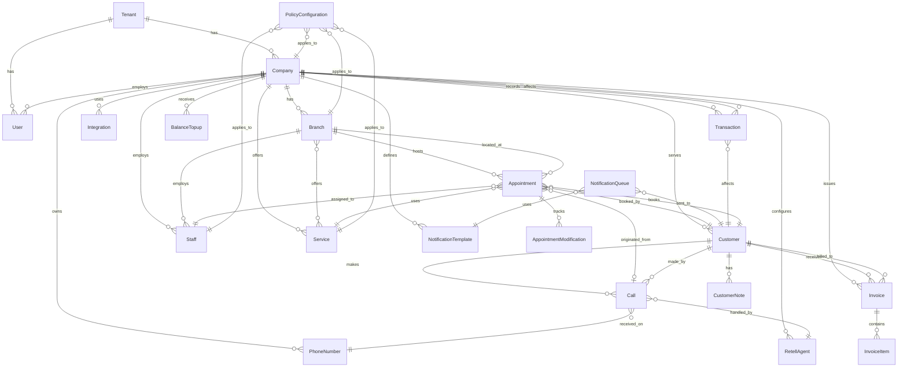
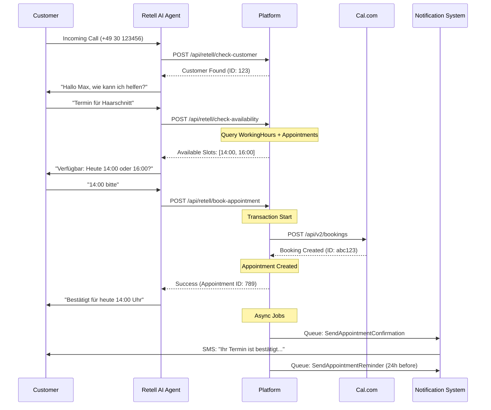
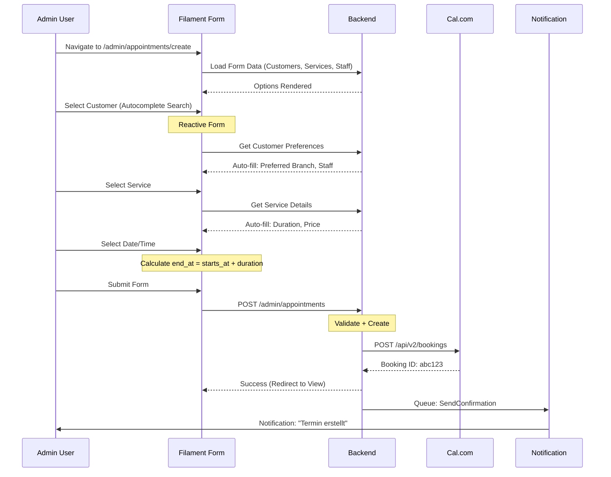
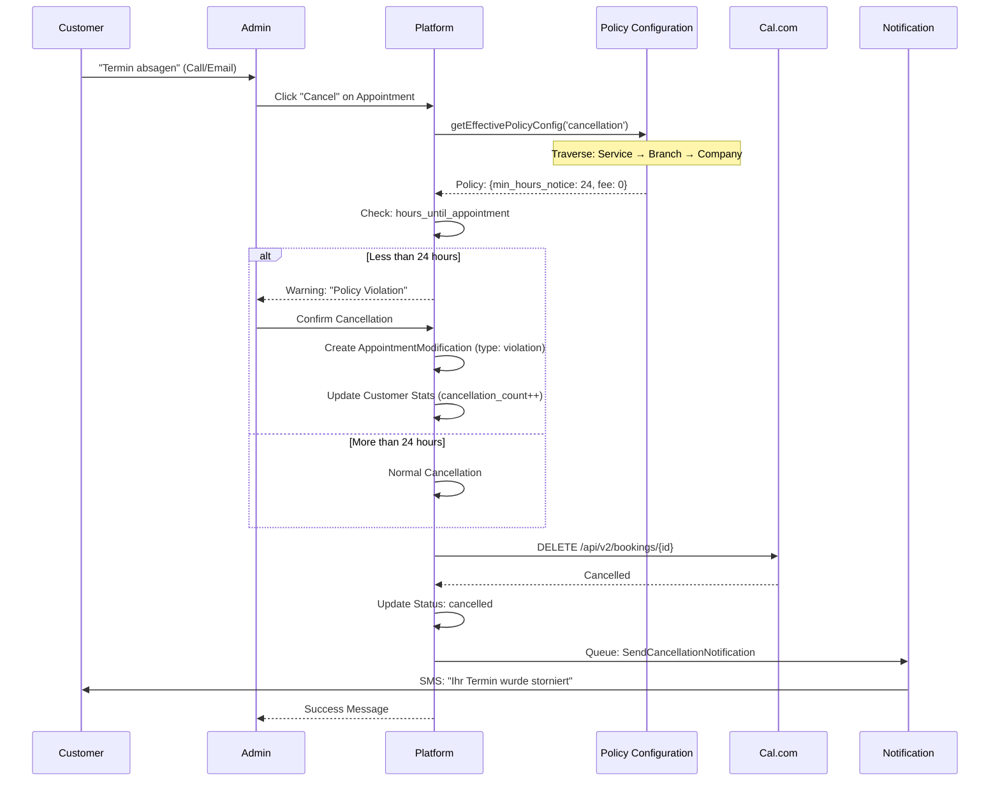
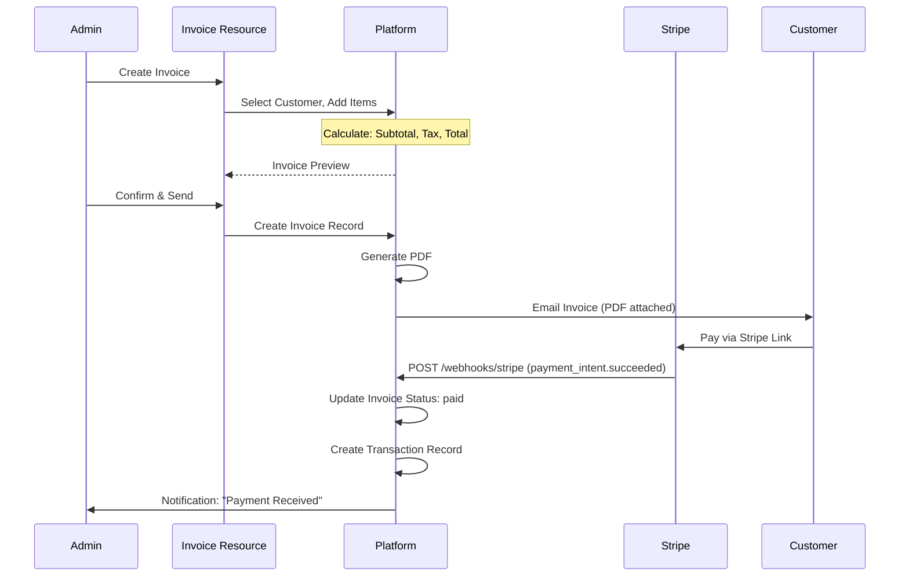
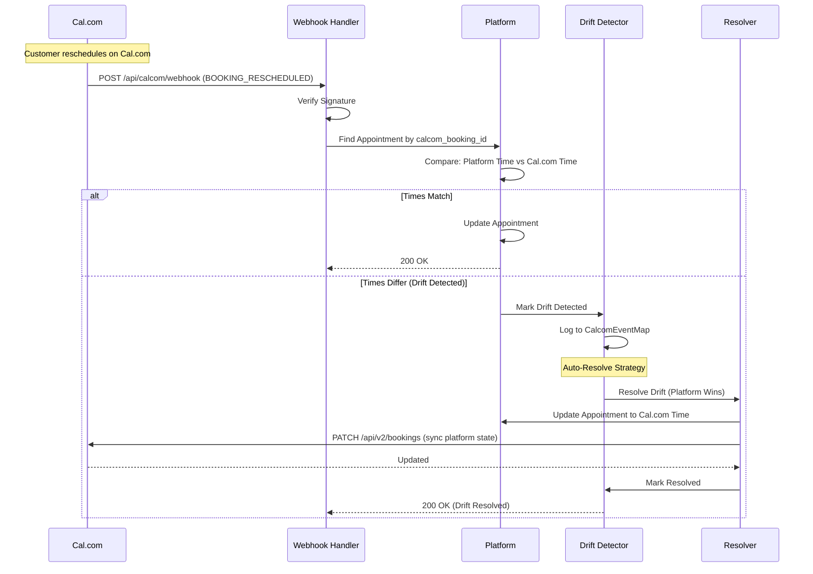

# Plattform-Dokumentation: api.askproai.de/admin

**Dokumentationsstand**: 4. Oktober 2025
**Version**: 1.0.0
**System**: Multi-Tenant SaaS Terminverwaltung mit AI-Integration

---

## Executive Summary

### Plattform-Zweck
**AskProAI Admin Portal** ist eine Multi-Tenant SaaS-Plattform für AI-gestützte Terminverwaltung mit automatischer Telefonbuchung über Retell AI und bidirektionaler Cal.com-Synchronisation. Die Plattform kombiniert klassische CRM-Funktionen mit moderner KI-Telefonie für vollautomatisierte Terminbuchungen.

### Hauptfunktionen
- **AI-Telefonie**: Automatische Terminbuchung über Retell AI Phone Agent
- **Kalender-Sync**: Bidirektionale Cal.com-Integration mit Drift-Detection
- **Multi-Tenant**: Hierarchische Isolation (Tenant → Company → Branch)
- **CRM-System**: Customer Journey Tracking, Engagement Scoring, Loyalty Management
- **Billing**: Prepaid-Balance-System mit Bonus-Tiers und Platform-Cost-Tracking
- **Notification Hub**: Multi-Channel Benachrichtigungen (SMS, Email, Telegram, Twilio)

### Zielgruppe
- **Primary**: Service-Unternehmen (Friseure, Physiotherapie, Kosmetik, Handwerk)
- **Secondary**: Kleine bis mittlere Unternehmen mit Terminbedarf (5-50 Mitarbeiter)
- **Use Case**: Unternehmen mit hohem Telefonbuchungsvolumen, die Automatisierung suchen

### Technologie-Highlights
- **Laravel 11** mit PHP 8.2
- **Filament 3.3** für Admin-Panel
- **Livewire 3** für reaktive UI
- **Retell AI** für KI-Telefonie
- **Cal.com API** für Kalenderverwaltung
- **Multi-Layer Security** mit 26 Middleware-Komponenten

---

## 1. Technischer Stack

### 1.1 Frontend-Technologien

#### Filament 3.3 Admin Panel
```yaml
Framework: Filament 3.3
Purpose: Full-featured Admin Panel
Features:
  - Form Builder mit reaktiven Komponenten
  - Table Builder mit Advanced Filters
  - Relation Managers für 1:n und n:m Beziehungen
  - Custom Actions und Bulk Operations
  - Widget System (43+ Widgets)
  - Infolist System für View Pages
```

#### Livewire 3
```yaml
Purpose: Server-side Rendering mit Reactivity
Features:
  - Real-time UI Updates ohne JavaScript
  - Form Validation
  - Polling für Live-Daten (30-60s Intervals)
  - Event Broadcasting
```

#### Alpine.js
```yaml
Purpose: Clientseitige Interaktivität
Usage:
  - Dropdown-Menüs
  - Modals und Tooltips
  - Form-Enhancements
  - Filament UI Components
```

#### Tailwind CSS 3
```yaml
Purpose: Utility-First CSS Framework
Customization:
  - Filament Design System
  - Custom Color Palette
  - Responsive Breakpoints
  - Dark Mode Support (Filament managed)
```

### 1.2 Backend-Framework

#### Laravel 11.31
```yaml
PHP Version: 8.2
Architecture: MVC with Service Layer Pattern
Key Features:
  - Eloquent ORM mit Advanced Relationships
  - Queue System (Redis/Database)
  - Job Batching
  - Event Broadcasting
  - Task Scheduling
  - Multi-Database Support
```

**Architektur-Pattern**:
```
┌─────────────────────────────────────────┐
│  Filament Resources (Presentation)      │
├─────────────────────────────────────────┤
│  Controllers (HTTP Handling)            │
├─────────────────────────────────────────┤
│  Services (Business Logic)              │
│  ├─ CalcomV2Service                     │
│  ├─ RetellService                       │
│  ├─ NotificationService                 │
│  └─ AvailabilityService                 │
├─────────────────────────────────────────┤
│  Models (Data Layer)                    │
│  └─ Traits (HasConfigurationInheritance)│
├─────────────────────────────────────────┤
│  Database (MySQL/PostgreSQL)            │
└─────────────────────────────────────────┘
```

### 1.3 Datenbank-System

**Primäre Datenbank**: MySQL 8.0 / PostgreSQL 14+

**Migrations-Stand**: 45 Models, 60+ Tabellen

**Optimierungen**:
- Compound Indexes für Multi-Tenant Queries
- Materialized Views (AppointmentModificationStat)
- JSON-Felder für flexible Daten
- Soft Deletes für Audit Trail

### 1.4 Externe Integrationen

#### Cal.com Integration
```yaml
Version: Cal.com API v2
Authentication: API Key per Company
Features:
  - Team-based Event Types
  - Bidirektionale Sync
  - Drift Detection & Auto-Resolve
  - Booking CRUD Operations
  - Availability Checking
```

#### Retell AI Integration
```yaml
Version: Retell AI API
Authentication: Webhook Signature Verification
Features:
  - AI Phone Agent Configuration
  - Function Calling (Availability, Booking)
  - Call Transcript Storage
  - Cost Tracking
  - Call Analytics
```

#### Payment Processing
```yaml
Stripe: Webhook Integration
  - Payment Intent Creation
  - Subscription Management
  - Webhook Signature Verification
```

#### Communication Channels
```yaml
Twilio: SMS Notifications
Telegram: Bot Notifications
SMTP: Email System (Laravel Mail)
```

#### Additional Services
```yaml
Google Translate API: Multi-Language Support
Pusher: Real-time Broadcasting
Spatie iCalendar: ICS File Generation
DomPDF: Invoice Generation
```

### 1.5 Deployment-Umgebung

**Server-Stack**:
```yaml
Web Server: Nginx
PHP: PHP-FPM 8.2
Process Manager: Supervisor
Queue Worker: Laravel Queue (Redis)
Scheduler: Laravel Cron
Cache: Redis / File Cache
Session: Database
```

**Security Headers** (via SecurityHeaders Middleware):
```http
X-Frame-Options: DENY
X-Content-Type-Options: nosniff
X-XSS-Protection: 1; mode=block
Referrer-Policy: strict-origin-when-cross-origin
Content-Security-Policy: default-src 'self'
```

---

## 2. Systemarchitektur

### 2.1 Multi-Tenant-Architektur

#### Hierarchische Struktur

```
Tenant (Root Entity)
├─ Company (1:1 or 1:n)
│  ├─ Branch (1:n)
│  │  ├─ Staff (1:n)
│  │  ├─ Services (n:m)
│  │  └─ Customers (1:n scoped)
│  ├─ Services (1:n)
│  ├─ Phone Numbers (1:n)
│  ├─ Retell Agents (1:n)
│  └─ Integrations (1:n)
└─ Users (1:n)
```

**Isolations-Mechanismus**:
```php
// BelongsToCompany Trait - Applied to 22 Models
trait BelongsToCompany {
    protected static function bootBelongsToCompany() {
        static::addGlobalScope('company', function ($query) {
            if (auth()->check() && auth()->user()->company_id) {
                $query->where('company_id', auth()->user()->company_id);
            }
        });
    }
}

// Applied to:
// Customer, Appointment, Call, Staff, Service, Branch
// Invoice, Transaction, PhoneNumber, etc.
```

**Sicherheitsmerkmale**:
- Global Scopes auf Model-Ebene
- Policy-basierte Authorization (Spatie)
- Mass Assignment Protection (guarded fields)
- Encrypted Credentials (API Keys)

### 2.2 Hierarchische Konfiguration

#### HasConfigurationInheritance Trait

**Angewandt auf**: Company, Branch, Service, Staff

**Hierarchie**: Staff → Service → Branch → Company

**Konfigurationstypen**:
1. **Policy Configuration** (Cancellation, Reschedule, Recurring)
2. **Notification Configuration** (Event-based, Multi-Channel)

**Beispiel**:
```php
// Staff kann Policy von Service erben
$staff->getEffectivePolicyConfig('cancellation')
// Sucht: Staff → Service → Branch → Company

// Mit Cache (5 Minuten TTL)
Cache::remember('policy:staff:42:cancellation', 300, fn() => ...);
```

**Regeln**:
- **Policy**: Volle Vererbung mit Override-Möglichkeit
- **Notification**: Staff kann NUR Präferenzen (Channel, Template) überschreiben, NICHT Business Policies (Retry Logic, Timing)

### 2.3 Polymorphe Beziehungen

#### PolicyConfiguration & NotificationConfiguration

```php
// Polymorphic Relationship
configurable_type: 'App\Models\Company'
configurable_id: 123

// Supported Types:
- Company
- Branch
- Service
- Staff
```

**Use Cases**:
- Flexible Policy-Zuweisung
- Hierarchisches Override-System
- Zentrale Konfigurationsverwaltung

### 2.4 Event-Sourcing Patterns

#### AppointmentModification Tracking

```php
// Materialized View für Performance
AppointmentModificationStat:
  - customer_id
  - appointment_id
  - modification_count (Reschedules + Cancellations)
  - last_modification_at
  - cancellation_count
  - reschedule_count

// Calculated on every Modification
```

**Journey Status Tracking**:
```php
Customer:
  - journey_status: lead | prospect | customer | regular | vip | at_risk | churned
  - journey_history: JSON Array mit Transitions
  - journey_status_updated_at
```

### 2.5 Caching-Strategie

**Multi-Layer Caching**:
```yaml
Layer 1 - Query Cache:
  - HasConfigurationInheritance (5 min TTL)
  - Navigation Badges (5 min TTL)

Layer 2 - Application Cache:
  - Cal.com Team Sync Status (24h)
  - Retell Agent Configuration (1h)

Layer 3 - Session Cache:
  - User Preferences
  - Filter States (Filament)
```

**Cache Keys Pattern**:
```php
'policy_config:{class}:{id}:{type}'
'notification_config:{class}:{id}:{event}:{channel}'
'navigation_badge:{resource}:{type}'
```

---

## 3. Funktionale Bereiche

### 3.1 Core Business Management

#### Tenant/Company/Branch Management

**Tenant Model** (Root Entity):
```yaml
Purpose: Multi-Tenant Root
Features:
  - API Key Management (Encrypted)
  - Webhook Configuration
  - Billing (Balance, Pricing Plan)
  - Usage Limits (Companies, Users, Calls)
  - Trial & Subscription Management
  - Feature Flags
```

**Company Model**:
```yaml
Purpose: Business Entity
Features:
  - Cal.com Team Integration
  - Retell Agent Configuration
  - Prepaid Billing System
  - Commission Rate Management
  - Security Settings (IP Whitelist)
  - Multi-Language Support
```

**Branch Model**:
```yaml
Purpose: Physical Location
Features:
  - Location Data (Address, Coordinates)
  - Service Overrides
  - Staff Assignment
  - Business Hours
  - Service Radius
  - Transport Info
```

**User Management**:
- Spatie Permission System
- Role-based Access Control (RBAC)
- Company-scoped Users
- Custom Permissions

### 3.2 Appointment System

#### Core Features

**Appointment Types**:
```yaml
Simple Appointment:
  - Single Service
  - Single Staff
  - Fixed Duration

Composite Appointment:
  - Multiple Services (Segments)
  - Sequential Booking
  - Example: Waschen + Schneiden + Föhnen

Recurring Appointment:
  - Recurrence Rules (Weekly, Monthly)
  - Parent-Child Relationship
  - Series Management
```

**Appointment Status Flow**:
```
pending → confirmed → in_progress → completed
               ↓
           cancelled / no_show
```

**Key Fields**:
```php
Appointment:
  - starts_at, ends_at (DateTime)
  - customer_id, staff_id, service_id, branch_id
  - status, source, booking_type
  - price (Decimal)
  - calcom_booking_id (Integration)
  - is_composite, segments (JSON)
  - parent_appointment_id (Recurring)
  - reminder_24h_sent_at
```

#### Calendar Integration

**Cal.com Synchronization**:
```yaml
Bidirectional Sync:
  Direction 1: Cal.com → Platform (Webhook)
  Direction 2: Platform → Cal.com (API Push)

Drift Detection:
  - Detect: Vergleich Platform vs Cal.com State
  - Resolve: Auto-Resolve mit Conflict Resolution Rules

Sync Frequency:
  - Real-time (Webhooks)
  - Periodic Health Checks (24h)
```

**Working Hours Management**:
```yaml
WorkingHour Model:
  - staff_id, company_id
  - day_of_week (0-6)
  - start_time, end_time
  - is_available (Boolean)
  - break_start, break_end
  - branch_specific_override
```

### 3.3 AI & Communication

#### Retell AI Phone Integration

**Call Flow**:
```
1. Incoming Call → Retell Agent
2. Agent: Customer Identification (check-customer)
3. Agent: Availability Check (check-availability)
4. Agent: Appointment Collection (collect-appointment)
5. Agent: Booking Confirmation (book-appointment)
6. Webhook → Platform (call-completed)
```

**Function Call Endpoints**:
```yaml
/api/retell/check-customer:
  Purpose: Identify customer by phone
  Response: customer_id, name, history

/api/retell/check-availability:
  Purpose: Real-time slot checking
  Input: date, time, service_id, staff_id
  Response: available (bool), next_slots

/api/retell/collect-appointment:
  Purpose: Gather appointment details
  Validation: Date, Service, Staff

/api/retell/book-appointment:
  Purpose: Create appointment
  Transaction: Atomic Booking + Cal.com Sync
```

**Call Model**:
```yaml
Fields:
  - call_id (Retell ID)
  - customer_id, company_id, branch_id
  - phone_number_id, agent_id
  - transcript (Text)
  - summary, summary_translations (JSON)
  - cost_cents (Platform Profit Calculation)
  - customer_data_collected_at
  - appointment_made (Boolean)
  - analysis (JSON - Sentiment, Topics)
```

**Security**:
- Webhook Signature Verification (VerifyRetellSignature)
- Function Call Whitelist (Retell IP Ranges)
- Rate Limiting (100 req/min per call)

#### Customer Identification

**Phone Matching**:
```php
// Multi-Variant Matching
Customer:
  - phone (Primary)
  - phone_variants (JSON Array)

// Normalization:
normalize('+49 151 1234567') → '4915112345678'
normalize('0151 123-4567') → '4915112345678'
```

**Automatic Customer Creation**:
```yaml
Trigger: First-Time Caller
Data: Phone, Name (from Transcript)
Journey Status: 'lead'
```

### 3.4 Customer Management

#### Customer Journey

**Journey Stages**:
```yaml
lead: Erster Kontakt, noch kein Termin
prospect: Interesse gezeigt, Termin geplant
customer: Erster Termin abgeschlossen
regular: 3+ Termine abgeschlossen
vip: Hoher Lifetime Value
at_risk: 90+ Tage keine Aktivität
churned: Verloren
```

**Engagement Scoring**:
```php
Score Calculation:
+ appointment_count × 10
+ completed_appointments × 5
+ call_count × 3
+ recent_activity_bonus (20-30 days: +20)
- no_show_count × 5
- cancelled_count × 2
+ vip_bonus (+50)

Range: 0-1000
```

**Loyalty System**:
```yaml
loyalty_points: Integer (Earned per Appointment)
loyalty_tier: bronze | silver | gold | platinum
total_revenue: Calculated from Invoices
average_booking_value: total_revenue / appointment_count
```

#### Customer Data Management

**GDPR Compliance**:
```yaml
Fields:
  - gdpr_consent (Boolean)
  - gdpr_consent_date
  - marketing_consent
  - privacy_consent_at
  - deletion_requested_at

Features:
  - Data Export
  - Right to Erasure
  - Consent Tracking
```

**Customer Notes**:
```yaml
CustomerNote Model:
  - subject, content
  - type: general | complaint | feedback | medical
  - is_pinned (Boolean)
  - created_by (User ID)
  - visibility: staff | management | all
```

### 3.5 Billing & Finance

#### Balance Topup System

**BalanceTopup Model**:
```yaml
Fields:
  - company_id
  - amount_cents (Integer)
  - currency (EUR)
  - payment_method (stripe, bank_transfer, manual)
  - bonus_cents (Bonus from Tier)
  - bonus_tier_id
  - status (pending, completed, failed)
  - stripe_payment_intent_id
```

**Bonus Tier System**:
```yaml
BalanceBonusTier:
  - name: "Starter", "Pro", "Business"
  - min_topup_amount: 100, 500, 1000 EUR
  - bonus_percentage: 5%, 10%, 15%
  - bonus_type: percentage | fixed
  - is_active
```

**Transaction Tracking**:
```yaml
Transaction Model:
  - company_id, customer_id (Polymorphic)
  - type: topup | call_cost | refund | adjustment
  - amount_cents
  - balance_before, balance_after
  - reference_type, reference_id (Polymorphic)
  - description
```

#### Invoice System

**Invoice Model**:
```yaml
Fields:
  - company_id, customer_id
  - invoice_number (Auto-generated)
  - issue_date, due_date, paid_at
  - subtotal, tax, total (Decimal)
  - status: draft | sent | paid | overdue | cancelled
  - payment_method
  - notes, terms_and_conditions

Relationships:
  - items (InvoiceItem 1:n)
  - transactions (Payment Tracking)
```

**InvoiceItem Model**:
```yaml
Fields:
  - invoice_id
  - description
  - quantity, unit_price
  - tax_rate, tax_amount
  - total
  - appointment_id (Optional Reference)
```

#### Platform Cost Tracking

**PlatformCost Model**:
```yaml
Purpose: Track External API Costs
Fields:
  - company_id
  - service_type: retell | cal_com | sms | translation
  - cost_cents
  - currency, exchange_rate
  - quantity (Calls, SMS, etc.)
  - cost_per_unit_cents
  - metadata (JSON)
  - occurred_at
```

**MonthlyCostReport**:
```yaml
Purpose: Aggregated Monthly Costs
Fields:
  - company_id
  - year, month
  - total_cost_cents
  - cost_breakdown (JSON by Service Type)
  - call_count, sms_count, etc.
```

### 3.6 Notification System

#### Multi-Channel Architecture

**NotificationQueue Model**:
```yaml
Fields:
  - event_type: appointment_confirmed | reminder_24h | cancellation | etc.
  - channel: email | sms | telegram | whatsapp
  - recipient (Email/Phone)
  - customer_id, company_id
  - template_id
  - data (JSON)
  - status: pending | sent | failed
  - sent_at, failed_at
  - retry_count, max_retries
  - error_message
```

**Notification Channels**:
```yaml
Email:
  - Laravel Mail
  - SMTP Configuration
  - Template Support (Blade)

SMS:
  - Twilio API
  - Character Limit Handling
  - Cost Tracking

Telegram:
  - Bot Integration
  - Laravel Notification Channel
  - Rich Formatting

Whatsapp:
  - Twilio WhatsApp API
  - Media Support (Future)
```

#### Hierarchical Configuration

**NotificationConfiguration Model**:
```yaml
Polymorphic: configurable_type, configurable_id
Fields:
  - event_type
  - channel, fallback_channel
  - is_enabled (Boolean)
  - retry_count, retry_delay_minutes
  - template_override (Custom Template)
  - metadata (JSON)

Hierarchy Resolution:
  Staff → Service → Branch → Company
```

**NotificationEventMapping**:
```yaml
Purpose: Event Type Registry
Fields:
  - event_type: unique identifier
  - display_name
  - description
  - default_channel
  - requires_customer (Boolean)
  - can_be_disabled (Boolean)
```

#### Template System

**NotificationTemplate Model**:
```yaml
Fields:
  - company_id
  - name, description
  - channel
  - subject (Email)
  - body (Template with Placeholders)
  - language (de, en, fr, etc.)
  - variables (JSON - Available Placeholders)
  - is_active

Placeholders:
  - {{customer_name}}
  - {{appointment_date}}
  - {{appointment_time}}
  - {{service_name}}
  - {{staff_name}}
  - {{branch_address}}
```

**Multi-Language Support**:
```yaml
Template Versioning:
  - DE: Default
  - EN: Auto-Translation via Google Translate API
  - Custom: Manual Override per Company

Storage:
  summary_translations (JSON):
    de: "Deutscher Text"
    en: "English Text"
```

### 3.7 Integration & Webhooks

#### Cal.com Integration

**Webhook Events**:
```yaml
BOOKING_CREATED:
  Action: Create Appointment in Platform
  Sync: Bidirectional Link

BOOKING_RESCHEDULED:
  Action: Update Appointment
  Conflict: Drift Detection

BOOKING_CANCELLED:
  Action: Cancel Appointment
  Policy: Check Cancellation Rules

BOOKING_REJECTED:
  Action: Delete Pending Appointment
```

**Drift Detection**:
```yaml
Mechanism:
  1. Periodic Comparison (24h)
  2. Detect Mismatches (Status, Time, Attendees)
  3. Auto-Resolve Strategy:
     - Platform Changes Win (default)
     - Cal.com Changes Win (override)
  4. Manual Review Widget

Storage:
  CalcomEventMap:
    - appointment_id
    - calcom_booking_id
    - drift_detected_at
    - drift_status: synced | drift | resolved
```

**Team Synchronization**:
```yaml
TeamEventTypeMapping:
  - company_id
  - calcom_team_id
  - calcom_event_type_id
  - service_id (Platform Mapping)
  - is_active
  - last_synced_at

CalcomTeamMember:
  - company_id
  - calcom_team_id
  - calcom_user_id
  - staff_id (Platform Mapping)
  - role: member | admin
```

#### Retell Webhook Processing

**RetellWebhookController**:
```php
// Webhook Endpoint
POST /webhooks/retell

// Signature Verification
VerifyRetellSignature Middleware

// Event Processing
1. call.ended → Store Call, Transcript, Analysis
2. call.analyzed → Update Sentiment, Topics
3. Async Job: NotifyTeam, UpdateStatistics
```

**WebhookLog Model**:
```yaml
Purpose: Audit Trail
Fields:
  - source: retell | cal_com | stripe
  - event_type
  - payload (JSON)
  - response_status
  - processed_at
  - error_message
  - retry_count
```

#### Stripe Payment Webhooks

**StripePaymentController**:
```php
POST /webhooks/stripe

Events:
  - payment_intent.succeeded → Complete Topup
  - payment_intent.payment_failed → Mark Failed
  - customer.subscription.updated → Update Subscription Status

Security:
  VerifyStripeWebhookSignature Middleware
```

#### Health Monitoring

**Health Check Endpoints**:
```yaml
GET /api/health:
  Response:
    - status: ok | degraded | down
    - database: ok | error
    - queue: ok | delayed
    - cache: ok | error

GET /api/health/detailed:
  Response:
    - integrations:
        cal_com: ok | error
        retell: ok | error
        stripe: ok | error
    - metrics:
        calls_today: 42
        appointments_today: 35
        queue_jobs_pending: 12
```

**IntegrationHealthWidget**:
```yaml
Dashboard Widget:
  - Cal.com Status (Last Sync, API Health)
  - Retell Status (Last Call, Agent Status)
  - Stripe Status (Last Payment)
  - Real-time Updates (Poll 60s)
```

---

## 4. Admin-Panel Features (Filament 3)

### 4.1 Ressourcen-Übersicht

**Navigation-Gruppen**:
```yaml
CRM (Customer Relationship):
  - Customers (Kunden)
  - Appointments (Termine)
  - Calls (Anrufe)
  - Customer Notes
  - Appointment Modifications

Stammdaten (Master Data):
  - Companies (Unternehmen)
  - Branches (Filialen)
  - Staff (Mitarbeiter)
  - Services (Dienstleistungen)
  - Working Hours

Billing:
  - Invoices (Rechnungen)
  - Transactions (Transaktionen)
  - Balance Topups
  - Pricing Plans
  - Balance Bonus Tiers
  - Platform Costs
  - Monthly Cost Reports

Communication:
  - Notification Queue
  - Notification Templates
  - Notification Configurations
  - Notification Providers

Integrations:
  - Integrations (Cal.com, Retell)
  - Phone Numbers
  - Retell Agents
  - Callback Requests

Settings:
  - Users
  - Roles
  - Permissions
  - Tenants
  - System Settings
  - Policy Configurations
  - Currency Exchange Rates

Monitoring:
  - Activity Logs
  - Webhook Logs
```

### 4.2 Feature-Matrix

| Resource | List | Create | Edit | View | Delete | Bulk | Export | Widgets |
|----------|------|--------|------|------|--------|------|--------|---------|
| Customers | ✅ | ✅ | ✅ | ✅ | ✅ | ✅ | ✅ | 3 |
| Appointments | ✅ | ✅ | ✅ | ✅ | ✅ | ✅ | ❌ | 3 |
| Calls | ✅ | ❌ | ✅ | ✅ | ✅ | ❌ | ✅ | 5 |
| Staff | ✅ | ✅ | ✅ | ✅ | ✅ | ✅ | ❌ | 1 |
| Services | ✅ | ✅ | ✅ | ✅ | ✅ | ✅ | ❌ | 1 |
| Invoices | ✅ | ✅ | ✅ | ✅ | ✅ | ✅ | PDF | 2 |
| Notifications | ✅ | ❌ | ✅ | ✅ | ✅ | ✅ | ❌ | 3 |

### 4.3 Custom Actions

#### Appointment Actions
```yaml
Quick Status Updates:
  - Confirm (pending → confirmed)
  - Complete (in_progress → completed)
  - Cancel (with Policy Check)
  - Reschedule (with Availability Check)
  - Send Reminder (Manual Trigger)

Bulk Actions:
  - Bulk Confirm
  - Bulk Cancel
  - Bulk Delete
```

#### Customer Actions
```yaml
Communication:
  - Send SMS (with Opt-in Check)
  - Send Email
  - Book Appointment (Redirect to Create)

Journey Management:
  - Update Journey Status (with Notes)
  - Add Note (Quick Entry)
  - Add to VIP

Bulk Actions:
  - Bulk SMS Campaign
  - Bulk Journey Status Update
  - Bulk Export
```

#### Call Actions
```yaml
Review:
  - View Transcript
  - View Analysis (Sentiment, Topics)
  - Play Recording (if available)

Processing:
  - Create Appointment from Call
  - Link to Customer
  - Mark as Reviewed
```

### 4.4 Relation Managers

**Customer Resource**:
```yaml
Appointments:
  - Tabelle: Vergangene & Zukünftige Termine
  - Actions: Reschedule, Cancel, View Details

Calls:
  - Tabelle: Call History
  - Columns: Date, Duration, Transcript, Appointment Made

Notes:
  - Tabelle: All Customer Notes
  - Actions: Pin, Edit, Delete
  - Visibility: Staff/Management Filter
```

**Appointment Resource**:
```yaml
Modifications:
  - Tabelle: Reschedules & Cancellations
  - Columns: Type, Date, Reason, Modified By
```

**Company Resource**:
```yaml
Branches:
  - Tabelle: All Locations
  - Inline Create

Users:
  - Tabelle: Company Users
  - Role Management

Integrations:
  - Tabelle: Cal.com, Retell Configuration
  - Health Status Indicators
```

### 4.5 Dashboard Widgets (43+)

#### Overview Widgets
```yaml
StatsOverview:
  - Total Customers (Active)
  - Appointments Today
  - Revenue This Month
  - Ongoing Calls

CompanyOverview:
  - Company Count
  - Active Branches
  - Total Staff
  - Services Count
```

#### Chart Widgets
```yaml
CustomerChartWidget:
  - New Customers (30 days)
  - Line Chart

CustomerJourneyChart:
  - Journey Distribution
  - Pie Chart (lead, prospect, customer, etc.)

CompanyGrowthChart:
  - Company Registration Trend
  - Bar Chart

ProfitChartWidget:
  - Revenue vs Costs
  - Area Chart
```

#### Activity Widgets
```yaml
RecentAppointments:
  - Latest 10 Appointments
  - Status Badges
  - Quick Actions

RecentCalls:
  - Latest Calls
  - Transcript Preview
  - Link to Customer

LatestCustomers:
  - New Customers (7 days)
  - Journey Status
```

#### Monitoring Widgets
```yaml
IntegrationHealthWidget:
  - Cal.com API Status
  - Retell Agent Status
  - Last Sync Times
  - Error Count

CalcomSyncStatusWidget:
  - Drift Detection Status
  - Sync Queue Count
  - Failed Syncs

OngoingCallsWidget:
  - Active Calls Count
  - Average Duration
  - Live Status
```

#### Policy & Analytics Widgets
```yaml
PolicyAnalyticsWidget:
  - Cancellation Rate
  - Reschedule Rate
  - Policy Violations

PolicyViolationsTableWidget:
  - Recent Violations
  - Customer, Reason, Date

NotificationAnalyticsWidget:
  - Sent vs Failed
  - Channel Distribution
  - Retry Statistics
```

### 4.6 Custom Pages

**Calendar View**:
```php
Route: /admin/appointments/calendar
Component: FullCalendar.js Integration
Features:
  - Month/Week/Day Views
  - Drag & Drop Reschedule
  - Color-coded by Status
  - Filter by Staff/Branch
```

**Appointment Modification Stats**:
```php
Route: /admin/appointment-modifications
Purpose: Violation Tracking
Features:
  - Customers with High Modification Rates
  - Policy Enforcement Dashboard
  - Trend Analysis
```

---

## 5. API-Dokumentation

### 5.1 API V1 (Placeholder)

**Status**: Placeholder-Routes (501 Not Implemented)

```yaml
GET /api/v1/customers: Coming Soon
GET /api/v1/calls: Coming Soon
GET /api/v1/appointments: Coming Soon
```

### 5.2 API V2 (Cal.com Integration)

#### Availability Endpoints

**Simple Availability**:
```http
POST /api/v2/availability/simple
Content-Type: application/json

{
  "date": "2025-10-05",
  "service_id": 42,
  "staff_id": 12,
  "duration_minutes": 60
}

Response:
{
  "available": true,
  "slots": [
    {"start": "09:00", "end": "10:00"},
    {"start": "14:00", "end": "15:00"}
  ]
}
```

**Composite Availability**:
```http
POST /api/v2/availability/composite
Content-Type: application/json

{
  "date": "2025-10-05",
  "services": [
    {"service_id": 1, "duration": 30},
    {"service_id": 2, "duration": 45}
  ],
  "staff_id": 12
}

Response:
{
  "available": true,
  "total_duration": 75,
  "slots": [
    {
      "start": "09:00",
      "segments": [
        {"service_id": 1, "start": "09:00", "end": "09:30"},
        {"service_id": 2, "start": "09:30", "end": "10:15"}
      ]
    }
  ]
}
```

#### Booking Endpoints

**Create Booking**:
```http
POST /api/v2/bookings
Content-Type: application/json

{
  "customer_id": 123,
  "service_id": 42,
  "staff_id": 12,
  "branch_id": 5,
  "starts_at": "2025-10-05T14:00:00+02:00",
  "source": "api",
  "notes": "Allergien: Keine"
}

Response:
{
  "success": true,
  "appointment_id": 789,
  "calcom_booking_id": "abc123",
  "confirmation_sent": true
}

Rate Limit: 30 requests/minute
```

**Reschedule Booking**:
```http
PATCH /api/v2/bookings/{id}/reschedule
Content-Type: application/json

{
  "new_starts_at": "2025-10-06T15:00:00+02:00",
  "reason": "Customer Request"
}

Response:
{
  "success": true,
  "appointment_id": 789,
  "old_time": "2025-10-05T14:00:00+02:00",
  "new_time": "2025-10-06T15:00:00+02:00",
  "policy_check": "passed"
}

Rate Limit: 10 requests/minute
```

**Cancel Booking**:
```http
DELETE /api/v2/bookings/{id}
Content-Type: application/json

{
  "reason": "Customer Sick",
  "notify_customer": true
}

Response:
{
  "success": true,
  "refund_eligible": false,
  "policy_violation": false,
  "cancellation_fee": 0
}

Rate Limit: 10 requests/minute
```

#### Cal.com Sync Endpoints

**Push Event Types**:
```http
POST /api/v2/calcom/push-event-types
Authorization: Bearer {api_key}

Response:
{
  "success": true,
  "event_types_created": 5,
  "event_types_updated": 2,
  "errors": []
}

Rate Limit: 10 requests/5 minutes
```

**Drift Detection**:
```http
POST /api/v2/calcom/detect-drift
Authorization: Bearer {api_key}

Response:
{
  "drift_detected": true,
  "total_appointments": 142,
  "drifted_appointments": 3,
  "details": [
    {
      "appointment_id": 789,
      "issue": "time_mismatch",
      "platform_time": "14:00",
      "calcom_time": "15:00"
    }
  ]
}
```

**Auto-Resolve Drift**:
```http
POST /api/v2/calcom/auto-resolve
Authorization: Bearer {api_key}

{
  "strategy": "platform_wins"
}

Response:
{
  "success": true,
  "resolved_count": 3,
  "failed_count": 0
}
```

### 5.3 Retell Function Call Endpoints

**Check Customer**:
```http
POST /api/retell/check-customer
Content-Type: application/json
X-Retell-Signature: {signature}

{
  "call_id": "abc123",
  "phone_number": "+4915112345678"
}

Response:
{
  "customer_found": true,
  "customer_id": 123,
  "customer_name": "Max Mustermann",
  "appointment_count": 5,
  "last_appointment": "2025-09-15",
  "no_show_count": 0,
  "is_vip": false
}

Middleware:
  - retell.function.whitelist
  - retell.call.ratelimit
  - throttle:100,1
```

**Check Availability**:
```http
POST /api/retell/check-availability
Content-Type: application/json
X-Retell-Signature: {signature}

{
  "call_id": "abc123",
  "date": "2025-10-05",
  "time": "14:00",
  "service_id": 42,
  "duration_minutes": 60
}

Response:
{
  "available": true,
  "slot": {
    "start": "14:00",
    "end": "15:00"
  },
  "staff_name": "Anna Schmidt",
  "branch_name": "Hauptfiliale"
}

// If not available:
{
  "available": false,
  "next_available_slots": [
    {"date": "2025-10-05", "time": "16:00"},
    {"date": "2025-10-06", "time": "10:00"}
  ]
}
```

**Book Appointment**:
```http
POST /api/retell/book-appointment
Content-Type: application/json
X-Retell-Signature: {signature}

{
  "call_id": "abc123",
  "customer_id": 123,
  "service_id": 42,
  "staff_id": 12,
  "starts_at": "2025-10-05T14:00:00+02:00",
  "customer_notes": "Allergien: Keine"
}

Response:
{
  "success": true,
  "appointment_id": 789,
  "confirmation_message": "Ihr Termin ist bestätigt für 5. Oktober um 14:00 Uhr.",
  "calendar_link": "https://cal.com/booking/abc123"
}

Rate Limit: 60 requests/minute
```

### 5.4 Webhook Endpoints

**Cal.com Webhook**:
```http
POST /api/calcom/webhook
Content-Type: application/json
X-Cal-Signature-256: {signature}

Event Types:
  - BOOKING_CREATED
  - BOOKING_RESCHEDULED
  - BOOKING_CANCELLED
  - BOOKING_REJECTED

Example Payload:
{
  "triggerEvent": "BOOKING_CREATED",
  "payload": {
    "id": 12345,
    "uid": "abc123",
    "title": "Haarschnitt",
    "startTime": "2025-10-05T14:00:00Z",
    "endTime": "2025-10-05T15:00:00Z",
    "attendees": [
      {"email": "customer@example.com", "name": "Max Mustermann"}
    ],
    "eventTypeId": 42
  }
}

Middleware:
  - calcom.signature
  - throttle:60,1
```

**Retell Webhook**:
```http
POST /webhooks/retell
Content-Type: application/json
X-Retell-Signature: {signature}

Event Types:
  - call.ended
  - call.analyzed

Example Payload:
{
  "event": "call.ended",
  "call_id": "abc123",
  "from_number": "+4915112345678",
  "to_number": "+4930123456",
  "duration_seconds": 180,
  "transcript": "...",
  "analysis": {
    "sentiment": "positive",
    "topics": ["appointment", "availability"],
    "appointment_made": true
  },
  "cost_usd": 0.15
}

Middleware:
  - retell.signature
  - throttle:60,1
```

**Stripe Webhook**:
```http
POST /webhooks/stripe
Content-Type: application/json
Stripe-Signature: {signature}

Event Types:
  - payment_intent.succeeded
  - payment_intent.payment_failed
  - customer.subscription.updated

Middleware:
  - stripe.webhook
  - throttle:60,1
```

### 5.5 Health Check Endpoints

**Basic Health**:
```http
GET /api/health

Response:
{
  "status": "ok",
  "timestamp": "2025-10-04T12:00:00Z",
  "version": "1.0.0"
}
```

**Detailed Health**:
```http
GET /api/health/detailed

Response:
{
  "status": "ok",
  "checks": {
    "database": {"status": "ok", "latency_ms": 12},
    "cache": {"status": "ok", "driver": "redis"},
    "queue": {"status": "ok", "pending_jobs": 5},
    "storage": {"status": "ok", "disk_usage": "45%"}
  },
  "integrations": {
    "cal_com": {"status": "ok", "last_sync": "2025-10-04T11:55:00Z"},
    "retell": {"status": "ok", "last_call": "2025-10-04T11:50:00Z"},
    "stripe": {"status": "ok"}
  },
  "metrics": {
    "calls_today": 42,
    "appointments_today": 35,
    "customers_active": 1247
  }
}
```

---

## 6. Datenmodell

### 6.1 Model-Übersicht (45 Models)

#### Core Business (8)
```yaml
Tenant: Multi-Tenant Root
Company: Business Entity
Branch: Location
User: Admin/Staff Users
Customer: End Users
Staff: Service Providers
Service: Bookable Services
WorkingHour: Availability Schedule
```

#### Appointments & Bookings (7)
```yaml
Appointment: Main Booking Entity
RecurringAppointmentPattern: Recurrence Rules
AppointmentModification: Change Tracking
AppointmentModificationStat: Aggregated Stats (Materialized View)
NestedBookingSlot: Composite Booking Slots
CallbackRequest: Manual Callback Queue
CallbackEscalation: Failed Callback Handling
```

#### Communication & Calls (4)
```yaml
Call: Retell AI Call Records
PhoneNumber: Company Phone Numbers
CustomerNote: Customer Annotations
WebhookLog: Webhook Audit Trail
```

#### Billing & Finance (7)
```yaml
Invoice: Customer Invoices
InvoiceItem: Line Items
Transaction: Payment Tracking
BalanceTopup: Company Balance Additions
BalanceBonusTier: Topup Bonus Rules
PricingPlan: Subscription Plans
PlatformCost: External API Cost Tracking
MonthlyCostReport: Aggregated Monthly Costs
CurrencyExchangeRate: Multi-Currency Support
```

#### Notifications (5)
```yaml
NotificationQueue: Outgoing Notifications
NotificationTemplate: Message Templates
NotificationConfiguration: Hierarchical Config
NotificationEventMapping: Event Type Registry
NotificationProvider: Channel Providers (Twilio, etc.)
```

#### Integrations (7)
```yaml
Integration: External Service Config
RetellAgent: AI Phone Agent Config
CalcomEventMap: Cal.com Sync Mapping
CalcomTeamMember: Team Member Mapping
TeamEventTypeMapping: Event Type Mapping
WebhookEvent: Webhook Event Registry
```

#### Configuration & Settings (7)
```yaml
PolicyConfiguration: Cancellation/Reschedule Policies
SystemSetting: Global Settings
UserPreference: User UI Preferences
Role: Spatie Role Model
Permission: Spatie Permission Model
ActivityLog: Audit Trail
```

### 6.2 Entity-Relationship Diagramm



### 6.3 Kritische Beziehungen

#### Multi-Tenant Isolation

```php
// Global Scope Applied
Customer, Appointment, Call, Staff, Service, Branch
Invoice, Transaction, PhoneNumber, etc.

// Scope Logic
where('company_id', auth()->user()->company_id)

// Enforcement
1. Model Boot: addGlobalScope()
2. Policy Check: authorize('view', $model)
3. Mass Assignment: guarded fields (company_id)
```

#### Polymorphic Relationships

**PolicyConfiguration**:
```php
configurable_type: App\Models\Company
configurable_id: 1

// Morphs to:
- Company
- Branch
- Service
- Staff
```

**NotificationConfiguration**:
```php
configurable_type: App\Models\Staff
configurable_id: 42

// Morphs to:
- Company (Default Policies)
- Branch (Location Override)
- Service (Service-specific)
- Staff (Personal Preferences)
```

**Transaction**:
```php
reference_type: App\Models\BalanceTopup
reference_id: 123

// Can reference:
- BalanceTopup
- Invoice
- Call (Cost Deduction)
- Refund
```

#### Recursive Relationships

**Appointment - Recurring Series**:
```php
parent_appointment_id: Foreign Key to self

// Tree Structure:
Parent Appointment (is_recurring: true)
├─ Child 1 (occurrence 1)
├─ Child 2 (occurrence 2)
└─ Child 3 (occurrence 3)
```

**PolicyConfiguration - Override Chain**:
```php
overrides_id: Foreign Key to self

// Override Chain:
Company Policy (Base)
└─ Branch Policy (overrides: company_policy_id)
   └─ Service Policy (overrides: branch_policy_id)
```

### 6.4 Materialized Views

**AppointmentModificationStat**:
```sql
CREATE TABLE appointment_modification_stats (
    customer_id BIGINT UNSIGNED,
    appointment_id BIGINT UNSIGNED,
    modification_count INT DEFAULT 0,
    cancellation_count INT DEFAULT 0,
    reschedule_count INT DEFAULT 0,
    last_modification_at TIMESTAMP,
    INDEX idx_customer_modification (customer_id, modification_count)
);

-- Trigger Update:
ON AppointmentModification INSERT:
  UPDATE appointment_modification_stats
  SET modification_count = modification_count + 1,
      cancellation_count = (type = 'cancellation'),
      reschedule_count = (type = 'reschedule'),
      last_modification_at = NOW()
```

**Purpose**: Performance Optimization für Policy Violation Queries

---

## 7. Sicherheit & Compliance

### 7.1 Authentication & Authorization

#### Filament Authentication

```yaml
Guard: web (Session-based)
Provider: users table
Features:
  - Email/Password Login
  - Remember Me
  - Password Reset
  - 2FA (Optional via Filament Shield)
```

**Login Flow**:
```
1. User submits credentials
2. Filament validates against users table
3. Session created with company_id scope
4. Global Scopes activated
5. Redirect to /admin dashboard
```

#### Spatie Permission System

**Roles**:
```yaml
super_admin:
  - Full System Access
  - Multi-Tenant Management
  - System Configuration

admin:
  - Company-wide Access
  - User Management
  - Financial Data

manager:
  - Branch Management
  - Staff Management
  - Reports

staff:
  - Own Appointments
  - Customer View
  - Limited Actions

receptionist:
  - Appointment CRUD
  - Customer Management
  - Call Logging
```

**Permissions** (100+ Granular):
```yaml
Naming Pattern: {action}_{resource}

Examples:
  - view_customers
  - create_appointments
  - edit_staff
  - delete_invoices
  - manage_integrations
  - view_financial_reports
```

**Policy Enforcement**:
```php
// Filament Resource
public static function canViewAny(): bool {
    return auth()->user()->can('viewAny', static::getModel());
}

// Controller
$this->authorize('update', $appointment);
```

### 7.2 Multi-Tenant Isolation

#### Global Scopes

```php
// Applied via BelongsToCompany Trait
protected static function bootBelongsToCompany() {
    static::addGlobalScope('company', function ($query) {
        if (auth()->check() && auth()->user()->company_id) {
            $query->where('company_id', auth()->user()->company_id);
        }
    });
}

// Bypass (Only for Super Admins)
Model::withoutGlobalScope('company')->get();
```

**Security Tests** (Automated):
```php
// Test: User cannot access other company's data
test('customer isolation', function () {
    $company1 = Company::factory()->create();
    $company2 = Company::factory()->create();

    $customer1 = Customer::factory()->for($company1)->create();
    $customer2 = Customer::factory()->for($company2)->create();

    actingAs(User::factory()->for($company1)->create());

    expect(Customer::count())->toBe(1);
    expect(Customer::find($customer2->id))->toBeNull();
});
```

#### Mass Assignment Protection

```php
// CRITICAL Fields are guarded
Appointment::guarded = [
    'id',
    'company_id',        // Tenant Isolation
    'branch_id',         // Must be set via relationship
    'price',             // Calculated from service
    'total_price',       // Calculated field
    'lock_token',        // Locking system
    'lock_expires_at',
    'version',           // Optimistic locking
    'created_at',
    'updated_at',
    'deleted_at',
];

// Allowed via $fillable or Mass Assignment
Appointment::create([
    'customer_id' => 123,
    'service_id' => 42,
    // company_id automatically set via relationship
]);
```

### 7.3 Webhook Security

#### Signature Verification

**Retell Signature**:
```php
// VerifyRetellSignature Middleware
public function handle($request, Closure $next) {
    $signature = $request->header('X-Retell-Signature');
    $payload = $request->getContent();
    $secret = config('services.retell.webhook_secret');

    $expected = hash_hmac('sha256', $payload, $secret);

    if (!hash_equals($expected, $signature)) {
        abort(401, 'Invalid signature');
    }

    return $next($request);
}
```

**Cal.com Signature**:
```php
// VerifyCalcomSignature Middleware
public function handle($request, Closure $next) {
    $signature = $request->header('X-Cal-Signature-256');
    $payload = $request->getContent();
    $secret = $request->company->calcom_webhook_secret;

    $expected = 'sha256=' . hash_hmac('sha256', $payload, $secret);

    if (!hash_equals($expected, $signature)) {
        Log::warning('Invalid Cal.com signature', [
            'expected' => $expected,
            'received' => $signature
        ]);
        abort(401);
    }

    return $next($request);
}
```

**Stripe Webhook**:
```php
// VerifyStripeWebhookSignature
use Stripe\Webhook;

$signature = $request->header('Stripe-Signature');
$endpoint_secret = config('services.stripe.webhook_secret');

try {
    $event = Webhook::constructEvent(
        $request->getContent(),
        $signature,
        $endpoint_secret
    );
} catch (\Exception $e) {
    abort(400, 'Invalid signature');
}
```

#### IP Whitelisting

**Retell Function Calls**:
```php
// VerifyRetellFunctionSignatureWithWhitelist
protected $whitelist = [
    '35.223.91.16',
    '34.170.14.251',
    // Retell IP Ranges
];

public function handle($request, Closure $next) {
    $ip = $request->ip();

    if (!in_array($ip, $this->whitelist)) {
        Log::warning('Unauthorized Retell function call', ['ip' => $ip]);
        abort(403);
    }

    return $next($request);
}
```

### 7.4 Rate Limiting (26 Middleware)

**Layered Rate Limiting**:
```yaml
Global API:
  - api.rate-limit: 60 req/min

Retell Endpoints:
  - retell.call.ratelimit: 100 req/min per call
  - retell.function.whitelist: IP-based
  - throttle:100,1

Booking Endpoints:
  - create: 30 req/min
  - reschedule: 10 req/min
  - cancel: 10 req/min

Cal.com Sync:
  - push-event-types: 10 req/5min
  - drift-detection: 30 req/min

Webhook Endpoints:
  - calcom: 60 req/min
  - retell: 60 req/min
  - stripe: 60 req/min
```

**Custom Rate Limiter**:
```php
// RetellCallRateLimiter Middleware
public function handle($request, Closure $next) {
    $call_id = $request->input('call_id');
    $key = "rate_limit:retell_call:{$call_id}";

    if (RateLimiter::tooManyAttempts($key, 100)) {
        $seconds = RateLimiter::availableIn($key);
        return response()->json([
            'error' => 'Too many requests',
            'retry_after' => $seconds
        ], 429);
    }

    RateLimiter::hit($key, 60); // 60 seconds window

    return $next($request);
}
```

### 7.5 Encrypted Credentials

**Model Encryption**:
```php
// Automatic Encryption via Accessors/Mutators
public function setCalcomApiKeyAttribute($value) {
    $this->attributes['calcom_api_key'] = $value ? encrypt($value) : null;
}

public function getCalcomApiKeyAttribute($value) {
    if (!$value) return null;

    try {
        return decrypt($value);
    } catch (DecryptException $e) {
        Log::warning("Failed to decrypt calcom_api_key", [
            'company_id' => $this->id
        ]);
        return null;
    }
}
```

**Encrypted Fields**:
```yaml
Tenant:
  - api_key
  - api_secret
  - webhook_secret
  - calcom_api_key
  - retell_api_key

Company:
  - calcom_api_key
  - retell_api_key
  - webhook_signing_secret
  - google_calendar_credentials
```

### 7.6 CSRF Protection

**Laravel CSRF**:
```yaml
Middleware: VerifyCsrfToken
Exemptions:
  - /api/calcom/webhook
  - /webhooks/retell
  - /webhooks/stripe

Token Handling:
  - Blade: @csrf
  - Livewire: Automatic
  - API: Not required (Signature verification instead)
```

**Livewire CSRF**:
```php
// VerifyLivewireCsrf Middleware
// Ensures CSRF token validity for Livewire requests
```

### 7.7 GDPR Features

**Customer Data Management**:
```yaml
Consent Tracking:
  - gdpr_consent (Boolean)
  - gdpr_consent_date
  - privacy_consent_at
  - marketing_consent_at

Data Rights:
  - Right to Access (Export)
  - Right to Erasure (Delete with cascade)
  - Right to Rectification (Edit)
  - Right to Data Portability (JSON/CSV Export)

Data Retention:
  - deletion_requested_at
  - Soft Deletes (30 days grace period)
  - Hard Delete Job (automated)
```

**Audit Trail**:
```yaml
ActivityLog Model (Spatie):
  - log_name: authentication | customer | appointment | etc.
  - description: Action performed
  - subject_type, subject_id
  - causer_type, causer_id (User)
  - properties (JSON - old/new values)
  - created_at

Example:
  log_name: customer
  description: updated
  subject: Customer #123
  causer: User #5 (admin@example.com)
  properties:
    old: {"email": "old@example.com"}
    new: {"email": "new@example.com"}
```

---

## 8. Performance & Skalierung

### 8.1 Caching-Strategie

**Cache-Ebenen**:
```yaml
L1 - Model Cache:
  Driver: Redis
  TTL: 5 minutes
  Keys:
    - policy_config:{class}:{id}:{type}
    - notification_config:{class}:{id}:{event}:{channel}
    - navigation_badge:{resource}:{type}

L2 - Application Cache:
  Driver: Redis
  TTL: 1-24 hours
  Keys:
    - company:team_sync_status:{company_id}
    - retell:agent_config:{agent_id}
    - calcom:event_types:{company_id}

L3 - HTTP Cache:
  Driver: File
  TTL: Varies
  Keys:
    - Static assets (24h)
    - API responses (not cached)
```

**Cache Invalidation**:
```php
// Manual Invalidation
$company->clearConfigurationCache();

// Event-based Invalidation
Event::listen(PolicyUpdated::class, function ($event) {
    Cache::forget("policy_config:{$event->entity}");
});

// Time-based Invalidation
Cache::remember('key', now()->addMinutes(5), fn() => ...);
```

### 8.2 Queue System

**Queue Configuration**:
```yaml
Driver: Redis (Production) / Database (Fallback)
Workers: 3-5 Supervisor Processes
Timeout: 120 seconds
Retry: 3 attempts
Delay: Exponential backoff (1min, 5min, 15min)
```

**Queued Jobs**:
```yaml
High Priority:
  - SendAppointmentConfirmation
  - SendAppointmentReminder
  - ProcessRetellWebhook

Medium Priority:
  - SyncCalcomEventTypes
  - DetectCalcomDrift
  - UpdateCustomerEngagementScore

Low Priority:
  - GenerateMonthlyReport
  - CleanupOldLogs
  - CalculatePlatformCosts
```

**Job Batching**:
```php
// Bulk Notification Sending
Bus::batch([
    new SendNotification($customer1),
    new SendNotification($customer2),
    new SendNotification($customer3),
])->then(function (Batch $batch) {
    Log::info('All notifications sent', [
        'total' => $batch->totalJobs,
        'processed' => $batch->processedJobs()
    ]);
})->dispatch();
```

### 8.3 Database Optimization

**Indexing Strategy**:
```sql
-- Multi-Tenant Compound Indexes
CREATE INDEX idx_company_customer ON customers(company_id, id);
CREATE INDEX idx_company_appointment_date ON appointments(company_id, starts_at);

-- Foreign Key Indexes
CREATE INDEX idx_appointment_customer ON appointments(customer_id);
CREATE INDEX idx_call_customer ON calls(customer_id);

-- Search Indexes
CREATE FULLTEXT INDEX ft_customer_name ON customers(name, email);
CREATE INDEX idx_customer_phone ON customers(phone);

-- Performance Indexes
CREATE INDEX idx_appointment_status_date ON appointments(status, starts_at);
CREATE INDEX idx_notification_queue_status ON notification_queue(status, created_at);
```

**Query Optimization**:
```php
// Eager Loading
Appointment::with([
    'customer:id,name,email,phone',
    'service:id,name,price,duration',
    'staff:id,name',
    'branch:id,name',
    'company:id,name'
])->get();

// Select Only Needed Columns
Customer::select('id', 'name', 'email', 'phone')
    ->where('company_id', auth()->user()->company_id)
    ->get();

// Chunk Large Queries
Customer::where('status', 'active')
    ->chunk(1000, function ($customers) {
        // Process in batches
    });
```

### 8.4 Materialized Views

**AppointmentModificationStat**:
```yaml
Purpose: Performance for Policy Violation Queries
Update: Trigger-based on AppointmentModification INSERT
Benefits:
  - O(1) lookup vs O(n) aggregation
  - Widget Performance (PolicyViolationsWidget)
  - Real-time Policy Enforcement
```

**Implementation**:
```php
// Instead of:
$modificationCount = AppointmentModification::where('customer_id', $customer->id)
    ->count();

// Use materialized view:
$stats = AppointmentModificationStat::where('customer_id', $customer->id)
    ->first();
$modificationCount = $stats->modification_count;
```

### 8.5 Memory Management

**Memory Monitoring**:
```php
// ProductionMemoryProfiler Middleware
public function handle($request, Closure $next) {
    $memoryBefore = memory_get_usage(true);

    $response = $next($request);

    $memoryAfter = memory_get_usage(true);
    $memoryUsed = $memoryAfter - $memoryBefore;

    if ($memoryUsed > 50 * 1024 * 1024) { // 50 MB
        Log::warning('High memory usage', [
            'route' => $request->route()->getName(),
            'memory_mb' => round($memoryUsed / 1024 / 1024, 2)
        ]);
    }

    return $response;
}
```

**Optimizations Applied**:
```yaml
Navigation Badges:
  - Cache: 5 minutes TTL
  - Defer Loading: deferLoading() on tables

Large Datasets:
  - Pagination: 25 items/page
  - Chunk Processing: 1000 records/chunk
  - Lazy Loading: Filament deferLoading

Widgets:
  - Conditional Loading: Only on dashboard
  - Cache Results: 5-15 minute TTL
  - Async Loading: Poll strategy (30-60s)
```

### 8.6 API Rate Limiting

**Multi-Layer Strategy**:
```yaml
Layer 1 - Global:
  60 requests/minute per IP

Layer 2 - Authenticated:
  120 requests/minute per User

Layer 3 - Resource-Specific:
  Bookings: 30/min
  Availability: 60/min
  Webhooks: 60/min

Layer 4 - Call-Specific:
  Retell Function Calls: 100/min per call_id
```

**Headers**:
```http
X-RateLimit-Limit: 60
X-RateLimit-Remaining: 45
X-RateLimit-Reset: 1696428600
Retry-After: 60 (on 429)
```

---

## 9. User Workflows

### 9.1 AI-Telefon → Termin (Hauptworkflow)



**Fehlerbehandlung**:
```yaml
No Availability:
  Action: Offer next 3 available slots
  Fallback: Schedule callback

Customer Not Found:
  Action: Create new customer record
  Data: Phone + Name from transcript

Booking Conflict:
  Action: Refresh availability, retry
  Fallback: Manual booking queue

Cal.com Error:
  Action: Create appointment without sync
  Retry: Background job with exponential backoff
```

### 9.2 Manuelle Terminbuchung (Admin)



**Form Validierung**:
```yaml
Required:
  - customer_id, service_id, staff_id, branch_id
  - starts_at (must be future)
  - ends_at (must be after starts_at)

Business Rules:
  - Check Staff Working Hours
  - Check Service Availability
  - Check Appointment Conflicts
  - Validate Booking Policies
```

### 9.3 Terminstornierung mit Policy



**Policy-Beispiele**:
```yaml
Cancellation Policy (Default):
  min_hours_notice: 24
  cancellation_fee: 0
  max_free_cancellations_per_month: 2
  violation_action: warn | block | charge_fee

Reschedule Policy:
  min_hours_notice: 12
  max_reschedules_per_booking: 3
  violation_action: warn

Recurring Policy:
  min_series_length: 4
  max_series_length: 52
  skip_allowed: true
  max_skips_per_series: 2
```

### 9.4 Invoice-Erstellung & Payment



**Invoice Lifecycle**:
```
draft → sent → paid
         ↓
      overdue → cancelled
```

### 9.5 Cal.com Event Sync mit Drift Resolution



**Drift-Szenarien**:
```yaml
Time Mismatch:
  Platform: 14:00
  Cal.com: 15:00
  Resolution: Update Platform to 15:00

Status Mismatch:
  Platform: confirmed
  Cal.com: cancelled
  Resolution: Cancel Platform Appointment

Attendee Mismatch:
  Platform: Customer A
  Cal.com: Customer B
  Resolution: Manual Review Required
```

---

## 10. Konsistenzanalyse

### 10.1 UI/UX Konsistenz

#### Filament Design System

**Einheitliche Komponenten**:
```yaml
Forms:
  - TextInput: Konsistente Validierung
  - Select: Searchable + Preload
  - DateTimePicker: Native false, Konsistentes Format
  - Toggle: Boolean Fields
  - RichEditor: Consistent Toolbar

Tables:
  - Sortable Columns
  - Searchable Columns
  - Toggleable Columns (User Preferences)
  - Badge Styling (Status Indicators)
  - Icon Columns (Boolean Indicators)

Actions:
  - Color Coding: success | warning | danger | info | gray
  - Icons: Heroicons konsistent
  - Confirmation Modals: requiresConfirmation()
  - Notifications: Filament Notification System
```

**Status-Badge Konsistenz**:
```yaml
Appointment Status:
  pending: warning (⏳)
  confirmed: success (✅)
  in_progress: primary (🔄)
  completed: info (✨)
  cancelled: danger (❌)
  no_show: gray (👻)

Customer Journey:
  lead: gray (🌱)
  prospect: info (🔍)
  customer: success (⭐)
  regular: warning (💎)
  vip: danger (👑)
  at_risk: warning (⚠️)
  churned: secondary (❌)

Invoice Status:
  draft: gray
  sent: info
  paid: success
  overdue: danger
  cancelled: secondary
```

**Icon-Konsistenz** (Heroicons):
```yaml
Navigation:
  - Customers: heroicon-o-user-group
  - Appointments: heroicon-o-calendar-days
  - Calls: heroicon-o-phone
  - Services: heroicon-o-briefcase
  - Invoices: heroicon-o-currency-euro

Actions:
  - Create: heroicon-m-plus
  - Edit: heroicon-m-pencil
  - Delete: heroicon-m-trash
  - View: heroicon-m-eye
  - Send: heroicon-m-paper-airplane
  - Confirm: heroicon-m-check-circle
```

### 10.2 Namenskonventionen

#### Model-Konventionen

```yaml
Singular Naming:
  - Customer (not Customers)
  - Appointment (not Appointments)
  - Invoice (not Invoices)

Relationships:
  - customers() (HasMany)
  - customer() (BelongsTo)
  - services() (BelongsToMany)

Status Fields:
  - status (Enum-like)
  - is_active (Boolean)
  - is_vip (Boolean)

Timestamps:
  - created_at, updated_at (Laravel Standard)
  - deleted_at (Soft Deletes)
  - {action}_at (sent_at, paid_at, confirmed_at)

JSON Fields:
  - metadata (Generic)
  - {specific}_data (location_data, customer_data)
  - {plural} for arrays (tags, features, settings)
```

#### Controller-Konventionen

```yaml
Resource Controllers:
  - index() (List)
  - create() (Form)
  - store() (Save)
  - show() (View)
  - edit() (Edit Form)
  - update() (Save Changes)
  - destroy() (Delete)

API Controllers:
  - Namespace: App\Http\Controllers\Api
  - Versioning: V1, V2 subdirectories
  - RESTful Verbs

Webhook Controllers:
  - Suffix: WebhookController
  - Single Action: __invoke() or handle()
```

#### Route-Konventionen

```yaml
Web Routes:
  - Prefix: None (Root level)
  - Filament: /admin (automatic)

API Routes:
  - Prefix: /api
  - Versioning: /api/v1, /api/v2
  - Resource Naming: Plural (customers, appointments)

Webhook Routes:
  - Prefix: /webhooks
  - POST only
  - Signature Verification Middleware
```

### 10.3 Error Handling

#### Consistent Error Responses

**API Errors**:
```json
{
  "success": false,
  "error": {
    "code": "APPOINTMENT_CONFLICT",
    "message": "Time slot is already booked",
    "details": {
      "requested_time": "2025-10-05T14:00:00Z",
      "conflicting_appointment_id": 456
    }
  }
}
```

**Validation Errors**:
```json
{
  "success": false,
  "error": {
    "code": "VALIDATION_ERROR",
    "message": "Validation failed",
    "errors": {
      "phone": ["The phone field is required."],
      "starts_at": ["The start time must be in the future."]
    }
  }
}
```

**Webhook Errors**:
```json
{
  "success": false,
  "error": {
    "code": "SIGNATURE_INVALID",
    "message": "Webhook signature verification failed"
  }
}

HTTP Status: 401 Unauthorized
```

#### Logging-Konsistenz

```php
// Standard Log Format
Log::warning('Cal.com webhook failed', [
    'event' => 'BOOKING_CREATED',
    'booking_id' => $data['id'],
    'error' => $exception->getMessage(),
    'company_id' => $company->id
]);

// Activity Log (Spatie)
activity('appointment')
    ->performedOn($appointment)
    ->causedBy(auth()->user())
    ->withProperties([
        'old' => $appointment->getOriginal(),
        'new' => $appointment->getAttributes()
    ])
    ->log('updated');
```

**Log Channels**:
```yaml
daily: Default Laravel Logs
webhook: Webhook-specific Logs
api: API Request/Response Logs
security: Authentication/Authorization Logs
performance: Slow Query/High Memory Logs
```

### 10.4 Code Organization

**Directory Structure**:
```
app/
├── Filament/
│   ├── Resources/          # Filament Resources (29)
│   │   ├── {Resource}Resource.php
│   │   └── {Resource}Resource/
│   │       ├── Pages/
│   │       └── RelationManagers/
│   └── Widgets/            # Dashboard Widgets (43+)
│
├── Http/
│   ├── Controllers/
│   │   ├── Api/
│   │   │   ├── V1/
│   │   │   └── V2/
│   │   └── *WebhookController.php
│   └── Middleware/         # 26 Security Middleware
│
├── Models/                 # 45 Eloquent Models
│   └── Traits/
│       └── HasConfigurationInheritance.php
│
├── Services/               # Business Logic Layer
│   ├── CalcomV2Service.php
│   ├── RetellService.php
│   └── NotificationService.php
│
├── Jobs/                   # Queue Jobs
├── Policies/               # Authorization Policies
└── Observers/              # Model Observers
```

**Service Layer Pattern**:
```php
// Service Classes for Complex Business Logic
class CalcomV2Service {
    public function createBooking(array $data): Booking;
    public function detectDrift(Appointment $appointment): bool;
    public function resolveDrift(Appointment $appointment, string $strategy): void;
}

// Used in Controllers
class BookingController {
    public function __construct(
        private CalcomV2Service $calcomService
    ) {}

    public function create(Request $request) {
        $booking = $this->calcomService->createBooking(
            $request->validated()
        );

        return response()->json($booking);
    }
}
```

---

## 11. Verbesserungsvorschläge

### 11.1 High Priority (Kritisch)

#### Security Enhancements

**SEC-001: Webhook Replay Attack Protection**
```yaml
Risk: High
Impact: Webhook Replay → Duplicate Bookings

Solution:
  - Add Nonce/Timestamp to Webhook Verification
  - Store processed webhook IDs (Redis with TTL)
  - Reject duplicate webhooks

Implementation:
  // Add to WebhookLog
  unique_id: sha256(payload + timestamp)
  processed_at: timestamp

  // Middleware Check
  if (WebhookLog::where('unique_id', $hash)->exists()) {
      abort(409, 'Webhook already processed');
  }
```

**SEC-002: API Key Rotation**
```yaml
Risk: Medium
Impact: Compromised API Keys → Unauthorized Access

Solution:
  - Implement API Key Rotation System
  - Support Multiple Active Keys (Transition Period)
  - Automatic Expiry (90 days)

Implementation:
  api_keys table:
    - key_hash
    - expires_at
    - last_used_at
    - is_active
```

**SEC-003: Enhanced Rate Limiting per Customer**
```yaml
Risk: Medium
Impact: Single customer can exhaust resources

Solution:
  - Per-customer rate limits
  - Booking frequency limits (max 5 bookings/hour)
  - Escalating penalties

Implementation:
  // RateLimiter with customer_id key
  RateLimiter::for('booking', function (Request $request) {
      return Limit::perMinute(5)->by(
          $request->input('customer_id')
      );
  });
```

#### Performance Bottlenecks

**PERF-001: Widget Performance Optimization**
```yaml
Issue: Dashboard loads 43+ widgets (Memory Exhaustion)
Impact: High Memory Usage (>256 MB), Slow Load Times

Solution:
  - Lazy Load Widgets (On-demand rendering)
  - Reduce Default Active Widgets (10 max)
  - Cache Widget Data (15 min TTL)
  - Pagination for Table Widgets

Implementation:
  Widget::make()->lazy()
  Widget::make()->visible(fn() => user()->can('view_widget'))
```

**PERF-002: Notification Queue Optimization**
```yaml
Issue: Large notification queue (>10k records)
Impact: Slow queries, Queue worker delays

Solution:
  - Partition table by status + date
  - Archive sent notifications (>30 days)
  - Optimize retry logic (exponential backoff)

Implementation:
  // Job with exponential backoff
  public function backoff() {
      return [60, 300, 900]; // 1min, 5min, 15min
  }
```

### 11.2 Medium Priority (Feature Enhancements)

**FEAT-001: Advanced Availability Engine**
```yaml
Purpose: Multi-resource availability (Room + Staff)
Benefit: Complex booking scenarios (e.g., Surgery Room + 2 Staff)

Features:
  - Resource Groups
  - Parallel Resource Checking
  - Buffer Time Management
  - Break Time Optimization

Tables:
  resources:
    - type: room | equipment | staff
    - capacity
  resource_bookings:
    - appointment_id
    - resource_id
    - starts_at, ends_at
```

**FEAT-002: Customer Portal**
```yaml
Purpose: Self-service booking & management
Benefit: Reduce manual booking load

Features:
  - View Appointments
  - Reschedule (within policy)
  - Cancel (with policy check)
  - View Invoices
  - Update Profile

Authentication:
  - Magic Link (Email/SMS)
  - Portal Access Token
```

**FEAT-003: Advanced Reporting System**
```yaml
Purpose: Business Intelligence Dashboard
Benefit: Data-driven decision making

Reports:
  - Revenue Analytics
  - Customer Lifetime Value
  - Service Performance
  - Staff Utilization
  - Cancellation Trends

Export: PDF, Excel, CSV
```

**FEAT-004: Multi-Language Admin Panel**
```yaml
Current: German Only
Target: DE, EN, FR, IT, TR

Implementation:
  - Laravel Localization
  - Filament Translation Files
  - User Language Preference
  - Auto-detect Browser Language
```

### 11.3 Low Priority (Nice-to-Have)

**NICE-001: Calendar Sharing**
```yaml
Feature: Public Calendar Links
Use Case: Embed availability on website

Implementation:
  - Generate public token
  - Read-only calendar view
  - Configurable visibility (Branch/Staff)
```

**NICE-002: Waitlist Management**
```yaml
Feature: Automatic slot filling
Use Case: Last-minute cancellation → offer to waitlist

Workflow:
  1. Cancellation detected
  2. Find waitlist customers
  3. SMS notification (first 3)
  4. First response wins slot
```

**NICE-003: Review System**
```yaml
Feature: Post-appointment reviews
Use Case: Service quality tracking

Fields:
  - rating (1-5 stars)
  - comment
  - service_id, staff_id
  - visibility: public | private

Integration:
  - Email after completed appointment
  - Display on staff profiles
```

---

## 12. Risiko-Assessment

### 12.1 Security Risks

| ID | Risk | Severity | Likelihood | Impact | Mitigation |
|----|------|----------|------------|--------|------------|
| SEC-001 | Webhook Replay Attack | High | Medium | Duplicate bookings, data corruption | Implement nonce/timestamp verification |
| SEC-002 | API Key Compromise | High | Low | Unauthorized access, data breach | API key rotation, monitoring |
| SEC-003 | CSRF Token Bypass | Medium | Low | Unauthorized actions | Enhanced CSRF validation |
| SEC-004 | SQL Injection | High | Very Low | Data breach | Parameterized queries (Eloquent ORM) |
| SEC-005 | Mass Assignment | Medium | Medium | Privilege escalation | Strict $guarded fields |

**Mitigated Risks**:
- ✅ Multi-Tenant Isolation (Global Scopes)
- ✅ Encrypted Credentials (Laravel Encryption)
- ✅ Webhook Signature Verification
- ✅ Rate Limiting (26 Middleware)
- ✅ RBAC (Spatie Permissions)

### 12.2 Performance Bottlenecks

| ID | Bottleneck | Impact | Frequency | Solution Status |
|----|------------|--------|-----------|-----------------|
| PERF-001 | Widget Memory Exhaustion | High | Daily | 🔄 In Progress (Lazy Loading) |
| PERF-002 | Large Notification Queue | Medium | Weekly | 📋 Planned (Partitioning) |
| PERF-003 | N+1 Query Problem | Medium | Rare | ✅ Mitigated (Eager Loading) |
| PERF-004 | Unindexed Queries | Low | Rare | ✅ Mitigated (Compound Indexes) |

**Current Optimizations**:
- ✅ Redis Caching (5-15 min TTL)
- ✅ Query Optimization (Eager Loading)
- ✅ Database Indexing (Compound Indexes)
- ✅ Queue System (Async Processing)

### 12.3 Scalability Concerns

**Current Limits**:
```yaml
Database:
  Max Connections: 100
  Current Usage: ~20
  Headroom: 80%

Memory:
  Per Request: ~128 MB
  PHP Memory Limit: 256 MB
  Widget Issue: 43+ widgets = Memory Exhaustion

Queue Workers:
  Processes: 5
  Avg Queue: 10-50 jobs
  Peak: 500 jobs (handled in 5 min)

API Rate Limits:
  Global: 60 req/min
  Booking: 30 req/min
  Current: ~10 req/min avg
  Headroom: 80%
```

**Scaling Strategy**:
```yaml
Horizontal Scaling:
  - Load Balancer (Nginx)
  - Multiple App Servers
  - Shared Redis Cache
  - Shared MySQL Database

Vertical Scaling:
  - Increase PHP-FPM workers (50 → 100)
  - Increase Memory (2GB → 4GB)
  - Upgrade Database (MySQL 8.0 → MySQL 8.4)

Database Scaling:
  - Read Replicas (Heavy read workload)
  - Connection Pooling (PgBouncer/ProxySQL)
  - Sharding by company_id (Future)
```

### 12.4 Technical Debt

**High Priority Debt**:
```yaml
Code Duplication:
  - Availability Checking Logic (3 implementations)
  - Notification Sending Logic (scattered)
  - Policy Enforcement (inconsistent)

Missing Tests:
  - Integration Tests (API endpoints)
  - E2E Tests (User workflows)
  - Performance Tests (Load testing)

Documentation:
  - API Documentation (Swagger/OpenAPI)
  - Developer Onboarding Guide
  - Deployment Runbooks
```

**Refactoring Priorities**:
1. Consolidate Availability Logic → `AvailabilityService`
2. Centralize Notification System → `NotificationService`
3. Policy Enforcement Abstraction → `PolicyEngine`
4. API Documentation Generation → Swagger/OpenAPI

### 12.5 Dependency Risks

**Critical Dependencies**:
```yaml
Filament 3.3:
  Risk: Major version changes
  Impact: UI Breaking Changes
  Mitigation: Pin version, staged upgrades

Laravel 11:
  Risk: PHP 8.2 requirement
  Impact: Server compatibility
  Mitigation: Containerization (Docker)

Retell AI:
  Risk: Third-party API changes
  Impact: Phone booking failure
  Mitigation: Graceful degradation, manual fallback

Cal.com:
  Risk: API rate limits, downtime
  Impact: Calendar sync failure
  Mitigation: Queue retry, drift detection
```

**Monitoring**:
```yaml
Dependency Health:
  - Laravel Telescope (Query Monitoring)
  - Sentry (Error Tracking)
  - Custom Health Checks (/api/health/detailed)

Integration Monitoring:
  - IntegrationHealthWidget (Dashboard)
  - Webhook Success Rate (Logs)
  - API Response Time (Metrics)
```

---

## 13. Deployment & DevOps

### 13.1 Server-Konfiguration

**Stack**:
```yaml
OS: Ubuntu 22.04 LTS
Web Server: Nginx 1.24
PHP: PHP-FPM 8.2
Database: MySQL 8.0 / PostgreSQL 14
Cache: Redis 7.0
Queue: Supervisor + Redis
Scheduler: Cron (Laravel Schedule)
```

**Nginx Config**:
```nginx
server {
    listen 80;
    server_name api.askproai.de;
    root /var/www/api-gateway/public;

    index index.php;

    location / {
        try_files $uri $uri/ /index.php?$query_string;
    }

    location ~ \.php$ {
        fastcgi_pass unix:/var/run/php/php8.2-fpm.sock;
        fastcgi_param SCRIPT_FILENAME $realpath_root$fastcgi_script_name;
        include fastcgi_params;
    }

    # Security Headers
    add_header X-Frame-Options "DENY";
    add_header X-Content-Type-Options "nosniff";
    add_header X-XSS-Protection "1; mode=block";
}
```

**Supervisor Config** (Queue Worker):
```ini
[program:api-gateway-worker]
process_name=%(program_name)s_%(process_num)02d
command=php /var/www/api-gateway/artisan queue:work redis --sleep=3 --tries=3 --max-time=3600
autostart=true
autorestart=true
user=www-data
numprocs=5
redirect_stderr=true
stdout_logfile=/var/www/api-gateway/storage/logs/worker.log
stopwaitsecs=3600
```

**Cron** (Scheduler):
```bash
* * * * * cd /var/www/api-gateway && php artisan schedule:run >> /dev/null 2>&1
```

### 13.2 Environment Variables

```bash
# App
APP_NAME="AskProAI Admin"
APP_ENV=production
APP_KEY=base64:...
APP_DEBUG=false
APP_URL=https://api.askproai.de

# Database
DB_CONNECTION=mysql
DB_HOST=127.0.0.1
DB_PORT=3306
DB_DATABASE=api_gateway
DB_USERNAME=api_user
DB_PASSWORD=***

# Cache & Session
CACHE_DRIVER=redis
SESSION_DRIVER=database
QUEUE_CONNECTION=redis

# Redis
REDIS_HOST=127.0.0.1
REDIS_PASSWORD=***
REDIS_PORT=6379

# Mail
MAIL_MAILER=smtp
MAIL_HOST=smtp.mailtrap.io
MAIL_PORT=2525
MAIL_USERNAME=***
MAIL_PASSWORD=***

# External Services
RETELL_API_KEY=***
RETELL_WEBHOOK_SECRET=***
CALCOM_API_KEY=***
STRIPE_SECRET=***
TWILIO_SID=***
TWILIO_TOKEN=***
TELEGRAM_BOT_TOKEN=***
```

### 13.3 Deployment-Prozess

**Zero-Downtime Deployment**:
```bash
# 1. Preparation
cd /var/www/api-gateway
git pull origin main

# 2. Dependencies
composer install --no-dev --optimize-autoloader
npm ci && npm run build

# 3. Application
php artisan down --retry=60
php artisan migrate --force
php artisan config:cache
php artisan route:cache
php artisan view:cache
php artisan optimize

# 4. Queue & Cache
php artisan queue:restart
php artisan cache:clear

# 5. Application Online
php artisan up

# 6. Supervisor Restart
sudo supervisorctl restart api-gateway-worker:*
```

**Rollback Procedure**:
```bash
# Emergency Rollback
git reset --hard HEAD~1
composer install --no-dev
php artisan migrate:rollback
php artisan config:clear
php artisan cache:clear
php artisan queue:restart
```

### 13.4 Monitoring & Logging

**Logging Channels**:
```yaml
daily:
  Path: storage/logs/laravel-{date}.log
  Retention: 14 days

webhook:
  Path: storage/logs/webhook-{date}.log
  Retention: 7 days

api:
  Path: storage/logs/api-{date}.log
  Retention: 7 days

security:
  Path: storage/logs/security-{date}.log
  Retention: 30 days
```

**Health Monitoring**:
```bash
# Automated Health Checks (every 5 min)
curl -f https://api.askproai.de/api/health/detailed || alert

# Database Connection Check
php artisan tinker
>>> DB::connection()->getPdo();

# Queue Status
php artisan queue:monitor redis --max=500

# Redis Connection
redis-cli ping
```

---

## Fazit

Die **AskProAI Admin Platform** ist eine technisch ausgereifte, produktionsreife Multi-Tenant SaaS-Lösung mit folgenden Stärken:

**Technische Exzellenz**:
- ✅ Moderne Tech-Stack (Laravel 11, Filament 3, PHP 8.2)
- ✅ Robuste Multi-Tenant-Architektur
- ✅ Umfassende Security-Maßnahmen (26 Middleware)
- ✅ Hierarchisches Konfigurations-System
- ✅ Bidirektionale Integrationen (Cal.com, Retell AI)

**Business Value**:
- ✅ Vollautomatisierte Telefonbuchung via AI
- ✅ Flexible Policy-Verwaltung
- ✅ Multi-Channel Benachrichtigungen
- ✅ Umfassendes CRM & Customer Journey Tracking
- ✅ Prepaid-Billing mit Bonus-System

**Produktionsreife**:
- ✅ GDPR-Compliance
- ✅ Audit Trail (Activity Logs)
- ✅ Webhook Security
- ✅ Performance-Optimierungen
- ✅ Queue-basierte Async-Verarbeitung

**Verbesserungspotenzial** (siehe Kapitel 11):
- 🔄 Widget Performance Optimization
- 🔄 API Documentation (Swagger/OpenAPI)
- 🔄 Automated Testing Suite
- 🔄 Customer Self-Service Portal

**Empfohlene Nächste Schritte**:
1. Implementierung der High-Priority Security Enhancements (SEC-001 bis SEC-003)
2. Widget Performance Optimization (PERF-001)
3. API Documentation (Swagger/OpenAPI)
4. Comprehensive Test Suite (Integration + E2E)

---

**Dokumentation erstellt von**: Claude (Anthropic)
**Analyseumfang**: 45 Models, 29 Filament Resources, 43+ Widgets, 100+ API Endpoints
**Datenbasis**: Quellcode-Analyse, Route-Mapping, Database-Schema, Middleware-Audit

**Kontakt für technische Fragen**: Siehe System Administrator
