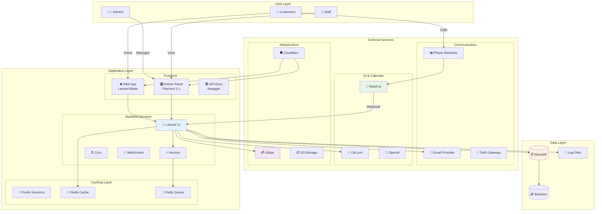
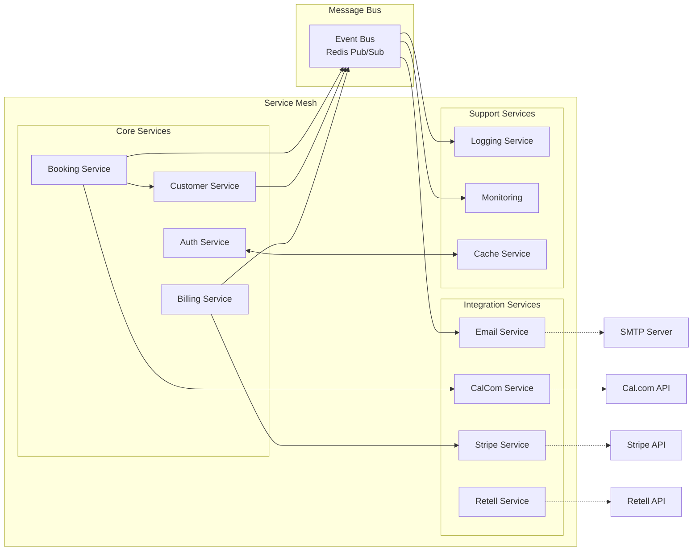
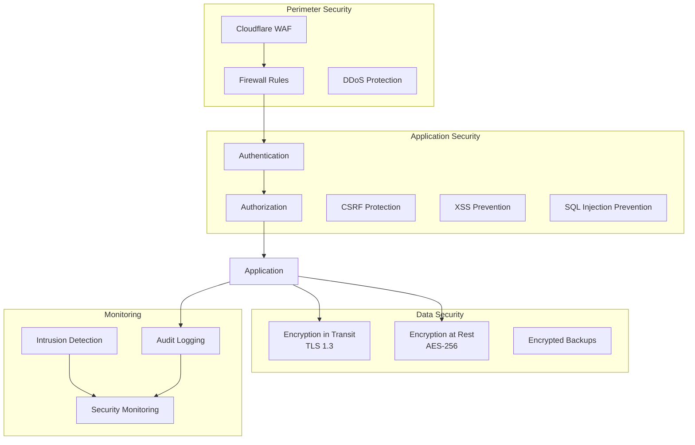
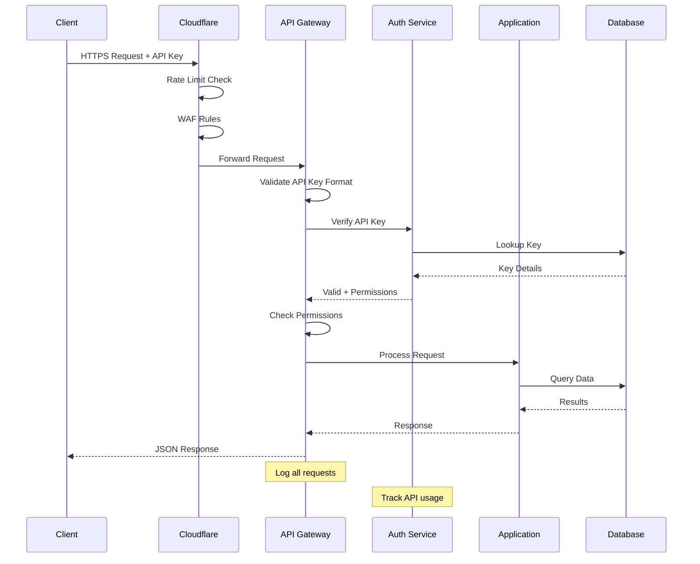
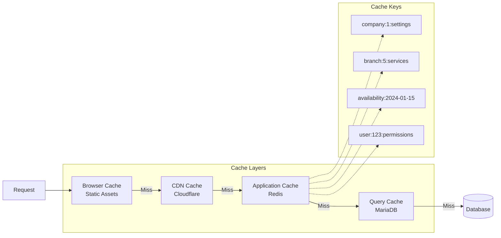
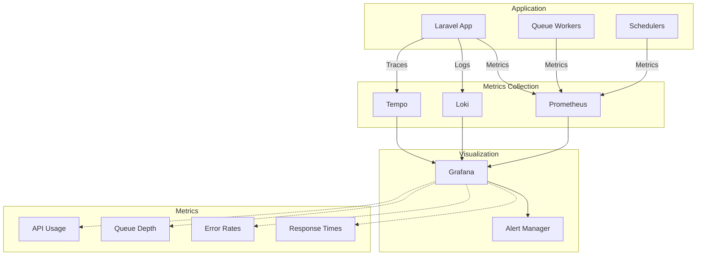

# 🏗️ System Architecture Diagrams

## High-Level Architecture

### Complete System Overview


### Microservices Communication Pattern


## Infrastructure Architecture

### Network Topology
```
┌─────────────────────────────────────────────────────────────────┐
│                           INTERNET                               │
│                                                                  │
│  Customers ──┐                                    ┌── Retell.ai │
│              │                                    │              │
│  Admins ─────┼─────────── HTTPS ─────────────────┼── Cal.com   │
│              │                                    │              │
│  Staff ──────┘                                    └── Stripe    │
└──────────────────────────────┬──────────────────────────────────┘
                               │
                    ┌──────────▼──────────┐
                    │    Cloudflare       │
                    │  - DDoS Protection  │
                    │  - SSL/TLS          │
                    │  - CDN              │
                    │  - Rate Limiting    │
                    └──────────┬──────────┘
                               │
                    ┌──────────▼──────────┐
                    │   Load Balancer     │
                    │  (High Availability) │
                    └────┬─────────┬──────┘
                         │         │
              ┌──────────▼───┐ ┌──▼──────────┐
              │  Web Server  │ │ Web Server  │
              │   (Nginx)    │ │  (Nginx)    │
              │   - Active   │ │ - Standby   │
              └──────┬───────┘ └─────────────┘
                     │
        ┌────────────┼────────────┬──────────────┐
        │            │            │              │
┌───────▼──────┐ ┌──▼───────┐ ┌──▼──────┐ ┌────▼─────┐
│   PHP-FPM    │ │ Laravel  │ │ Horizon │ │  Redis   │
│ Worker Pool  │ │   App    │ │ Queue   │ │ Cluster  │
│              │ │          │ │ Worker  │ │          │
└──────────────┘ └────┬─────┘ └─────────┘ └──────────┘
                      │
              ┌───────▼────────┐
              │    MariaDB     │
              │ Primary/Replica │
              │    Cluster     │
              └────────────────┘
```

### Container Architecture (Docker)
```mermaid
graph TD
    subgraph "Docker Host"
        subgraph "Application Containers"
            NGINX[nginx:alpine<br/>Port 80/443]
            PHP[php:8.3-fpm<br/>Laravel App]
            HORIZON[php:8.3-cli<br/>Queue Worker]
            CRON[php:8.3-cli<br/>Scheduler]
        end
        
        subgraph "Service Containers"
            REDIS[redis:7-alpine<br/>Port 6379]
            MARIADB[mariadb:11<br/>Port 3306]
            MAILHOG[mailhog<br/>Port 1025/8025]
        end
        
        subgraph "Volumes"
            APP_VOL[/var/www/html]
            DB_VOL[/var/lib/mysql]
            REDIS_VOL[/data]
        end
        
        subgraph "Networks"
            FRONTEND[frontend]
            BACKEND[backend]
        end
    end
    
    NGINX -->|frontend| PHP
    PHP -->|backend| REDIS
    PHP -->|backend| MARIADB
    HORIZON -->|backend| REDIS
    CRON -->|backend| PHP
    
    PHP -.-> APP_VOL
    MARIADB -.-> DB_VOL
    REDIS -.-> REDIS_VOL
```

## Security Architecture

### Security Layers


### API Security Flow


## Scalability Architecture

### Horizontal Scaling Strategy
```
Current State (Single Server)          Target State (Multi-Server)
─────────────────────────────          ───────────────────────────

┌─────────────────┐                    ┌─────────────────────────┐
│  Single Server  │                    │    Load Balancer        │
│                 │                    └───────┬─────────────────┘
│  - Nginx        │                            │
│  - PHP-FPM      │         ┌──────────────────┼──────────────────┐
│  - Laravel      │         │                  │                  │
│  - Redis        │    ┌────▼────┐        ┌────▼────┐       ┌────▼────┐
│  - MariaDB      │    │ App #1  │        │ App #2  │       │ App #3  │
│                 │    │ PHP-FPM │        │ PHP-FPM │       │ PHP-FPM │
└─────────────────┘    └────┬────┘        └────┬────┘       └────┬────┘
                            │                  │                  │
                            └──────────┬───────┴──────────────────┘
                                       │
                            ┌──────────▼──────────┐
                            │   Shared Services  │
                            │  - Redis Cluster   │
                            │  - MariaDB Cluster │
                            │  - S3 Storage      │
                            └────────────────────┘
```

### Caching Strategy


## Deployment Architecture

### Blue-Green Deployment
```
┌─────────────────────────────────────────────────────────┐
│                    Load Balancer                         │
│                  (Routing Control)                       │
└────────────────────┬─────────────┬──────────────────────┘
                     │             │
         100% ───────┘             └─────── 0%
                     │             │
           ┌─────────▼─────────┐   │   ┌─────────────────┐
           │   BLUE (Active)   │   │   │  GREEN (New)    │
           │   Environment     │   │   │  Environment    │
           │                   │   │   │                 │
           │  - Version 1.5    │   │   │  - Version 1.6  │
           │  - Serving Users  │   │   │  - Testing      │
           │  - Stable         │   │   │  - Validation   │
           └───────────────────┘   │   └─────────────────┘
                                   │
                        Switch when ready
                                   │
         0% ───────┐               ▼             100%
                   │               │               │
           ┌───────▼───────────┐   │   ┌─────────▼───────┐
           │   BLUE (Old)      │   │   │  GREEN (Active) │
           │   Environment     │   │   │  Environment    │
           │                   │   │   │                 │
           │  - Version 1.5    │   │   │  - Version 1.6  │
           │  - Standby        │   │   │  - Serving Users│
           │  - Rollback Ready │   │   │  - Monitoring   │
           └───────────────────┘   │   └─────────────────┘
```

## Monitoring Architecture

### Observability Stack


---

> 📝 **Note**: These diagrams represent the current and planned architecture of AskProAI. Update as the system evolves.