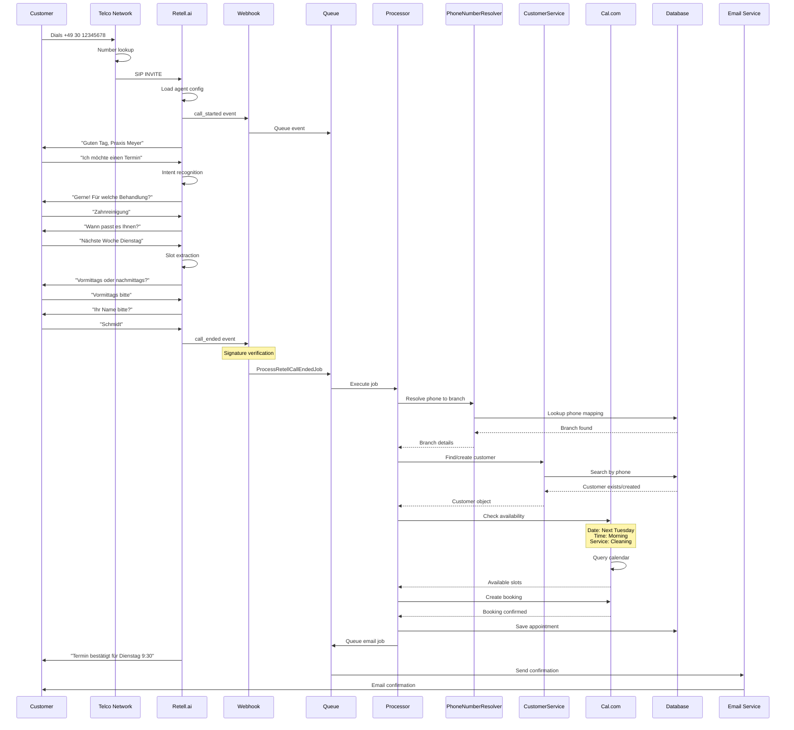
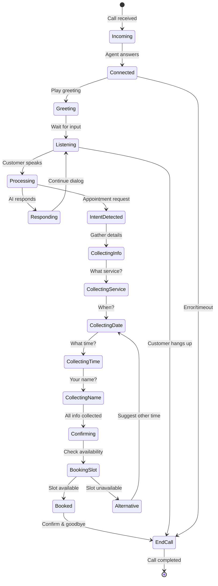
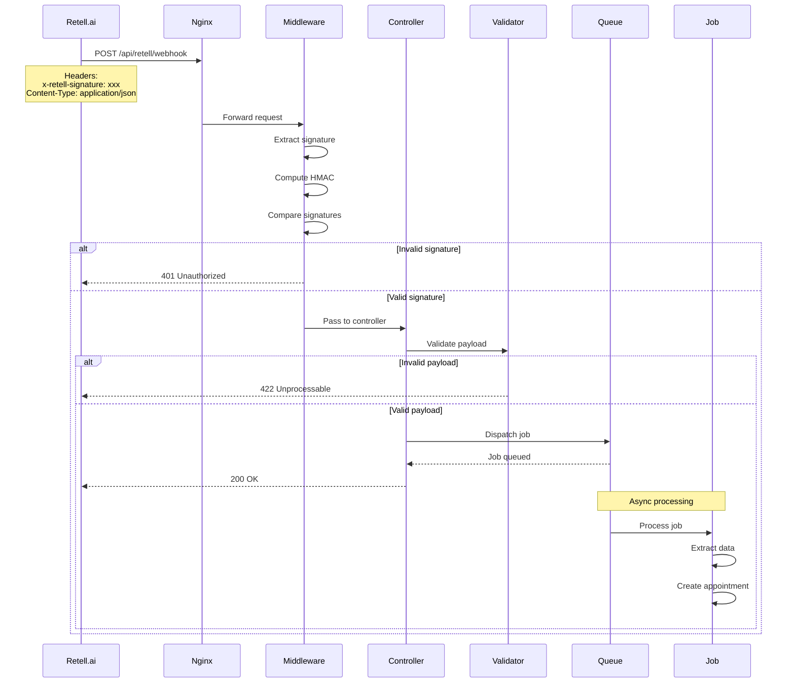
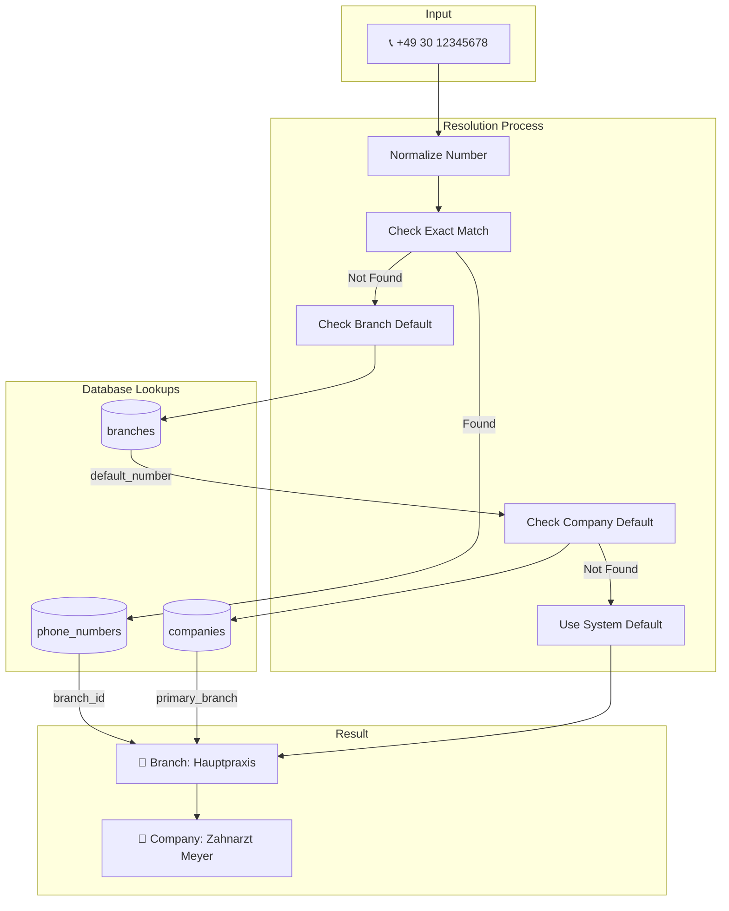
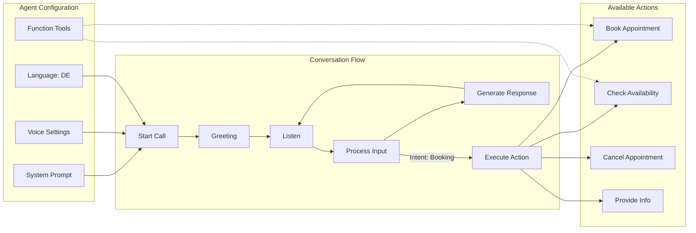
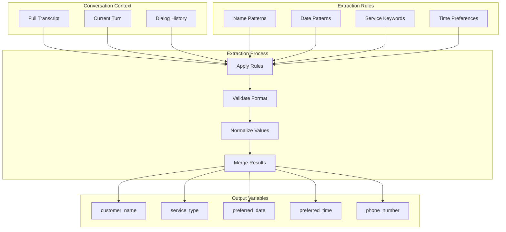
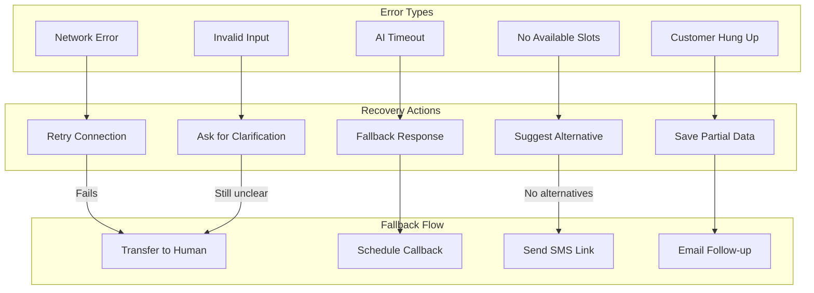
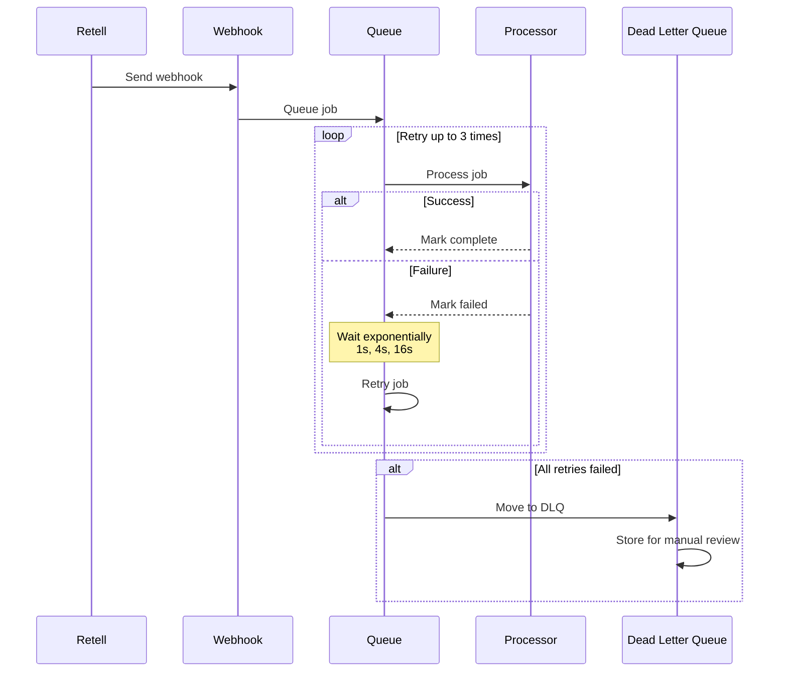

# 📞 Detailed Call Flow Diagrams

## Complete Phone-to-Appointment Journey

### End-to-End Call Flow


### Call State Machine


## Data Extraction & Processing

### NLP Processing Pipeline
```mermaid
graph TD
    subgraph "Raw Input"
        AUDIO[🎤 Audio Stream]
        TRANS[📝 Transcript]
    end
    
    subgraph "Retell.ai Processing"
        STT[Speech to Text]
        NLP[NLP Engine]
        INTENT[Intent Classification]
        ENTITY[Entity Extraction]
    end
    
    subgraph "Extracted Entities"
        NAME[👤 Name: Schmidt]
        SERVICE[🦷 Service: Zahnreinigung]
        DATE[📅 Date: Next Tuesday]
        TIME[⏰ Time: Morning]
        PHONE[📞 Phone: +49301234567]
    end
    
    subgraph "Structured Output"
        JSON[{<br/>"name": "Schmidt",<br/>"service": "cleaning",<br/>"date": "2024-01-23",<br/>"time": "morning",<br/>"phone": "+49301234567"<br/>}]
    end
    
    AUDIO --> STT
    STT --> TRANS
    TRANS --> NLP
    NLP --> INTENT
    NLP --> ENTITY
    
    ENTITY --> NAME
    ENTITY --> SERVICE
    ENTITY --> DATE
    ENTITY --> TIME
    ENTITY --> PHONE
    
    NAME --> JSON
    SERVICE --> JSON
    DATE --> JSON
    TIME --> JSON
    PHONE --> JSON
```

### Webhook Processing Detail


## Phone Number Resolution

### Branch Mapping Logic


### Multi-Tenant Call Routing
```
┌────────────────────────────────────────────────────────┐
│                   Incoming Calls                        │
└─────────┬──────────────┬──────────────┬────────────────┘
          │              │              │
    +49301234567   +49302345678   +49303456789
          │              │              │
┌─────────▼──────────────▼──────────────▼────────────────┐
│              Phone Number Resolution                    │
│                                                         │
│  1. Normalize number format                            │
│  2. Query phone_numbers table                          │
│  3. Get branch_id and company_id                      │
└─────────┬──────────────┬──────────────┬────────────────┘
          │              │              │
     Company A      Company B      Company C
     Branch 1       Branch 1       Branch 2
          │              │              │
┌─────────▼──────────────▼──────────────▼────────────────┐
│              Tenant Isolation                          │
│                                                         │
│  - Scope all queries by company_id                     │
│  - Separate data storage                               │
│  - Individual settings & preferences                   │
└─────────────────────────────────────────────────────────┘
```

## AI Agent Configuration

### Retell Agent Flow


### Dynamic Variable Extraction


## Error Handling & Recovery

### Call Error States


### Webhook Retry Logic


## Performance Optimization

### Call Processing Timeline
```mermaid
gantt
    title Call Processing Performance (Target Times)
    dateFormat X
    axisFormat %Lms
    
    section Network
    Call routing     :done, routing, 0, 100
    SIP setup       :done, sip, 100, 200
    
    section AI Processing
    Agent load      :done, agent, 200, 50
    Greeting        :active, greet, 250, 300
    Conversation    :crit, conv, 550, 60000
    
    section Backend
    Webhook receive :done, webhook, 60550, 50
    Queue dispatch  :done, queue, 60600, 20
    Phone resolve   :active, phone, 60620, 30
    Customer lookup :active, customer, 60650, 50
    Calendar check  :active, calendar, 60700, 800
    Create booking  :active, booking, 61500, 200
    Send email      :done, email, 61700, 100
    
    section Targets
    Total target    :milestone, 0, 0
```

### Optimization Points
```
┌─────────────────────────────────────────────────────────────┐
│                    Optimization Checklist                    │
├─────────────────────────────────────────────────────────────┤
│                                                             │
│ □ Phone Resolution Cache                                    │
│   - Cache phone→branch mapping (5 min TTL)                 │
│   - Reduces DB queries by 80%                              │
│                                                             │
│ □ Customer Lookup Index                                    │
│   - Index on (company_id, phone)                          │
│   - Query time: 200ms → 5ms                               │
│                                                             │
│ □ Calendar Prefetch                                        │
│   - Prefetch common slots during call                      │
│   - Parallel processing saves 500ms                        │
│                                                             │
│ □ Webhook Async Processing                                  │
│   - Return 200 immediately                                 │
│   - Process in background queue                            │
│                                                             │
│ □ Connection Pooling                                        │
│   - Reuse Cal.com connections                             │
│   - Saves 100ms per request                               │
│                                                             │
└─────────────────────────────────────────────────────────────┘
```

---

> 📝 **Note**: Times and metrics shown are targets. Actual performance may vary based on load and infrastructure.