# 💳 Payment Processing Flow Diagrams

## Stripe Integration Overview

### Complete Payment Flow
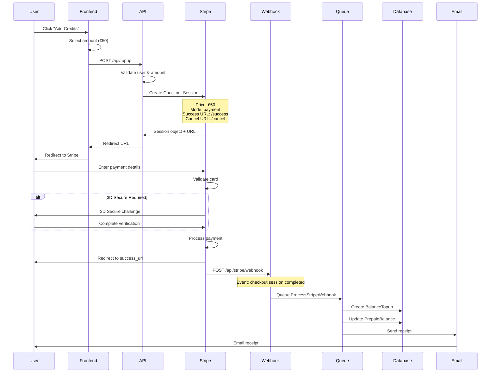

### Payment State Machine
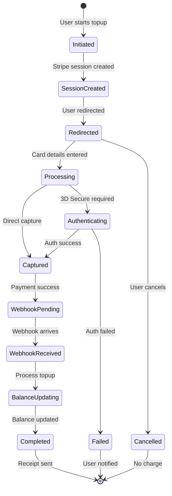

## Prepaid Balance System

### Balance Management Flow
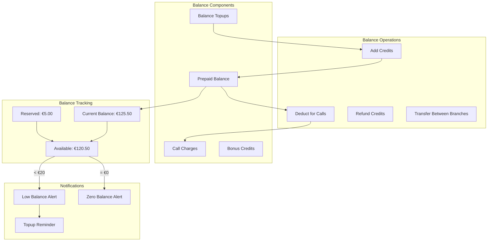

### Auto Top-up Flow
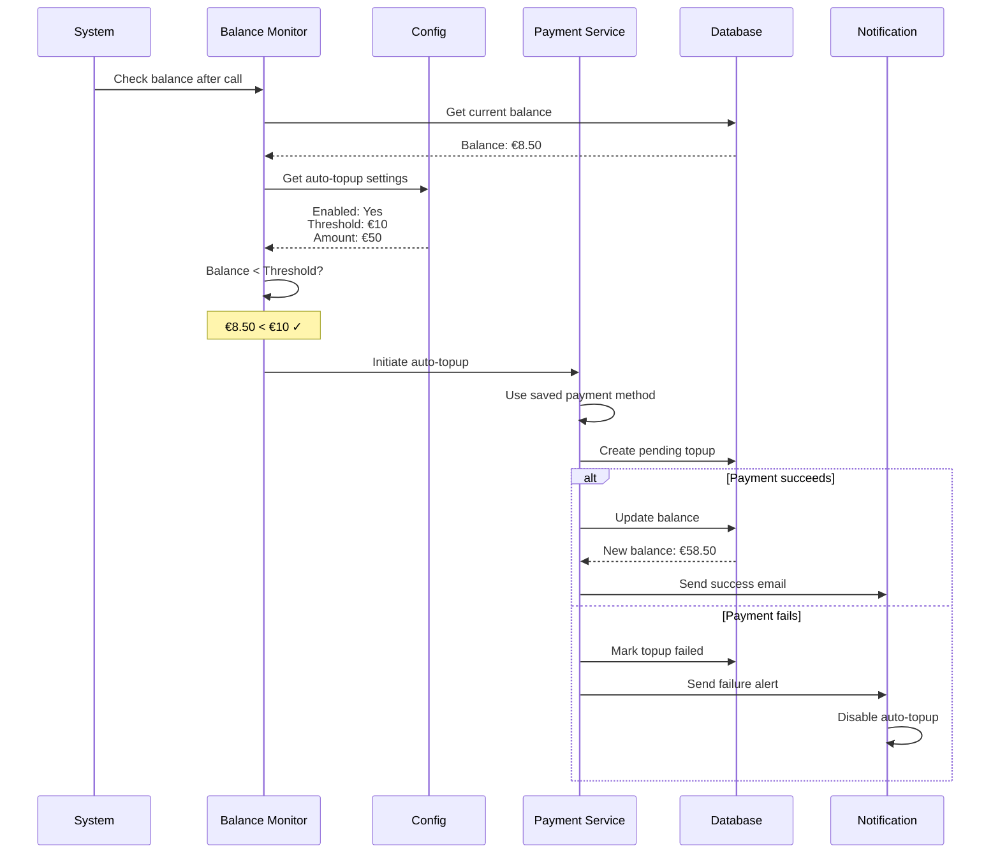

## Billing Calculations

### Call Cost Calculation
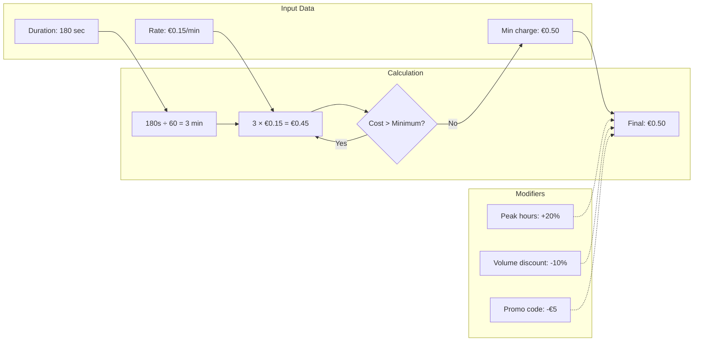

### Billing Rules Engine
```
┌─────────────────────────────────────────────────────────────┐
│                    Billing Rules Engine                      │
├─────────────────────────────────────────────────────────────┤
│                                                             │
│  Rule Priority Order:                                       │
│  1. Promotional Codes    (Highest)                         │
│  2. Contract Overrides                                     │
│  3. Volume Discounts                                       │
│  4. Time-based Rates                                       │
│  5. Standard Rates       (Lowest)                          │
│                                                             │
│  ┌─────────────────────────────────────────────┐          │
│  │ Example Calculation:                         │          │
│  │                                              │          │
│  │ Base cost:           €0.45                  │          │
│  │ Peak hours (+20%):   €0.09                  │          │
│  │ Subtotal:            €0.54                  │          │
│  │ Volume disc (-10%):  -€0.05                 │          │
│  │ Promo code:          -€5.00                 │          │
│  │ ─────────────────────────────                │          │
│  │ Final charge:        €0.00 (min)            │          │
│  └─────────────────────────────────────────────┘          │
│                                                             │
└─────────────────────────────────────────────────────────────┘
```

## Webhook Security

### Stripe Webhook Verification
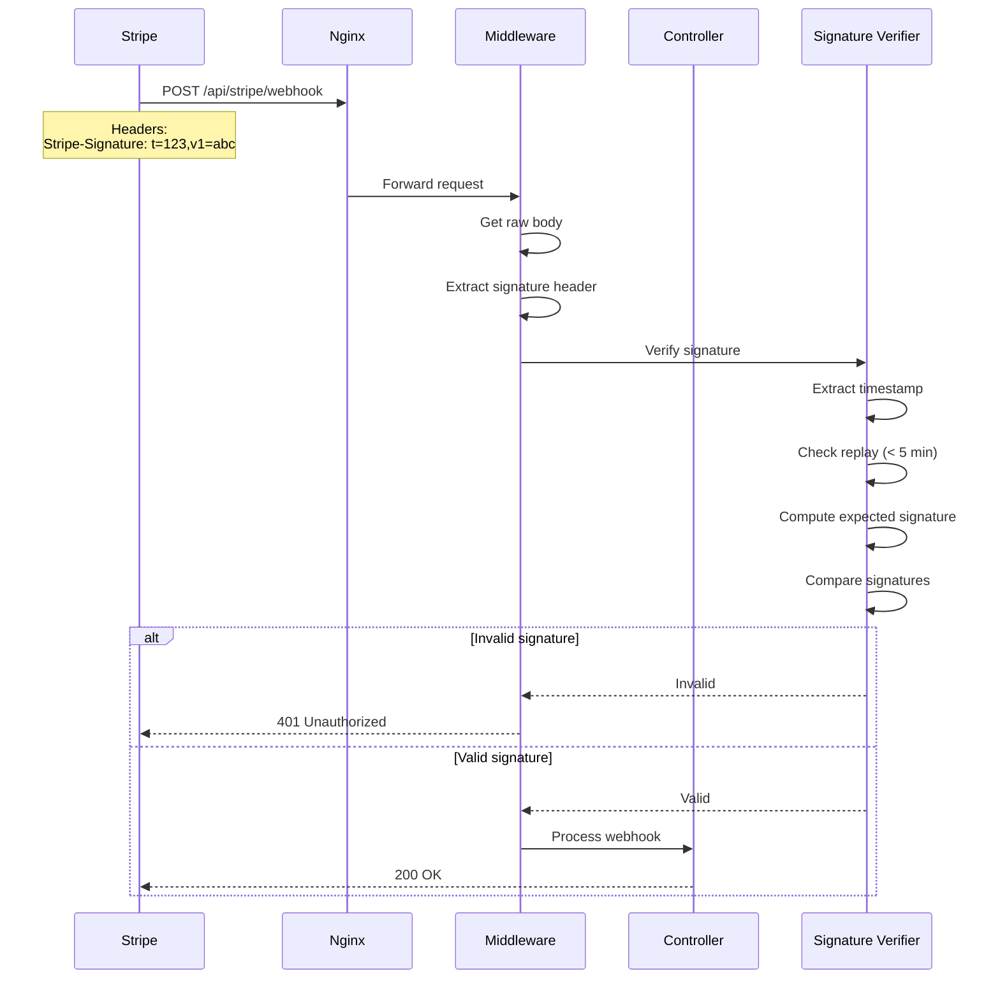

### Webhook Event Processing
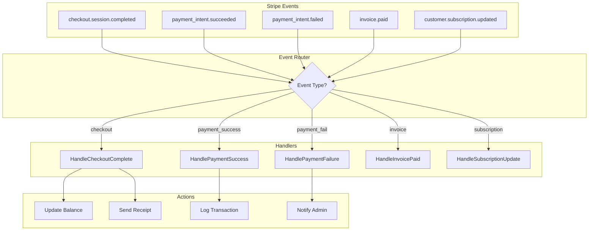

## Transaction Management

### Transaction Lifecycle
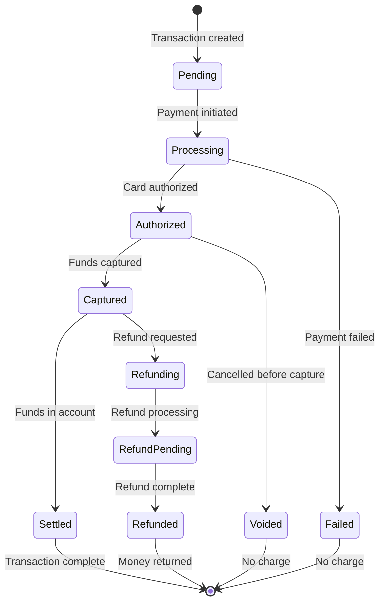

### Transaction Audit Trail
```
┌─────────────────────────────────────────────────────────────┐
│                  Transaction Audit Log                       │
├─────────────────────────────────────────────────────────────┤
│                                                             │
│ Transaction: TXN-2024-001234                                │
│ ─────────────────────────────                               │
│                                                             │
│ 2024-01-15 10:00:00 | CREATED      | Amount: €50.00       │
│ 2024-01-15 10:00:01 | STRIPE_SENT  | Session: cs_xxx      │
│ 2024-01-15 10:00:15 | USER_INPUT   | Card entered         │
│ 2024-01-15 10:00:30 | 3DS_REQUIRED | Bank verification    │
│ 2024-01-15 10:00:45 | 3DS_COMPLETE | Verification OK      │
│ 2024-01-15 10:00:46 | AUTHORIZED   | Payment authorized   │
│ 2024-01-15 10:00:47 | CAPTURED     | Funds captured       │
│ 2024-01-15 10:00:48 | WEBHOOK_RECV | Event: completed     │
│ 2024-01-15 10:00:49 | BALANCE_UPD  | +€50.00             │
│ 2024-01-15 10:00:50 | EMAIL_SENT   | Receipt sent         │
│ 2024-01-15 10:00:51 | COMPLETED    | Transaction done     │
│                                                             │
│ Related Records:                                            │
│ - Balance Topup: #5678                                      │
│ - Stripe Charge: ch_xxx                                    │
│ - Email Job: #9012                                          │
│                                                             │
└─────────────────────────────────────────────────────────────┘
```

## Invoice Generation

### Invoice Creation Flow
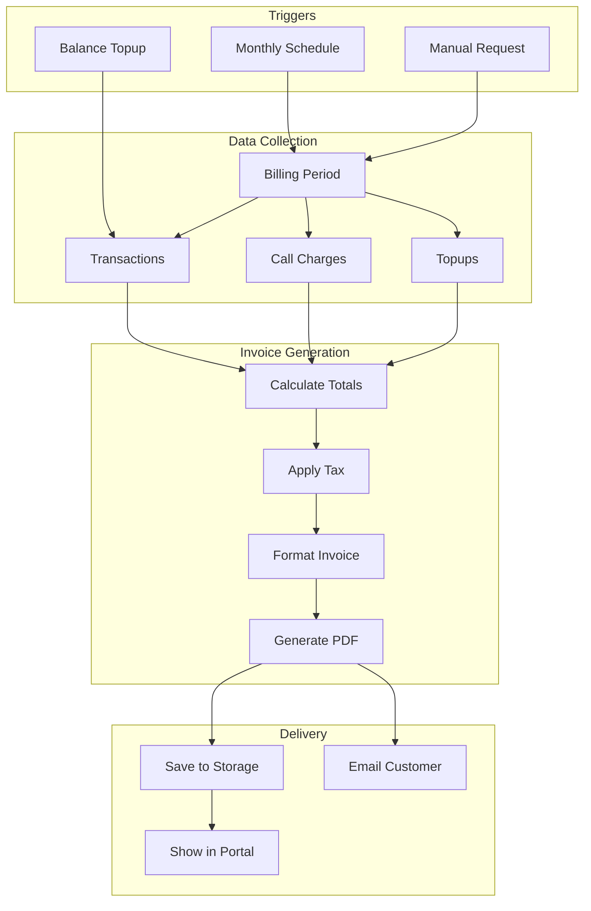

### Invoice Data Structure
```
┌─────────────────────────────────────────────────────────────┐
│                      INVOICE #2024-001234                    │
├─────────────────────────────────────────────────────────────┤
│                                                             │
│ From:                        To:                            │
│ AskProAI GmbH               Zahnarztpraxis Meyer           │
│ Beispielstr. 123            Kundenstr. 456                 │
│ 10115 Berlin                80331 München                   │
│                                                             │
│ Invoice Date: 2024-01-31                                    │
│ Period: January 2024                                        │
│ ─────────────────────────────────────────────────────────  │
│                                                             │
│ Line Items:                                                 │
│ ┌────────────────────────────┬──────┬────────┬─────────┐  │
│ │ Description                │ Qty  │ Rate   │ Amount  │  │
│ ├────────────────────────────┼──────┼────────┼─────────┤  │
│ │ Incoming Calls            │ 150  │ €0.15  │ €22.50  │  │
│ │ Peak Hour Surcharge       │  30  │ €0.03  │  €0.90  │  │
│ │ SMS Notifications         │  75  │ €0.08  │  €6.00  │  │
│ │ Balance Topup 2024-01-15  │   1  │ €50.00 │ €50.00  │  │
│ └────────────────────────────┴──────┴────────┴─────────┘  │
│                                                             │
│                              Subtotal:         €79.40      │
│                              VAT (19%):        €15.09      │
│                              ─────────────────────────      │
│                              Total:            €94.49      │
│                                                             │
│ Payment Method: Prepaid Balance                             │
│ Balance After: €155.51                                      │
│                                                             │
└─────────────────────────────────────────────────────────────┘
```

## Refund Processing

### Refund Flow
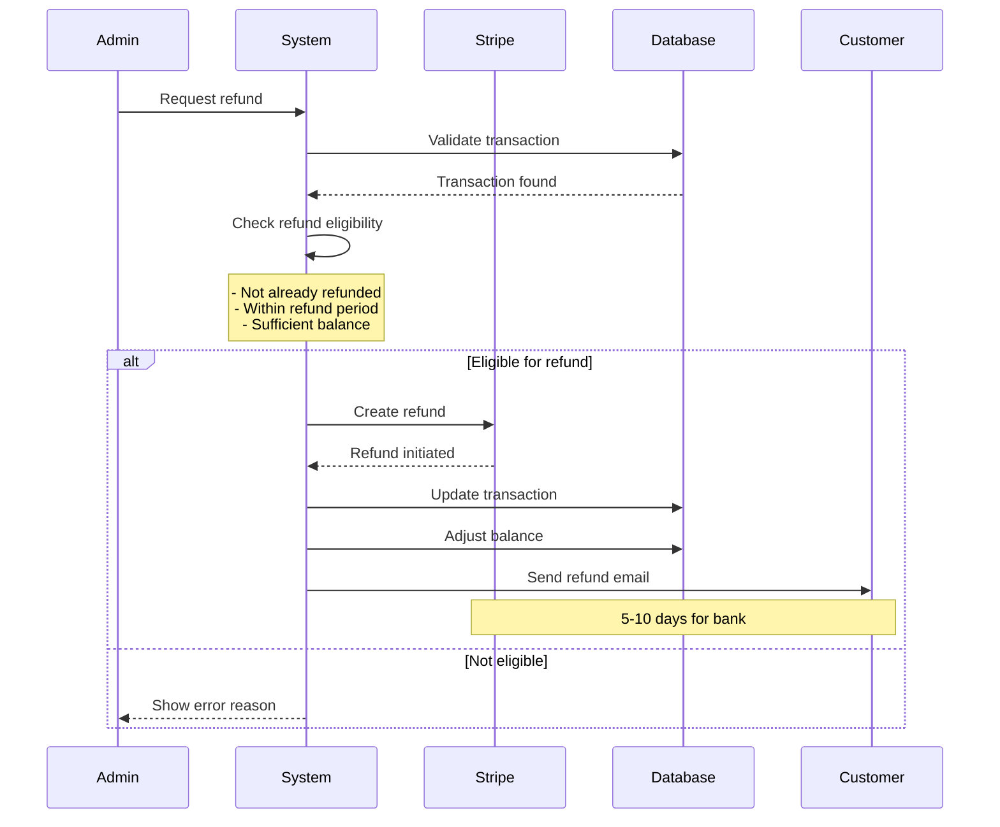

## Reporting & Analytics

### Financial Dashboard Data Flow
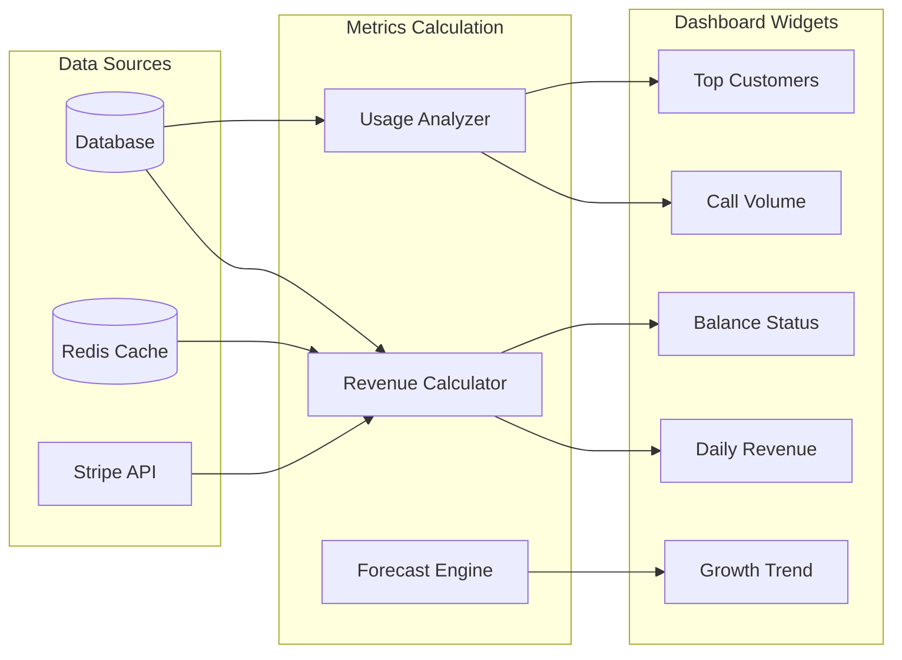

---

> 📝 **Note**: All monetary values shown are examples. Actual rates and fees are configured per company.