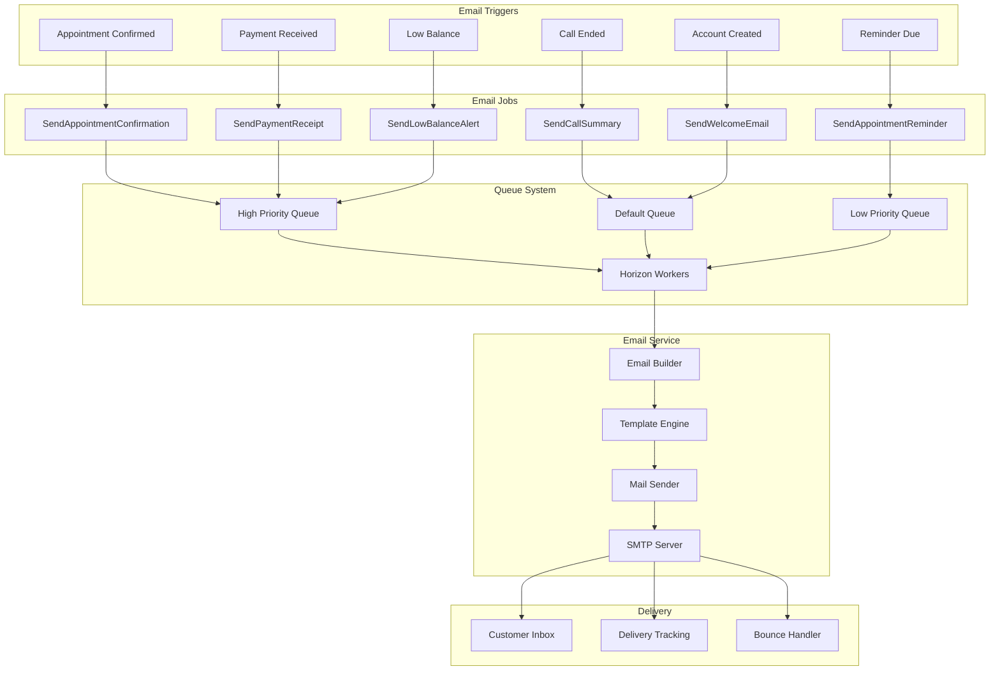
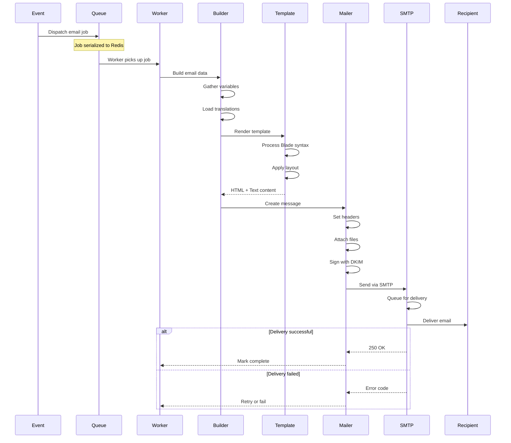
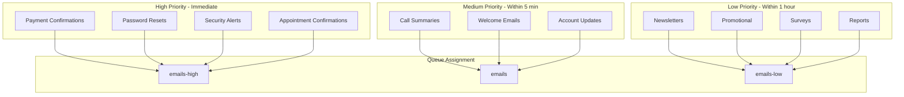
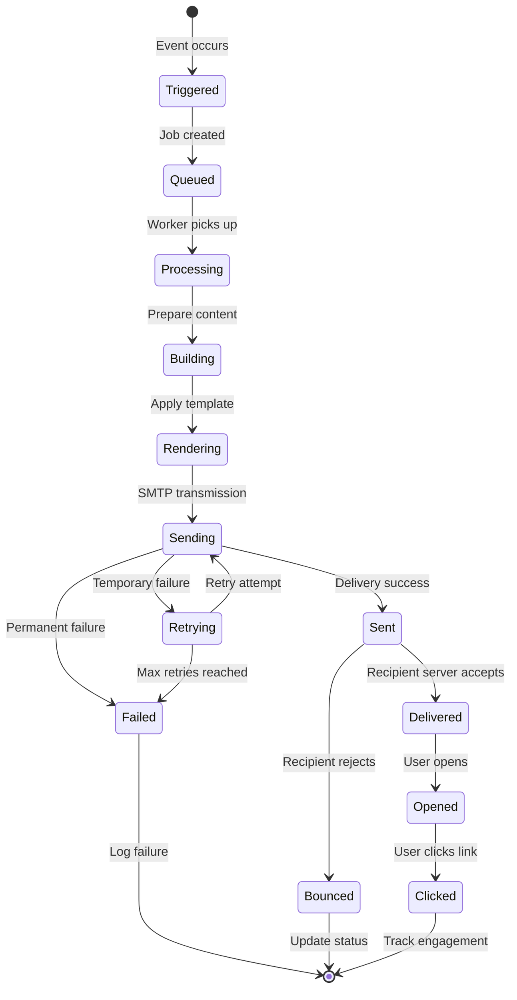
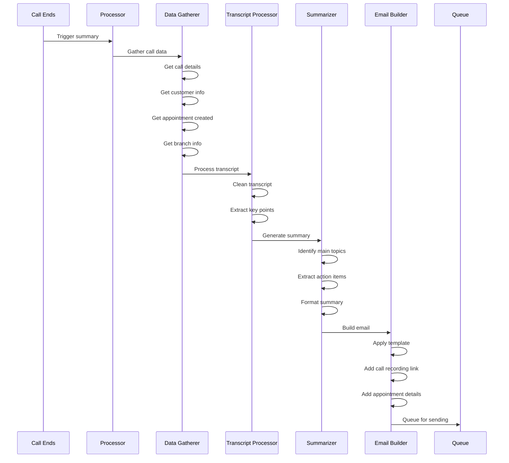
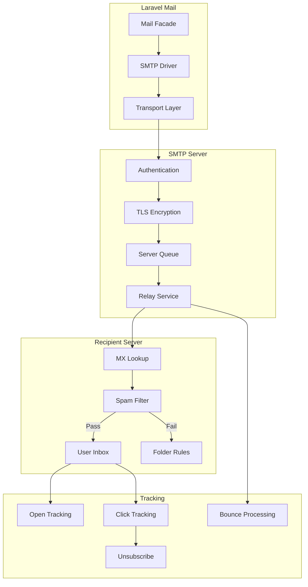
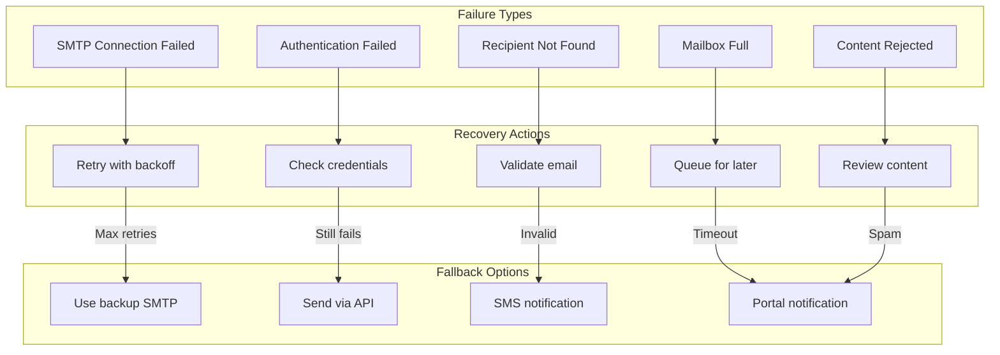
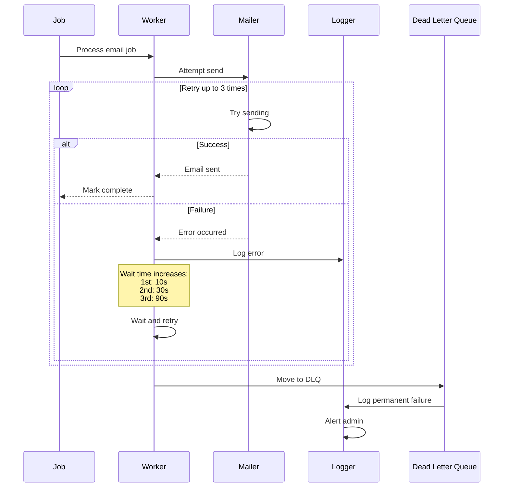
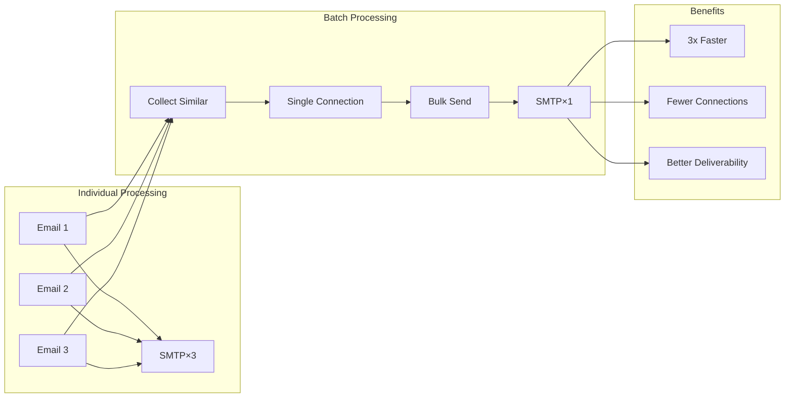
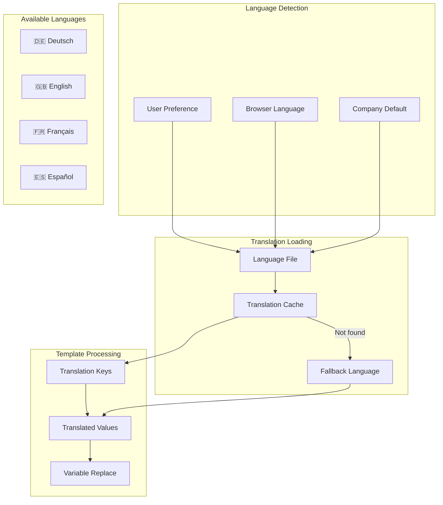

# 📧 Email System Flow Diagrams

## Email System Architecture

### Complete Email Pipeline


### Email Processing Sequence


## Email Templates

### Template Hierarchy
```
┌─────────────────────────────────────────────────────────────┐
│                    Master Layout                             │
│  ┌─────────────────────────────────────────────────────┐   │
│  │  Header                                              │   │
│  │  - Logo                                              │   │
│  │  - Company Name                                      │   │
│  └─────────────────────────────────────────────────────┘   │
│                                                             │
│  ┌─────────────────────────────────────────────────────┐   │
│  │  Content Block                                       │   │
│  │  @yield('content')                                   │   │
│  └─────────────────────────────────────────────────────┘   │
│                                                             │
│  ┌─────────────────────────────────────────────────────┐   │
│  │  Footer                                              │   │
│  │  - Contact Info                                      │   │
│  │  - Unsubscribe Link                                  │   │
│  │  - Legal Notice                                      │   │
│  └─────────────────────────────────────────────────────┘   │
└─────────────────────────────────────────────────────────────┘
                             │
        ┌────────────────────┼────────────────────┐
        │                    │                    │
┌───────▼──────┐    ┌────────▼──────┐    ┌───────▼──────┐
│ Appointment  │    │ Call Summary  │    │   Payment    │
│ Confirmation │    │    Email      │    │   Receipt    │
└──────────────┘    └───────────────┘    └──────────────┘
```

### Template Data Flow
```mermaid
graph LR
    subgraph "Data Sources"
        APP[Appointment Data]
        CUST[Customer Info]
        BRANCH[Branch Details]
        TRANS[Transaction Data]
    end
    
    subgraph "Data Processing"
        MERGE[Merge Variables]
        TRANS_KEY[Translate Keys]
        FORMAT[Format Values]
        ESCAPE[Escape HTML]
    end
    
    subgraph "Template Variables"
        V1[{{customer_name}}]
        V2[{{appointment_date}}]
        V3[{{branch_address}}]
        V4[{{amount}}]
    end
    
    subgraph "Output"
        HTML[HTML Email]
        TEXT[Text Email]
    end
    
    APP --> MERGE
    CUST --> MERGE
    BRANCH --> MERGE
    TRANS --> MERGE
    
    MERGE --> TRANS_KEY
    TRANS_KEY --> FORMAT
    FORMAT --> ESCAPE
    
    ESCAPE --> V1
    ESCAPE --> V2
    ESCAPE --> V3
    ESCAPE --> V4
    
    V1 --> HTML
    V2 --> HTML
    V3 --> HTML
    V4 --> HTML
    
    V1 --> TEXT
    V2 --> TEXT
```

## Email Types & Priorities

### Email Priority Matrix


### Email Lifecycle States


## Call Summary Email

### Call Summary Generation


### Call Summary Template Structure
```
┌─────────────────────────────────────────────────────────────┐
│                   Call Summary Email                         │
├─────────────────────────────────────────────────────────────┤
│                                                             │
│ Hello {{customer_name}},                                    │
│                                                             │
│ Thank you for calling {{company_name}} today.               │
│                                                             │
│ ┌─────────────────────────────────────────────────────┐    │
│ │ Call Details:                                       │    │
│ │ • Date: {{call_date}}                              │    │
│ │ • Duration: {{duration}} minutes                    │    │
│ │ • Agent: AI Assistant                              │    │
│ └─────────────────────────────────────────────────────┘    │
│                                                             │
│ ┌─────────────────────────────────────────────────────┐    │
│ │ Summary:                                            │    │
│ │ {{call_summary}}                                    │    │
│ └─────────────────────────────────────────────────────┘    │
│                                                             │
│ ┌─────────────────────────────────────────────────────┐    │
│ │ Appointment Confirmed:                              │    │
│ │ • Service: {{service_name}}                         │    │
│ │ • Date: {{appointment_date}}                        │    │
│ │ • Time: {{appointment_time}}                        │    │
│ │ • Location: {{branch_address}}                      │    │
│ └─────────────────────────────────────────────────────┘    │
│                                                             │
│ [View Full Transcript] [Add to Calendar]                    │
│                                                             │
└─────────────────────────────────────────────────────────────┘
```

## Email Delivery & Tracking

### SMTP Flow


### Delivery Status Tracking
```
┌─────────────────────────────────────────────────────────────┐
│                  Email Delivery Timeline                     │
├─────────────────────────────────────────────────────────────┤
│                                                             │
│ Email ID: MSG-2024-001234                                   │
│ To: customer@example.com                                    │
│ Subject: Appointment Confirmation                           │
│                                                             │
│ Timeline:                                                   │
│ ─────────                                                   │
│ 10:00:00 | TRIGGERED    | Appointment created              │
│ 10:00:01 | QUEUED       | Job ID: 5678                   │
│ 10:00:05 | PROCESSING   | Worker: horizon-1              │
│ 10:00:06 | RENDERED     | Template: appointment.blade    │
│ 10:00:07 | SENDING      | Via: smtp.udag.de             │
│ 10:00:08 | ACCEPTED     | Remote: 250 OK                │
│ 10:00:15 | DELIVERED    | To: recipient server          │
│ 10:05:32 | OPENED       | IP: 192.168.1.1              │
│ 10:05:45 | CLICKED      | Link: Add to calendar        │
│                                                             │
│ Status: ✅ Successfully delivered and engaged               │
│                                                             │
└─────────────────────────────────────────────────────────────┘
```

## Error Handling

### Email Failure Recovery


### Retry Strategy


## Email Optimization

### Performance Metrics
```
┌─────────────────────────────────────────────────────────────┐
│                  Email Performance Dashboard                 │
├─────────────────────────────────────────────────────────────┤
│                                                             │
│ Daily Statistics (2024-01-15):                             │
│ ──────────────────────────────                             │
│                                                             │
│ Total Sent:        1,234        █████████████ 100%        │
│ Delivered:         1,198        ████████████░  97%        │
│ Opened:              876        █████████░░░░  71%        │
│ Clicked:             234        ███░░░░░░░░░░  19%        │
│ Bounced:              36        █░░░░░░░░░░░░   3%        │
│                                                             │
│ Average Times:                                              │
│ • Queue → Send:     2.3s                                   │
│ • Send → Deliver:   4.7s                                   │
│ • Deliver → Open:   35m                                    │
│                                                             │
│ By Type:                                                    │
│ • Confirmations:    456  ████████                         │
│ • Summaries:        321  ██████                           │
│ • Reminders:        234  ████                             │
│ • Receipts:         223  ████                             │
│                                                             │
└─────────────────────────────────────────────────────────────┘
```

### Batch Processing


## Multi-Language Support

### Translation Flow


---

> 📝 **Note**: Email templates follow responsive design principles and are tested across major email clients.