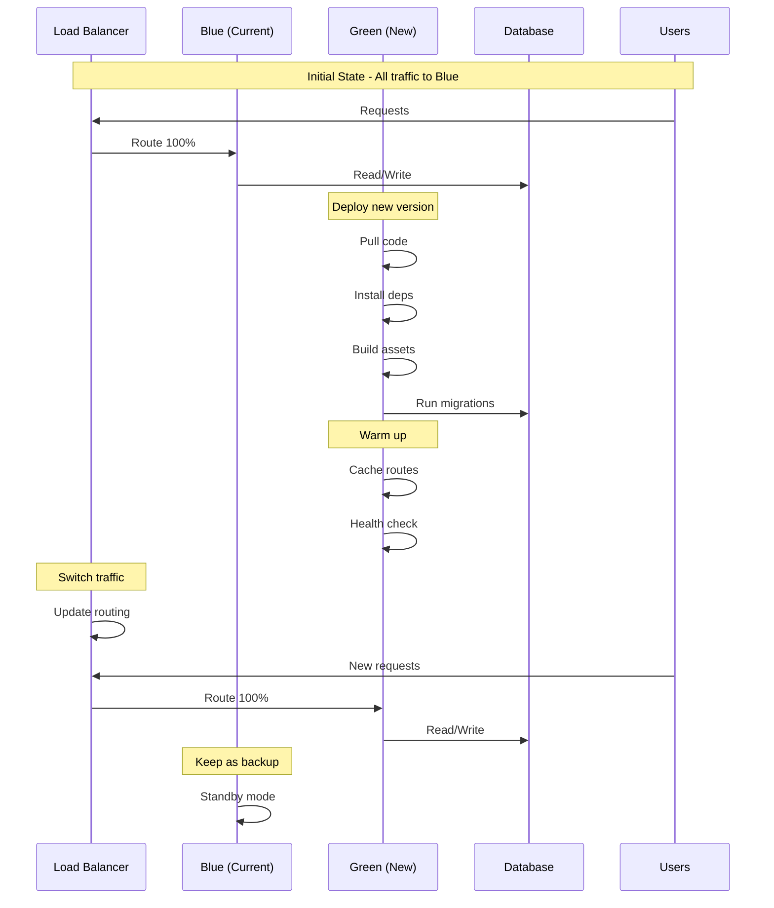
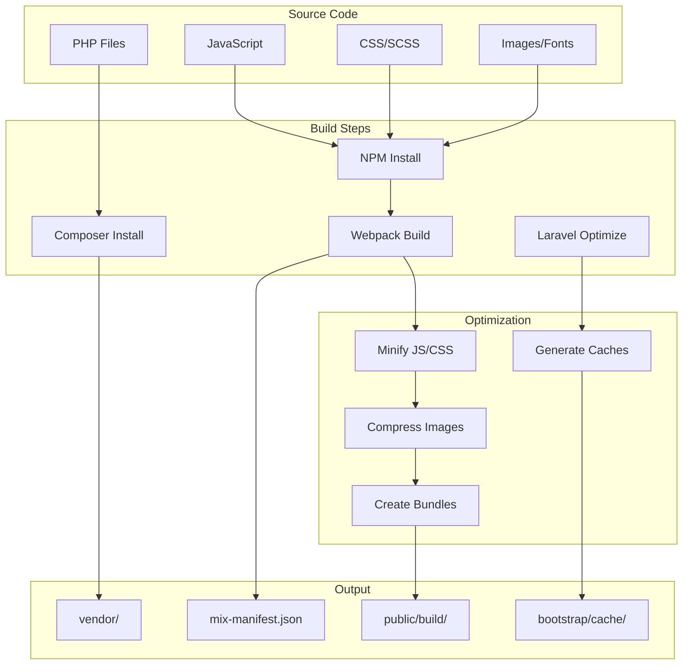
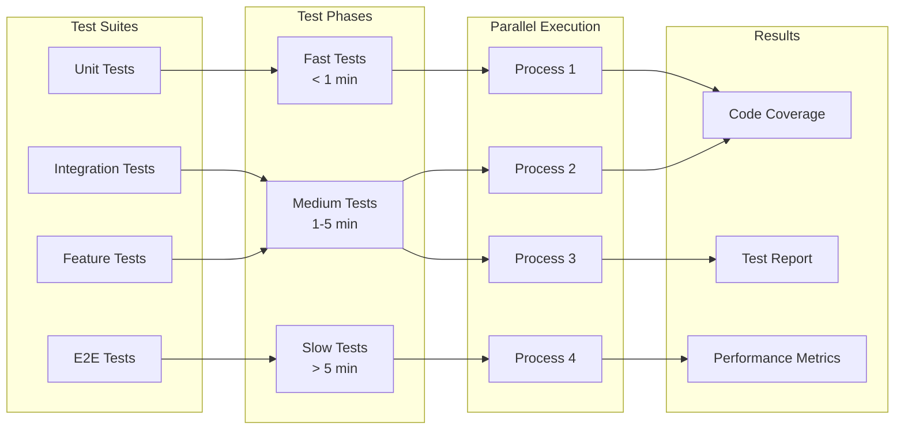
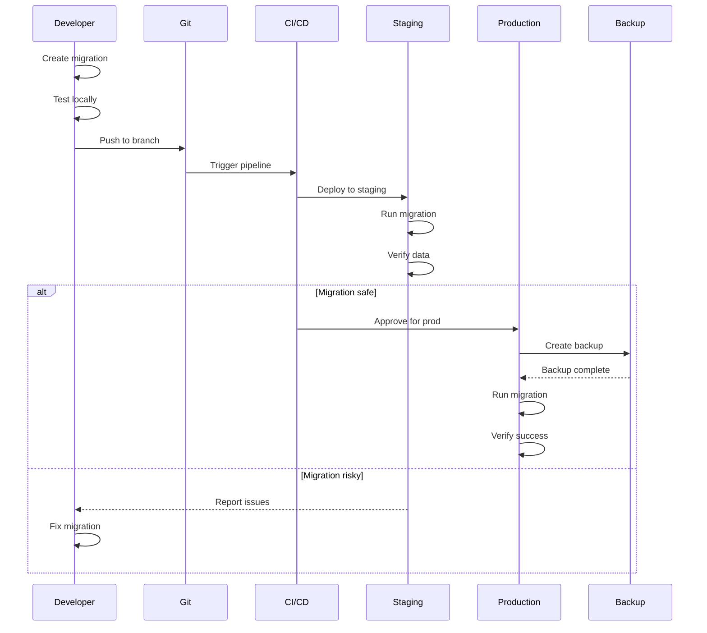
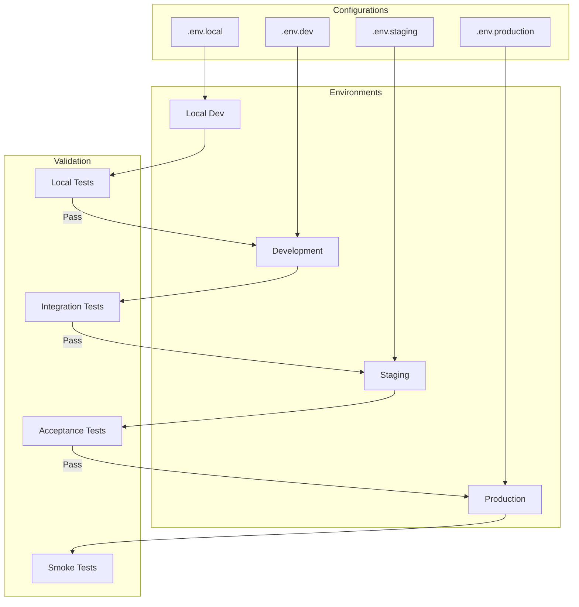
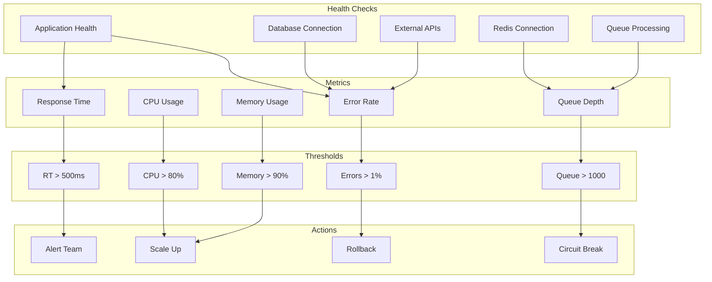
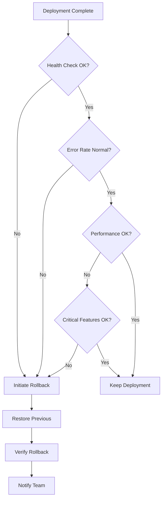
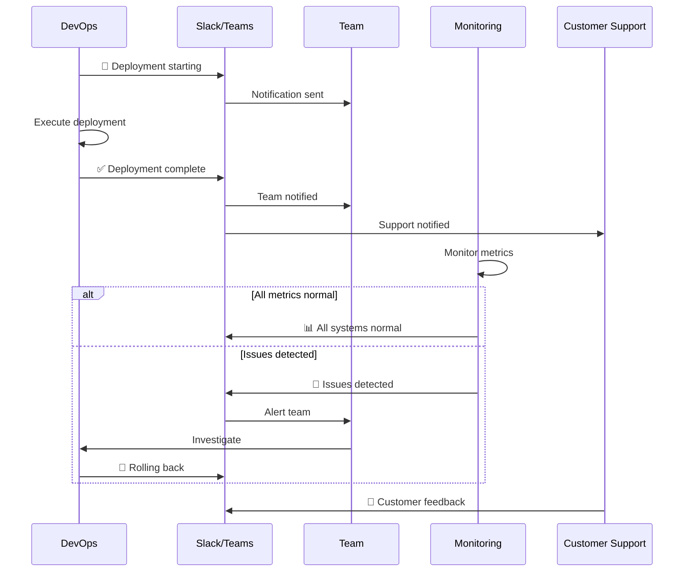

# 🚀 Deployment Pipeline Diagrams

## CI/CD Pipeline Overview

### Complete Deployment Flow

```mermaid
graph TD
    subgraph "Development"
        DEV[Developer]
        LOCAL[Local Testing]
        COMMIT[Git Commit]
    end
    
    subgraph "Version Control"
        GIT[GitHub/GitLab]
        PR[Pull Request]
        REVIEW[Code Review]
        MERGE[Merge to Main]
    end
    
    subgraph "CI Pipeline"
        TRIGGER[Pipeline Trigger]
        LINT[Code Linting]
        TEST[Unit Tests]
        BUILD[Build Assets]
        SECURITY[Security Scan]
        ARTIFACTS[Store Artifacts]
    end
    
    subgraph "Deployment Stages"
        STAGING[Staging Deploy]
        SMOKE[Smoke Tests]
        PROD[Production Deploy]
        VERIFY[Health Checks]
    end
    
    subgraph "Rollback"
        MONITOR[Monitoring]
        ALERT[Alert Triggered]
        ROLLBACK[Auto Rollback]
    end
    
    DEV --> LOCAL
    LOCAL --> COMMIT
    COMMIT --> GIT
    GIT --> PR
    PR --> REVIEW
    REVIEW --> MERGE
    
    MERGE --> TRIGGER
    TRIGGER --> LINT
    LINT --> TEST
    TEST --> BUILD
    BUILD --> SECURITY
    SECURITY --> ARTIFACTS
    
    ARTIFACTS --> STAGING
    STAGING --> SMOKE
    SMOKE --> PROD
    PROD --> VERIFY
    
    VERIFY --> MONITOR
    MONITOR -->|Issues| ALERT
    ALERT --> ROLLBACK
```


### GitHub Actions Workflow
```yaml
name: Deploy Pipeline
on:
  push:
    branches: [main]

jobs:
  test:
    runs-on: ubuntu-latest
    steps:
      - uses: actions/checkout@v3
      - name: Setup PHP
        uses: shivammathur/setup-php@v2
      - name: Install Dependencies
        run: composer install
      - name: Run Tests
        run: php artisan test
      
  build:
    needs: test
    runs-on: ubuntu-latest
    steps:
      - name: Build Assets
        run: npm run build
      - name: Upload Artifacts
        uses: actions/upload-artifact@v3
        
  deploy:
    needs: build
    runs-on: ubuntu-latest
    steps:
      - name: Deploy to Production
        run: ./deploy.sh
```

## Zero-Downtime Deployment

### Blue-Green Deployment Strategy


### Rolling Deployment Pattern
```
Step 1: Initial State (3 servers active)
┌─────────────────────────────────────────────┐
│              Load Balancer                   │
└────────┬──────────┬──────────┬──────────────┘
         │          │          │
    ┌────▼───┐ ┌───▼────┐ ┌───▼────┐
    │ Node 1 │ │ Node 2 │ │ Node 3 │
    │  v1.0  │ │  v1.0  │ │  v1.0  │
    │   🟢   │ │   🟢   │ │   🟢   │
    └────────┘ └────────┘ └────────┘

Step 2: Update Node 1
┌─────────────────────────────────────────────┐
│              Load Balancer                   │
└────────┬──────────┬──────────┬──────────────┘
         ❌          │          │
    ┌────────┐ ┌───▼────┐ ┌───▼────┐
    │ Node 1 │ │ Node 2 │ │ Node 3 │
    │  v1.1  │ │  v1.0  │ │  v1.0  │
    │   🔄   │ │   🟢   │ │   🟢   │
    └────────┘ └────────┘ └────────┘

Step 3: Node 1 Ready, Update Node 2
┌─────────────────────────────────────────────┐
│              Load Balancer                   │
└────────┬──────────┬──────────┬──────────────┘
         │          ❌          │
    ┌────▼───┐ ┌────────┐ ┌───▼────┐
    │ Node 1 │ │ Node 2 │ │ Node 3 │
    │  v1.1  │ │  v1.1  │ │  v1.0  │
    │   🟢   │ │   🔄   │ │   🟢   │
    └────────┘ └────────┘ └────────┘

Step 4: All Nodes Updated
┌─────────────────────────────────────────────┐
│              Load Balancer                   │
└────────┬──────────┬──────────┬──────────────┘
         │          │          │
    ┌────▼───┐ ┌───▼────┐ ┌───▼────┐
    │ Node 1 │ │ Node 2 │ │ Node 3 │
    │  v1.1  │ │  v1.1  │ │  v1.1  │
    │   🟢   │ │   🟢   │ │   🟢   │
    └────────┘ └────────┘ └────────┘
```

## Build & Test Pipeline

### Build Process Flow


### Test Execution Strategy


## Database Migration Strategy

### Safe Migration Flow


### Zero-Downtime Migration Pattern
```
Phase 1: Add new column (nullable)
┌─────────────────────────────────┐
│         Original Schema         │
│  ┌─────────────────────────┐   │
│  │ users                   │   │
│  ├─────────────────────────┤   │
│  │ id                      │   │
│  │ email                   │   │
│  │ name                    │   │
│  │ phone (new, nullable)   │   │
│  └─────────────────────────┘   │
└─────────────────────────────────┘
         ↓ Deploy Code ↓

Phase 2: Dual write (old + new)
┌─────────────────────────────────┐
│      Application Logic          │
│  ┌─────────────────────────┐   │
│  │ Create User:            │   │
│  │ - Write to name         │   │
│  │ - Write to phone        │   │
│  │                         │   │
│  │ Read User:              │   │
│  │ - Read from name        │   │
│  │ - Fallback to phone     │   │
│  └─────────────────────────┘   │
└─────────────────────────────────┘
         ↓ Backfill Data ↓

Phase 3: Switch to new column
┌─────────────────────────────────┐
│      Application Logic          │
│  ┌─────────────────────────┐   │
│  │ Create/Read User:       │   │
│  │ - Use phone only        │   │
│  │                         │   │
│  │ Migration complete      │   │
│  │ Drop old column later   │   │
│  └─────────────────────────┘   │
└─────────────────────────────────┘
```

## Environment Management

### Environment Promotion Flow


### Configuration Management
```
┌─────────────────────────────────────────────────────────────┐
│                 Environment Variables                        │
├─────────────────────────────────────────────────────────────┤
│                                                             │
│ Base (.env.example)          Environment Override          │
│ ───────────────────          ─────────────────────        │
│ APP_NAME=AskProAI           APP_ENV=production            │
│ APP_DEBUG=false             APP_DEBUG=false               │
│ APP_URL=                    APP_URL=https://api.askpro... │
│                                                             │
│ DB_CONNECTION=mysql         DB_HOST=prod-db.aws.com       │
│ DB_DATABASE=askproai        DB_PASSWORD=****************  │
│                                                             │
│ MAIL_MAILER=smtp           MAIL_HOST=ses-smtp.aws.com    │
│ MAIL_PORT=587              MAIL_USERNAME=AKIA**********  │
│                                                             │
│ CACHE_DRIVER=redis         REDIS_HOST=prod-redis.aws.com │
│ QUEUE_CONNECTION=redis     REDIS_CLUSTER=true            │
│                                                             │
│ Priority: Environment > .env > .env.example                │
└─────────────────────────────────────────────────────────────┘
```

## Monitoring & Rollback

### Deployment Health Monitoring


### Rollback Decision Tree


## Post-Deployment Tasks

### Post-Deployment Checklist
```
┌─────────────────────────────────────────────────────────────┐
│              Post-Deployment Verification                    │
├─────────────────────────────────────────────────────────────┤
│                                                             │
│ Immediate (0-5 minutes):                                   │
│ □ Health endpoint responding                                │
│ □ Database connections stable                               │
│ □ Queue workers processing                                  │
│ □ No 500 errors in logs                                   │
│ □ Response times < 500ms                                   │
│                                                             │
│ Short-term (5-30 minutes):                                 │
│ □ Error rate < 0.1%                                        │
│ □ All critical paths tested                                │
│ □ Memory usage stable                                      │
│ □ No spike in failed jobs                                  │
│ □ External API connections OK                              │
│                                                             │
│ Long-term (30+ minutes):                                   │
│ □ No memory leaks detected                                 │
│ □ Database query performance normal                        │
│ □ Cache hit rates normal                                   │
│ □ Customer complaints = 0                                  │
│ □ Business metrics tracking                                │
│                                                             │
└─────────────────────────────────────────────────────────────┘
```

### Deployment Communication Flow


## Deployment Automation Scripts

### Deploy Script Structure
```bash
#!/bin/bash
# deploy.sh - Main deployment script

# Pre-deployment
backup_database()
create_deployment_tag()

# Deployment
pull_latest_code()
install_dependencies()
run_migrations()
build_assets()
clear_caches()

# Post-deployment
restart_services()
run_health_checks()
notify_team()

# Rollback if needed
rollback_on_failure()
```

---

> 📝 **Note**: Always test deployment procedures in staging environment before production deployment.