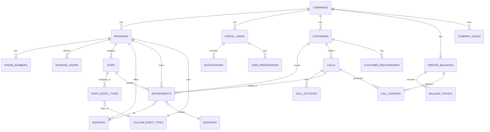

# 🗄️ Database Schema Diagrams

## Complete Database Overview

### Entity Relationship Diagram


## Core Tables Structure

### Companies (Multi-Tenant Root)
```sql
CREATE TABLE companies (
    id BIGINT PRIMARY KEY AUTO_INCREMENT,
    tenant_id VARCHAR(50) UNIQUE NOT NULL,
    name VARCHAR(255) NOT NULL,
    
    -- Contact Information
    email VARCHAR(255),
    phone VARCHAR(50),
    website VARCHAR(255),
    
    -- Address
    address TEXT,
    city VARCHAR(100),
    postal_code VARCHAR(20),
    country VARCHAR(2) DEFAULT 'DE',
    
    -- Integration Keys
    retell_api_key TEXT ENCRYPTED,
    retell_agent_id VARCHAR(255),
    calcom_api_key TEXT ENCRYPTED,
    calcom_team_id VARCHAR(255),
    stripe_customer_id VARCHAR(255),
    
    -- Settings
    settings JSON,
    timezone VARCHAR(50) DEFAULT 'Europe/Berlin',
    language VARCHAR(5) DEFAULT 'de',
    
    -- Status
    is_active BOOLEAN DEFAULT TRUE,
    trial_ends_at TIMESTAMP NULL,
    
    -- Timestamps
    created_at TIMESTAMP DEFAULT CURRENT_TIMESTAMP,
    updated_at TIMESTAMP DEFAULT CURRENT_TIMESTAMP ON UPDATE CURRENT_TIMESTAMP,
    
    -- Indexes
    INDEX idx_tenant_id (tenant_id),
    INDEX idx_active_companies (is_active, trial_ends_at)
);
```

### Branches (Physical Locations)
```sql
CREATE TABLE branches (
    id BIGINT PRIMARY KEY AUTO_INCREMENT,
    company_id BIGINT NOT NULL,
    
    -- Basic Information
    name VARCHAR(255) NOT NULL,
    slug VARCHAR(100),
    branch_code VARCHAR(50),
    
    -- Location
    address TEXT NOT NULL,
    city VARCHAR(100),
    postal_code VARCHAR(20),
    latitude DECIMAL(10, 8),
    longitude DECIMAL(11, 8),
    
    -- Contact
    phone VARCHAR(50),
    email VARCHAR(255),
    
    -- Calendar Integration
    calcom_event_type_id INT,
    calcom_location_id INT,
    
    -- Settings
    timezone VARCHAR(50),
    is_primary BOOLEAN DEFAULT FALSE,
    is_active BOOLEAN DEFAULT TRUE,
    
    -- Timestamps
    created_at TIMESTAMP DEFAULT CURRENT_TIMESTAMP,
    updated_at TIMESTAMP DEFAULT CURRENT_TIMESTAMP ON UPDATE CURRENT_TIMESTAMP,
    
    -- Foreign Keys
    FOREIGN KEY (company_id) REFERENCES companies(id) ON DELETE CASCADE,
    
    -- Indexes
    INDEX idx_company_branches (company_id, is_active),
    INDEX idx_branch_slug (company_id, slug),
    UNIQUE KEY unique_primary_branch (company_id, is_primary)
);
```

### Customers
```sql
CREATE TABLE customers (
    id BIGINT PRIMARY KEY AUTO_INCREMENT,
    company_id BIGINT NOT NULL,
    
    -- Personal Information
    first_name VARCHAR(100),
    last_name VARCHAR(100),
    full_name VARCHAR(255) GENERATED ALWAYS AS 
        (CONCAT(COALESCE(first_name, ''), ' ', COALESCE(last_name, ''))) STORED,
    
    -- Contact
    phone VARCHAR(50) NOT NULL,
    phone_normalized VARCHAR(50) GENERATED ALWAYS AS 
        (REGEXP_REPLACE(phone, '[^0-9+]', '')) STORED,
    email VARCHAR(255),
    
    -- Additional Info
    date_of_birth DATE,
    gender ENUM('male', 'female', 'other', 'not_specified'),
    preferred_language VARCHAR(5),
    
    -- Customer Journey
    acquisition_source VARCHAR(100),
    acquisition_date DATE,
    first_appointment_date DATE,
    last_appointment_date DATE,
    
    -- Statistics
    total_appointments INT DEFAULT 0,
    completed_appointments INT DEFAULT 0,
    cancelled_appointments INT DEFAULT 0,
    no_show_appointments INT DEFAULT 0,
    total_spent DECIMAL(10, 2) DEFAULT 0,
    
    -- Status
    is_active BOOLEAN DEFAULT TRUE,
    is_blocked BOOLEAN DEFAULT FALSE,
    blocked_reason TEXT,
    
    -- Timestamps
    created_at TIMESTAMP DEFAULT CURRENT_TIMESTAMP,
    updated_at TIMESTAMP DEFAULT CURRENT_TIMESTAMP ON UPDATE CURRENT_TIMESTAMP,
    
    -- Foreign Keys
    FOREIGN KEY (company_id) REFERENCES companies(id) ON DELETE CASCADE,
    
    -- Indexes
    INDEX idx_customer_phone (company_id, phone_normalized),
    INDEX idx_customer_email (company_id, email),
    INDEX idx_customer_name (company_id, full_name),
    UNIQUE KEY unique_customer_phone (company_id, phone_normalized)
);
```

### Appointments
```sql
CREATE TABLE appointments (
    id BIGINT PRIMARY KEY AUTO_INCREMENT,
    company_id BIGINT NOT NULL,
    branch_id BIGINT NOT NULL,
    customer_id BIGINT NOT NULL,
    staff_id BIGINT,
    service_id BIGINT,
    
    -- Appointment Details
    appointment_code VARCHAR(50) UNIQUE,
    title VARCHAR(255),
    description TEXT,
    
    -- Timing
    start_time DATETIME NOT NULL,
    end_time DATETIME NOT NULL,
    duration_minutes INT GENERATED ALWAYS AS 
        (TIMESTAMPDIFF(MINUTE, start_time, end_time)) STORED,
    buffer_before INT DEFAULT 0,
    buffer_after INT DEFAULT 0,
    
    -- Status
    status ENUM('scheduled', 'confirmed', 'completed', 'cancelled', 'no_show') 
        DEFAULT 'scheduled',
    confirmation_sent_at TIMESTAMP NULL,
    reminder_sent_at TIMESTAMP NULL,
    
    -- Source
    source ENUM('phone', 'web', 'admin', 'api', 'walk_in') DEFAULT 'phone',
    call_id BIGINT,
    
    -- Calendar Integration
    calcom_booking_id INT,
    calcom_event_id VARCHAR(255),
    google_event_id VARCHAR(255),
    
    -- Cancellation
    cancelled_at TIMESTAMP NULL,
    cancelled_by VARCHAR(100),
    cancellation_reason TEXT,
    
    -- Notes
    internal_notes TEXT,
    customer_notes TEXT,
    
    -- Timestamps
    created_at TIMESTAMP DEFAULT CURRENT_TIMESTAMP,
    updated_at TIMESTAMP DEFAULT CURRENT_TIMESTAMP ON UPDATE CURRENT_TIMESTAMP,
    
    -- Foreign Keys
    FOREIGN KEY (company_id) REFERENCES companies(id) ON DELETE CASCADE,
    FOREIGN KEY (branch_id) REFERENCES branches(id) ON DELETE CASCADE,
    FOREIGN KEY (customer_id) REFERENCES customers(id) ON DELETE CASCADE,
    FOREIGN KEY (staff_id) REFERENCES staff(id) ON DELETE SET NULL,
    FOREIGN KEY (service_id) REFERENCES services(id) ON DELETE SET NULL,
    FOREIGN KEY (call_id) REFERENCES calls(id) ON DELETE SET NULL,
    
    -- Indexes
    INDEX idx_appointment_time (company_id, branch_id, start_time),
    INDEX idx_appointment_status (company_id, status, start_time),
    INDEX idx_appointment_customer (customer_id, start_time),
    INDEX idx_appointment_staff (staff_id, start_time),
    INDEX idx_calcom_booking (calcom_booking_id)
);
```

### Calls (Phone Interactions)
```sql
CREATE TABLE calls (
    id BIGINT PRIMARY KEY AUTO_INCREMENT,
    company_id BIGINT NOT NULL,
    branch_id BIGINT,
    customer_id BIGINT,
    
    -- Call Identifiers
    call_id VARCHAR(100) UNIQUE NOT NULL,
    retell_call_id VARCHAR(100),
    twilio_call_sid VARCHAR(100),
    
    -- Call Details
    phone_number VARCHAR(50),
    phone_number_id BIGINT,
    direction ENUM('inbound', 'outbound') DEFAULT 'inbound',
    
    -- Timing
    started_at TIMESTAMP NOT NULL,
    ended_at TIMESTAMP,
    duration_seconds INT,
    
    -- Status
    status ENUM('in_progress', 'completed', 'failed', 'no_answer', 'busy') 
        DEFAULT 'in_progress',
    end_reason VARCHAR(100),
    
    -- Content
    transcript TEXT,
    summary TEXT,
    recording_url TEXT,
    
    -- AI Analysis
    intent VARCHAR(100),
    sentiment ENUM('positive', 'neutral', 'negative'),
    language_code VARCHAR(10) DEFAULT 'de',
    confidence_score DECIMAL(3, 2),
    
    -- Extracted Data
    dynamic_variables JSON,
    custom_data JSON,
    
    -- Results
    appointment_created BOOLEAN DEFAULT FALSE,
    appointment_id BIGINT,
    
    -- Timestamps
    created_at TIMESTAMP DEFAULT CURRENT_TIMESTAMP,
    updated_at TIMESTAMP DEFAULT CURRENT_TIMESTAMP ON UPDATE CURRENT_TIMESTAMP,
    
    -- Foreign Keys
    FOREIGN KEY (company_id) REFERENCES companies(id) ON DELETE CASCADE,
    FOREIGN KEY (branch_id) REFERENCES branches(id) ON DELETE SET NULL,
    FOREIGN KEY (customer_id) REFERENCES customers(id) ON DELETE SET NULL,
    FOREIGN KEY (appointment_id) REFERENCES appointments(id) ON DELETE SET NULL,
    
    -- Indexes
    INDEX idx_call_time (company_id, started_at),
    INDEX idx_call_phone (company_id, phone_number),
    INDEX idx_call_status (status, ended_at),
    INDEX idx_retell_call (retell_call_id)
);
```

## Financial Tables

### Prepaid Balances
```sql
CREATE TABLE prepaid_balances (
    id BIGINT PRIMARY KEY AUTO_INCREMENT,
    company_id BIGINT NOT NULL,
    
    -- Balance Information
    current_balance DECIMAL(10, 2) DEFAULT 0.00,
    reserved_balance DECIMAL(10, 2) DEFAULT 0.00,
    available_balance DECIMAL(10, 2) GENERATED ALWAYS AS 
        (current_balance - reserved_balance) STORED,
    
    -- Auto Top-up Settings
    auto_topup_enabled BOOLEAN DEFAULT FALSE,
    auto_topup_threshold DECIMAL(10, 2),
    auto_topup_amount DECIMAL(10, 2),
    stripe_payment_method_id VARCHAR(255),
    
    -- Spending Limits
    daily_spending_limit DECIMAL(10, 2),
    monthly_spending_limit DECIMAL(10, 2),
    
    -- Statistics
    total_topped_up DECIMAL(10, 2) DEFAULT 0.00,
    total_spent DECIMAL(10, 2) DEFAULT 0.00,
    last_topup_at TIMESTAMP NULL,
    last_charge_at TIMESTAMP NULL,
    
    -- Alerts
    low_balance_alert_threshold DECIMAL(10, 2) DEFAULT 10.00,
    low_balance_alert_sent_at TIMESTAMP NULL,
    zero_balance_reached_at TIMESTAMP NULL,
    
    -- Timestamps
    created_at TIMESTAMP DEFAULT CURRENT_TIMESTAMP,
    updated_at TIMESTAMP DEFAULT CURRENT_TIMESTAMP ON UPDATE CURRENT_TIMESTAMP,
    
    -- Foreign Keys
    FOREIGN KEY (company_id) REFERENCES companies(id) ON DELETE CASCADE,
    
    -- Indexes
    UNIQUE KEY unique_company_balance (company_id),
    INDEX idx_low_balance (available_balance, low_balance_alert_sent_at)
);
```

### Balance Topups
```sql
CREATE TABLE balance_topups (
    id BIGINT PRIMARY KEY AUTO_INCREMENT,
    company_id BIGINT NOT NULL,
    prepaid_balance_id BIGINT NOT NULL,
    
    -- Transaction Details
    transaction_id VARCHAR(100) UNIQUE,
    amount DECIMAL(10, 2) NOT NULL,
    currency VARCHAR(3) DEFAULT 'EUR',
    
    -- Payment Information
    payment_method ENUM('stripe', 'bank_transfer', 'admin_credit', 'promotional'),
    stripe_session_id VARCHAR(255),
    stripe_payment_intent_id VARCHAR(255),
    
    -- Status
    status ENUM('pending', 'processing', 'completed', 'failed', 'refunded') 
        DEFAULT 'pending',
    
    -- Invoice
    invoice_number VARCHAR(50),
    invoice_url TEXT,
    receipt_url TEXT,
    
    -- Metadata
    initiated_by VARCHAR(100),
    is_auto_topup BOOLEAN DEFAULT FALSE,
    notes TEXT,
    metadata JSON,
    
    -- Timestamps
    created_at TIMESTAMP DEFAULT CURRENT_TIMESTAMP,
    completed_at TIMESTAMP NULL,
    failed_at TIMESTAMP NULL,
    
    -- Foreign Keys
    FOREIGN KEY (company_id) REFERENCES companies(id) ON DELETE CASCADE,
    FOREIGN KEY (prepaid_balance_id) REFERENCES prepaid_balances(id),
    
    -- Indexes
    INDEX idx_topup_status (company_id, status, created_at),
    INDEX idx_stripe_session (stripe_session_id)
);
```

## Staff & Services

### Staff Members
```sql
CREATE TABLE staff (
    id BIGINT PRIMARY KEY AUTO_INCREMENT,
    company_id BIGINT NOT NULL,
    branch_id BIGINT,
    
    -- Personal Information
    first_name VARCHAR(100) NOT NULL,
    last_name VARCHAR(100) NOT NULL,
    display_name VARCHAR(255),
    employee_id VARCHAR(50),
    
    -- Contact
    email VARCHAR(255),
    phone VARCHAR(50),
    
    -- Professional
    title VARCHAR(100),
    specialties JSON,
    bio TEXT,
    
    -- Calendar Integration
    calcom_user_id INT,
    google_calendar_id VARCHAR(255),
    
    -- Availability
    is_available BOOLEAN DEFAULT TRUE,
    available_days JSON, -- ["monday", "tuesday", ...]
    
    -- Settings
    color_code VARCHAR(7), -- Hex color for UI
    notification_preferences JSON,
    
    -- Status
    is_active BOOLEAN DEFAULT TRUE,
    
    -- Timestamps
    hired_date DATE,
    terminated_date DATE,
    created_at TIMESTAMP DEFAULT CURRENT_TIMESTAMP,
    updated_at TIMESTAMP DEFAULT CURRENT_TIMESTAMP ON UPDATE CURRENT_TIMESTAMP,
    
    -- Foreign Keys
    FOREIGN KEY (company_id) REFERENCES companies(id) ON DELETE CASCADE,
    FOREIGN KEY (branch_id) REFERENCES branches(id) ON DELETE SET NULL,
    
    -- Indexes
    INDEX idx_staff_branch (branch_id, is_active),
    INDEX idx_staff_email (company_id, email),
    UNIQUE KEY unique_staff_email (company_id, email)
);
```

### Services
```sql
CREATE TABLE services (
    id BIGINT PRIMARY KEY AUTO_INCREMENT,
    company_id BIGINT NOT NULL,
    branch_id BIGINT,
    
    -- Service Information
    name VARCHAR(255) NOT NULL,
    slug VARCHAR(100),
    category VARCHAR(100),
    
    -- Details
    description TEXT,
    duration_minutes INT NOT NULL DEFAULT 30,
    buffer_time_minutes INT DEFAULT 0,
    
    -- Pricing
    price DECIMAL(10, 2),
    currency VARCHAR(3) DEFAULT 'EUR',
    tax_rate DECIMAL(5, 2) DEFAULT 19.00,
    
    -- Availability
    is_active BOOLEAN DEFAULT TRUE,
    available_online BOOLEAN DEFAULT TRUE,
    max_advance_days INT DEFAULT 90,
    min_advance_hours INT DEFAULT 24,
    
    -- Requirements
    requires_deposit BOOLEAN DEFAULT FALSE,
    deposit_amount DECIMAL(10, 2),
    
    -- Timestamps
    created_at TIMESTAMP DEFAULT CURRENT_TIMESTAMP,
    updated_at TIMESTAMP DEFAULT CURRENT_TIMESTAMP ON UPDATE CURRENT_TIMESTAMP,
    
    -- Foreign Keys
    FOREIGN KEY (company_id) REFERENCES companies(id) ON DELETE CASCADE,
    FOREIGN KEY (branch_id) REFERENCES branches(id) ON DELETE SET NULL,
    
    -- Indexes
    INDEX idx_service_category (company_id, category, is_active),
    INDEX idx_service_slug (company_id, slug)
);
```

## Audit & Analytics Tables

### Audit Logs
```sql
CREATE TABLE audit_logs (
    id BIGINT PRIMARY KEY AUTO_INCREMENT,
    company_id BIGINT,
    user_id BIGINT,
    
    -- Audit Information
    action VARCHAR(100) NOT NULL,
    model_type VARCHAR(100),
    model_id BIGINT,
    
    -- Changes
    old_values JSON,
    new_values JSON,
    
    -- Context
    ip_address VARCHAR(45),
    user_agent TEXT,
    request_id VARCHAR(100),
    
    -- Timestamp
    created_at TIMESTAMP DEFAULT CURRENT_TIMESTAMP,
    
    -- Indexes
    INDEX idx_audit_model (model_type, model_id, created_at),
    INDEX idx_audit_user (user_id, created_at),
    INDEX idx_audit_action (action, created_at)
);
```

### Call Activities (Analytics)
```sql
CREATE TABLE call_activities (
    id BIGINT PRIMARY KEY AUTO_INCREMENT,
    call_id BIGINT NOT NULL,
    company_id BIGINT NOT NULL,
    
    -- Activity Details
    activity_type VARCHAR(50) NOT NULL,
    activity_data JSON,
    timestamp TIMESTAMP NOT NULL,
    duration_seconds INT,
    
    -- Foreign Keys
    FOREIGN KEY (call_id) REFERENCES calls(id) ON DELETE CASCADE,
    FOREIGN KEY (company_id) REFERENCES companies(id) ON DELETE CASCADE,
    
    -- Indexes
    INDEX idx_activity_type (company_id, activity_type, timestamp)
);
```

## Database Optimization

### Critical Indexes
```sql
-- Performance-critical composite indexes
CREATE INDEX idx_appointment_search 
    ON appointments(company_id, branch_id, start_time, status);

CREATE INDEX idx_customer_search 
    ON customers(company_id, phone_normalized, email);

CREATE INDEX idx_call_analytics 
    ON calls(company_id, started_at, status, appointment_created);

-- Full-text search indexes
CREATE FULLTEXT INDEX ft_customer_name 
    ON customers(first_name, last_name);

CREATE FULLTEXT INDEX ft_call_transcript 
    ON calls(transcript);
```

### Database Views
```sql
-- Active appointments view
CREATE VIEW active_appointments AS
SELECT 
    a.*,
    c.full_name as customer_name,
    s.display_name as staff_name,
    srv.name as service_name,
    b.name as branch_name
FROM appointments a
    LEFT JOIN customers c ON a.customer_id = c.id
    LEFT JOIN staff s ON a.staff_id = s.id
    LEFT JOIN services srv ON a.service_id = srv.id
    LEFT JOIN branches b ON a.branch_id = b.id
WHERE a.status IN ('scheduled', 'confirmed')
    AND a.start_time >= NOW();

-- Company statistics view
CREATE VIEW company_statistics AS
SELECT 
    c.id as company_id,
    COUNT(DISTINCT cu.id) as total_customers,
    COUNT(DISTINCT a.id) as total_appointments,
    COUNT(DISTINCT ca.id) as total_calls,
    pb.current_balance as prepaid_balance
FROM companies c
    LEFT JOIN customers cu ON c.id = cu.company_id
    LEFT JOIN appointments a ON c.id = a.company_id
    LEFT JOIN calls ca ON c.id = ca.company_id
    LEFT JOIN prepaid_balances pb ON c.id = pb.company_id
GROUP BY c.id;
```

### Partitioning Strategy
```sql
-- Partition large tables by date
ALTER TABLE calls 
PARTITION BY RANGE (YEAR(started_at)) (
    PARTITION p2023 VALUES LESS THAN (2024),
    PARTITION p2024 VALUES LESS THAN (2025),
    PARTITION p2025 VALUES LESS THAN (2026),
    PARTITION pfuture VALUES LESS THAN MAXVALUE
);

ALTER TABLE appointments
PARTITION BY RANGE (YEAR(start_time)) (
    PARTITION p2023 VALUES LESS THAN (2024),
    PARTITION p2024 VALUES LESS THAN (2025),
    PARTITION p2025 VALUES LESS THAN (2026),
    PARTITION pfuture VALUES LESS THAN MAXVALUE
);
```

---

> 📝 **Note**: Schema includes generated columns, proper indexes, and foreign key constraints for data integrity and performance.