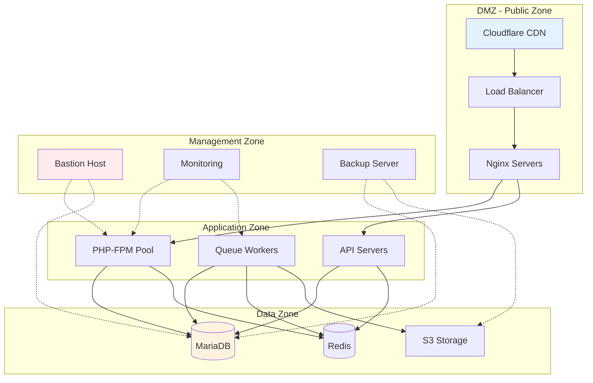
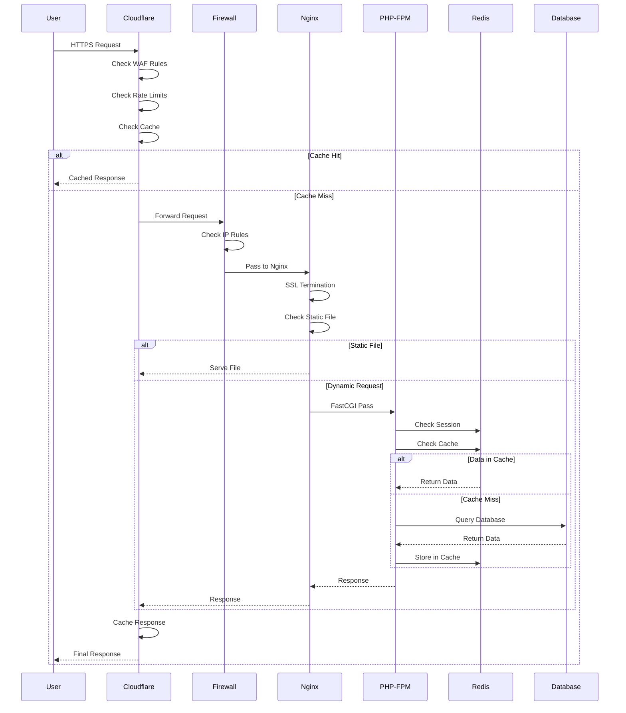
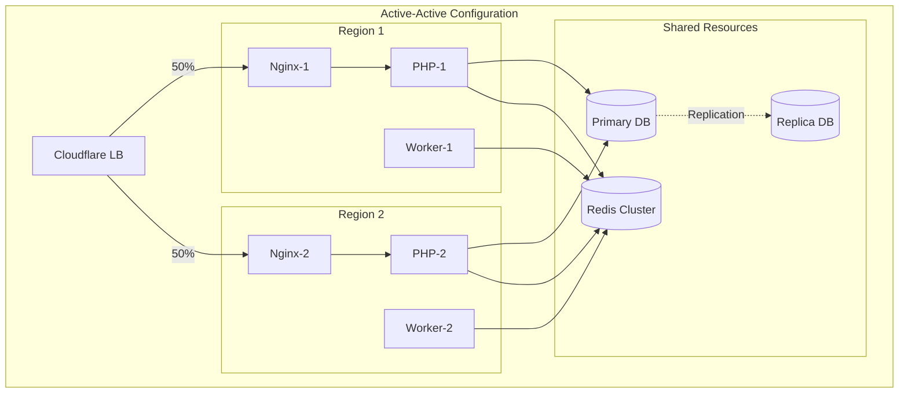
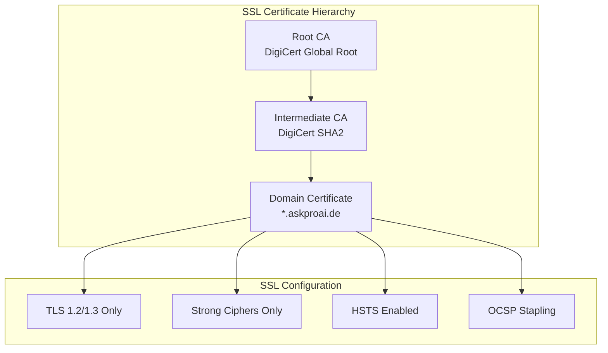
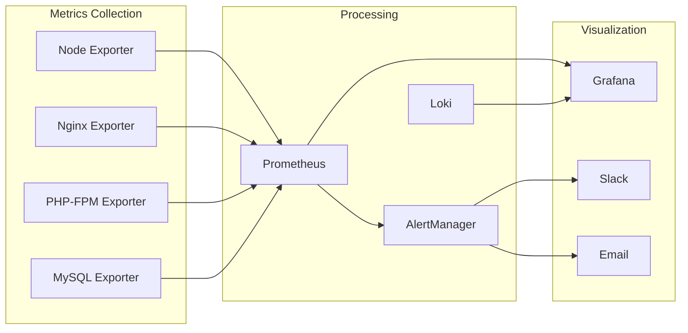
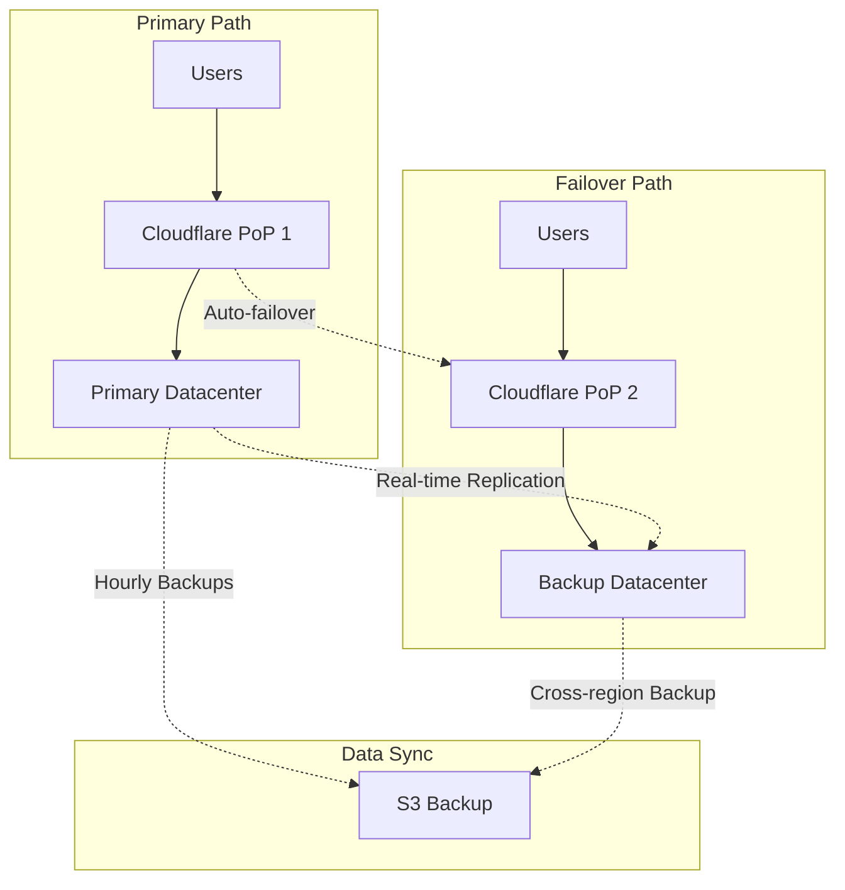

# 🌐 Network Topology Diagrams

## Overall Network Architecture

### Production Infrastructure
```
┌─────────────────────────────────────────────────────────────────────┐
│                              INTERNET                                │
│                                                                      │
│    End Users          External Services         Monitoring          │
│    ─────────          ────────────────         ──────────          │
│    • Customers        • Retell.ai API          • StatusPage        │
│    • Admins          • Cal.com API             • Pingdom           │
│    • Staff           • Stripe API              • Datadog           │
│                      • SMTP Server                                  │
└───────────────────────────┬─────────────────────────────────────────┘
                            │
                ┌───────────▼────────────┐
                │     Cloudflare         │
                │   ──────────────       │
                │   • DDoS Protection    │
                │   • WAF Rules          │
                │   • SSL Termination    │
                │   • CDN & Caching      │
                │   • Rate Limiting      │
                └───────────┬────────────┘
                            │
                ┌───────────▼────────────┐
                │    Firewall (UFW)      │
                │   ──────────────       │
                │   • Port 443 (HTTPS)   │
                │   • Port 22 (SSH)      │
                │   • Deny all others    │
                └───────────┬────────────┘
                            │
         ┌──────────────────┼──────────────────┐
         │                  │                  │
┌────────▼────────┐ ┌───────▼───────┐ ┌───────▼────────┐
│   Web Server    │ │  Application  │ │   Background   │
│     (Nginx)     │ │   (PHP-FPM)   │ │   (Horizon)    │
│  ─────────────  │ │ ───────────── │ │  ────────────  │
│  • Port 80/443  │ │  • Port 9000  │ │  • Workers     │
│  • Reverse Proxy│ │  • Laravel    │ │  • Schedulers  │
│  • Static Files │ │  • API Routes │ │  • Queue Jobs  │
└────────┬────────┘ └───────┬───────┘ └────────┬───────┘
         │                  │                   │
         └──────────────────┼───────────────────┘
                            │
         ┌──────────────────┼──────────────────┐
         │                  │                  │
┌────────▼────────┐ ┌───────▼───────┐ ┌───────▼────────┐
│    Database     │ │     Redis     │ │   File Storage │
│   (MariaDB)     │ │    Cluster    │ │      (S3)      │
│  ─────────────  │ │ ───────────── │ │  ────────────  │
│  • Port 3306    │ │  • Port 6379  │ │  • Backups     │
│  • Primary      │ │  • Sessions   │ │  • Uploads     │
│  • Replicas     │ │  • Cache      │ │  • Logs        │
└─────────────────┘ └───────────────┘ └────────────────┘
```

## Security Zones

### Network Segmentation


## Traffic Flow Patterns

### HTTP Request Flow


### Webhook Traffic Flow
```
┌─────────────────────────────────────────────────────────┐
│                    External Service                      │
│                  (Retell.ai/Stripe)                     │
└────────────────────────┬────────────────────────────────┘
                         │
                         │ POST /api/webhook
                         │ Headers: Signature
                         │
                    ┌────▼────┐
                    │  Edge   │
                    │ Server  │ ← Rate limit: 100/min
                    └────┬────┘
                         │
                    ┌────▼────┐
                    │Firewall │ ← IP Whitelist
                    └────┬────┘
                         │
                    ┌────▼────┐
                    │  Nginx  │ ← Request validation
                    └────┬────┘
                         │
                    ┌────▼────┐
                    │Laravel  │ ← Signature verify
                    └────┬────┘
                         │
                ┌────────┴────────┐
                │                 │
           ┌────▼────┐      ┌────▼────┐
           │ Process │      │  Queue  │
           │  Sync   │      │  Async  │
           └─────────┘      └─────────┘
```

## Port Mapping & Services

### Service Port Matrix
```
┌────────────────────────────────────────────────────────────────┐
│                        Port Allocation                          │
├────────────────────────────────────────────────────────────────┤
│                                                                 │
│ External Ports (Internet-facing):                              │
│ ─────────────────────────────────                              │
│ 443/tcp    HTTPS       → Nginx (SSL/TLS)                      │
│ 80/tcp     HTTP        → Nginx (Redirect to HTTPS)            │
│ 22/tcp     SSH         → OpenSSH (Key-based only)             │
│                                                                 │
│ Internal Ports (Local only):                                   │
│ ─────────────────────────────                                  │
│ 9000/tcp   PHP-FPM     → FastCGI Process Manager              │
│ 3306/tcp   MariaDB     → Database Server                      │
│ 6379/tcp   Redis       → Cache/Session/Queue                  │
│ 9200/tcp   ElasticSearch → Full-text Search (Future)          │
│ 8025/tcp   Mailhog     → Local Email Testing                  │
│                                                                 │
│ Monitoring Ports (Restricted):                                 │
│ ──────────────────────────────                                 │
│ 9100/tcp   Node Exporter → Prometheus Metrics                 │
│ 3000/tcp   Grafana      → Metrics Dashboard                   │
│ 9090/tcp   Prometheus   → Metrics Collection                  │
│                                                                 │
└────────────────────────────────────────────────────────────────┘
```

## Load Balancing Strategy

### High Availability Setup


### Traffic Distribution
```
┌─────────────────────────────────────────────────────────────┐
│                    Load Balancer Rules                       │
├─────────────────────────────────────────────────────────────┤
│                                                              │
│ Health Checks:                                               │
│ • Endpoint: /health                                          │
│ • Interval: 10s                                             │
│ • Timeout: 5s                                               │
│ • Threshold: 3 failures                                     │
│                                                              │
│ Distribution Algorithm:                                      │
│ • Method: Round Robin                                       │
│ • Session: IP Hash (Sticky)                                 │
│ • Failover: Automatic                                       │
│                                                              │
│ Traffic Rules:                                               │
│ ┌────────────────┬──────────────┬─────────────┐           │
│ │ Path           │ Backend      │ Weight      │           │
│ ├────────────────┼──────────────┼─────────────┤           │
│ │ /api/*         │ API Servers  │ 100%        │           │
│ │ /admin/*       │ App Servers  │ 100%        │           │
│ │ /health        │ All Servers  │ Round Robin │           │
│ │ /*             │ Web Servers  │ 100%        │           │
│ └────────────────┴──────────────┴─────────────┘           │
│                                                              │
└─────────────────────────────────────────────────────────────┘
```

## SSL/TLS Configuration

### Certificate Chain


### SSL Termination Points
```
┌─────────────────────────────────────────────────────────────┐
│                   SSL/TLS Flow                               │
├─────────────────────────────────────────────────────────────┤
│                                                              │
│ 1. Client → Cloudflare                                      │
│    • Protocol: TLS 1.3                                      │
│    • Certificate: Cloudflare Universal SSL                  │
│    • Encryption: AES-256-GCM                               │
│                                                              │
│ 2. Cloudflare → Origin                                      │
│    • Protocol: TLS 1.2+                                     │
│    • Certificate: Let's Encrypt                             │
│    • Mode: Full (Strict)                                    │
│                                                              │
│ 3. Internal Services                                         │
│    • Nginx → PHP-FPM: Unencrypted (Local)                  │
│    • PHP → Database: SSL/TLS                               │
│    • PHP → Redis: Unencrypted (Local)                      │
│                                                              │
└─────────────────────────────────────────────────────────────┘
```

## DNS Configuration

### DNS Record Structure
```
askproai.de
├── A Records
│   ├── @           → 104.26.10.xxx (Cloudflare)
│   └── @           → 104.26.11.xxx (Cloudflare)
│
├── AAAA Records
│   ├── @           → 2606:4700:xxx (IPv6)
│   └── @           → 2606:4700:yyy (IPv6)
│
├── CNAME Records
│   ├── www         → askproai.de
│   ├── api         → askproai.de
│   └── admin       → askproai.de
│
├── MX Records
│   ├── @           → 10 mx1.smtp.de
│   └── @           → 20 mx2.smtp.de
│
├── TXT Records
│   ├── @           → "v=spf1 include:_spf.smtp.de -all"
│   ├── _dmarc      → "v=DMARC1; p=quarantine; rua=mailto:..."
│   └── stripe._domainkey → "k=rsa; p=MIGfMA0GCSqGSIb3..."
│
└── CAA Records
    └── @           → 0 issue "letsencrypt.org"
```

## Monitoring & Alerting

### Network Monitoring Stack


### Critical Alerts Configuration
```
┌─────────────────────────────────────────────────────────────┐
│                     Alert Rules                              │
├─────────────────────────────────────────────────────────────┤
│                                                              │
│ Infrastructure Alerts:                                       │
│ • CPU Usage > 80% for 5 minutes                            │
│ • Memory Usage > 90%                                        │
│ • Disk Usage > 85%                                          │
│ • Network Errors > 1% of traffic                           │
│                                                              │
│ Application Alerts:                                          │
│ • Response Time > 1 second (p95)                           │
│ • Error Rate > 1% for 5 minutes                            │
│ • Queue Depth > 1000 jobs                                  │
│ • Failed Jobs > 10 in 5 minutes                            │
│                                                              │
│ Security Alerts:                                             │
│ • Failed SSH attempts > 5                                   │
│ • WAF blocks > 100/minute                                   │
│ • Invalid API calls > 50/minute                            │
│ • Database connection failures                              │
│                                                              │
└─────────────────────────────────────────────────────────────┘
```

## Disaster Recovery

### Backup Network Paths


### Network Recovery Procedures
```
┌─────────────────────────────────────────────────────────────┐
│                 Disaster Recovery Plan                       │
├─────────────────────────────────────────────────────────────┤
│                                                              │
│ Scenario 1: Primary Server Failure                          │
│ 1. Cloudflare auto-detects via health checks               │
│ 2. Traffic redirected to backup server                      │
│ 3. Database promotes replica to primary                     │
│ 4. Alert sent to ops team                                  │
│ 5. RTO: < 5 minutes                                        │
│                                                              │
│ Scenario 2: Complete DC Failure                             │
│ 1. Cloudflare failover to secondary DC                     │
│ 2. Restore from latest S3 backup                           │
│ 3. Update DNS if needed                                    │
│ 4. Verify data consistency                                 │
│ 5. RTO: < 30 minutes                                       │
│                                                              │
│ Scenario 3: DDoS Attack                                     │
│ 1. Cloudflare absorbs attack                               │
│ 2. Rate limiting activated                                 │
│ 3. Under Attack mode enabled                               │
│ 4. Monitor and adjust rules                                │
│ 5. RTO: Immediate                                          │
│                                                              │
└─────────────────────────────────────────────────────────────┘
```

---

> 📝 **Note**: Network topology is designed for high availability, security, and scalability with multiple failover mechanisms.