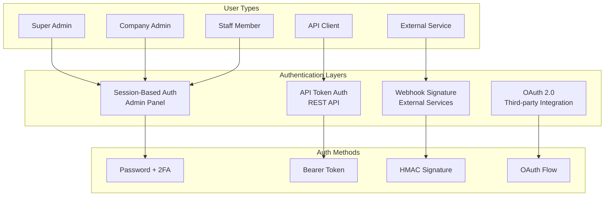
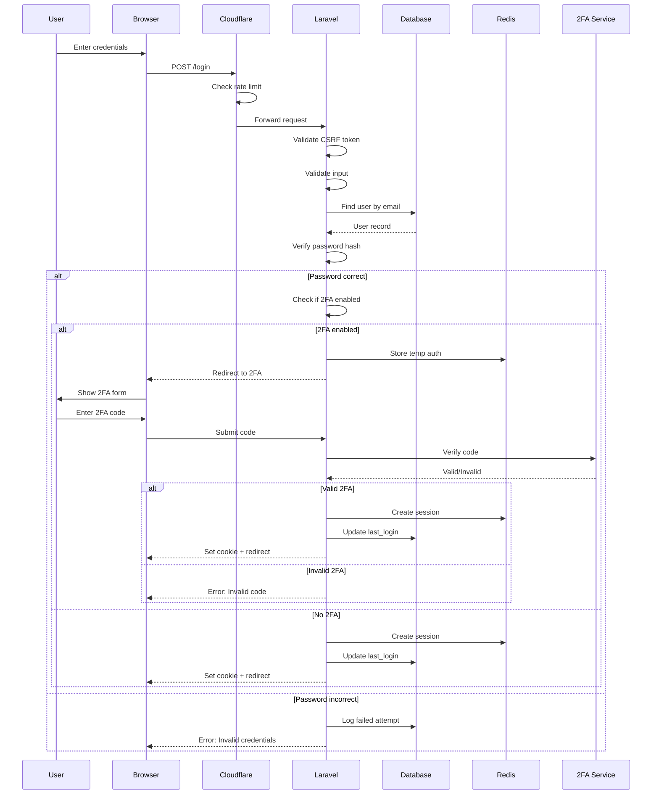
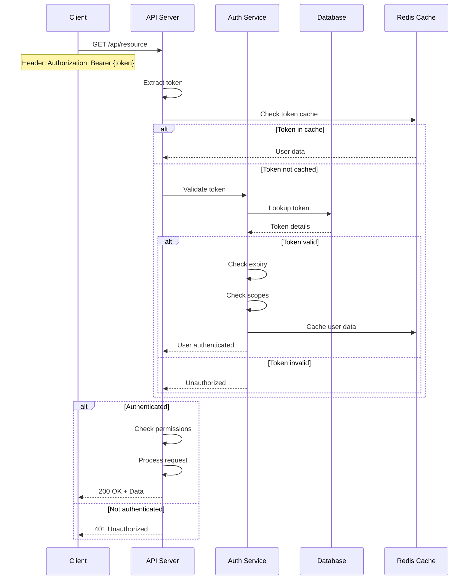
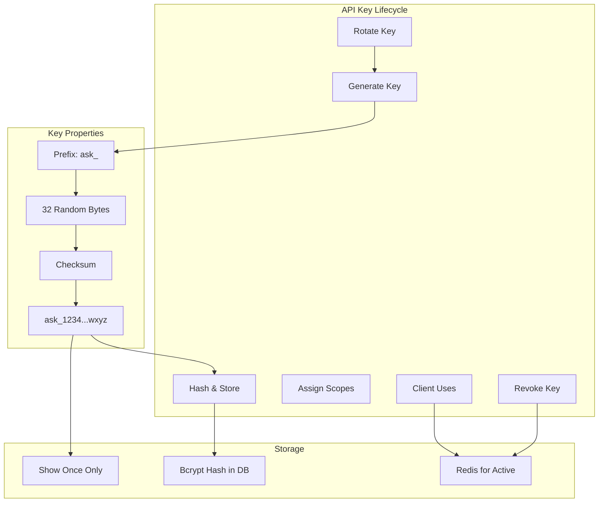
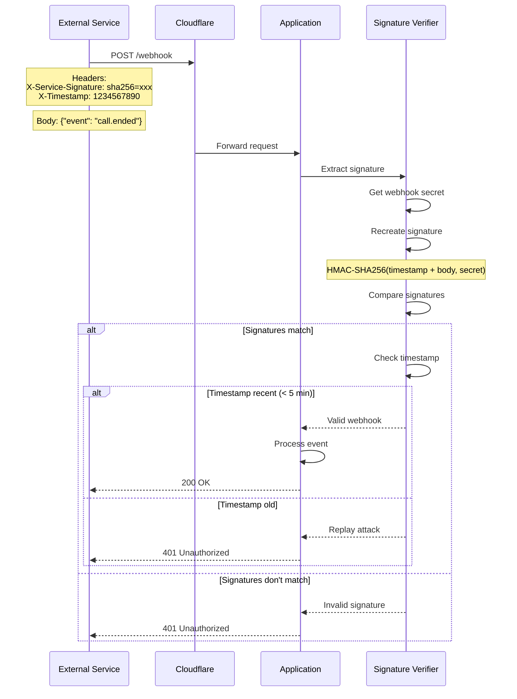
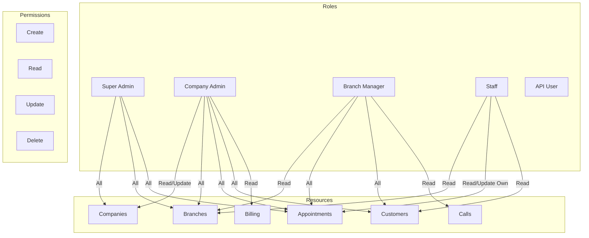
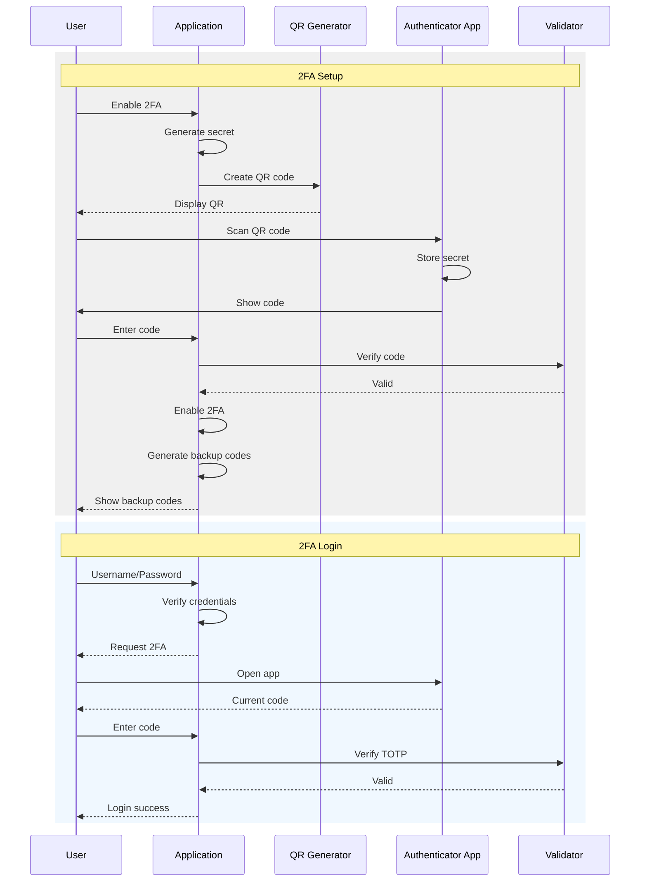
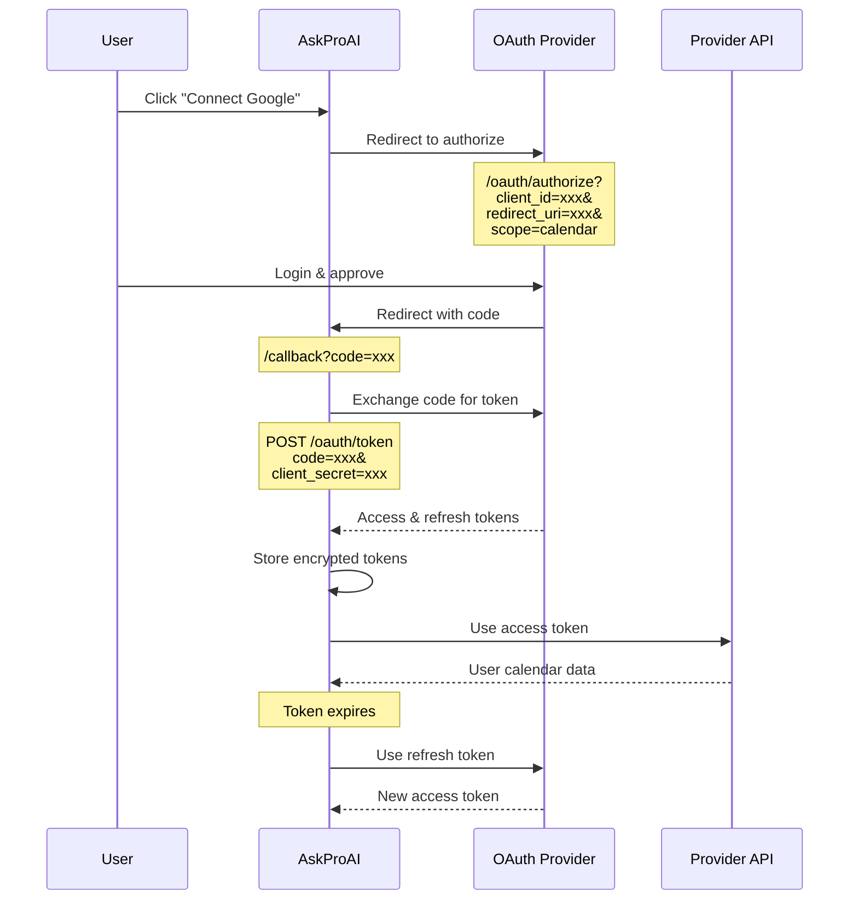
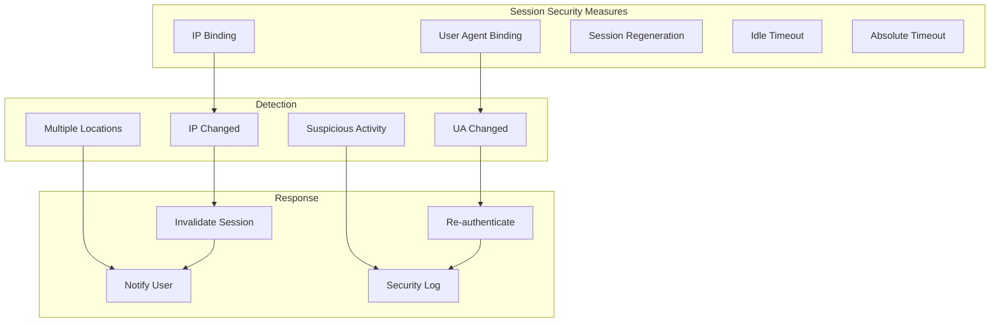

# 🔐 Authentication Flow Diagrams

## Authentication System Overview

### Multi-Layer Authentication Architecture


## Web Authentication Flow

### Login Process


### Session Management
```
┌─────────────────────────────────────────────────────────────┐
│                    Session Lifecycle                         │
├─────────────────────────────────────────────────────────────┤
│                                                              │
│ 1. Session Creation                                          │
│    ┌─────────────────────────────────────┐                 │
│    │ Session ID: uuid-v4                  │                 │
│    │ User ID: 123                         │                 │
│    │ IP Address: 192.168.1.1             │                 │
│    │ User Agent: Mozilla/5.0...          │                 │
│    │ Created: 2024-01-15 10:00:00        │                 │
│    │ Expires: 2024-01-15 12:00:00        │                 │
│    └─────────────────────────────────────┘                 │
│                                                              │
│ 2. Session Storage (Redis)                                   │
│    Key: laravel_session:uuid-v4                            │
│    TTL: 7200 seconds (2 hours)                             │
│                                                              │
│ 3. Cookie Settings                                           │
│    Name: askproai_session                                   │
│    HttpOnly: true                                           │
│    Secure: true (HTTPS only)                               │
│    SameSite: lax                                           │
│    Domain: .askproai.de                                    │
│                                                              │
│ 4. Session Validation (Each Request)                        │
│    • Check session exists in Redis                         │
│    • Validate IP hasn't changed                           │
│    • Validate User Agent match                            │
│    • Extend TTL on activity                               │
│                                                              │
└─────────────────────────────────────────────────────────────┘
```

## API Authentication

### API Token Flow


### API Key Management


## Webhook Authentication

### Signature Verification Flow


### Webhook Security Implementation
```
┌─────────────────────────────────────────────────────────────┐
│                 Webhook Security Layers                      │
├─────────────────────────────────────────────────────────────┤
│                                                              │
│ 1. IP Whitelisting (Cloudflare)                            │
│    • Retell.ai: 34.xxx.xxx.0/24                           │
│    • Stripe: 54.xxx.xxx.0/24                              │
│    • Cal.com: 185.xxx.xxx.0/24                            │
│                                                              │
│ 2. Signature Verification                                    │
│    ┌────────────────────────────────────┐                  │
│    │ Retell Signature:                  │                  │
│    │ Header: x-retell-signature         │                  │
│    │ Format: v={timestamp},d={hash}    │                  │
│    │ Secret: Same as API key            │                  │
│    └────────────────────────────────────┘                  │
│                                                              │
│    ┌────────────────────────────────────┐                  │
│    │ Stripe Signature:                  │                  │
│    │ Header: stripe-signature           │                  │
│    │ Format: t={time},v1={hash}        │                  │
│    │ Secret: whsec_xxxxx                │                  │
│    └────────────────────────────────────┘                  │
│                                                              │
│ 3. Replay Protection                                         │
│    • Timestamp must be < 5 minutes old                     │
│    • Store processed event IDs                             │
│    • Reject duplicate events                               │
│                                                              │
└─────────────────────────────────────────────────────────────┘
```

## Permission System

### Role-Based Access Control (RBAC)


### Permission Matrix
```
┌─────────────────────────────────────────────────────────────┐
│                    Permission Matrix                         │
├─────────────────┬────────┬─────────┬──────────┬────────────┤
│ Resource        │ Super  │ Company │ Branch   │ Staff      │
│                 │ Admin  │ Admin   │ Manager  │            │
├─────────────────┼────────┼─────────┼──────────┼────────────┤
│ Companies       │ CRUD   │ RU      │ R        │ -          │
│ Branches        │ CRUD   │ CRUD    │ R        │ R          │
│ Staff           │ CRUD   │ CRUD    │ RU       │ R          │
│ Appointments    │ CRUD   │ CRUD    │ CRUD     │ R(own)     │
│ Customers       │ CRUD   │ CRUD    │ CRUD     │ R          │
│ Calls           │ CRUD   │ CRUD    │ R        │ R          │
│ Billing         │ CRUD   │ RU      │ R        │ -          │
│ Settings        │ CRUD   │ RU      │ R        │ -          │
│ API Keys        │ CRUD   │ CRD     │ -        │ -          │
│ Webhooks        │ CRUD   │ RU      │ -        │ -          │
└─────────────────┴────────┴─────────┴──────────┴────────────┘

Legend: C=Create, R=Read, U=Update, D=Delete, -=No Access
```

## Multi-Factor Authentication

### 2FA Flow


### 2FA Backup & Recovery
```
┌─────────────────────────────────────────────────────────────┐
│                  2FA Recovery Options                        │
├─────────────────────────────────────────────────────────────┤
│                                                              │
│ 1. Backup Codes                                             │
│    ┌─────────────────────────────────┐                     │
│    │ • 8 single-use codes            │                     │
│    │ • 8 characters each             │                     │
│    │ • Stored hashed                 │                     │
│    │ • Download as PDF               │                     │
│    └─────────────────────────────────┘                     │
│                                                              │
│ 2. SMS Fallback                                             │
│    • Send code to registered phone                         │
│    • Rate limited: 3 per hour                              │
│    • Logged for security                                   │
│                                                              │
│ 3. Admin Override                                           │
│    • Super admin can disable 2FA                           │
│    • Requires admin 2FA                                    │
│    • Audit logged                                          │
│    • Email notification sent                               │
│                                                              │
│ 4. Account Recovery                                         │
│    • Email verification                                    │
│    • Security questions                                    │
│    • 24-hour waiting period                               │
│    • Manual review for high-value accounts                 │
│                                                              │
└─────────────────────────────────────────────────────────────┘
```

## OAuth 2.0 Integration

### OAuth Flow (Future Implementation)


## Security Headers

### Security Headers Configuration
```
┌─────────────────────────────────────────────────────────────┐
│                  Security Headers                            │
├─────────────────────────────────────────────────────────────┤
│                                                              │
│ Strict-Transport-Security:                                  │
│   max-age=31536000; includeSubDomains; preload             │
│                                                              │
│ Content-Security-Policy:                                     │
│   default-src 'self';                                      │
│   script-src 'self' 'unsafe-inline' cdn.jsdelivr.net;      │
│   style-src 'self' 'unsafe-inline' fonts.googleapis.com;   │
│   font-src 'self' fonts.gstatic.com;                       │
│   img-src 'self' data: https:;                             │
│   connect-src 'self' api.stripe.com;                       │
│                                                              │
│ X-Frame-Options: DENY                                       │
│ X-Content-Type-Options: nosniff                             │
│ X-XSS-Protection: 1; mode=block                            │
│ Referrer-Policy: strict-origin-when-cross-origin           │
│ Permissions-Policy: geolocation=(), microphone=()          │
│                                                              │
└─────────────────────────────────────────────────────────────┘
```

## Session Security

### Session Hijacking Prevention


---

> 📝 **Note**: Authentication system implements defense in depth with multiple security layers and fallback mechanisms.