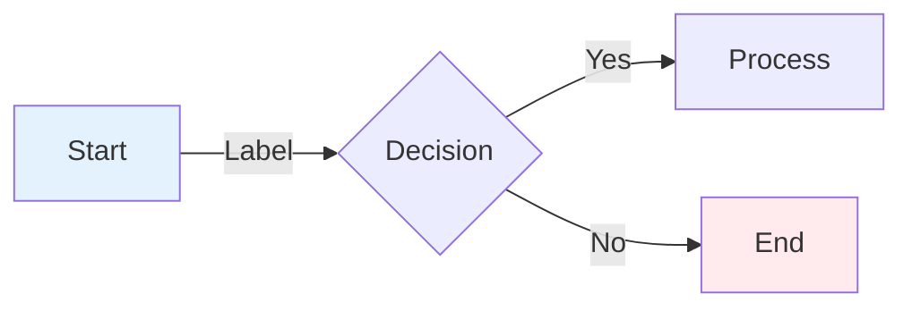

# 📊 AskProAI Visual Documentation

Welcome to the visual documentation for AskProAI. This directory contains comprehensive diagrams and flowcharts that illustrate the system architecture, data flows, and key processes.

## 📁 Directory Structure

### 🏗️ [01_SYSTEM_ARCHITECTURE.md](./01_SYSTEM_ARCHITECTURE.md)
Complete system architecture diagrams including:
- High-level system overview
- Microservices communication patterns
- Infrastructure architecture
- Container architecture (Docker)
- Security architecture
- Scalability patterns
- Deployment architecture
- Monitoring stack

### 📞 [02_CALL_FLOW_DETAILED.md](./02_CALL_FLOW_DETAILED.md)
Detailed phone-to-appointment flow diagrams:
- End-to-end call processing
- Call state machine
- NLP data extraction pipeline
- Webhook processing details
- Phone number resolution
- AI agent configuration
- Error handling and recovery
- Performance optimization

### 💳 [03_PAYMENT_PROCESSING.md](./03_PAYMENT_PROCESSING.md)
Payment and billing flow diagrams:
- Stripe integration overview
- Payment state machine
- Prepaid balance system
- Auto top-up flow
- Billing calculations
- Invoice generation
- Transaction management
- Refund processing

### 📧 [04_EMAIL_SYSTEM.md](./04_EMAIL_SYSTEM.md)
Email system architecture and flows:
- Complete email pipeline
- Template hierarchy
- Email types and priorities
- Call summary generation
- SMTP flow and delivery tracking
- Error handling and retry logic
- Multi-language support
- Performance optimization

### 🚀 [05_DEPLOYMENT_PIPELINE.md](./05_DEPLOYMENT_PIPELINE.md)
CI/CD and deployment diagrams:
- Complete deployment flow
- GitHub Actions workflow
- Zero-downtime deployment strategies
- Build and test pipeline
- Database migration patterns
- Environment management
- Monitoring and rollback procedures
- Post-deployment tasks

### 🗄️ [06_DATABASE_SCHEMA.md](./06_DATABASE_SCHEMA.md)
Database structure and relationships:
- Complete entity relationship diagram
- Core tables structure with SQL
- Financial tables
- Staff and services tables
- Audit and analytics tables
- Database optimization strategies
- Critical indexes and views
- Partitioning strategies

### 🌐 [07_NETWORK_TOPOLOGY.md](./07_NETWORK_TOPOLOGY.md)
Network architecture and security:
- Production infrastructure layout
- Security zones and segmentation
- Traffic flow patterns
- Port mapping and services
- Load balancing strategies
- SSL/TLS configuration
- DNS structure
- Disaster recovery procedures

### 🔐 [08_AUTHENTICATION_FLOW.md](./08_AUTHENTICATION_FLOW.md)
Authentication and authorization flows:
- Multi-layer authentication architecture
- Web login process with 2FA
- API token authentication
- Webhook signature verification
- Permission system (RBAC)
- OAuth 2.0 integration (planned)
- Security headers configuration
- Session security measures

### 🎨 [QUICK_REFERENCE_ASCII.md](./QUICK_REFERENCE_ASCII.md)
Terminal-friendly ASCII art diagrams:
- System overview
- Request flow
- Database relations
- Authentication flow
- Call processing pipeline
- Network topology
- Performance metrics
- Common commands reference

## 🛠️ Tools for Viewing/Editing

### Mermaid Diagrams
- **VS Code**: Install "Markdown Preview Mermaid Support" extension
- **Online**: Visit [mermaid.live](https://mermaid.live) for live editing
- **GitHub**: Mermaid diagrams render automatically in markdown files

### ASCII Diagrams
- **Terminal**: View directly in any terminal
- **VS Code**: Best viewed with monospace font
- **Online**: [asciiflow.com](https://asciiflow.com) for creating new diagrams

## 📝 Diagram Standards

### Mermaid Style Guide


### ASCII Art Style
```
┌─────────┐     ┌─────────┐
│ Component│────>│ Component│
└─────────┘     └─────────┘
     │               ▲
     └───────────────┘
```

## 🔄 Maintenance

### When to Update Diagrams
1. **System Architecture Changes**: New services, components, or integrations
2. **Process Updates**: Changes to business logic or workflows
3. **Database Schema Changes**: New tables, relationships, or indexes
4. **API Changes**: New endpoints or authentication methods
5. **Infrastructure Updates**: Network changes, new servers, or services

### Update Process
1. Edit the relevant `.md` file
2. Test diagram rendering locally
3. Update this README if adding new files
4. Commit with descriptive message: `docs: update [diagram] for [feature]`

## 🎯 Quick Links

### Most Referenced Diagrams
- [System Overview](./01_SYSTEM_ARCHITECTURE.md#high-level-architecture)
- [Call Flow](./02_CALL_FLOW_DETAILED.md#end-to-end-call-flow)
- [Database Schema](./06_DATABASE_SCHEMA.md#entity-relationship-diagram)
- [Authentication](./08_AUTHENTICATION_FLOW.md#login-process)
- [Deployment](./05_DEPLOYMENT_PIPELINE.md#complete-deployment-flow)

### Emergency References
- [Network Topology](./07_NETWORK_TOPOLOGY.md#production-infrastructure)
- [Disaster Recovery](./07_NETWORK_TOPOLOGY.md#disaster-recovery)
- [Rollback Procedures](./05_DEPLOYMENT_PIPELINE.md#rollback-decision-tree)
- [Security Layers](./QUICK_REFERENCE_ASCII.md#security-layers)

## 📚 Additional Resources

### Related Documentation
- [Main Documentation](../VISUAL_DOCUMENTATION_GUIDE.md)
- [Claude.md](../CLAUDE.md) - Development guidelines
- [Deployment Checklist](../DEPLOYMENT_CHECKLIST.md)
- [Error Patterns](../ERROR_PATTERNS.md)

### External Tools
- [Mermaid Documentation](https://mermaid-js.github.io/mermaid/)
- [PlantUML](https://plantuml.com/) - For complex UML diagrams
- [draw.io](https://app.diagrams.net/) - For detailed architectural diagrams

---

> 📝 **Note**: Keep diagrams simple and focused. Complex systems should be broken down into multiple focused diagrams rather than one overwhelming diagram.

> 💡 **Tip**: Use the ASCII diagrams for quick reference in terminal or code comments, and Mermaid diagrams for detailed documentation.