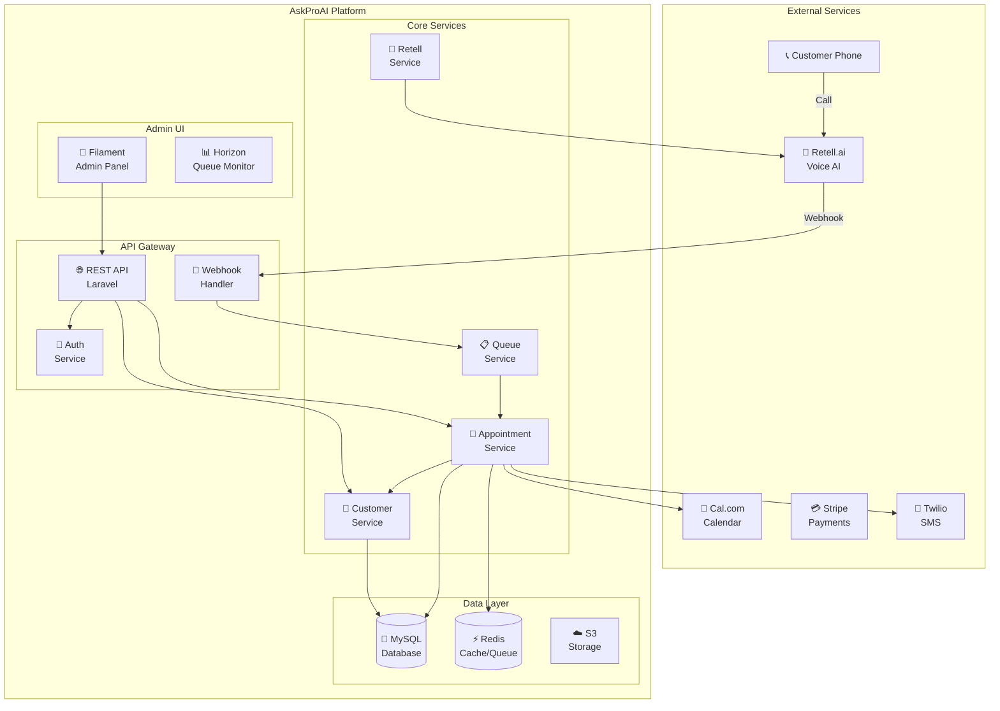
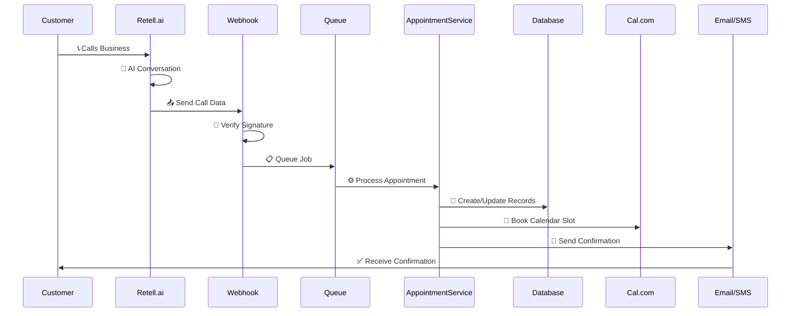
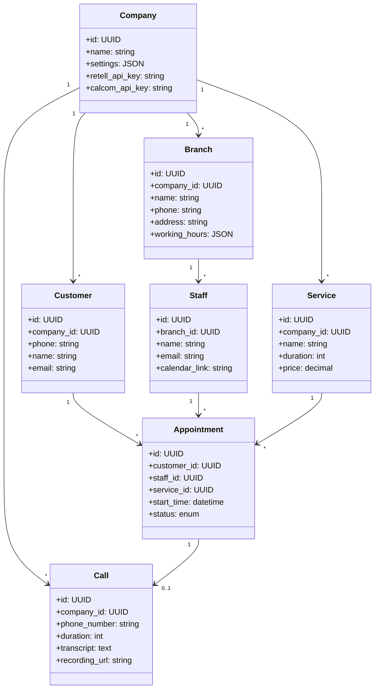
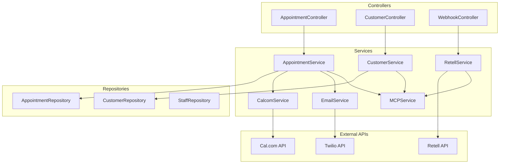
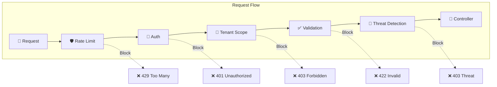
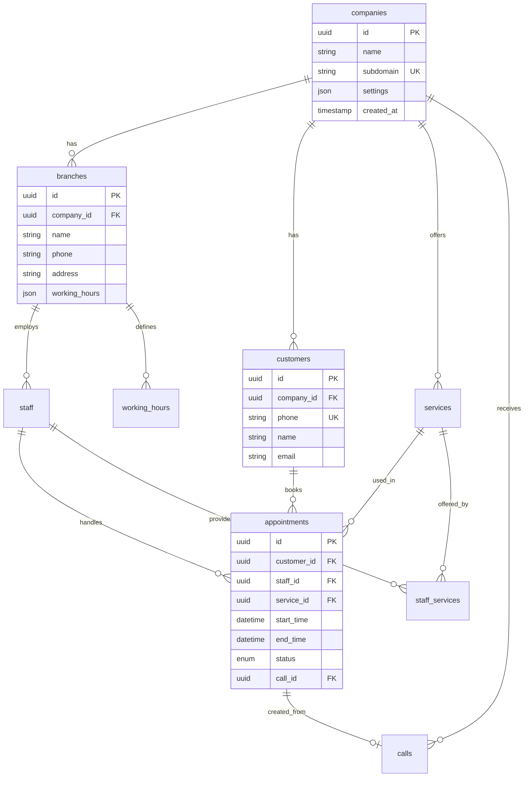
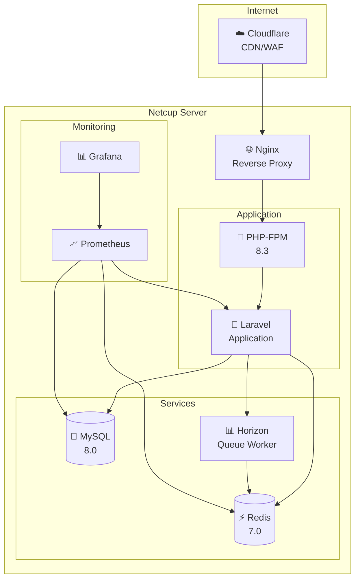
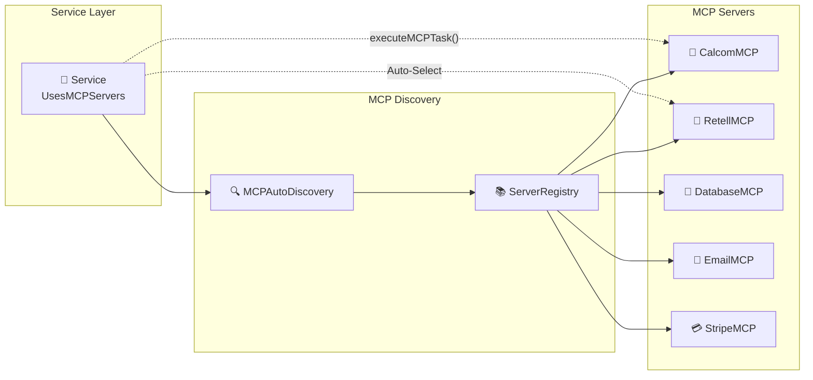

# 🏗️ AskProAI Architecture - Visual Guide

## 🌐 System Overview

## 🔄 Request Flow

## 🏛️ Domain Model

## 🔧 Service Layer Architecture

## 🔐 Security Layers

## 📊 Database Schema (Core Tables)

## 🚀 Deployment Architecture

## 💡 MCP Server Integration

---

## 🎯 Quick Navigation

- [Back to Main](../CLAUDE.md)
- [API Documentation](./API_GUIDE.md)
- [Testing Guide](./TESTING_GUIDE.md)
- [Deployment Guide](./DEPLOYMENT.md)

---

<i>Diagrams are auto-generated from code structure</i>

