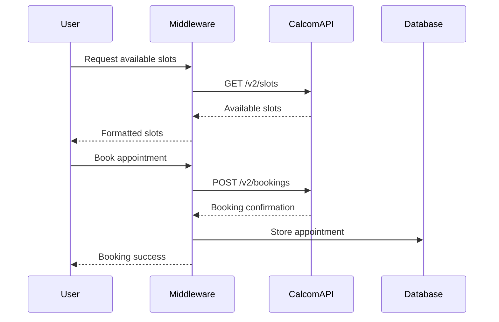
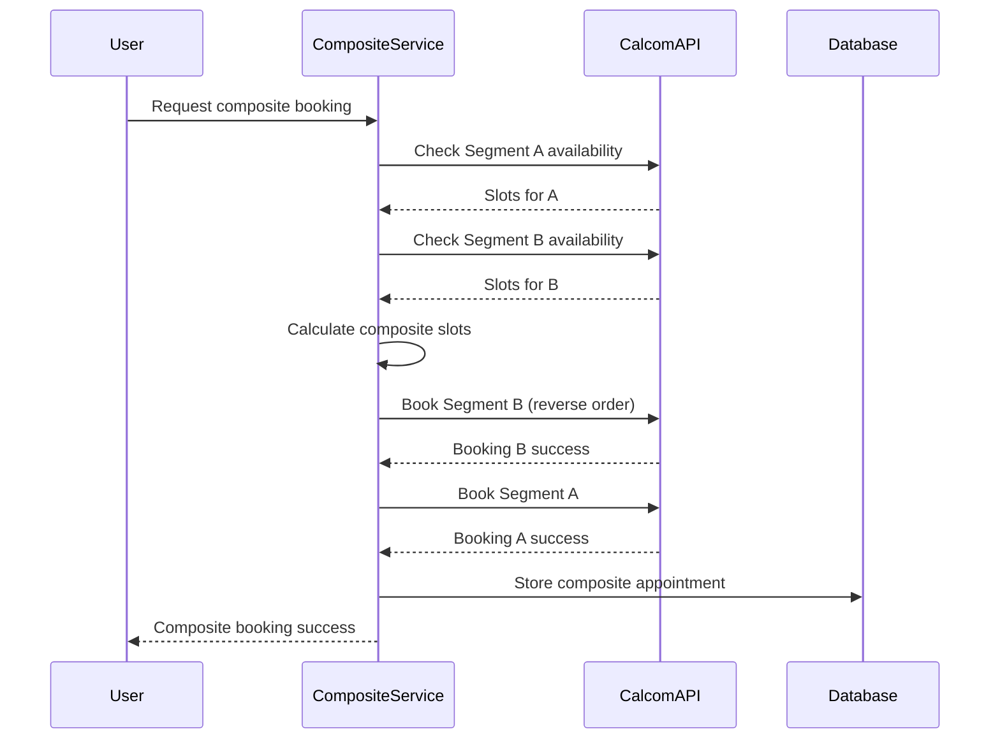

# Cal.com V2 API Integration Documentation

## Overview
This document provides comprehensive documentation for the Cal.com V2 API integration in the API Gateway middleware system.

## Table of Contents
1. [Authentication & Configuration](#authentication--configuration)
2. [API Endpoints](#api-endpoints)
3. [Data Flow](#data-flow)
4. [Error Handling](#error-handling)
5. [Testing](#testing)
6. [Best Practices](#best-practices)
7. [Troubleshooting](#troubleshooting)

## Authentication & Configuration

### Environment Variables
```bash
# Required Configuration
CALCOM_API_KEY="your_api_key_here"
CALCOM_API_VERSION="2024-08-13"
CALCOM_WEBHOOK_SECRET="your_webhook_secret"

# Optional Configuration
CALCOM_BASE_URL="https://api.cal.com/v2"  # Default
CALCOM_TIMEOUT=30                          # Request timeout in seconds
CALCOM_RETRY_ATTEMPTS=3                    # Number of retry attempts
```

### Headers Required for All Requests
```http
Authorization: Bearer {API_KEY}
cal-api-version: 2024-08-13
Content-Type: application/json
```

### Company-Specific API Keys
The system supports hierarchical API key management:
1. Company-specific keys (stored in `companies.calcom_v2_api_key`)
2. Environment default (fallback)

```php
// Implementation in CalcomV2Client.php
$client = new CalcomV2Client($company); // Uses company key if available
$client = new CalcomV2Client();         // Uses environment default
```

## API Endpoints

### 1. Availability Management

#### Get Available Slots
```php
GET /v2/slots
```

**Parameters:**
- `eventTypeId` (int, required): Cal.com event type ID
- `startTime` (ISO8601, required): Start of availability window
- `endTime` (ISO8601, required): End of availability window
- `timeZone` (string, required): Timezone (e.g., "Europe/Berlin")

**Response Structure:**
```json
{
  "status": "success",
  "data": {
    "slots": [
      {
        "start": "2025-01-15T10:00:00+01:00",
        "end": "2025-01-15T10:30:00+01:00"
      }
    ]
  }
}
```

**Implementation:**
```php
$response = $client->getAvailableSlots(
    $eventTypeId,
    Carbon::parse('2025-01-15 09:00'),
    Carbon::parse('2025-01-15 18:00'),
    'Europe/Berlin'
);
```

### 2. Booking Operations

#### Create Booking
```php
POST /v2/bookings
```

**Request Body:**
```json
{
  "eventTypeId": 123,
  "start": "2025-01-15T10:00:00+01:00",
  "end": "2025-01-15T10:30:00+01:00",
  "timeZone": "Europe/Berlin",
  "language": "de",
  "metadata": {},
  "responses": {
    "name": "John Doe",
    "email": "john@example.com",
    "guests": [],
    "location": {
      "optionValue": "",
      "value": "Vor Ort"
    }
  },
  "instant": false,
  "noEmail": true
}
```

**Response:**
```json
{
  "status": "success",
  "data": {
    "id": 1234,
    "uid": "abc123",
    "eventTypeId": 123,
    "status": "ACCEPTED",
    "start": "2025-01-15T10:00:00+01:00",
    "end": "2025-01-15T10:30:00+01:00",
    "attendees": [...]
  }
}
```

#### Reschedule Booking
```php
PATCH /v2/bookings/{id}
```

**Request Body:**
```json
{
  "start": "2025-01-16T14:00:00+01:00",
  "end": "2025-01-16T14:30:00+01:00",
  "timeZone": "Europe/Berlin",
  "reason": "Customer requested new time"
}
```

#### Cancel Booking
```php
DELETE /v2/bookings/{id}
```

**Request Body:**
```json
{
  "cancellationReason": "Customer unable to attend"
}
```

### 3. Event Type Management

#### Create Event Type
```php
POST /v2/event-types
```

**Request Body:**
```json
{
  "title": "Service Name",
  "slug": "service-name",
  "description": "Service description",
  "lengthInMinutes": 30,
  "hidden": true,
  "disableGuests": true,
  "requiresConfirmation": false,
  "bookingFields": [...],
  "locations": [{"type": "inPerson"}]
}
```

#### List Event Types
```php
GET /v2/event-types
```

### 4. Webhook Management

#### Register Webhook
```php
POST /v2/webhooks
```

**Request Body:**
```json
{
  "subscriberUrl": "https://your-domain.com/api/webhooks/calcom",
  "eventTriggers": [
    "booking.created",
    "booking.cancelled",
    "booking.rescheduled"
  ],
  "active": true,
  "secret": "your_webhook_secret"
}
```

## Data Flow

### Simple Booking Flow


### Composite Booking Flow


## Error Handling

### Error Response Format
```json
{
  "error": {
    "code": "ERROR_CODE",
    "message": "Human readable message",
    "details": {}
  }
}
```

### Common Error Codes

| Code | HTTP Status | Description | Action |
|------|-------------|-------------|--------|
| `SLOT_UNAVAILABLE` | 409 | Requested slot is no longer available | Retry with different slot |
| `INVALID_EVENT_TYPE` | 404 | Event type not found | Check event type ID |
| `RATE_LIMIT_EXCEEDED` | 429 | Too many requests | Implement exponential backoff |
| `INVALID_TIMEZONE` | 400 | Invalid timezone format | Use valid IANA timezone |
| `BOOKING_NOT_FOUND` | 404 | Booking ID doesn't exist | Verify booking ID |
| `UNAUTHORIZED` | 401 | Invalid API key | Check authentication |

### Retry Logic
```php
// Implemented in CalcomV2Client.php
->retry(3, 200, function ($exception, $request) {
    $status = optional($exception->response)->status();
    if (in_array($status, [409, 429])) {
        usleep(pow(2, $request->retries) * 1000000); // Exponential backoff
        return true;
    }
    return false;
})
```

### Compensation Pattern for Composite Bookings
When a composite booking fails partway through:
1. All successful segment bookings are automatically cancelled
2. No appointment record is created in the database
3. Error is returned to the user

```php
// Implementation in CompositeBookingService.php
private function compensateFailedBookings(array $bookings): void
{
    foreach ($bookings as $booking) {
        if ($booking['booking_id']) {
            $this->calcom->cancelBooking(
                $booking['booking_id'],
                'Composite booking failed - automatic compensation'
            );
        }
    }
}
```

## Testing

### Unit Tests
Located in `/tests/Feature/CalcomV2/`

Run tests:
```bash
# All Cal.com tests
php artisan test --filter CalcomV2

# Specific test suite
php artisan test tests/Feature/CalcomV2/CalcomV2ClientTest.php
php artisan test tests/Feature/CalcomV2/CalcomV2IntegrationTest.php
```

### Test Scripts
Located in `/scripts/test/`

```bash
# Test availability endpoints
./scripts/test/test-calcom-availability.sh

# Test booking operations
./scripts/test/test-calcom-booking.sh

# With custom configuration
API_BASE=http://staging.example.com/api/v2 \
SERVICE_ID=5 \
./scripts/test/test-calcom-availability.sh
```

### Mock Server
For testing without hitting the real Cal.com API:

```php
use Tests\Mocks\CalcomV2MockServer;

// In test setup
CalcomV2MockServer::setUp();

// Set specific scenarios
CalcomV2MockServer::setScenario('conflict');
CalcomV2MockServer::addScenario('createBooking', 'error');

// Get created bookings for assertions
$bookings = CalcomV2MockServer::getBookings();
```

## Best Practices

### 1. Always Use Timezone-Aware Dates
```php
// Good
$start = Carbon::parse('2025-01-15 10:00')->setTimezone('Europe/Berlin');

// Better
$start = Carbon::parse('2025-01-15 10:00', 'Europe/Berlin');
```

### 2. Handle Rate Limiting
- Implement exponential backoff
- Cache availability queries when possible
- Batch operations where appropriate

### 3. Validate Before Booking
```php
// Check availability before attempting to book
$slots = $this->checkAvailability($service, $start, $end);
if ($slots->isEmpty()) {
    throw new NoAvailabilityException();
}
```

### 4. Use Idempotency Keys for Critical Operations
```php
// For composite bookings
$compositeUid = Str::uuid();
$existing = Appointment::where('composite_group_uid', $compositeUid)->first();
if ($existing) {
    return $existing; // Prevent duplicate bookings
}
```

### 5. Log All API Interactions
```php
Log::channel('calcom')->info('Booking created', [
    'booking_id' => $response->json('data.id'),
    'service_id' => $service->id,
    'customer_id' => $customer->id
]);
```

## Webhook Processing

### Webhook Events
The system handles the following Cal.com webhook events:

| Event | Description | Action |
|-------|-------------|--------|
| `BOOKING.CREATED` | New booking created | Create/update appointment |
| `BOOKING.CANCELLED` | Booking cancelled | Update appointment status |
| `BOOKING.RESCHEDULED` | Booking time changed | Update appointment times |
| `EVENT_TYPE.CREATED` | New event type | Import to services |
| `EVENT_TYPE.UPDATED` | Event type modified | Update service |
| `EVENT_TYPE.DELETED` | Event type removed | Soft delete service |

### Webhook Security
All webhooks are verified using HMAC-SHA256:

```php
// Middleware: CalcomWebhookSignatureMiddleware.php
$signature = 'sha256=' . hash_hmac('sha256', $payload, $secret);
if (!hash_equals($signature, $request->header('X-Cal-Signature-256'))) {
    return response()->json(['error' => 'Invalid signature'], 401);
}
```

### Webhook URL Configuration
```
Production: https://your-domain.com/api/webhooks/calcom
Staging: https://staging.your-domain.com/api/webhooks/calcom
```

## Troubleshooting

### Common Issues

#### 1. "SLOT_UNAVAILABLE" Error
**Cause:** Slot was booked between availability check and booking attempt
**Solution:**
- Implement slot reservation before booking
- Add retry logic with alternative slots

#### 2. Timezone Mismatches
**Cause:** Mixing timezone formats or assumptions
**Solution:**
- Always specify timezone explicitly
- Use ISO8601 format for all date/time values
- Ensure `timeZone` parameter uses camelCase (not `timezone`)

#### 3. Composite Booking Partial Failures
**Cause:** One segment fails after others succeed
**Solution:**
- Compensation saga automatically cancels successful bookings
- Check logs for specific failure reasons
- Verify all staff have correct Cal.com event mappings

#### 4. Rate Limiting (429 errors)
**Cause:** Too many requests to Cal.com API
**Solution:**
- Implement caching for availability queries
- Use exponential backoff in retry logic
- Consider batching operations

### Debug Logging
Enable debug logging for Cal.com operations:

```php
// In .env
CALCOM_DEBUG=true
LOG_CHANNEL=stack

// Check logs
tail -f storage/logs/calcom.log
```

### Health Check Endpoint
Monitor Cal.com integration status:

```bash
curl http://your-domain.com/api/health/calcom
```

Response:
```json
{
  "status": "healthy",
  "api_reachable": true,
  "webhook_registered": true,
  "last_sync": "2025-01-15T10:30:00Z",
  "event_types_count": 25
}
```

## Migration from V1 to V2

### Key Differences
1. **Endpoint Structure**: `/v1/` → `/v2/`
2. **Authentication**: Query parameter → Bearer token
3. **Date Format**: Various → Strict ISO8601
4. **Response Format**: Nested → Flat structure

### Migration Checklist
- [ ] Update API base URL
- [ ] Switch to Bearer token authentication
- [ ] Update date formatting to ISO8601
- [ ] Update response parsing for new structure
- [ ] Test all booking flows
- [ ] Update webhook endpoints
- [ ] Verify error handling

## Performance Considerations

### Caching Strategy
```php
// Cache availability for 5 minutes
Cache::remember("slots_{$eventTypeId}_{$date}", 300, function() {
    return $this->calcom->getAvailableSlots(...);
});
```

### Database Indexing
Ensure proper indexes on:
- `appointments.starts_at`
- `appointments.calcom_v2_booking_id`
- `calcom_event_maps.event_type_id`
- `appointments.composite_group_uid`

### Connection Pooling
For high-volume operations:
```php
// Use persistent HTTP connections
Http::withOptions([
    'connect_timeout' => 5,
    'timeout' => 30,
    'http_errors' => false,
    'pool_size' => 10
])
```

## Support and Resources

### Internal Documentation
- `/docs/MIDDLEWARE_OVERVIEW.md` - System architecture
- `/docs/COMPOSITE_BOOKINGS.md` - Composite booking details
- `/claudedocs/calcom-analysis.md` - Technical analysis

### External Resources
- [Cal.com API Documentation](https://cal.com/docs/api)
- [Cal.com Status Page](https://status.cal.com)

### Contact
- Technical Issues: Create issue in project repository
- API Support: support@cal.com
- Emergency: Check runbook in `/docs/RUNBOOK.md`