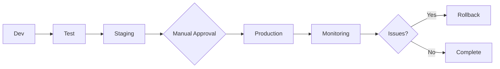

# CI/CD Best Practices - AskProAI

**Version**: 1.0  
**Last Updated**: 2025-01-10  
**Purpose**: Guidelines and best practices for CI/CD pipeline management

## Table of Contents

1. [Pipeline Design Principles](#pipeline-design-principles)
2. [GitHub Actions Best Practices](#github-actions-best-practices)
3. [Testing Strategy](#testing-strategy)
4. [Security Best Practices](#security-best-practices)
5. [Performance Optimization](#performance-optimization)
6. [Deployment Strategies](#deployment-strategies)
7. [Monitoring & Observability](#monitoring--observability)
8. [Documentation Standards](#documentation-standards)
9. [Team Collaboration](#team-collaboration)
10. [Continuous Improvement](#continuous-improvement)

---

## Pipeline Design Principles

### 1. Fast Feedback

**Goal**: Developers should receive feedback within 10 minutes

```yaml
# Parallel job execution
jobs:
  quick-checks:
    runs-on: ubuntu-latest
    strategy:
      matrix:
        check: [lint, security, unit-tests]
    steps:
      - name: Run ${{ matrix.check }}
        run: make ${{ matrix.check }}
```

### 2. Fail Fast

**Goal**: Stop pipeline execution as soon as a critical failure occurs

```yaml
jobs:
  validate:
    runs-on: ubuntu-latest
    steps:
      - name: Syntax Check
        run: |
          find . -name "*.php" -exec php -l {} \; || exit 1
          
      - name: Critical Security Check
        run: |
          if grep -r "password.*=" --include="*.php" .; then
            echo "Hardcoded password detected!"
            exit 1
          fi
```

### 3. Reproducible Builds

**Goal**: Same input = same output, always

```dockerfile
# Use specific versions
FROM php:8.2.3-fpm-alpine3.17

# Lock dependencies
COPY composer.lock /app/
RUN composer install --no-dev --no-scripts --no-autoloader

# Use deterministic builds
ARG BUILD_DATE
ARG VCS_REF
LABEL build_date=$BUILD_DATE vcs_ref=$VCS_REF
```

### 4. Progressive Deployment



---

## GitHub Actions Best Practices

### 1. Workflow Organization

```yaml
# .github/workflows/_reusable-build.yml
name: Reusable Build Workflow

on:
  workflow_call:
    inputs:
      environment:
        required: true
        type: string
    secrets:
      NPM_TOKEN:
        required: true

jobs:
  build:
    # Reusable build logic
```

### 2. Caching Strategy

```yaml
# Effective caching
- name: Cache Composer dependencies
  uses: actions/cache@v4
  with:
    path: vendor
    key: ${{ runner.os }}-composer-${{ hashFiles('**/composer.lock') }}
    restore-keys: |
      ${{ runner.os }}-composer-

- name: Cache NPM dependencies
  uses: actions/cache@v4
  with:
    path: ~/.npm
    key: ${{ runner.os }}-npm-${{ hashFiles('**/package-lock.json') }}
```

### 3. Matrix Builds

```yaml
strategy:
  matrix:
    php: [8.2, 8.3]
    node: [18, 20]
    exclude:
      - php: 8.3
        node: 18
```

### 4. Conditional Execution

```yaml
- name: Deploy to Production
  if: |
    github.ref == 'refs/heads/main' &&
    github.event_name == 'push' &&
    contains(github.event.head_commit.message, '[deploy]')
  run: ./deploy.sh production
```

### 5. Artifact Management

```yaml
- name: Upload test results
  if: always()
  uses: actions/upload-artifact@v4
  with:
    name: test-results-${{ matrix.php }}
    path: |
      test-results/
      coverage/
    retention-days: 30
```

---

## Testing Strategy

### 1. Test Pyramid

```
         /\
        /  \  E2E Tests (10%)
       /    \
      /------\ Integration Tests (20%)
     /        \
    /----------\ Unit Tests (70%)
```

### 2. Parallel Testing

```yaml
# phpunit.xml
<phpunit parallelTesting="true" 
         numberOfGroups="4">
    <testsuites>
        <testsuite name="Unit">
            <directory>tests/Unit</directory>
        </testsuite>
    </testsuites>
</phpunit>
```

### 3. Test Data Management

```php
// Use factories for consistent test data
class TestCase extends BaseTestCase
{
    protected function setUp(): void
    {
        parent::setUp();
        
        // Use transactions for faster tests
        DB::beginTransaction();
    }
    
    protected function tearDown(): void
    {
        DB::rollBack();
        parent::tearDown();
    }
}
```

### 4. Performance Testing

```yaml
- name: Performance Benchmark
  run: |
    # Baseline performance
    ab -n 1000 -c 50 http://localhost:8000/api/health > baseline.txt
    
    # Run after changes
    ab -n 1000 -c 50 http://localhost:8000/api/health > current.txt
    
    # Compare
    ./scripts/compare-performance.sh baseline.txt current.txt
```

---

## Security Best Practices

### 1. Secret Management

```yaml
# Never commit secrets
# Use GitHub Secrets
- name: Deploy
  env:
    API_KEY: ${{ secrets.API_KEY }}
    DB_PASSWORD: ${{ secrets.DB_PASSWORD }}
  run: |
    # Secrets are masked in logs automatically
    echo "Deploying with API key: $API_KEY"
```

### 2. Dependency Scanning

```yaml
- name: Security Audit
  run: |
    # PHP dependencies
    composer audit
    
    # NPM dependencies
    npm audit --production
    
    # Container scanning
    trivy image myapp:latest
```

### 3. SAST (Static Application Security Testing)

```yaml
- name: SAST Scan
  uses: github/super-linter@v5
  env:
    DEFAULT_BRANCH: main
    GITHUB_TOKEN: ${{ secrets.GITHUB_TOKEN }}
    VALIDATE_PHP_PSALM: true
    VALIDATE_PHP_PHPSTAN: true
```

### 4. Security Headers

```nginx
# nginx.conf
add_header X-Frame-Options "SAMEORIGIN" always;
add_header X-Content-Type-Options "nosniff" always;
add_header X-XSS-Protection "1; mode=block" always;
add_header Referrer-Policy "no-referrer-when-downgrade" always;
add_header Content-Security-Policy "default-src 'self'" always;
```

---

## Performance Optimization

### 1. Build Optimization

```yaml
# Multi-stage builds
FROM composer:2 AS vendor
COPY composer.json composer.lock ./
RUN composer install \
    --no-interaction \
    --no-plugins \
    --no-scripts \
    --no-dev \
    --prefer-dist

FROM node:18 AS assets
COPY package*.json ./
RUN npm ci --production
COPY . .
RUN npm run build

FROM php:8.2-fpm
COPY --from=vendor /app/vendor ./vendor
COPY --from=assets /app/public/build ./public/build
```

### 2. Pipeline Performance

```yaml
# Run jobs in parallel
jobs:
  tests:
    strategy:
      matrix:
        suite: [unit, feature, integration]
    runs-on: ubuntu-latest
    steps:
      - run: php artisan test --testsuite=${{ matrix.suite }}
```

### 3. Resource Optimization

```yaml
# Use appropriate runner sizes
jobs:
  small-job:
    runs-on: ubuntu-latest  # 2 CPU, 7GB RAM
    
  large-job:
    runs-on: ubuntu-latest-4-cores  # 4 CPU, 16GB RAM
```

---

## Deployment Strategies

### 1. Blue-Green Deployment

```bash
#!/bin/bash
# blue-green-deploy.sh

CURRENT=$(readlink /var/www/app)
if [[ $CURRENT == *"blue"* ]]; then
    TARGET="green"
else
    TARGET="blue"
fi

# Deploy to inactive environment
deploy_to_environment $TARGET

# Health check
if health_check $TARGET; then
    # Switch traffic
    ln -sfn /var/www/app-$TARGET /var/www/app
    reload_nginx
else
    echo "Health check failed, aborting"
    exit 1
fi
```

### 2. Canary Deployment

```nginx
# nginx.conf
upstream backend {
    server app-stable:9000 weight=9;  # 90% traffic
    server app-canary:9000 weight=1;  # 10% traffic
}
```

### 3. Feature Flags

```php
// config/features.php
return [
    'new_booking_flow' => env('FEATURE_NEW_BOOKING_FLOW', false),
    'sms_notifications' => env('FEATURE_SMS_NOTIFICATIONS', false),
];

// Usage
if (config('features.new_booking_flow')) {
    return $this->newBookingFlow();
}
```

### 4. Database Migrations

```php
// Safe migration pattern
class AddNewColumnSafely extends Migration
{
    public function up()
    {
        // 1. Add nullable column
        Schema::table('users', function (Blueprint $table) {
            $table->string('new_field')->nullable();
        });
        
        // 2. Backfill in batches (separate job)
        // 3. Make non-nullable in next release
    }
    
    public function down()
    {
        Schema::table('users', function (Blueprint $table) {
            $table->dropColumn('new_field');
        });
    }
}
```

---

## Monitoring & Observability

### 1. Deployment Tracking

```yaml
- name: Record Deployment
  run: |
    curl -X POST $DATADOG_API_URL/api/v1/events \
      -H "Content-Type: application/json" \
      -H "DD-API-KEY: ${{ secrets.DATADOG_API_KEY }}" \
      -d '{
        "title": "Deployment to Production",
        "text": "Version ${{ github.sha }} deployed",
        "tags": ["environment:production", "version:${{ github.sha }}"],
        "alert_type": "info"
      }'
```

### 2. Metrics Collection

```php
// app/Http/Middleware/MetricsMiddleware.php
public function handle($request, Closure $next)
{
    $start = microtime(true);
    
    $response = $next($request);
    
    $duration = microtime(true) - $start;
    
    // Send to metrics collector
    app('metrics')->histogram('http_request_duration_seconds', $duration, [
        'method' => $request->method(),
        'route' => $request->route()->getName(),
        'status' => $response->status(),
    ]);
    
    return $response;
}
```

### 3. Structured Logging

```php
// config/logging.php
'channels' => [
    'stack' => [
        'driver' => 'stack',
        'channels' => ['daily', 'slack'],
        'ignore_exceptions' => false,
    ],
    
    'daily' => [
        'driver' => 'daily',
        'path' => storage_path('logs/laravel.log'),
        'level' => env('LOG_LEVEL', 'debug'),
        'days' => 14,
        'formatter' => Monolog\Formatter\JsonFormatter::class,
    ],
],
```

---

## Documentation Standards

### 1. Pipeline Documentation

```yaml
# .github/workflows/README.md
# CI/CD Workflows

## Workflows Overview
- `ci.yml`: Main CI pipeline (runs on every push)
- `deploy.yml`: Manual deployment workflow
- `security.yml`: Daily security scans

## Required Secrets
- `PRODUCTION_SSH_KEY`: SSH key for production server
- `SLACK_WEBHOOK_URL`: Notifications webhook

## Usage Examples
```

### 2. Deployment Runbooks

```markdown
# Production Deployment Runbook

## Pre-requisites
- [ ] All tests passing on main branch
- [ ] No active incidents
- [ ] Deployment window confirmed

## Steps
1. Create deployment ticket
2. Run deployment workflow
3. Monitor health checks
4. Verify key metrics

## Rollback Procedure
1. Run rollback workflow
2. Verify service restoration
```

### 3. Change Documentation

```yaml
# In PR description template
## Changes
- Added new feature X
- Fixed bug Y
- Updated dependency Z

## Deployment Notes
- Requires migration: Yes/No
- Configuration changes: Yes/No
- Breaking changes: Yes/No
```

---

## Team Collaboration

### 1. Code Review Standards

```yaml
# .github/pull_request_template.md
## Checklist
- [ ] Tests added/updated
- [ ] Documentation updated
- [ ] Security impact considered
- [ ] Performance impact considered
- [ ] Deployment notes added
```

### 2. Branch Protection

```json
{
  "required_status_checks": {
    "strict": true,
    "contexts": ["continuous-integration", "security-scan"]
  },
  "enforce_admins": true,
  "required_pull_request_reviews": {
    "required_approving_review_count": 1,
    "dismiss_stale_reviews": true
  },
  "restrictions": null
}
```

### 3. Communication

```yaml
# Deployment notifications
- name: Notify Team
  if: always()
  run: |
    STATUS="${{ job.status }}"
    COLOR=$([ "$STATUS" = "success" ] && echo "good" || echo "danger")
    
    curl -X POST ${{ secrets.SLACK_WEBHOOK }} \
      -H 'Content-Type: application/json' \
      -d "{
        \"attachments\": [{
          \"color\": \"$COLOR\",
          \"title\": \"Deployment $STATUS\",
          \"fields\": [
            {\"title\": \"Environment\", \"value\": \"${{ inputs.environment }}\"},
            {\"title\": \"Version\", \"value\": \"${{ github.sha }}\"},
            {\"title\": \"Deployed by\", \"value\": \"${{ github.actor }}\"}
          ]
        }]
      }"
```

---

## Continuous Improvement

### 1. Metrics to Track

```sql
-- Deployment frequency
SELECT 
    DATE(created_at) as date,
    COUNT(*) as deployments,
    AVG(duration_seconds) as avg_duration,
    SUM(CASE WHEN status = 'failed' THEN 1 ELSE 0 END) as failures
FROM deployments
WHERE created_at > NOW() - INTERVAL 30 DAY
GROUP BY DATE(created_at);

-- Lead time
SELECT 
    AVG(TIMESTAMPDIFF(HOUR, first_commit, deployed_at)) as avg_lead_time_hours
FROM deployment_metrics
WHERE deployed_at > NOW() - INTERVAL 30 DAY;
```

### 2. Regular Reviews

**Weekly**:
- Review failed deployments
- Analyze pipeline performance
- Update documentation

**Monthly**:
- Review security scan results
- Optimize slow steps
- Update dependencies

**Quarterly**:
- Architecture review
- Tool evaluation
- Team training

### 3. Innovation Pipeline

```yaml
# Experiment with new tools/practices
name: Experimental Pipeline

on:
  workflow_dispatch:
  push:
    branches: [experiment/*]

jobs:
  experimental:
    runs-on: ubuntu-latest
    steps:
      - name: Try New Tool
        continue-on-error: true
        run: |
          # Test new tools/practices here
          # Document findings
```

---

## Quick Reference

### Do's ✅

1. **Version everything** (code, configs, scripts)
2. **Automate repetitive tasks**
3. **Test early and often**
4. **Monitor everything**
5. **Document decisions**
6. **Use semantic versioning**
7. **Keep secrets secure**
8. **Fail fast and loud**
9. **Make rollbacks easy**
10. **Celebrate successes**

### Don'ts ❌

1. **Don't skip tests** for speed
2. **Don't deploy on Fridays** (unless critical)
3. **Don't ignore warnings**
4. **Don't mix concerns** (build vs deploy)
5. **Don't forget monitoring**
6. **Don't use latest tags**
7. **Don't hardcode values**
8. **Don't ignore documentation**
9. **Don't deploy without backup**
10. **Don't blame individuals**

---

**Document Version**: 1.0  
**Last Updated**: 2025-01-10  
**Next Review**: 2025-04-10  
**Maintained By**: DevOps Team